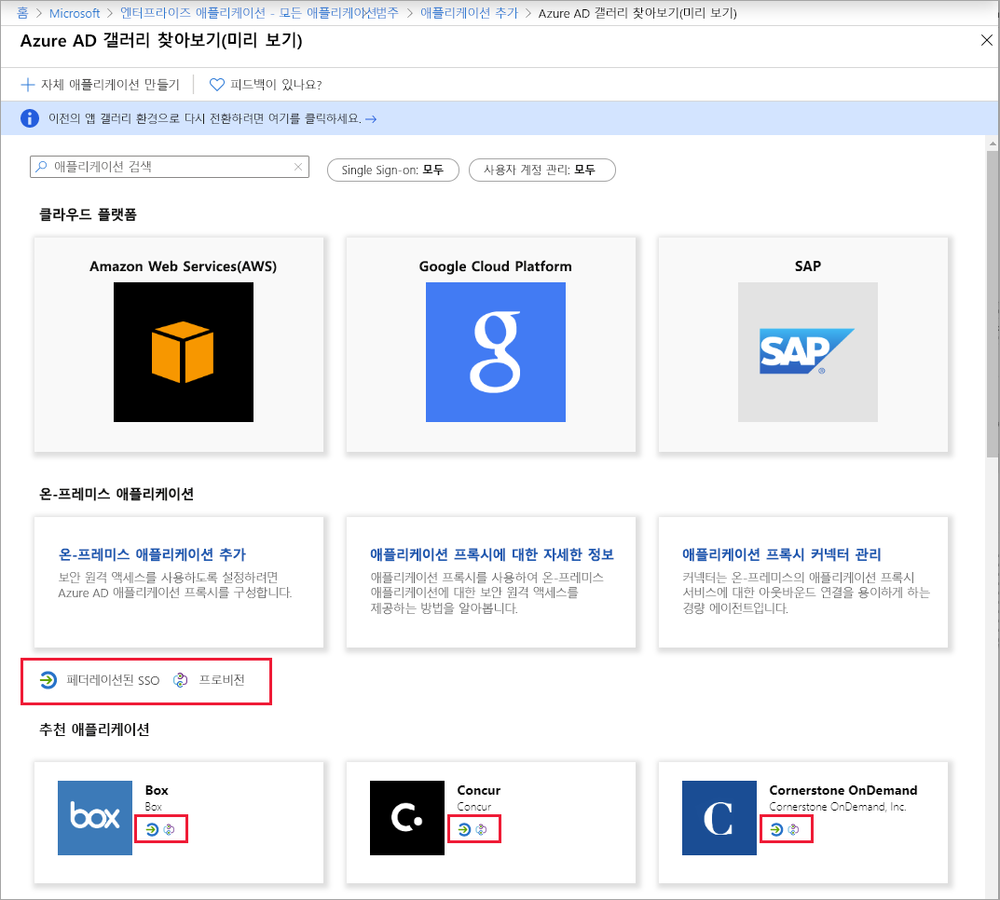
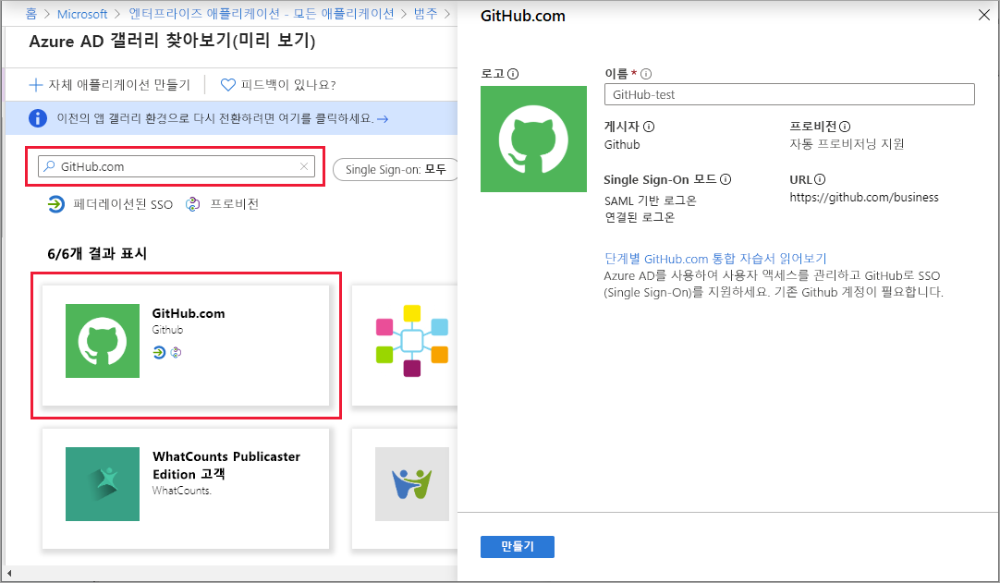

# 빠른 시작: 애플리케이션을 Azure AD(Azure Active Directory) 테넌트에 추가

Azure AD(Azure Active Directory)에는 수천 개의 사전 통합 애플리케이션이 들어 있는 갤러리가 있습니다. 조직에서 사용하는 대부분의 애플리케이션은 이미 갤러리에 있을 수 있습니다. 이 빠른 시작에서는 Azure Portal을 사용하여 Azure AD 테넌트에 갤러리 애플리케이션을 추가합니다. 이 빠른 시작에서는 갤러리의 일부인 앱을 추가하는 데 중점을 둡니다. 갤러리에 포함되지 않은 앱은 Azure AD와 통합될 수도 있지만 이 빠른 시작에서는 다루지 않습니다. 

Azure AD 테넌트에 애플리케이션을 추가하면 다음과 같은 작업을 수행할 수 있습니다.

- 앱의 속성을 구성합니다.
- 조건부 액세스 정책을 사용하여 앱에 대한 사용자 액세스를 관리합니다.
- 사용자가 Azure AD 자격 증명을 사용하여 앱에 로그인할 수 있도록 Single Sign-On을 구성합니다.

## 필수 구성 요소

Azure AD 테넌트에 애플리케이션 추가하려면 다음이 필요합니다.

- 활성 구독이 있는 Azure 계정. [체험 계정을 만듭니다](https://azure.microsoft.com/free/?WT.mc_id=A261C142F).
- 다음 역할 중 하나입니다. 전역 관리자, 클라우드 애플리케이션 관리자, 애플리케이션 관리자 또는 서비스 주체의 소유자.
- (선택 사항: [앱 보기](view-applications-portal.md) 완료).

>[!IMPORTANT]
>이 빠른 시작의 단계를 테스트하기 위해 비-프로덕션 환경을 사용하는 것이 좋습니다.

## Azure AD 테넌트에 앱 추가

Azure AD 테넌트에 갤러리 애플리케이션을 추가하려면:

1. [Azure Portal](https://portal.azure.com)의 왼쪽 탐색 패널에서 **Azure Active Directory**를 선택합니다.
2. **Azure Active Directory** 창에서 **엔터프라이즈 애플리케이션**을 선택합니다. **모든 애플리케이션** 창이 열리고 Azure AD 테넌트에 있는 임의의 애플리케이션 샘플이 표시됩니다.
3. **엔터프라이즈 애플리케이션** 창에서 **새 애플리케이션**을 선택합니다. 
    
4. 새 갤러리 미리 보기 환경으로 전환합니다. **애플리케이션 페이지 추가** 맨 위에 있는 배너에서 **여기를 클릭하여 새롭고 향상된 앱 갤러리 사용해 보기** 링크를 선택합니다.
5. **Azure AD 갤러리 찾아보기(미리 보기)** 창이 열리고 클라우드 플랫폼, 온-프레미스 애플리케이션 및 추천 애플리케이션에 대한 타일이 표시됩니다. **추천 애플리케이션** 섹션에 나열된 애플리케이션에는 페더레이션된 SSO(Single Sign-On) 및 프로비저닝을 지원하는지 여부를 나타내는 아이콘이 있습니다.
    
6. 추가하려는 애플리케이션의 갤러리를 찾아보거나 검색 상자에 해당 이름을 입력하여 애플리케이션을 검색할 수 있습니다. 그런 다음, 결과에서 애플리케이션을 선택합니다. 양식에서 조직의 요구에 맞게 애플리케이션 이름을 편집할 수 있습니다. 이 예제에서는 이름을 **GitHub-test**로 변경했습니다.
    
7. **만들기**를 선택합니다. 시작 페이지가 열리고 조직의 애플리케이션을 구성하는 옵션이 제공됩니다.

애플리케이션 추가를 마쳤습니다. 다음 빠른 시작에서는 애플리케이션의 로고를 변경하고 다른 속성을 편집하는 방법을 보여줍니다.

## 다음 단계

- [앱 구성](add-application-portal-configure.md)
- [Single Sign-On 설정](add-application-portal-setup-sso.md)
- [앱 삭제](delete-application-portal.md)