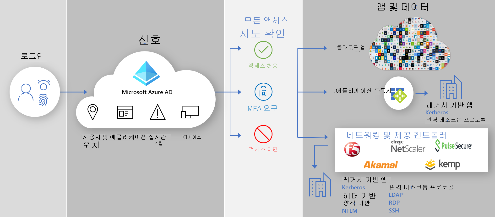

# 보안 하이브리드 액세스: 앱 제공 컨트롤러 및 네트워크를 사용하여 레거시 앱 보호

이제 기존 애플리케이션 배달 컨트롤러나 네트워크를 사용하여 온-프레미스 및 클라우드 레거시 인증 애플리케이션을 Azure AD에 연결하여 보호할 수 있습니다. 이러한 방식으로 Azure AD 조건부 액세스 및 Azure AD ID 보호 같은 Azure AD 기능을 사용하여 모든 애플리케이션에서 간극을 연결하고, 보안 테세를 강화할 수 있습니다.

기존 네트워킹 및 배달 컨트롤러를 사용하여 비즈니스 프로세스에 여전히 중요 하지만 이전에는 Azure AD로 보호할 수 없었는 레거시 애플리케이션을 쉽게 보호할 수 있습니다. 이러한 애플리케이션을 보호하는 데 필요한 모든 조건은 이미 충족되었을 것입니다.

다음 공급업체는 Azure AD와 통합하기 위한 미리 빌드한 솔루션과 자세한 지침을 제공합니다.

* [F5 Big-IP APM](https://aka.ms/f5-hybridaccessguide)
* [ZPA(Zscaler Private Access)](https://aka.ms/zscaler-hybridaccessguide)
