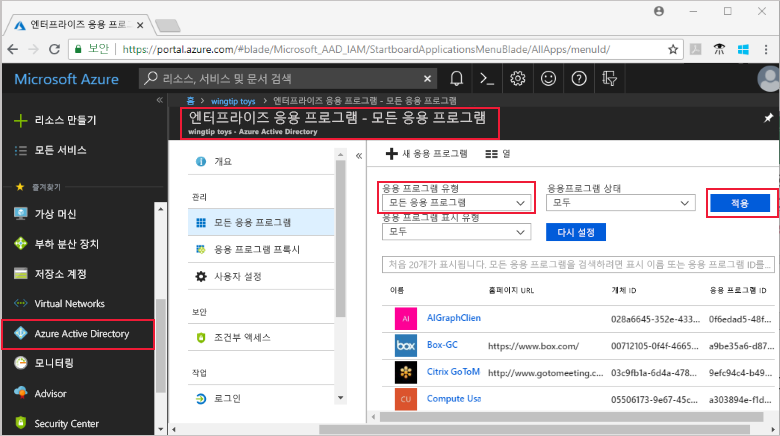

# Azure Active Directory에서 관리할 수 있는 모든 엔터프라이즈 앱 보기
Azure AD(Azure Active Directory)에서 엔터프라이즈 응용 프로그램을 관리할 수 있습니다. 관리할 수 있는 앱을 보고, 앱에 사용자 또는 그룹을 할당하고, 응용 프로그램 이름/로고와 같은 앱에 대한 속성을 유지하고, 사용자가 로그인할 수 없도록 응용 프로그램을 비활성화할 수 있습니다.

## 모든 앱을 보려면 어떻게 해야 합니까?
1. 디렉터리에 대한 전역 관리자인 계정으로 [Azure Portal](https://portal.azure.com)에 로그인합니다.
2. **모든 서비스**를 선택하고 텍스트 상자에 **Azure Active Directory**를 입력한 다음, **입력**을 선택합니다.
3. **Azure Active Directory -** ***directoryname*** 창, 즉 관리 중인 디렉터리에 대한 Azure AD 창에서 **엔터프라이즈 응용 프로그램**을 선택합니다.

    
4. **엔터프라이즈 응용 프로그램** 창에서 **모든 응용 프로그램**을 선택합니다. 이 창에서 관리, 표시된 열을 변경하거나 원하는 앱을 찾도록 목록을 필터링할(예: 비활성화된 앱만 보도록) 앱을 선택할 수 있습니다.

## 다음 단계
* [엔터프라이즈 앱에 사용자 또는 그룹 할당](assign-user-or-group-access-portal.md)
* [엔터프라이즈 앱에서 사용자 또는 그룹 할당 제거](remove-user-or-group-access-portal.md)
* [엔터프라이즈 앱에 대한 사용자 로그인 비활성화](disable-user-sign-in-portal.md)
* [엔터프라이즈 앱의 이름 또는 로고 변경](change-name-or-logo-portal.md)
