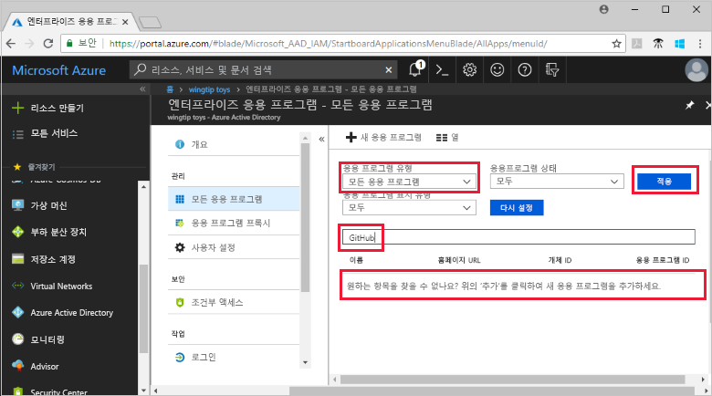
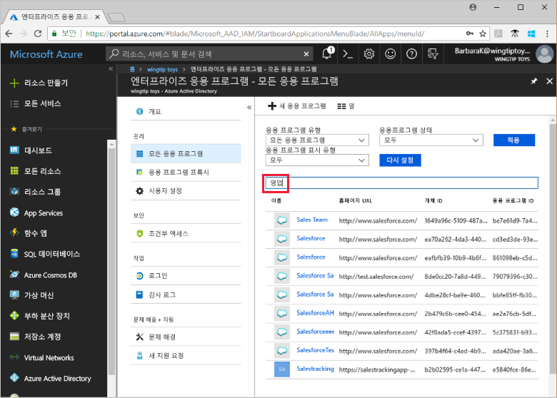

# Azure Active Directory 테넌트 애플리케이션 보기

이 빠른 시작에서는 Azure Portal을 사용하여 Azure AD(Azure Active Directory) 테넌트의 애플리케이션을 봅니다.

## 시작하기 전에

결과를 보려면 Azure AD 테넌트에 하나 이상의 애플리케이션이 있어야 합니다. 애플리케이션을 추가하려면 [애플리케이션 추가](add-application-portal.md) 빠른 시작을 참조하세요.

[Azure Portal](https://portal.azure.com)에 Azure AD 테넌트의 글로벌 관리자, 클라우드 애플리케이션 관리자 또는 애플리케이션 관리자로 로그인합니다.

## 테넌트 애플리케이션 목록 찾기

Azure AD 테넌트 애플리케이션은 Azure Portal의 **엔터프라이즈 앱** 섹션에서 볼 수 있습니다.

테넌트 애플리케이션을 찾으려면:

1. **[Azure Portal](https://portal.azure.com)** 의 왼쪽 탐색 패널에서 Azure **Active Directory**를 선택합니다. 

1. **Azure Active Directory** 창에서 **엔터프라이즈 애플리케이션**을 선택합니다. 

1. **애플리케이션 종류** 드롭다운 메뉴에서 **모든 애플리케이션**을 선택하고 **적용**을 선택합니다. 테넌트 애플리케이션의 무작위 샘플이 나타납니다.
   
1. 더 많은 애플리케이션을 보려면 목록 아래에서 **추가 로드**를 클릭합니다. 테넌트에 있는 애플리케이션 수에 따라 목록을 스크롤하는 것보다 [특정 애플리케이션을 검색](#search-for-a-tenant-application)하는 것이 더 쉬울 수 있습니다.

## 보기 옵션 선택

원하는 항목에 따라 옵션을 선택합니다.

1. **애플리케이션 종류**, **애플리케이션 상태** 및 **애플리케이션 표시**에 따라 애플리케이션을 볼 수 있습니다. 

1. **애플리케이션 종류** 아래에서 다음 옵션 중 하나를 선택합니다.

    - **엔터프라이즈 애플리케이션**은 Microsoft 이외의 애플리케이션을 보여줍니다.
    - **Microsoft 애플리케이션**은 Microsoft 애플리케이션을 보여줍니다.
    - **모든 애플리케이션**은 Microsoft 애플리케이션과 Microsoft 이외의 애플리케이션을 모두 보여줍니다.

1. **애플리케이션 상태**에서 **모두**, **사용 안 함** 또는 **사용**을 선택합니다. **모두** 옵션은 사용하도록 설정된 애플리케이션과 사용하지 않도록 설정된 애플리케이션을 모두 포함합니다.

1. **애플리케이션 표시** 아래에서 **모두** 또는 **숨겨진**을 선택합니다. **숨겨진** 옵션은 테넌트에 있지만 사용자에게 보이지 않는 애플리케이션을 표시합니다.

1. 원하는 옵션을 선택한 후 **적용**을 선택합니다.
 

## 테넌트 애플리케이션 검색

특정 애플리케이션을 검색하려면:

1. **애플리케이션 종류** 메뉴에서 **모든 애플리케이션**을 선택하고 **적용**을 선택합니다.

1. 찾으려는 애플리케이션의 이름을 입력합니다. 애플리케이션이 Azure AD 테넌트에 추가되면 검색 결과에 나타납니다. 이 예제는 GitHub가 테넌트 애플리케이션에 추가되지 않은 것을 보여줍니다.

    

1. 애플리케이션 이름의 처음 몇 글자를 입력해 보세요. 이 예제는 **Sales**로 시작하는 모든 애플리케이션을 보여줍니다.

    

## 다음 단계

이 빠른 시작에서는 Azure AD 테넌트의 애플리케이션을 보는 방법을 배웠습니다. 애플리케이션 종류, 상태 및 표시 여부에 따라 애플리케이션 목록을 필터링하는 방법을 알아보았습니다. 특정 애플리케이션을 검색하는 방법도 배웠습니다.

원하는 애플리케이션을 찾았으니, 계속해서 [테넌트에 더 많은 애플리케이션을 추가](add-application-portal.md)할 수 있습니다. 또는 애플리케이션을 선택하여 속성 및 구성 옵션을 살펴보거나 편집할 수 있습니다. 예를 들어 Single Sign-On을 구성할 수 있습니다. 

> [!div class="nextstepaction"]
> [Single Sign-on 구성](configure-single-sign-on-portal.md)

