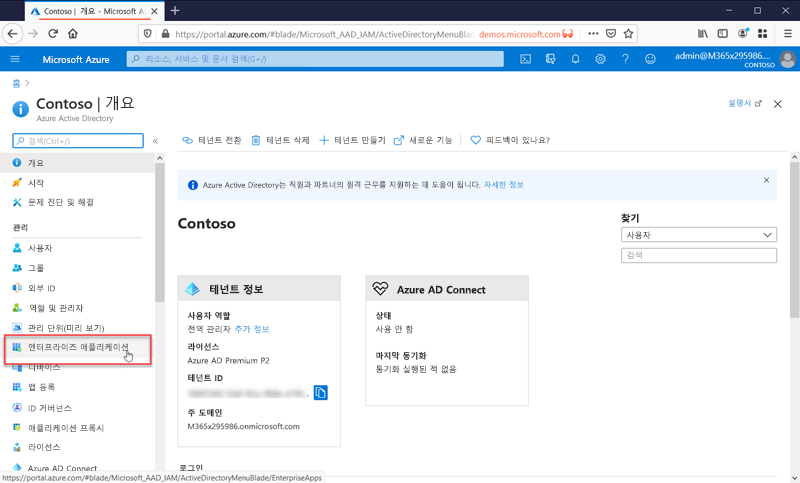

# 애플리케이션 관리란?

Azure AD는 IAM(ID 및 액세스 관리) 시스템입니다. 디지털 ID에 대한 정보를 저장할 수 있는 단일 장소를 제공합니다. 사용자 정보가 저장되는 위치로 Azure AD를 사용하도록 소프트웨어 애플리케이션을 구성할 수 있습니다. 

Azure AD는 애플리케이션과 통합되도록 구성되어야 합니다. 즉, ID 시스템으로 사용하는 애플리케이션을 알고 있어야 합니다. Azure AD에서 이러한 애플리케이션을 인식하고 이러한 애플리케이션을 처리하는 방법을 애플리케이션 관리라고 합니다.

Azure Active Directory 포털의 관리 섹션에 있는 **엔터프라이즈 애플리케이션** 블레이드에서 애플리케이션을 관리합니다.

## IAM(ID 및 액세스 관리) 시스템이란?
애플리케이션은 일부 용도로 사용되는 소프트웨어의 일부입니다. 대부분의 애플리케이션은 사용자가 로그인하여 애플리케이션에서 특정 사용자에 대해 맞춤형 환경을 제공할 수 있도록 해야 합니다. 즉, 애플리케이션은 애플리케이션을 사용하는 사용자의 ID를 알고 있어야 합니다. 사용자를 위해 제공하거나 제거할 기능을 알고 있기 때문입니다.

각 애플리케이션에서 사용자를 개별적으로 추적하는 경우 모든 애플리케이션에 대해 다른 사용자 이름 및 로그인의 사일로를 얻을 수 있습니다. 한 애플리케이션은 다른 애플리케이션의 사용자에 대해 알지 못합니다.

중앙 집중식 ID 시스템은 모든 애플리케이션에서 사용할 수 있는 사용자 정보를 저장하는 단일 장소를 제공하여 이 문제를 해결합니다. 이러한 시스템은 IAM(ID 및 액세스 관리) 시스템이라고 합니다. Azure Active AD는 Microsoft 클라우드의 IAM 시스템입니다.

>[!TIP]
>IAM 시스템은 사용자 ID를 추적하는 단일 장소를 제공합니다. Azure AD는 Microsoft 클라우드의 IAM 시스템입니다.

## 클라우드 솔루션을 사용하여 애플리케이션을 관리하는 이유는 무엇인가요?

조직에는 사용자가 작업하는 데 사용해야 하는 수백 개의 애플리케이션이 있을 수 있습니다. 사용자는 많은 디바이스 및 위치에서 이러한 애플리케이션에 액세스합니다. 매일 새 애플리케이션이 추가, 개발 및 중단됩니다. 너무 많은 애플리케이션과 액세스 지점이 있는 경우 클라우드 기반 솔루션을 사용하여 모든 애플리케이션에 대한 사용자 액세스를 관리하는 것이 그 어느 때보다 더 중요합니다.

>[!TIP]
>Azure AD 앱 갤러리에는 이미 Azure AD를 ID 공급자로 사용하도록 미리 구성된 많은 인기 있는 애플리케이션이 포함되어 있습니다.

## Azure AD는 애플리케이션에서 어떻게 작동하나요?

Azure AD는 사용자의 클라우드 및 온-프레미스 앱에 단일한 ID 시스템을 제공하여 애플리케이션을 관리하는 방법을 단순화합니다. SaaS 애플리케이션, 온-프레미스 애플리케이션 및 LOB(기간 업무) 앱을 Azure AD에 추가할 수 있습니다. 그런 다음, 사용자는 한 번 로그인하여 Microsoft 365는 물론, Microsoft의 다른 비즈니스 애플리케이션과 함께 이러한 애플리케이션에 안전하고 원활하게 액세스합니다. [사용자 프로비저닝을 자동화](../app-provisioning/user-provisioning.md)하여 관리 비용을 절감할 수 있습니다. 또한 다단계 인증 및 조건부 액세스 정책을 사용하여 보안 애플리케이션 액세스를 제공할 수도 있습니다.

## 어떤 유형의 애플리케이션을 Azure AD와 통합할 수 있나요?

**엔터프라이즈 애플리케이션**에 추가하여 Azure AD로 관리할 수 있는 애플리케이션에는 주요 네 가지 유형이 있습니다.

- **Azure AD Gallery 애플리케이션** – Azure AD에는 Azure AD과의 Single Sign-On을 위해 사전 통합된 수천 개의 애플리케이션이 포함된 갤러리가 있습니다. 조직에서 사용하는 애플리케이션 중 일부는 이 갤러리에 있을 것입니다. [앱 통합 계획에 대해 알아보거나](plan-an-application-integration.md), [SaaS 애플리케이션 자습서](https://docs.microsoft.com/azure/active-directory/saas-apps/)에서 개별 앱에 대한 자세한 통합 단계를 확인하세요.

- **애플리케이션 프록시 지원 온-프레미스 애플리케이션** – Azure AD 애플리케이션 프록시를 통해 Azure AD와 온-프레미스 웹앱을 통합하여 Single Sign-On을 지원할 수 있습니다. 그런 다음, 최종 사용자가 Microsoft 365 및 기타 SaaS 앱에 액세스하는 것과 같은 방식으로 온-프레미스 웹앱에 액세스할 수 있습니다. [Azure AD의 애플리케이션 프록시를 통해 온-프레미스 애플리케이션에 대한 원격 액세스 제공](application-proxy.md)을 참조하세요.

- **사용자 지정 개발 애플리케이션** - 고유한 기간 업무 애플리케이션을 빌드할 경우 Azure AD와 통합하여 Single Sign-On을 지원할 수 있습니다. Azure AD에 애플리케이션을 등록하여 애플리케이션에 대한 인증 정책을 제어할 수 있습니다. 자세한 내용은 [개발자를 위한 지침](developer-guidance-for-integrating-applications.md)을 참조하세요.

- **비 갤러리 애플리케이션** – 사용자 고유의 애플리케이션을 구현하세요! Azure AD에 추가하여 다른 앱에 대한 Single Sign-On을 지원합니다. 애플리케이션을 통합하는 방법에는 여러 가지가 있으며, 이 중 일부는 아래에 나열되어 있습니다. 자세한 내용은 [SAML Single Sign-On 구성](configure-saml-single-sign-on.md)을 참조하세요.

>[!TIP]
>Azure AD는 아직 미리 구성되지 않은 애플리케이션 및 앱 갤러리에도 통합할 수 있습니다. **Azure AD를 다음과 통합**할 수 있습니다.
> - **사용자 이름 및 암호 필드**를 렌더링하는 모든 웹 링크 또는 애플리케이션입니다.
> - **SAML 또는 OpenID Connect 프로토콜**을 지원하는 모든 애플리케이션
> - **SCIM(System for Cross-domain Identity Management)** 표준을 지원하는 모든 애플리케이션

## 조건부 액세스 정책을 사용하여 위험 관리

Azure AD SSO(Single Sign-On)를 [조건부 액세스](../conditional-access/concept-conditional-access-cloud-apps.md)와 연결하면 애플리케이션 액세스에 대한 높은 수준의 보안이 제공됩니다. 보안 기능에는 클라우드 규모 ID 보호, 위험 기반 액세스 제어, 기본 다단계 인증 및 조건부 액세스 정책이 포함됩니다. 이러한 기능을 사용하면 애플리케이션 또는 높은 수준의 보안이 필요한 그룹을 기반으로 제어 정책을 세분화할 수 있습니다.

## Single Sign-On으로 생산성 개선

애플리케이션 및 Microsoft 365에서 SSO(Single Sign-On)를 사용하도록 설정하면 로그인 프롬프트가 감소하거나 제거되어 기존 사용자를 위한 우수한 환경이 제공됩니다. 사용자 환경은 더 응집력이 있는 것으로 느껴지고 여러 프롬프트가 없거나 여러 암호를 관리할 필요가 없어 덜 산만합니다. 비즈니스 그룹은 셀프 서비스 및 동적 멤버 자격을 통해 액세스를 관리하고 승인할 수 있습니다. 비즈니스에서 적합한 사용자가 애플리케이션에 대한 액세스를 관리하도록 하면 ID 시스템의 보안이 향상됩니다.

SSO는 보안을 개선합니다. ‘Single Sign-On을 사용하지 않으면’ 관리자가 각 개별 애플리케이션의 사용자 계정을 만들고 업데이트해야 하며 이 작업에는 시간이 걸립니다.** 또한, 사용자는 애플리케이션에 액세스하기 위해 여러 자격 증명을 추적해야 합니다. 결과적으로 사용자는 암호를 적어 두거나 다른 암호 관리 솔루션을 사용하기 쉬우므로 데이터 보안 위험이 도입될 수 있습니다. [Single Sign-On에 대해 자세히 읽어보세요](what-is-single-sign-on.md).

## 거버넌스 및 규정 준수 처리

Azure AD를 사용하면 SIEM(보안 인시던트 및 이벤트 관리)을 사용하는 보고서를 통해 애플리케이션 로그인을 모니터링할 수 있습니다. 포털 또는 API에서 보고서에 액세스할 수 있습니다. 애플리케이션에 액세스할 수 있는 사용자를 프로그래밍 방식으로 감사하고 액세스 검토를 통해 비활성 사용자에 대한 액세스를 제거합니다.

## 비용 관리

Azure AD로 마이그레이션하면 비용을 절약하고 온-프레미스 인프라를 관리하는 번거로움을 제거할 수 있습니다. 또한 Azure AD는 애플리케이션에 대한 셀프 서비스 액세스를 제공하므로 관리자와 사용자의 시간이 절약됩니다. Single Sign-On을 사용하면 애플리케이션별 암호가 필요 없습니다. 한 번 로그온하는 이 기능을 사용하면 애플리케이션의 암호 재설정 및 암호 검색 시 손실된 생산성에 관련된 비용이 절약됩니다.

인적 자원에 중점을 둔 애플리케이션 또는 큰 사용자 세트의 기타 애플리케이션의 경우 앱 프로비저닝을 활용하여 사용자 프로비저닝 및 프로비저닝 해제 프로세스를 자동화할 수 있습니다. [애플리케이션 프로비저닝이란?](../app-provisioning/user-provisioning.md)을 참조하세요.

## 다음 단계

- [애플리케이션 관리에 대한 빠른 시작 시리즈](view-applications-portal.md)
- [애플리케이션 통합 시작](plan-an-application-integration.md)
- [프로비저닝 자동화 방법 알아보기](../app-provisioning/user-provisioning.md)
