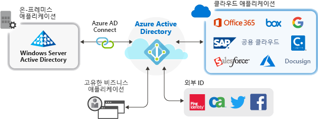

# Azure Active Directory의 애플리케이션 관리

Azure AD(Azure Active Directory)는 사용자의 클라우드 및 온-프레미스 앱에 단일한 ID 시스템을 제공하여 애플리케이션을 관리하는 방법을 단순화합니다. SaaS 애플리케이션, 온-프레미스 애플리케이션 및 LOB(기간 업무) 앱을 Azure AD에 추가할 수 있습니다. 그런 다음, 사용자는 한 번 로그인하여 Office 365는 물론, Microsoft의 다른 비즈니스 애플리케이션과 함께 이러한 애플리케이션에 안전하고 원활하게 액세스합니다. 사용자 프로비저닝을 자동화하여 관리 비용을 절감할 수 있습니다. 또한 다단계 인증 및 조건부 액세스 정책을 사용하여 보안 애플리케이션 액세스를 제공할 수도 있습니다.

## 클라우드 솔루션을 사용하여 애플리케이션을 관리하는 이유는 무엇인가요?

조직에는 사용자가 작업하는 데 사용해야 하는 수백 개의 애플리케이션이 있을 수 있습니다. 사용자는 많은 장치 및 위치에서 이러한 애플리케이션에 액세스합니다. 매일 새 애플리케이션이 추가, 개발 및 중단됩니다. 너무 많은 애플리케이션과 액세스 지점이 있는 경우 클라우드 기반 솔루션을 사용하여 모든 애플리케이션에 대한 사용자 액세스를 관리하는 것이 그 어느 때보다 더 중요합니다.

## 어떤 유형의 애플리케이션을 Azure AD와 통합할 수 있나요?
**엔터프라이즈 애플리케이션**에 추가하여 Azure AD로 관리할 수 있는 애플리케이션에는 주요 네 가지 유형이 있습니다.

-   **Azure AD Gallery 애플리케이션** – Azure AD에는 Azure AD과의 Single Sign-On을 위해 사전 통합된 수천 개의 애플리케이션이 포함된 갤러리가 있습니다. 조직에서 사용하는 애플리케이션 중 일부는 이 갤러리에 있을 것입니다. [앱 통합 계획에 대해 알아보거나](plan-an-application-integration.md), [SaaS 애플리케이션 자습서](https://docs.microsoft.com/azure/active-directory/saas-apps/)에서 개별 앱에 대한 자세한 통합 단계를 확인하세요. 

-   **애플리케이션 프록시 지원 온-프레미스 애플리케이션** – Azure AD 애플리케이션 프록시를 통해 Azure AD와 온-프레미스 웹앱을 통합하여 Single Sign-On을 지원할 수 있습니다. 그런 다음, 최종 사용자는 Office 365 및 기타 SaaS 앱에 액세스하는 동일한 방식으로 사용자의 온-프레미스 웹앱에 액세스할 수 있습니다. [애플리케이션 프록시 사용 이유 및 작동 방식에 대해 알아 보세요](what-is-application-proxy.md).

-   **사용자 지정 개발 애플리케이션** - 고유한 기간 업무 애플리케이션을 빌드할 경우 Azure AD와 통합하여 Single Sign-On을 지원할 수 있습니다. Azure AD에 애플리케이션을 등록하여 애플리케이션에 대한 인증 정책을 제어할 수 있습니다. 자세한 내용은 [개발자를 위한 지침](developer-guidance-for-integrating-applications.md)을 참조하세요.

-   **비 갤러리 애플리케이션** – 사용자 고유의 애플리케이션을 구현하세요! Azure AD에 추가하여 다른 앱에 대한 Single Sign-On을 지원합니다. 원하는 모든 웹 링크 또는 사용자 이름 및 암호 필드를 렌더링하고 SAML 또는 OpenID Connect 프로토콜을 지원하거나 SCIM을 지원하는 애플리케이션을 통합할 수 있습니다. 자세한 내용은 [비 갤러리 앱에 대한 Single Sign-On 구성](configure-single-sign-on-non-gallery-applications.md)을 참조하세요.

## 조건부 액세스 정책을 사용하여 위험 관리
Azure AD SSO(Single Sign-On)를 [조건부 액세스](https://docs.microsoft.com/azure/active-directory/conditional-access/overview)와 연결하면 애플리케이션 액세스에 대한 높은 수준의 보안이 제공됩니다. 보안 기능에는 클라우드 규모 ID 보호, 위험 기반 액세스 제어, 기본 다단계 인증 및 조건부 액세스 정책이 포함됩니다. 이러한 기능을 사용하면 응용 프로그램 또는 높은 수준의 보안이 필요한 그룹을 기반으로 제어 정책을 세분화할 수 있습니다.

## Single Sign-On으로 생산성 개선
응용 프로그램 및 Office 365에서 SSO(Single Sign-On)를 사용하도록 설정하면 로그인 프롬프트가 감소하거나 제거되어 기존 사용자를 위한 우수한 환경이 제공됩니다. 사용자 환경은 더 응집력이 있는 것으로 느껴지고 여러 프롬프트가 없거나 여러 암호를 관리할 필요가 없어 덜 산만합니다. 비즈니스 그룹은 셀프 서비스 및 동적 멤버 자격을 통해 액세스를 관리하고 승인할 수 있습니다. 비즈니스에서 적합한 사용자가 애플리케이션에 대한 액세스를 관리하도록 하면 ID 시스템의 보안이 향상됩니다.

SSO는 보안을 개선합니다. ‘Single Sign-On을 사용하지 않으면’ 관리자가 각 개별 애플리케이션의 사용자 계정을 만들고 업데이트해야 하며 이 작업에는 시간이 걸립니다.  또한, 사용자는 애플리케이션에 액세스하기 위해 여러 자격 증명을 추적해야 합니다. 결과적으로 사용자는 암호를 적어 두거나 다른 암호 관리 솔루션을 사용하기 쉬우므로 데이터 보안 위험이 도입될 수 있습니다. [Single Sign-On에 대해 자세히 읽어보세요](what-is-single-sign-on.md).

## 거버넌스 및 규정 준수 처리
Azure AD를 사용하면 SIEM(보안 인시던트 및 이벤트 관리)을 사용하는 보고서를 통해 애플리케이션 로그인을 모니터링할 수 있습니다. 포털 또는 API에서 보고서에 액세스할 수 있습니다. 애플리케이션에 액세스할 수 있는 사용자를 프로그래밍 방식으로 감사하고 액세스 검토를 통해 비활성 사용자에 대한 액세스를 제거합니다.

## 비용 관리
Azure AD로 마이그레이션하면 비용을 절약하고 온-프레미스 인프라를 관리하는 번거로움을 제거할 수 있습니다. 또한 Azure AD는 애플리케이션에 대한 셀프 서비스 액세스를 제공하므로 관리자와 사용자의 시간이 절약됩니다. Single Sign-On을 사용하면 응용 프로그램별 암호가 필요 없습니다. 한 번 로그온하는 이 기능을 사용하면 애플리케이션의 암호 재설정 및 암호 검색 시 손실된 생산성에 관련된 비용이 절약됩니다.

## 다음 단계

- [애플리케이션 프록시란?](what-is-application-proxy.md)
- [빠른 시작: Azure AD 테넌트에 갤러리 애플리케이션 추가](add-application-portal.md)
