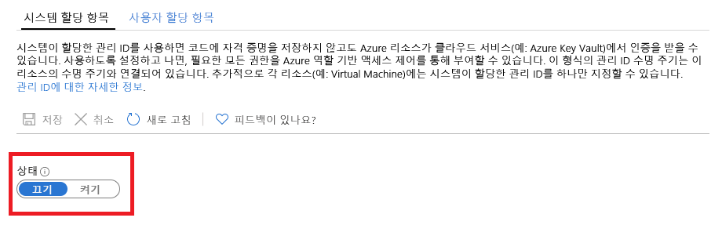

# Azure 리소스용 관리 ID란?

[!INCLUDE [preview-notice](../../../includes/active-directory-msi-preview-notice.md)]

클라우드 개발자는 코드에서 Azure 리소스에 액세스하는 가장 간단하고 안전한 방법을 찾고 있을 것입니다. 

Azure 리소스에 대한 관리 ID는 다음과 같은 관리 ID이기 때문에 이 요구 사항을 충족할 수 있습니다.

- 코드에서 자격 증명의 필요성을 **제거**합니다.
- 자격 증명을 자동으로 **회전**합니다.
- 관리 ID에 대한 사용자 개입을 최소한으로 **줄입니다**.

## 작동 방법 

관리 ID를 지원하는 모든 Azure 리소스는 코드에 자격 증명이 없어도 데이터를 교환하는 토큰을 가져올 수 있습니다. 프로세스는 다음 단계로 구성됩니다.

 
1.  **사용** - 리소스에 대한 관리 ID를 만듭니다.
2.  **액세스 권한 부여** – Azure RBAC를 사용하여 리소스에 대한 액세스를 허용합니다.
3.  **액세스** - 허용된 작업을 수행합니다.
4.  **사용 안 함** – 관리 ID를 삭제합니다. 

## 관리 ID 유형

두 가지 종류의 관리 ID가 있습니다.

- 시스템 할당 관리 ID

- 사용자 할당 관리 ID

독립 실행형 Azure 리소스의 경우 **시스템 할당** 관리 ID를 사용하도록 설정할 수 있습니다. 시스템 할당 관리 ID는 ID 관리 관점에서 가장 편리한 지원을 제공합니다. 한 번의 클릭으로 리소스에 대한 ID의 자동 수명 주기 관리를 사용하도록 설정할 수 있습니다.   

   

시스템 할당 관리 ID는 독립 실행형 리소스에 가장 편리한 솔루션을 제공하지만 동일한 작업에 대해 Azure 리소스 그룹을 관리 해야 하는 경우에는 상황이 달라집니다. 이 시나리오에서는 ID를 수동으로 만들고 그룹화에 필요한 모든 Azure 리소스에 이 마스터 ID를 할당하는 것이 더 좋습니다. 이 할당을 **사용자 할당** 관리 ID라고 합니다. 
  

## 지원되는 서비스

Azure 리소스에 대한 관리 ID를 사용하여 Azure AD 인증을 지원하는 서비스를 인증할 수 있습니다. Azure 리소스에 대한 관리 ID 기능을 지원하는 Azure 서비스 목록은 [Azure 리소스에 대한 관리 ID를 지원하는 서비스](services-support-msi.md)를 참조하세요.

## 다음 단계

다음 빠른 시작으로 Azure 리소스에 대한 관리 ID 기능을 시작하세요.

* [Windows VM 시스템 할당 관리 ID를 사용하여 Resource Manager에 액세스](tutorial-windows-vm-access-arm.md)
* [Linux VM 시스템 할당 관리 ID를 사용하여 Resource Manager에 액세스](tutorial-linux-vm-access-arm.md)
