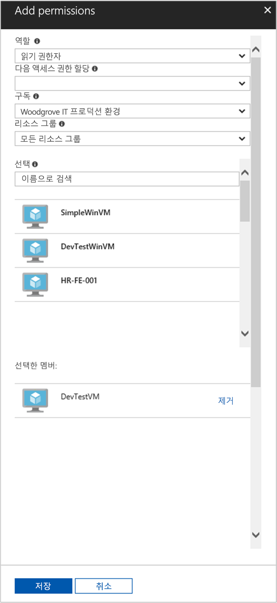

# <a name="use-a-linux-vm-system-assigned-managed-identity-to-access-azure-resource-manager"></a>Linux VM 시스템 할당 관리 ID를 사용하여 Azure Resource Manager에 액세스

[!INCLUDE [preview-notice](../../../includes/active-directory-msi-preview-notice.md)]

이 빠른 시작에서는 Linux VM(가상 머신)에 대한 시스템 할당 ID를 사용하여 Azure Resource Manager API에 액세스하는 방법을 보여줍니다. Azure 리소스에 대한 관리 ID는 Azure에서 자동으로 관리되며 이를 사용하면 Azure AD 인증을 지원하는 서비스에 인증할 수 있으므로 코드에 자격 증명을 삽입할 필요가 없습니다. 다음 방법에 대해 알아봅니다.

> [!div class="checklist"]
> * VM에 Azure Resource Manager의 리소스 그룹 액세스 권한 부여 
> * VM ID를 사용하여 액세스 토큰을 가져온 다음 Azure Resource Manager를 호출하는 데 사용 

## <a name="prerequisites"></a>필수 조건

[!INCLUDE [msi-tut-prereqs](../../../includes/active-directory-msi-tut-prereqs.md)]

## <a name="grant-your-vm-access-to-a-resource-group-in-azure-resource-manager"></a>VM에 Azure Resource Manager의 리소스 그룹 액세스 권한 부여 

Azure 리소스에 대한 관리 ID를 사용하면 코드에서 Azure AD 인증을 지원하는 리소스에 인증하기 위한 액세스 토큰을 가져올 수 있습니다. Azure Resource Manager API는 Azure AD 인증을 지원합니다. 먼저 이 VM에 Azure Resource Manager의 리소스(이 예제에서는 VM이 포함된 리소스 그룹)에 대한 액세스 권한을 부여해야 합니다.  

1. **리소스 그룹**의 탭으로 이동합니다.
2. 앞에서 만든 특정 **리소스 그룹**을 선택합니다.
3. 왼쪽 패널의 **액세스 제어(IAM)** 로 이동합니다.
4. **추가**를 클릭하여 VM에 대한 새 역할 할당을 추가합니다. **역할**로 **독자**를 선택합니다.
5. 다음 드롭다운인 **다음에 대한 액세스 할당:** 에서 **Virtual Machine** 리소스에 대한 액세스 권한을 할당합니다.
6. 그런 다음 **구독** 드롭다운에 적절한 구독이 나열되어 있는지 확인합니다. 그리고 **리소스 그룹**에서는 **모든 리소스 그룹**을 선택합니다.
7. 마지막으로 **선택**의 드롭다운에서 Linux Virtual Machine을 선택하고 **저장**을 클릭합니다.

    

## <a name="get-an-access-token-using-the-vms-system-assigned-managed-identity-and-use-it-to-call-resource-manager"></a>VM의 시스템 할당 관리 ID를 통해 액세스 토큰을 가져오고 Resource Manager를 호출하는 데 사용합니다. 

아래의 단계를 완료하려면 SSH 클라이언트가 필요합니다. Windows를 사용 중인 경우 [Linux용 Windows 하위 시스템](https://msdn.microsoft.com/commandline/wsl/about)에서 SSH 클라이언트를 사용할 수 있습니다. SSH 클라이언트의 키 구성에 대한 도움이 필요하면 [Azure에서 Windows를 통해 SSH 키를 사용하는 방법](../../virtual-machines/linux/ssh-from-windows.md) 또는 [Azure에서 Linux VM용 SSH 공개 및 프라이빗 키 쌍을 만들고 사용하는 방법](../../virtual-machines/linux/mac-create-ssh-keys.md)을 참조하세요.

1. Portal에서 Linux VM으로 이동한 다음 **개요**에서 **연결**을 클릭합니다.  
2. 선택한 SSH 클라이언트를 사용하여 VM에 **연결**합니다. 
3. 터미널 창에서 `curl`을 사용하여 Azure 리소스에 대한 로컬 관리 ID 엔드포인트에 대한 요청을 만들어서 Azure Resource Manager에 대한 액세스 토큰을 가져옵니다.  
 
    액세스 토큰에 대한 `curl` 요청은 다음과 같습니다.  
    
    ```bash
    curl 'http://169.254.169.254/metadata/identity/oauth2/token?api-version=2018-02-01&resource=https://management.azure.com/' -H Metadata:true   
    ```
    
    > [!NOTE]
    > "Resource" 매개 변수의 값은 Azure AD에 필요한 값과 정확하게 일치해야 합니다.  Resource Manager 리소스 ID의 경우 URI에 후행 슬래시를 포함해야 합니다. 
    
    응답에는 Azure Resource Manager에 액세스하는 데 필요한 액세스 토큰이 포함되어 있습니다. 
    
    응답:  

    ```bash
    {"access_token":"eyJ0eXAiOi...",
    "refresh_token":"",
    "expires_in":"3599",
    "expires_on":"1504130527",
    "not_before":"1504126627",
    "resource":"https://management.azure.com",
    "token_type":"Bearer"} 
    ```
    
    이 액세스 토큰을 사용하여 Azure Resource Manager에 액세스해 이전에 이 VM에 액세스 권한을 부여했던 리소스 그룹의 세부 정보를 확인하는 등의 작업을 수행할 수 있습니다. \<구독 ID\>, \<리소스 그룹\> 및 \<액세스 토큰\>의 값을 앞서 만든 것으로 바꿉니다. 
    
    > [!NOTE]
    > URL은 대/소문자를 구분하므로 앞서 리소스 그룹의 이름을 지정할 때 사용했던 것과 정확히 동일한 대/소문자를 사용해야 하며, “resourceGroups”와 같이 대문자 “G”를 사용해야 합니다.  
    
    ```bash 
    curl https://management.azure.com/subscriptions/<SUBSCRIPTION ID>/resourceGroups/<RESOURCE GROUP>?api-version=2016-09-01 -H "Authorization: Bearer <ACCESS TOKEN>" 
    ```
    
    특정 리소스 그룹 정보가 포함된 응답이 반환됩니다.    
    ```bash
    {"id":"/subscriptions/98f51385-2edc-4b79-bed9-7718de4cb861/resourceGroups/DevTest","name":"DevTest","location":"westus","properties":{"provisioningState":"Succeeded"}} 
    ```

## <a name="next-steps"></a>다음 단계

이 빠른 시작에서는 시스템 할당 관리 ID를 사용하여 Azure Resource Manager API에 액세스하는 방법을 알아보았습니다.  Azure Resource Manager에 대한 자세한 내용은 다음을 참조하세요.

> [!div class="nextstepaction"]
>[Azure 리소스 관리자](/azure/azure-resource-manager/resource-group-overview)
