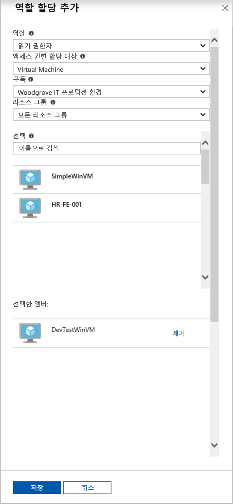

# <a name="use-a-windows-vm-system-assigned-managed-identity-to-access-resource-manager"></a>Windows VM 시스템 할당 관리 ID를 사용하여 Resource Manager에 액세스

[!INCLUDE [preview-notice](../../../includes/active-directory-msi-preview-notice.md)]

이 빠른 시작에서는 시스템 할당 관리 ID를 사용하도록 설정된 Windows 가상 머신을 사용하여 Azure Resource Manager API에 액세스하는 방법을 보여줍니다. Azure 리소스에 대한 관리 ID는 Azure에서 자동으로 관리되며 이를 사용하면 Azure AD 인증을 지원하는 서비스에 인증할 수 있으므로 코드에 자격 증명을 삽입할 필요가 없습니다. 다음 방법에 대해 알아봅니다.

> [!div class="checklist"] 
> * VM에 Azure Resource Manager의 리소스 그룹 액세스 권한 부여 
> * VM ID를 사용하여 액세스 토큰을 가져온 다음 Azure Resource Manager를 호출하는 데 사용

## <a name="prerequisites"></a>필수 조건

[!INCLUDE [msi-tut-prereqs](../../../includes/active-directory-msi-tut-prereqs.md)]

## <a name="grant-your-vm-access-to-a-resource-group-in-resource-manager"></a>VM에 Resource Manager의 리소스 그룹 액세스 권한 부여
Azure 리소스에 대한 관리 ID를 사용하면 코드에서 Azure AD 인증을 지원하는 리소스에 인증하기 위한 액세스 토큰을 가져올 수 있습니다.  Azure Resource Manager는 Azure AD 인증을 지원합니다.  먼저 이 VM의 시스템 할당 관리 ID에 Azure Resource Manager의 리소스(이 예제에서는 VM이 포함된 리소스 그룹)에 대한 액세스 권한을 부여해야 합니다.  

1.  **리소스 그룹**의 탭으로 이동합니다. 
2.  **Windows VM**용으로 만든 특정 **리소스 그룹**을 선택합니다. 
3.  왼쪽 패널의 **액세스 제어(IAM)** 로 이동합니다. 
4.  다음으로, **역할 할당 추가**에서 **Windows VM**에 대한 새 역할 할당을 추가합니다.  **역할**로 **독자**를 선택합니다. 
5.  다음 드롭다운에서 **Virtual Machine** 리소스에 대한 **액세스를 할당**합니다. 
6.  그런 다음 **구독** 드롭다운에 적절한 구독이 나열되어 있는지 확인합니다. 그리고 **리소스 그룹**에서는 **모든 리소스 그룹**을 선택합니다. 
7.  마지막으로 **선택**의 드롭다운에서 Windows VM을 선택하고 **저장**을 클릭합니다.

    

## <a name="get-an-access-token-using-the-vms-system-assigned-managed-identity-and-use-it-to-call-azure-resource-manager"></a>VM의 시스템 할당 관리 ID를 통해 액세스 토큰을 가져오고 Azure Resource Manager를 호출하는 데 사용합니다. 

이 부분에서는 **PowerShell**을 사용해야 합니다.  **PowerShell**이 설치되어 있지 않으면 [여기](https://docs.microsoft.com/powershell/azure/overview)서 다운로드하세요. 

1.  Portal에서 **Virtual Machines** -> Windows Virtual Machines로 이동한 다음 **개요**에서 **연결**을 클릭합니다. 
2.  Windows VM을 만들 때 추가한 **사용자 이름**과 **암호**를 입력합니다. 
3.  이제 가상 머신에 대한 **원격 데스크톱 연결**을 만들었으므로 원격 세션에서 **PowerShell**을 엽니다. 
4.  Invoke-WebRequest cmdlet을 사용하여 Azure Resource Manager에 대한 액세스 토큰을 가져오도록 Azure 리소스 엔드포인트의 로컬 관리 ID에 요청합니다.

    ```powershell
       $response = Invoke-WebRequest -Uri 'http://169.254.169.254/metadata/identity/oauth2/token?api-version=2018-02-01&resource=https://management.azure.com/' -Method GET -Headers @{Metadata="true"}
    ```
    
    > [!NOTE]
    > "resource" 매개 변수의 값은 Azure AD에 필요한 값과 정확하게 일치해야 합니다. Azure Resource Manager 리소스 ID를 사용할 때는 URI에 후행 슬래시를 포함해야 합니다.
    
    다음으로 $response 개체에서 JSON(JavaScript Object Notation) 형식의 문자열로 저장된 전체 응답을 추출합니다. 
    
    ```powershell
    $content = $response.Content | ConvertFrom-Json
    ```
    다음으로는 응답에서 액세스 토큰을 추출합니다.
    
    ```powershell
    $ArmToken = $content.access_token
    ```
    
    마지막으로 액세스 토큰을 사용하여 Azure Resource Manager를 호출합니다. 또한 이 예제에서는 Invoke-WebRequest cmdlet을 사용하여 Azure Resource Manager를 호출하고, 인증 헤더에 액세스 토큰을 포함합니다.
    
    ```powershell
    (Invoke-WebRequest -Uri https://management.azure.com/subscriptions/<SUBSCRIPTION ID>/resourceGroups/<RESOURCE GROUP>?api-version=2016-06-01 -Method GET -ContentType "application/json" -Headers @{ Authorization ="Bearer $ArmToken"}).content
    ```
    > [!NOTE] 
    > URL은 대/소문자를 구분하므로 앞서 리소스 그룹의 이름을 지정할 때 사용했던 것과 정확히 동일한 대/소문자를 사용해야 하며, “resourceGroups”와 같이 대문자 “G”를 사용해야 합니다.
        
    다음 명령은 리소스 그룹의 세부 정보를 반환합니다.

    ```powershell
    {"id":"/subscriptions/98f51385-2edc-4b79-bed9-7718de4cb861/resourceGroups/DevTest","name":"DevTest","location":"westus","properties":{"provisioningState":"Succeeded"}}
    ```

## <a name="next-steps"></a>다음 단계

이 빠른 시작에서는 시스템 할당 관리 ID를 사용하여 Azure Resource Manager API에 액세스하는 방법을 알아보았습니다.  Azure Resource Manager에 대한 자세한 내용은 다음을 참조하세요.

> [!div class="nextstepaction"]
>[Azure 리소스 관리자](/azure/azure-resource-manager/resource-group-overview)

