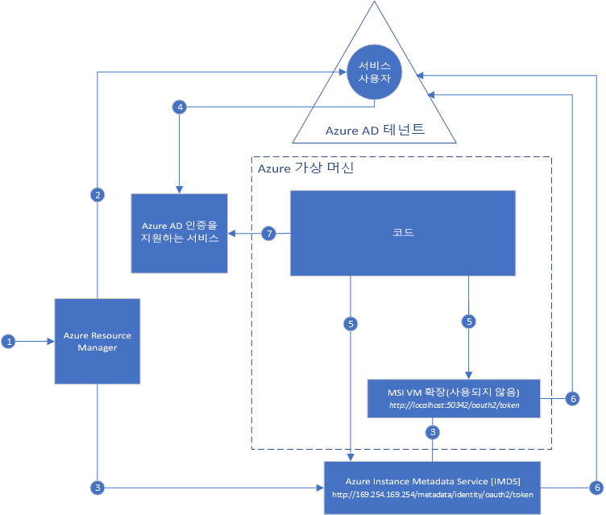

#  Azure 리소스용 MSI(관리 서비스 ID)란?

[!INCLUDE[preview-notice](../../../includes/active-directory-msi-preview-notice.md)]

클라우드 응용 프로그램을 빌드할 때 일반적으로 발생하는 문제 중 하나는 클라우드 서비스에 인증하기 위해 코드에 포함해야 하는 자격 증명을 관리하는 방법입니다. 즉, 이러한 자격 증명의 보안을 유지하는 것이 중요합니다. 이러한 자격 증명은 개발자 워크스테이션에 표시되거나 소스 컨트롤에 체크 인되지 않는 것이 가장 좋습니다. Azure Key Vault를 사용하면 자격 증명과 기타 키 및 비밀을 안전하게 저장할 수 있습니다. 하지만 이러한 자격 증명/키/비밀을 검색하려면 코드가 Key Vault에 인증해야 합니다. MSI(관리 서비스 ID)를 사용하면 Azure AD(Azure Active Directory)에서 자동으로 관리되는 ID를 Azure 서비스에 제공함으로써 이 문제를 보다 간편하게 해결할 수 있습니다. 이 ID를 사용하면 Key Vault를 비롯하여 Azure AD 인증을 지원하는 모든 서비스에 인증할 수 있으므로 코드에 자격 증명을 포함할 필요가 없습니다.

## 작동 원리

사용 가능한 관리 서비스 ID 형식은 **시스템 할당** 및 **사용자 할당**의 두 가지입니다.

- **시스템 할당 ID**는 Azure 서비스 인스턴스에서 직접 사용하도록 설정됩니다. 사용하도록 설정하면 Azure는 서비스 인스턴스의 구독에서 신뢰하는 Azure AD 테넌트에 서비스 인스턴스의 ID를 만듭니다. ID가 만들어지면 해당 자격 증명이 서비스 인스턴스에 프로비전됩니다. 시스템 할당 ID의 수명 주기는 MSI가 사용하도록 설정된 Azure 서비스 인스턴스와 직접적으로 연관됩니다. 서비스 인스턴스가 삭제되면 Azure는 Azure AD에서 ID와 자격 증명을 자동으로 정리합니다.
- **사용자 할당 ID**(공개 미리 보기)는 독립 실행형 Azure 리소스로 생성됩니다. 만들기 프로세스를 통해 Azure는 사용 중인 구독에서 신뢰하는 Azure AD 테넌트에 ID를 만듭니다. 생성된 ID는 하나 이상의 Azure 서비스 인스턴스에 할당할 수 있습니다. 사용자 할당 ID의 수명 주기는 할당된 Azure 서비스 인스턴스의 수명 주기와 별도로 관리됩니다.

결과적으로, 코드에 시스템 할당 ID 또는 사용자 할당 ID를 사용하여 Azure AD 인증을 지원하는 서비스에 대한 액세스 토큰을 요청할 수 있습니다. 이러한 모든 작업이 수행되는 동안 Azure는 서비스 인스턴스에 사용되는 자격 증명 롤링을 처리합니다.

다음 예제는 시스템 할당 ID가 Azure Virtual Machines에서 작동하는 방식을 보여줍니다.

1. Azure Resource Manager가 VM에서 시스템 할당 ID를 사용하도록 설정하라는 메시지를 받습니다.
2. Azure Resource Manager가 Azure AD에서 VM의 ID를 나타내는 서비스 주체를 만듭니다. 서비스 주체는 이 구독이 신뢰하는 Azure AD 테넌트에서 작성됩니다.
3. Azure Resource Manager가 VM에서 ID를 구성합니다.
    - Azure Instance Metadata Service ID 엔드포인트를 서비스 주체 클라이언트 ID 및 인증서로 업데이트합니다.
    - MSI VM 확장을 프로비전하고 서비스 주체 클라이언트 ID 및 인증서를 추가합니다. (지원 중단 예정)
4. 이제 VM에 ID가 생겼으니, 서비스 주체 정보를 사용하여 Azure 리소스에 대한 VM 액세스 권한을 부여합니다. 예를 들어 코드가 Azure Resource Manager를 호출해야 하는 경우 Azure AD에서 RBAC(역할 기반 액세스 제어)를 사용하여 VM 서비스 주체에 적절한 역할을 할당합니다. 코드가 Key Vault를 호출해야 하는 경우에는 Key Vault의 특정 비밀이나 키 액세스 권한을 코드에 부여합니다.
5. VM에서 실행되는 코드는 VM 내에서만 액세스할 수 있는 두 엔드포인트에서 토큰을 요청할 수 있습니다.

    - Azure IMDS(Instance Metadata Service) ID 엔드포인트: http://169.254.169.254/metadata/identity/oauth2/token(권장)
        - 리소스 매개 변수가 토큰을 보낼 서비스를 지정합니다. 예를 들어 코드가 Azure Resource Manager에 인증하도록 하려면 resource=https://management.azure.com/을 사용합니다.
        - API 버전 매개 변수는 IMDS 버전을 지정하고, api-version=2018-02-01 이상을 사용합니다.
    - MSI VM 확장 엔드포인트: http://localhost:50342/oauth2/token(지원 중단 예정)
        - 리소스 매개 변수가 토큰을 보낼 서비스를 지정합니다. 예를 들어 코드가 Azure Resource Manager에 인증하도록 하려면 resource=https://management.azure.com/을 사용합니다.

6. 3단계에서 구성한 클라이언트 ID 및 인증서를 사용하여 5단계에서 지정한 대로 액세스 토큰을 요청하는 Azure AD에 대한 호출이 생성됩니다. Azure AD가 JWT(JSON Web Token) 액세스 토큰을 반환합니다.
7. 코드가 Azure AD 인증을 지원하는 서비스에 대한 호출에서 액세스 토큰을 전송합니다.

아래에는 동일한 다이어그램을 통해 사용자 할당 MSI가 Azure Virtual Machines에서 작동하는 방식을 보여 주는 예가 나와 있습니다.

1. Azure Resource Manager가 사용자 할당 ID를 만들라는 요청을 받습니다.
2. Azure Resource Manager가 Azure AD에서 사용자 할당 ID를 나타내는 서비스 주체를 만듭니다. 서비스 주체는 이 구독이 신뢰하는 Azure AD 테넌트에서 작성됩니다.
3. Azure Resource Manager가 VM에서 사용자 할당 ID를 구성하라는 요청을 받습니다.
    - Azure Instance Metadata Service ID 엔드포인트를 사용자 할당 ID 서비스 주체 클라이언트 ID 및 인증서로 업데이트합니다.
    - MSI VM 확장을 프로비전하고 사용자 할당 ID 서비스 주체 클라이언트 ID 및 인증서(지원 중단 예정)를 추가합니다.
4. 이제 사용자 할당 ID가 생겼으니, 서비스 주체 정보를 사용하여 Azure 리소스에 대한 액세스 권한을 부여합니다. 예를 들어 코드가 Azure Resource Manager를 호출해야 하는 경우 Azure AD에서 RBAC(역할 기반 액세스 제어)를 사용하여 사용자 할당 ID 서비스 주체에 적절한 역할을 할당합니다. 코드가 Key Vault를 호출해야 하는 경우에는 Key Vault의 특정 비밀이나 키 액세스 권한을 코드에 부여합니다. 참고: 이 단계는 3단계 전에도 수행할 수 있습니다.
5. VM에서 실행되는 코드는 VM 내에서만 액세스할 수 있는 두 엔드포인트에서 토큰을 요청할 수 있습니다.

    - Azure IMDS(Instance Metadata Service) ID 엔드포인트: http://169.254.169.254/metadata/identity/oauth2/token(권장)
        - 리소스 매개 변수가 토큰을 보낼 서비스를 지정합니다. 예를 들어 코드가 Azure Resource Manager에 인증하도록 하려면 resource=https://management.azure.com/을 사용합니다.
        - 클라이언트 ID 매개 변수는 토큰이 요청되는 ID를 지정합니다. 단일 VM에 사용자 할당 ID가 두 개 이상 있을 때 분명히 하기 위해 필요합니다.
        - API 버전 매개 변수는 IMDS 버전을 지정하고, api-version=2018-02-01 이상을 사용합니다.

    - MSI VM 확장 엔드포인트: http://localhost:50342/oauth2/token(지원 중단 예정)
        - 리소스 매개 변수가 토큰을 보낼 서비스를 지정합니다. 예를 들어 코드가 Azure Resource Manager에 인증하도록 하려면 resource=https://management.azure.com/을 사용합니다.
        - 클라이언트 ID 매개 변수는 토큰이 요청되는 ID를 지정합니다. 단일 VM에 사용자 할당 ID가 두 개 이상 있을 때 분명히 하기 위해 필요합니다.
6. 3단계에서 구성한 클라이언트 ID 및 인증서를 사용하여 5단계에서 지정한 대로 액세스 토큰을 요청하는 Azure AD에 대한 호출이 생성됩니다. Azure AD가 JWT(JSON Web Token) 액세스 토큰을 반환합니다.
7. 코드가 Azure AD 인증을 지원하는 서비스에 대한 호출에서 액세스 토큰을 전송합니다.
     
## 관리 서비스 ID 사용해 보기

다른 Azure 리소스에 액세스하기 위한 종단 간 시나리오에 대해 알아보려면 관리되는 서비스 ID 자습서를 시도해 보세요.
  
| MSI 사용 리소스에서 | 학습할 방법 |
| ------- | -------- |
| Azure VM(Windows) | [Windows VM 관리 서비스 ID를 사용하여 Azure Data Lake Store에 액세스](tutorial-windows-vm-access-datalake.md) |
|                    | [Windows VM 관리 서비스 ID를 사용하여 Azure Resource Manager 액세스](tutorial-windows-vm-access-arm.md) |
|                    | [Windows VM 관리 서비스 ID를 사용하여 Azure SQL 액세스](tutorial-windows-vm-access-sql.md) |
|                    | [Windows VM 관리 서비스 ID를 사용하여 액세스 키를 통해 Azure Storage 액세스](tutorial-windows-vm-access-storage.md) |
|                    | [Windows VM 관리 서비스 ID를 사용하여 SAS를 통해 Azure Storage 액세스](tutorial-windows-vm-access-storage-sas.md) |
|                    | [Windows VM 관리 서비스 ID 및 Azure Key Vault를 사용한 비 Azure AD 리소스 액세스](tutorial-windows-vm-access-nonaad.md) |
| Azure VM(Linux)   | [Linux VM 관리 서비스 ID를 사용하여 Azure Data Lake Store에 액세스](tutorial-linux-vm-access-datalake.md) |
|                    | [Linux VM 관리 서비스 ID를 사용하여 Azure Resource Manager 액세스](tutorial-linux-vm-access-arm.md) |
|                    | [Linux VM 관리 서비스 ID를 사용하여 액세스 키를 통해 Azure Storage 액세스](tutorial-linux-vm-access-storage.md) |
|                    | [ VM 관리 서비스 ID를 사용하여 SAS를 통해 Azure Storage 액세스](tutorial-linux-vm-access-storage-sas.md) |
|                    | [Linux VM 관리 서비스 ID 및 Azure Key Vault를 사용한 비 Azure AD 리소스 액세스](tutorial-linux-vm-access-nonaad.md) |
| Azure App Service  | [Azure App Service 또는 Azure Functions를 통한 관리 서비스 ID 사용](/azure/app-service/app-service-managed-service-identity) |
| Azure 기능    | [Azure App Service 또는 Azure Functions를 통한 관리 서비스 ID 사용](/azure/app-service/app-service-managed-service-identity) |
| Azure Service Bus  | [Azure Service Bus를 통한 관리 서비스 ID 사용](../../service-bus-messaging/service-bus-managed-service-identity.md) |
| Azure Event Hubs   | [Azure Event Hubs를 통한 관리 서비스 ID 사용](../../event-hubs/event-hubs-managed-service-identity.md) |

## 관리 서비스 ID를 지원하는 Azure 서비스

관리 ID는 Azure AD 인증을 지원하는 서비스를 인증하는 데 사용할 수 있습니다. 관리 서비스 ID를 지원하는 Azure 서비스 목록은 다음 문서를 참조하세요.
- [관리 서비스 ID를 지원하는 서비스](services-support-msi.md)

## 관리 서비스 ID의 비용은 어느 정도인가요?

관리 서비스 ID는 Azure 구독에 기본적으로 포함된 Azure Active Directory Free와 함께 제공됩니다. 즉, 관리 서비스 ID에 대한 추가 비용은 없습니다.

## 지원 및 피드백

많은 의견 부탁드립니다!

* Stack Overflow 관련 작업 방법 질문은 [azure-msi](http://stackoverflow.com/questions/tagged/azure-msi) 태그를 포함하여 작성해 주세요.
* [개발자용 Azure AD 피드백 포럼](https://feedback.azure.com/forums/169401-azure-active-directory/category/164757-developer-experiences)에서 기능을 요청하거나 피드백을 보내 주세요.

## 다음 단계

다음 빠른 시작으로 Azure 관리 서비스 ID를 시작합니다.

* [Windows VM MSI(관리 서비스 ID)를 사용하여 Resource Manager 액세스 - Windows VM](tutorial-windows-vm-access-arm.md)
* [Linux VM MSI(관리 서비스 ID)를 사용하여 Azure Resource Manager에 액세스 - Linux VM](tutorial-linux-vm-access-arm.md)
