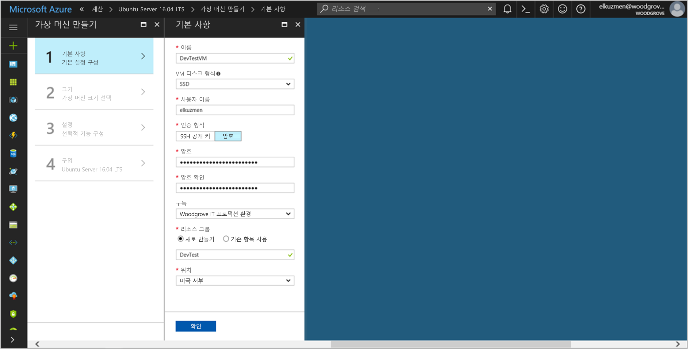

# <a name="use-managed-service-identity-for-a-linux-vm-to-access-azure-data-lake-store"></a>Linux VM용 관리 서비스 ID를 사용하여 Azure Data Lake Store에 액세스

[!INCLUDE[preview-notice](../../../includes/active-directory-msi-preview-notice.md)]

이 자습서에서는 Linux VM(가상 머신)용 관리 서비스 ID를 사용하여 Azure Data Lake Store에 액세스하는 방법을 보여줍니다. Azure는 MSI를 통해 사용자가 만든 ID를 자동으로 관리합니다. MSI를 사용하면 코드에 자격 증명을 삽입할 필요 없이 Azure AD(Azure Active Directory) 인증을 지원하는 서비스에 인증할 수 있습니다. 

이 자습서에서는 다음 방법에 대해 알아봅니다.

> [!div class="checklist"]
> * Linux VM에서 MSI를 사용하도록 설정 
> * VM에 Azure Data Lake Store에 대한 액세스 권한 부여
> * VM ID를 사용하여 액세스 토큰을 가져와서 Azure Data Lake Store에 액세스하는 데 사용하기

## <a name="prerequisites"></a>필수 조건

[!INCLUDE [msi-qs-configure-prereqs](../../../includes/active-directory-msi-qs-configure-prereqs.md)]

[!INCLUDE [msi-tut-prereqs](../../../includes/active-directory-msi-tut-prereqs.md)]

## <a name="sign-in-to-azure"></a>Azure에 로그인

[Azure Portal](https://portal.azure.com)에 로그인합니다.

## <a name="create-a-linux-virtual-machine-in-a-new-resource-group"></a>새 리소스 그룹에 Linux 가상 머신 만들기

이 자습서에서는 새 Linux VM을 만듭니다. 기존 VM에서 MSI를 사용하도록 설정할 수도 있습니다.

1. Azure Portal의 왼쪽 상단 모서리에 있는 **새로 만들기** 단추를 선택합니다.
2. **Compute**를 선택한 후 **Ubuntu Server 16.04 LTS**를 선택합니다.
3. 가상 머신 정보를 입력합니다. **인증 유형**으로 **SSH 공용 키** 또는 **암호**를 선택합니다. 생성된 자격 증명을 사용하면 VM에 로그인할 수 있습니다.

   

4. **구독** 목록에서 가상 머신에 대한 구독을 선택합니다.
5. 가상 머신을 만들 대상이 되는 새 리소스 그룹을 선택하려면 **리소스 그룹** > **새로 만들기**를 선택합니다. 완료하면 **확인**을 선택합니다.
6. VM의 크기를 선택합니다. 더 많은 크기를 보려면 **모두 보기**를 선택하거나 **지원되는 디스크 형식** 필터를 변경합니다. 설정 창에서 기본값을 유지하고 **확인**을 선택합니다.

## <a name="enable-msi-on-your-vm"></a>VM에서 MSI를 사용하도록 설정

VM MSI를 사용하면 코드에 자격 증명을 포함하지 않고도 Azure AD에서 액세스 토큰을 가져올 수 있습니다. VM에서 관리 서비스 ID를 사용하도록 설정하면 해당 관리 ID를 만들기 위해 VM이 Azure Active Directory에 등록되고, VM에서 ID가 구성되는 두 가지 작업이 수행됩니다.

1. **Virtual Machine**에 대해 MSI를 사용하도록 설정할 가상 머신을 선택합니다.
2. 왼쪽 창에서 **구성**을 선택합니다.
3. **관리 서비스 ID**가 표시됩니다. MSI를 등록하고 사용하도록 설정하려면 **예**를 선택합니다. 사용하지 않도록 설정하려면 **아니요**를 선택합니다.
   
4. **저장**을 선택합니다.

## <a name="grant-your-vm-access-to-azure-data-lake-store"></a>VM에 Azure Data Lake Store에 대한 액세스 권한 부여

이제 Azure Data Lake Store에 있는 파일 및 폴더에 VM 액세스 권한을 부여할 수 있습니다. 이 단계에서는 기존 Data Lake Store 인스턴스를 사용하거나 새로 만들 수 있습니다. Azure Portal을 사용하여 Data Lake Store 인스턴스를 만들려면 이 [Azure Data Lake Store 빠른 시작](https://docs.microsoft.com/azure/data-lake-store/data-lake-store-get-started-portal)을 참조하세요. [Azure Data Lake Store 설명서](https://docs.microsoft.com/azure/data-lake-store/data-lake-store-overview)에는 Azure CLI 및 Azure PowerShell을 사용하는 빠른 시작도 있습니다.

Data Lake Store에서 새 폴더를 만들고, 이 폴더의 파일을 읽고, 쓰고, 실행할 수 있는 MSI 권한을 부여합니다.

1. Azure Portal의 왼쪽 창에서 **Data Lake Store**를 선택합니다.
2. 사용할 Data Lake Store 인스턴스를 선택합니다.
3. 명령 모음에서 **데이터 탐색기**를 선택합니다.
4. Data Lake Store 인스턴스의 루트 폴더가 선택됩니다. 명령 모음에서 **액세스**를 선택합니다.
5. **추가**를 선택합니다.  **선택** 상자에서 VM의 이름(예: **DevTestVM**)을 입력합니다. 검색 결과에서 VM을 선택한 다음, **선택**을 클릭합니다.
6. **사용 권한 선택**을 클릭합니다.  **읽기** 및 **실행**을 선택하고, **이 폴더**에 추가하고, **액세스 권한 전용**으로 추가합니다. **확인**을 선택합니다.  사용 권한은 성공적으로 추가되어야 합니다.
7. **액세스** 창을 닫습니다.
8. 이 자습서에서는 새 폴더를 만듭니다. 명령 모음에서 **새 폴더**를 선택하고 새 폴더 이름(예: **TestFolder**)을 입력합니다.  **확인**을 선택합니다.
9. 만든 폴더를 선택한 다음, 명령 모음에서 **액세스**를 선택합니다.
10. 5단계와 마찬가지로 **추가**를 선택합니다. **선택** 상자에 VM의 이름을 입력합니다. 검색 결과에서 VM을 선택한 다음, **선택**을 클릭합니다.
11. 6단계와 마찬가지로 **권한 선택**을 선택합니다. **읽기**, **쓰기** 및 **실행**을 선택하고, **이 폴더**에 추가하고, **액세스 권한 항목 및 기본 권한 항목**으로 추가합니다. **확인**을 선택합니다.  사용 권한은 성공적으로 추가되어야 합니다.

이제 사용자가 만든 폴더의 파일에 MSI가 모든 작업을 수행할 수 있습니다. Data Lake Store에 대한 액세스 권한을 관리하는 방법에 대한 자세한 내용은 [Data Lake Store의 Access Control](https://docs.microsoft.com/azure/data-lake-store/data-lake-store-access-control)을 참조하세요.

## <a name="get-an-access-token-and-call-the-data-lake-store-file-system"></a>액세스 토큰 가져오기 및 Data Lake Store 파일 시스템 호출

Azure Data Lake Store는 기본적으로 Azure AD 인증을 지원하므로 MSI를 통해 얻은 액세스 토큰을 직접 수락할 수 있습니다. Data Lake Store 파일 시스템에 인증하려면 Azure AD에서 발급한 액세스 토큰을 Data Lake Store 파일 시스템 엔드포인트로 보냅니다. 액세스 토큰은 인증 헤더에 "Bearer \<ACCESS_TOKEN_VALUE\>" 형식으로 있습니다.  Azure AD 인증을 위한 Data Lake Store 지원에 대해 자세히 알아보려면 [Azure Active Directory를 사용하여 Data Lake Store 인증](https://docs.microsoft.com/azure/data-lake-store/data-lakes-store-authentication-using-azure-active-directory)을 참조하세요.

이 자습서에서는 cURL을 사용하여 REST 요청을 생성하여 Data Lake Store 파일 시스템용 REST API를 인증합니다.

> [!NOTE]
> Data Lake Store 파일 시스템용 클라이언트 SDK는 관리 서비스 ID를 아직 지원하지 않습니다.

아래의 단계를 완료하려면 SSH 클라이언트가 필요합니다. Windows를 사용 중인 경우 [Linux용 Windows 하위 시스템](https://msdn.microsoft.com/commandline/wsl/about)에서 SSH 클라이언트를 사용할 수 있습니다. SSH 클라이언트의 키 구성에 대한 도움이 필요하면 [Azure에서 Windows를 통해 SSH 키를 사용하는 방법](../../virtual-machines/linux/ssh-from-windows.md) 또는 [Azure에서 Linux VM용 SSH 공개 및 개인 키 쌍을 만들고 사용하는 방법](../../virtual-machines/linux/mac-create-ssh-keys.md)을 참조하세요.

1. 포털에서 Linux VM으로 이동합니다. **개요**에서 **연결**을 선택합니다.  
2. 원하는 SSH 클라이언트를 사용하여 VM에 연결합니다. 
3. 터미널 창에서 cURL을 사용하여 Data Lake Store 파일 시스템에 액세스 토큰을 가져오도록 로컬 MSI 엔드포인트에 요청합니다. Data Lake Store의 리소스 식별자는 "https://datalake.azure.net/"입니다.  리소스 식별자에 후행 슬래시를 포함해야 합니다.
    
   ```bash
   curl 'http://169.254.169.254/metadata/identity/oauth2/token?api-version=2018-02-01&resource=https%3A%2F%2Fdatalake.azure.net%2F' -H Metadata:true   
   ```
    
   성공적인 응답에는 Data Lake Store에 인증하는 데 사용하는 액세스 토큰이 반환됩니다.

   ```bash
   {"access_token":"eyJ0eXAiOiJ...",
    "refresh_token":"",
    "expires_in":"3599",
    "expires_on":"1508119757",
    "not_before":"1508115857",
    "resource":"https://datalake.azure.net/",
    "token_type":"Bearer"}
   ```

4. cURL을 사용하여 Data Lake Store 파일 시스템의 REST 엔드포인트에 요청하여 루트 폴더의 폴더를 나열합니다. 모든 항목이 올바르게 구성되었는지 확인하는 간단한 방법입니다. 이전 단계에서 액세스 토큰의 값을 복사합니다. 인증 헤더의 "Bearer" 문자열에 대문자 "B"가 있어야 합니다. Azure Portal에 있는 **Data Lake Store** 창의 **개요** 섹션에서 Data Lake Store 인스턴스의 이름을 찾을 수 있습니다.

   ```bash
   curl https://<YOUR_ADLS_NAME>.azuredatalakestore.net/webhdfs/v1/?op=LISTSTATUS -H "Authorization: Bearer <ACCESS_TOKEN>"
   ```
    
   성공적인 응답은 다음과 같습니다.

   ```bash
   {"FileStatuses":{"FileStatus":[{"length":0,"pathSuffix":"TestFolder","type":"DIRECTORY","blockSize":0,"accessTime":1507934941392,"modificationTime":1508105430590,"replication":0,"permission":"770","owner":"bd0e76d8-ad45-4fe1-8941-04a7bf27f071","group":"bd0e76d8-ad45-4fe1-8941-04a7bf27f071"}]}}
   ```

5. 이제 Data Lake Store 인스턴스에 파일을 업로드해 볼 수 있습니다. 먼저 업로드할 파일을 만듭니다.

   ```bash
   echo "Test file." > Test1.txt
   ```

6. cURL을 사용하여 Data Lake Store 파일 시스템 REST 엔드포인트에 요청하여 이전에 만든 폴더에 파일을 업로드합니다. 업로드에는 리디렉션이 포함되고 cURL은 리디렉션을 자동으로 따릅니다. 

   ```bash
   curl -i -X PUT -L -T Test1.txt -H "Authorization: Bearer <ACCESS_TOKEN>" 'https://<YOUR_ADLS_NAME>.azuredatalakestore.net/webhdfs/v1/<FOLDER_NAME>/Test1.txt?op=CREATE' 
   ```

    성공적인 응답은 다음과 같습니다.

   ```bash
   HTTP/1.1 100 Continue
   HTTP/1.1 307 Temporary Redirect
   Cache-Control: no-cache, no-cache, no-store, max-age=0
   Pragma: no-cache
   Expires: -1
   Location: https://mytestadls.azuredatalakestore.net/webhdfs/v1/TestFolder/Test1.txt?op=CREATE&write=true
   x-ms-request-id: 756f6b24-0cca-47ef-aa12-52c3b45b954c
   ContentLength: 0
   x-ms-webhdfs-version: 17.04.22.00
   Status: 0x0
   X-Content-Type-Options: nosniff
   Strict-Transport-Security: max-age=15724800; includeSubDomains
   Date: Sun, 15 Oct 2017 22:10:30 GMT
   Content-Length: 0
       
   HTTP/1.1 100 Continue
       
   HTTP/1.1 201 Created
   Cache-Control: no-cache, no-cache, no-store, max-age=0
   Pragma: no-cache
   Expires: -1
   Location: https://mytestadls.azuredatalakestore.net/webhdfs/v1/TestFolder/Test1.txt?op=CREATE&write=true
   x-ms-request-id: af5baa07-3c79-43af-a01a-71d63d53e6c4
   ContentLength: 0
   x-ms-webhdfs-version: 17.04.22.00
   Status: 0x0
   X-Content-Type-Options: nosniff
   Strict-Transport-Security: max-age=15724800; includeSubDomains
   Date: Sun, 15 Oct 2017 22:10:30 GMT
   Content-Length: 0
   ```

Data Lake Store 파일 시스템에 다른 API를 사용하여 파일에 추가, 파일 다운로드 등을 수행할 수 있습니다.

축하합니다! Linux VM용 MSI를 사용하여 Data Lake Store 파일 시스템을 인증받았습니다.

## <a name="related-content"></a>관련 콘텐츠

- MSI의 개요는 [관리 서비스 ID 개요](overview.md)를 참조하세요.
- 관리 작업을 위해 Data Lake Store는 Azure Resource Manager를 사용합니다.  MSI를 사용하여 Resource Manager를 인증받는 방법에 대한 자세한 내용은 [Linux VM MSI(관리 서비스 ID)를 사용하여 Resource Manager에 액세스](https://docs.microsoft.com/azure/active-directory/msi-tutorial-linux-vm-access-arm)를 참조하세요.
- [Azure Active Directory를 사용하여 Data Lake Store인증](https://docs.microsoft.com/azure/data-lake-store/data-lakes-store-authentication-using-azure-active-directory)에 대해 자세히 알아봅니다.
- [Azure Data Lake Store에서 REST API를 사용하여 파일 시스템 작업](https://docs.microsoft.com/azure/data-lake-store/data-lake-store-data-operations-rest-api) 또는 [WebHDFS 파일 시스템 API](https://docs.microsoft.com/rest/api/datalakestore/webhdfs-filesystem-apis)에 대해 자세히 알아봅니다.
- [Data Lake Store에서 액세스 제어](https://docs.microsoft.com/azure/data-lake-store/data-lake-store-access-control)에 대해 자세히 알아봅니다.

다음 설명 섹션을 사용하여 피드백을 제공하고 콘텐츠를 구체화하고 모양을 갖출 수 있습니다.
