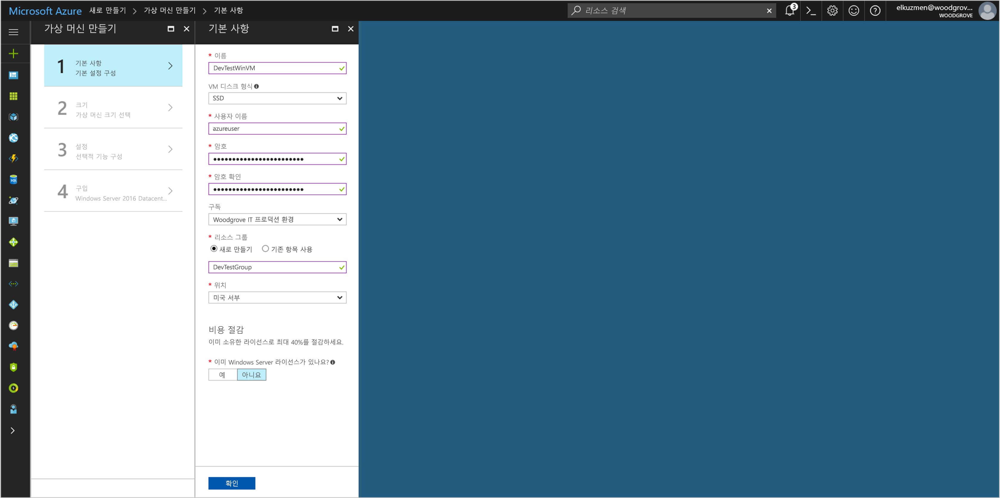
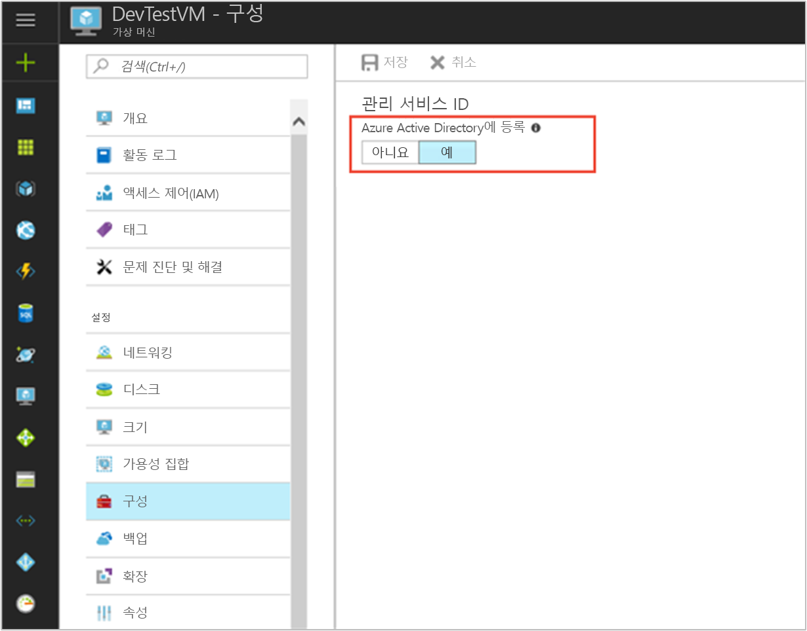

# <a name="use-a-windows-vm-managed-service-identity-msi-to-access-azure-sql"></a>Windows VM MSI(관리 서비스 ID)를 사용하여 Azure SQL 액세스

[!INCLUDE[preview-notice](../../../includes/active-directory-msi-preview-notice.md)]

이 자습서에서는 Windows VM(가상 컴퓨터)에 대해 MSI(관리 서비스 ID)를 사용하여 Azure SQL Server에 액세스하는 방법을 보여 줍니다. Azure에서 자동으로 관리되는 관리 서비스 ID를 사용하면 Azure AD 인증을 지원하는 서비스에 인증할 수 있으므로 코드에 자격 증명을 삽입할 필요가 없습니다. 다음 방법에 대해 알아봅니다.

> [!div class="checklist"]
> * Windows VM에서 MSI를 사용하도록 설정 
> * VM에 Azure SQL Server에 대한 액세스 권한 부여
> * VM ID를 사용하여 액세스 토큰을 가져온 다음 Azure SQL Server를 쿼리하는 데 사용

## <a name="prerequisites"></a>필수 조건

[!INCLUDE [msi-qs-configure-prereqs](../../../includes/active-directory-msi-qs-configure-prereqs.md)]

[!INCLUDE [msi-tut-prereqs](../../../includes/active-directory-msi-tut-prereqs.md)]

## <a name="sign-in-to-azure"></a>Azure에 로그인

[https://portal.azure.com](https://portal.azure.com)에서 Azure Portal에 로그인합니다.

## <a name="create-a-windows-virtual-machine-in-a-new-resource-group"></a>새 리소스 그룹에 Windows 가상 머신 만들기

이 자습서에서는 새 Windows VM을 만듭니다.  기존 VM에서 MSI를 사용하도록 설정할 수도 있습니다.

1.  Azure Portal의 왼쪽 위에 있는 **리소스 만들기** 단추를 클릭합니다.
2.  **Compute**를 선택한 후 **Windows Server 2016 Datacenter**를 선택합니다. 
3.  가상 머신 정보를 입력합니다. 여기서 만드는 **사용자 이름** 및 **암호**는 가상 머신에 로그인하는 데 사용하는 자격 증명입니다.
4.  드롭다운에서 가상 머신의 적절한 **구독**을 선택합니다.
5.  가상 컴퓨터를 만들 새 **리소스 그룹**을 선택하려면 **새로 만들기**를 선택합니다. 완료되면 **확인**을 클릭합니다.
6.  VM의 크기를 선택합니다. 더 많은 크기를 보려면 **모두 보기**를 선택하거나 **지원되는 디스크 형식** 필터를 변경합니다. 설정 페이지에서 기본값을 그대로 유지하고 **확인**을 클릭합니다.

    

## <a name="enable-msi-on-your-vm"></a>VM에서 MSI를 사용하도록 설정 

VM MSI를 사용하면 코드에 자격 증명을 포함하지 않고도 Azure AD에서 액세스 토큰을 가져올 수 있습니다. MSI를 사용하도록 설정하면 VM용으로 관리 ID를 만들도록 Azure에 지시하게 됩니다. MSI를 사용하도록 설정하면 그 배경에서는 두 작업이 수행됩니다. 즉 해당 관리 ID를 만들기 위해 VM이 Azure Active Directory에 등록되고, VM에서 ID가 구성됩니다.

1.  MSI를 사용하도록 설정할 **Virtual Machine**을 선택합니다.  
2.  왼쪽 탐색 모음에서 **구성**을 클릭합니다. 
3.  **관리 서비스 ID**가 표시됩니다. MSI를 등록하고 사용하도록 설정하려면 **예**를 선택하고, 사용하지 않도록 설정하려면 아니요를 선택합니다. 
4.  **저장**을 클릭하여 구성을 저장합니다.  
    

## <a name="grant-your-vm-access-to-a-database-in-an-azure-sql-server"></a>VM에 Azure SQL Server의 데이터베이스에 대한 액세스 권한 부여

이제 VM에 Azure SQL Server의 데이터베이스에 대한 액세스 권한을 부여할 수 있습니다.  이 단계에서는 기존 SQL Server를 사용하거나 새로 만들 수 있습니다.  Azure Portal을 사용하여 새 서버 및 데이터베이스를 만들려면 다음 [Azure SQL 빠른 시작](https://docs.microsoft.com/azure/sql-database/sql-database-get-started-portal)을 따릅니다. [Azure SQL 설명서](https://docs.microsoft.com/azure/sql-database/)에서 Azure CLI 및 Azure PowerShell을 사용하는 빠른 시작도 있습니다.

VM에 데이터베이스에 대한 액세스 권한을 부여하는 과정은 다음 3단계로 진행됩니다.
1.  Azure AD에서 그룹을 만들고 VM MSI를 그룹의 구성원으로 만듭니다.
2.  SQL Server에 대한 Azure AD 인증을 사용하도록 설정합니다.
3.  Azure AD 그룹을 나타내는 데이터베이스에 **포함된 사용자**를 만듭니다.

> [!NOTE]
> 일반적으로 VM의 MSI에 직접 매핑되는 포함된 사용자를 만듭니다.  현재 Azure SQL은 포함된 사용자에 매핑될 VM MSI를 나타내는 Azure AD 서비스 주체를 허용하지 않습니다.  지원되는 해결 방법으로, VM MSI를 Azure AD 그룹의 구성원으로 만든 다음 해당 그룹을 나타내는 데이터베이스에 포함된 사용자를 만듭니다.


### <a name="create-a-group-in-azure-ad-and-make-the-vm-msi-a-member-of-the-group"></a>Azure AD에서 그룹을 만들고 VM MSI를 그룹의 구성원으로 만듭니다.

기존 Azure AD 그룹을 사용하거나 Azure AD PowerShell을 사용하여 새로 만들 수 있습니다.  

먼저 [Azure AD PowerShell](https://docs.microsoft.com/powershell/azure/active-directory/install-adv2) 모듈을 설치합니다. 그런 후 `Connect-AzureAD`를 사용하여 로그인하고 다음 명령을 실행하여 그룹을 만든 후 변수에 저장합니다.

```powershell
$Group = New-AzureADGroup -DisplayName "VM MSI access to SQL" -MailEnabled $false -SecurityEnabled $true -MailNickName "NotSet"
```

출력은 다음과 같으며 변수의 값을 검사합니다.

```powershell
$Group = New-AzureADGroup -DisplayName "VM MSI access to SQL" -MailEnabled $false -SecurityEnabled $true -MailNickName "NotSet"
$Group
ObjectId                             DisplayName          Description
--------                             -----------          -----------
6de75f3c-8b2f-4bf4-b9f8-78cc60a18050 VM MSI access to SQL
```

다음으로 그룹에 VM의 MSI를 추가합니다.  Azure PowerShell를 사용하여 알 수 있는 MSI의 **ObjectId**가 필요합니다.  먼저 [Azure Powershell](https://docs.microsoft.com/powershell/azure/install-azurerm-ps)을 다운로드합니다. 그런 후 `Connect-AzureRmAccount`를 사용하여 로그인하고 다음 명령을 실행하여 다음을 수행합니다.
- 여러 구독이 있는 경우 세션 컨텍스트가 원하는 Azure 구독으로 설정되어 있는지 확인합니다.
- Azure 구독의 사용 가능한 리소스를 나열하고 올바른 리소스 그룹 및 VM 이름을 확인합니다.
- 적절한 `<RESOURCE-GROUP>` 및 `<VM-NAME>` 값을 사용하여 MSI VM의 속성을 가져옵니다.

```powershell
Set-AzureRMContext -subscription "bdc79274-6bb9-48a8-bfd8-00c140fxxxx"
Get-AzureRmResource
$VM = Get-AzureRmVm -ResourceGroup <RESOURCE-GROUP> -Name <VM-NAME>
```

출력은 다음과 같으며 VM MSI의 서비스 주체 개체 ID를 검사합니다.
```powershell
$VM = Get-AzureRmVm -ResourceGroup DevTestGroup -Name DevTestWinVM
$VM.Identity.PrincipalId
b83305de-f496-49ca-9427-e77512f6cc64
```

이제 그룹에 VM MSI를 추가합니다.  Azure AD PowerShell을 사용하면 그룹에 서비스 주체만 추가할 수 있습니다.  다음 명령을 실행합니다.
```powershell
Add-AzureAdGroupMember -ObjectId $Group.ObjectId -RefObjectId $VM.Identity.PrincipalId
```

또한 나중에 그룹 구성원 자격을 확인하면 출력은 다음과 같습니다.

```powershell
Add-AzureAdGroupMember -ObjectId $Group.ObjectId -RefObjectId $VM.Identity.PrincipalId
Get-AzureAdGroupMember -ObjectId $Group.ObjectId

ObjectId                             AppId                                DisplayName
--------                             -----                                -----------
b83305de-f496-49ca-9427-e77512f6cc64 0b67a6d6-6090-4ab4-b423-d6edda8e5d9f DevTestWinVM
```

### <a name="enable-azure-ad-authentication-for-the-sql-server"></a>SQL Server에 대해 Azure AD 인증 사용

그룹을 만들고 그룹 구성원 자격에 VM MSI를 추가했으므로 다음 단계를 사용하여 [SQL Server에 대해 Azure AD 인증을 구성](/azure/sql-database/sql-database-aad-authentication-configure#provision-an-azure-active-directory-administrator-for-your-azure-sql-server)할 수 있습니다.

1.  Azure Portal의 왼쪽 탐색 영역에서 **SQL Server**를 선택합니다.
2.  Azure AD 인증에 사용할 SQL Server를 클릭합니다.
3.  블레이드의 **설정** 섹션에서 **Active Directory 관리자**를 클릭합니다.
4.  명령 모음에서 **Set admin**을 클릭합니다.
5.  서버 관리자로 만들 Azure AD 사용자 계정을 선택하고 **선택**을 클릭합니다.
6.  명령 모음에서 **저장**을 클릭합니다.

### <a name="create-a-contained-user-in-the-database-that-represents-the-azure-ad-group"></a>Azure AD 그룹을 나타내는 데이터베이스에 포함된 사용자를 만듭니다.

이 다음 단계를 위해 [Microsoft SSMS(SQL Server Management Studio)](https://docs.microsoft.com/sql/ssms/download-sql-server-management-studio-ssms)가 필요합니다. 시작하기 전에 다음 문서를 검토하여 Azure AD 통합의 배경 정보를 숙지하면 도움이 될 수 있습니다.

- [SQL Database 및 SQL Data Warehouse에 대한 유니버설 인증(MFA에 대한 SSMS 지원)](/azure/sql-database/sql-database-ssms-mfa-authentication.md)
- [SQL Database 또는 SQL Data Warehouse에서의 Azure Active Directory 인증 구성 및 관리](/azure/sql-database/sql-database-aad-authentication-configure.md)

1.  SQL Server Management Studio를 시작합니다.
2.  **서버에 연결** 대화 상자의 **서버 이름** 필드에 SQL Server 이름을 입력합니다.
3.  **인증** 필드에서 **Active Directory - MFA 지원을 통한 유니버설 인증**을 선택합니다.
4.  **사용자 이름** 필드에 서버 관리자로 설정한 Azure AD 계정의 이름(예: helen@woodgroveonline.com)을 입력합니다.
5.  **옵션**을 클릭합니다.
6.  **연결할 데이터베이스** 필드에 구성하려면 비시스템 데이터베이스의 이름을 입력합니다.
7.  **Connect**를 클릭합니다.  로그인 프로세스를 완료합니다.
8.  **개체 탐색기**에서 **데이터베이스** 폴더를 확장합니다.
9.  사용자 데이터베이스를 마우스 오른쪽 단추로 클릭하고 **새 쿼리**를 클릭합니다.
10.  쿼리 창에서 다음 줄을 입력하고 도구 모음에서 **실행**을 클릭합니다.
    
     ```
     CREATE USER [VM MSI access to SQL] FROM EXTERNAL PROVIDER
     ```
    
     명령이 성공적으로 완료되고 그룹에 대한 포함된 사용자가 만들어집니다.
11.  쿼리 창을 지우고 다음 줄을 입력한 후 도구 모음에서 **실행**을 클릭합니다.
     
     ```
     ALTER ROLE db_datareader ADD MEMBER [VM MSI access to SQL]
     ```

     명령이 성공적으로 완료되고 포함된 사용자에게 전체 데이터베이스를 읽을 수 있는 기능이 부여됩니다.

이제 VM에서 실행되는 코드는 MSI에서 토큰을 가져오고 해당 토큰을 사용하여 SQL Server 인증을 받을 수 있습니다.

## <a name="get-an-access-token-using-the-vm-identity-and-use-it-to-call-azure-sql"></a>VM ID를 사용하여 액세스 토큰을 가져온 다음 Azure SQL을 호출하는 데 사용 

Azure SQL은 기본적으로 Azure AD 인증을 지원하므로 MSI를 사용하여 획득한 액세스 토큰을 직접 수락할 수 있습니다.  SQL에 대한 연결을 만들기 위해 **액세스 토큰** 방법을 사용합니다.  이 방법은 Azure SQL을 Azure AD와 통합하는 작업의 일부로, 연결 문자열에서 자격 증명을 제공하는 것과는 다릅니다.

다음은 액세스 토큰을 사용하여 SQL에 대한 연결을 여는 .Net 코드 예제입니다.  VM MSI 끝점에 액세스하기 위해서는 VM에 대해 이 코드를 실행해야 합니다.  액세스 토큰 방법을 사용하려면 **.NET Framework 4.6** 이상이 필요합니다.  그에 따라 AZURE-SQL-SERVERNAME 및 DATABASE 값을 바꿉니다.  Azure SQL에 대한 리소스 ID는 "https://database.windows.net/"입니다.

```csharp
using System.Net;
using System.IO;
using System.Data.SqlClient;
using System.Web.Script.Serialization;

//
// Get an access token for SQL.
//
HttpWebRequest request = (HttpWebRequest)WebRequest.Create("http://169.254.169.254/metadata/identity/oauth2/token?api-version=2018-02-01&resource=https://database.windows.net/");
request.Headers["Metadata"] = "true";
request.Method = "GET";
string accessToken = null;

try
{
    // Call MSI endpoint.
    HttpWebResponse response = (HttpWebResponse)request.GetResponse();

    // Pipe response Stream to a StreamReader and extract access token.
    StreamReader streamResponse = new StreamReader(response.GetResponseStream()); 
    string stringResponse = streamResponse.ReadToEnd();
    JavaScriptSerializer j = new JavaScriptSerializer();
    Dictionary<string, string> list = (Dictionary<string, string>) j.Deserialize(stringResponse, typeof(Dictionary<string, string>));
    accessToken = list["access_token"];
}
catch (Exception e)
{
    string errorText = String.Format("{0} \n\n{1}", e.Message, e.InnerException != null ? e.InnerException.Message : "Acquire token failed");
}

//
// Open a connection to the SQL server using the access token.
//
if (accessToken != null) {
    string connectionString = "Data Source=<AZURE-SQL-SERVERNAME>; Initial Catalog=<DATABASE>;";
    SqlConnection conn = new SqlConnection(connectionString);
    conn.AccessToken = accessToken;
    conn.Open();
}
```

또는 VM에서 앱을 작성 및 배포하지 않고도 PowerShell을 사용하여 전체적인 설정을 빠르게 테스트할 수도 있습니다.

1.  Portal에서 **Virtual Machines** -> Windows Virtual Machines로 이동한 다음 **개요**에서 **연결**을 클릭합니다. 
2.  Windows VM을 만들 때 추가한 **사용자 이름**과 **암호**를 입력합니다. 
3.  이제 가상 머신에 대한 **원격 데스크톱 연결**을 만들었으므로 원격 세션에서 **PowerShell**을 엽니다. 
4.  Powershell의 `Invoke-WebRequest`를 사용하여 로컬 MSI 끝점에 대한 요청을 수행해 Azure SQL용 액세스 토큰을 가져옵니다.

    ```powershell
       $response = Invoke-WebRequest -Uri http://169.254.169.254/metadata/identity/oauth2/token?api-version=2018-02-01&resource=https%3A%2F%2Fdatabase.windows.net%2F -Method GET -Headers @{Metadata="true"}
    ```
    
    JSON 개체에서 PowerShell 개체로 응답을 변환합니다. 
    
    ```powershell
    $content = $response.Content | ConvertFrom-Json
    ```

    응답에서 액세스 토큰을 추출합니다.
    
    ```powershell
    $AccessToken = $content.access_token
    ```

5.  SQL Server에 대한 연결을 엽니다. AZURE-SQL-SERVERNAME 및 DATABASE 값을 바꿉니다.
    
    ```powershell
    $SqlConnection = New-Object System.Data.SqlClient.SqlConnection
    $SqlConnection.ConnectionString = "Data Source = <AZURE-SQL-SERVERNAME>; Initial Catalog = <DATABASE>"
    $SqlConnection.AccessToken = $AccessToken
    $SqlConnection.Open()
    ```

    다음으로 쿼리를 만든 후 서버로 보냅니다.  TABLE 값을 바꿉니다.

    ```powershell
    $SqlCmd = New-Object System.Data.SqlClient.SqlCommand
    $SqlCmd.CommandText = "SELECT * from <TABLE>;"
    $SqlCmd.Connection = $SqlConnection
    $SqlAdapter = New-Object System.Data.SqlClient.SqlDataAdapter
    $SqlAdapter.SelectCommand = $SqlCmd
    $DataSet = New-Object System.Data.DataSet
    $SqlAdapter.Fill($DataSet)
    ```

`$DataSet.Tables[0]` 값을 확인하여 쿼리의 결과를 검토합니다.  자격 증명을 제공하지 않고도 VM MSI를 사용하여 데이터베이스를 쿼리했습니다.

## <a name="related-content"></a>관련 콘텐츠

- MSI의 개요는 [관리 서비스 ID 개요](overview.md)를 참조하세요.
- [Azure AD 인증에 대한 Azure SQL 지원](https://docs.microsoft.com/azure/sql-database/sql-database-aad-authentication)에 대해 자세히 알아봅니다.
- [Azure AD 인증에 대한 Azure SQL 지원 구성](https://docs.microsoft.com/azure/sql-database/sql-database-aad-authentication-configure)에 대해 자세히 알아봅니다.
- [SQL Server의 인증 및 액세스](https://docs.microsoft.com/sql/relational-databases/security/authentication-access/getting-started-with-database-engine-permissions)에 대해 자세히 알아봅니다.

다음 설명 섹션을 사용하여 피드백을 제공하고 콘텐츠를 구체화하고 모양을 갖출 수 있습니다.
