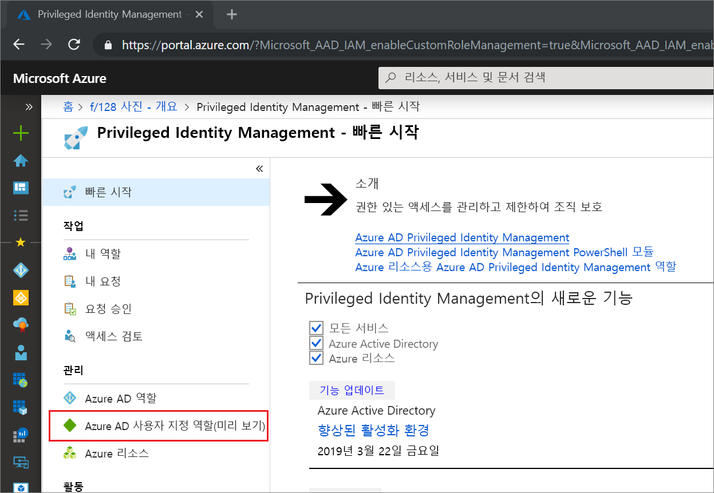
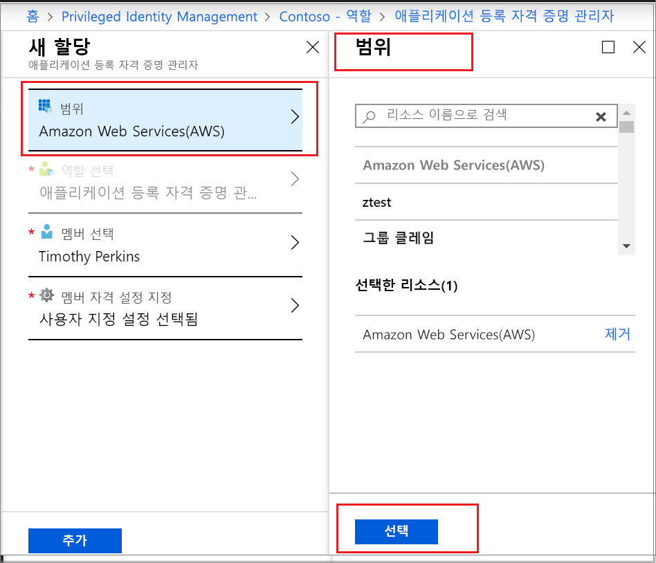

# Privileged Identity Management에서 Azure AD 사용자 지정 역할 활성화

이제 Azure AD(Azure Active Directory)의 Privileged Identity Management에서 ID 및 액세스 관리 환경의 애플리케이션 관리를 위해 만든 사용자 지정 역할에 대해 Just-In-Time 및 시간 제한 할당이 지원됩니다. Azure AD에서 애플리케이션 관리를 위임하기 위한 사용자 지정 역할을 만드는 방법에 대한 자세한 내용은 [Azure Active Directory의 사용자 지정 관리자 역할(미리 보기)](../users-groups-roles/roles-custom-overview.md)을 참조하세요.

> [!NOTE]
> 미리 보기 기간 중에는 Azure AD 사용자 지정 역할이 기본 제공 디렉터리 역할과 통합되지 않습니다. 이 기능이 일반 공급되면 기본 제공 역할 환경에서 역할 관리가 수행됩니다. 다음 배너가 표시 되는 경우 이러한 역할은 [기본 제공 역할 환경에서](pim-how-to-activate-role.md) 관리 해야 하며이 문서는 적용 되지 않습니다.
>
> :::image type="content" source="media/pim-how-to-add-role-to-user/pim-new-version.png" alt-text="Azure AD에서 Privileged Identity Management를 선택 합니다." lightbox="media/pim-how-to-add-role-to-user/pim-new-version.png":::

## 역할 활성화

Azure AD 사용자 지정 역할을 활성화 해야 하는 경우 Privileged Identity Management에서 내 역할 탐색 옵션을 선택 하 여 활성화를 요청 합니다.

1. [Azure Portal](https://portal.azure.com)에 로그인 합니다.
1. Azure AD [Privileged Identity Management](https://portal.azure.com/?Microsoft_AAD_IAM_enableCustomRoleManagement=true&Microsoft_AAD_IAM_enableCustomRoleAssignment=true&feature.rbacv2roles=true&feature.rbacv2=true&Microsoft_AAD_RegisteredApps=demo#blade/Microsoft_Azure_PIMCommon/CommonMenuBlade/quickStart)를 엽니다.

1. **Azure AD 사용자 지정 역할**을 선택하면 적격 Azure AD 사용자 지정 역할이 표시됩니다.

   

> [!Note] 
> 역할을 할당 하기 전에 역할을 만들거나 구성 해야 합니다. AAD 사용자 지정 역할을 구성 하는 방법에 대 한 자세한 내용은 [Privileged Identity Management에서 AZURE AD 사용자 지정 역할 구성](azure-ad-custom-roles-configure.md)을 참조 하세요.

1. **Azure AD 사용자 지정 역할(미리 보기)** 페이지에서 필요한 할당을 찾습니다.
1. **역할 활성화**를 선택하여 **활성화** 페이지를 엽니다.
1. 다단계 인증이 필요한 역할은 **진행하기 전에 ID 확인**을 클릭합니다. 세션당 한 번만 인증해야 합니다.
1. **ID 확인**을 선택하고 지침에 따라 추가 보안 확인을 제공합니다.
1. 사용자 지정 애플리케이션 범위를 지정하려면 **범위**를 선택하여 필터 창을 엽니다. 역할에 대한 액세스는 필요한 최소 범위에서 요청해야 합니다. 할당이 특정 애플리케이션 범위에 있으면 해당 범위에서만 활성화할 수 있습니다.

   

1. 필요한 경우 사용자 지정 활성화 시작 시간을 지정합니다. 사용하면 지정된 시간에 역할 멤버가 활성화됩니다.
1. **이유** 상자에 활성화 요청의 이유를 입력합니다. 이 항목은 역할 설정에서 필수 여부를 설정할 수 있습니다.
1. **활성화**를 선택합니다.

역할에 승인이 필요하지 않으면 설정에 따라 활성화되고 활성 역할 목록에 추가됩니다. 활성화된 역할을 사용하려면 [Privileged Identity Management에서 Azure AD 사용자 지정 역할 할당](azure-ad-custom-roles-assign.md)의 단계부터 시작합니다.

역할을 활성화하는 데 승인이 필요하면, 요청이 승인 보류 중이라고 알려주는 Azure 알림을 받게 됩니다.

## 다음 단계

- [Azure AD 사용자 지정 역할 할당](azure-ad-custom-roles-assign.md)
- [Azure AD 사용자 지정 역할 할당 제거 또는 업데이트](azure-ad-custom-roles-update-remove.md)
- [Azure AD 사용자 지정 역할 할당 구성](azure-ad-custom-roles-configure.md)
- [Azure AD의 역할 정의](../users-groups-roles/directory-assign-admin-roles.md)
