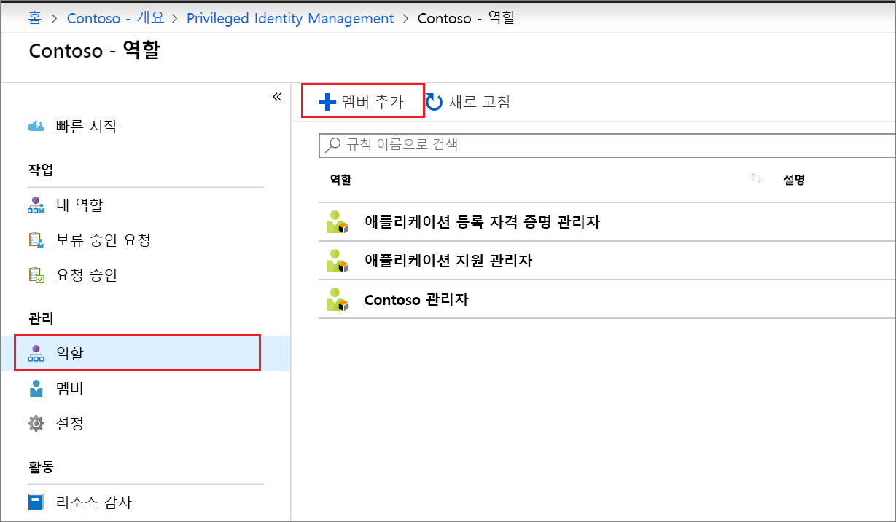
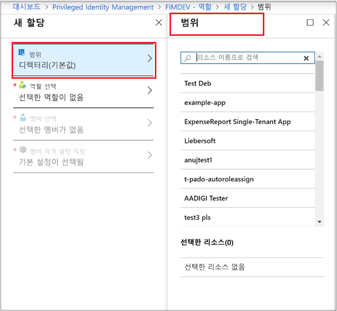
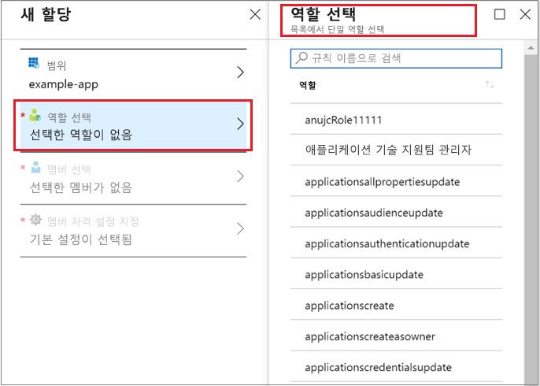
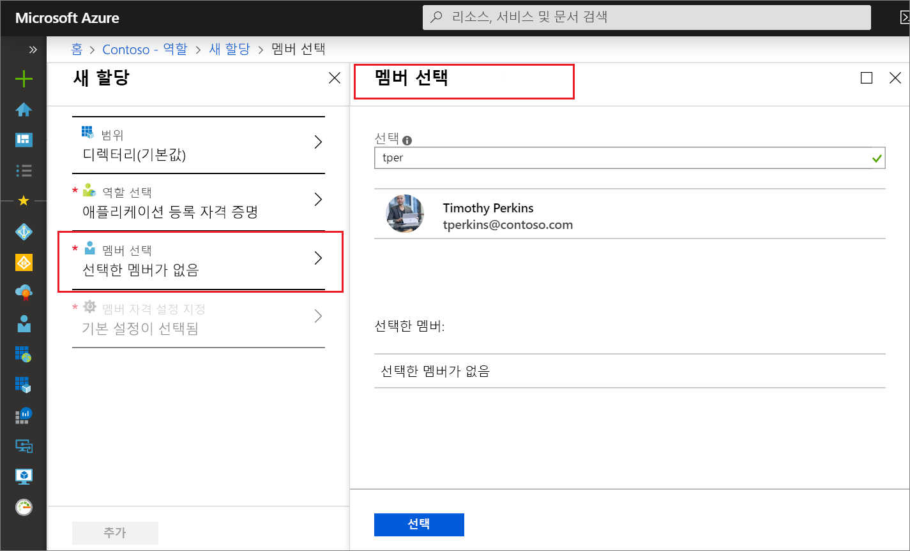
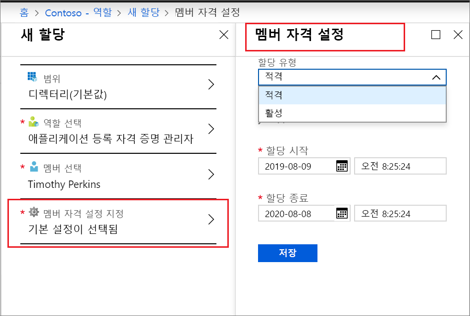
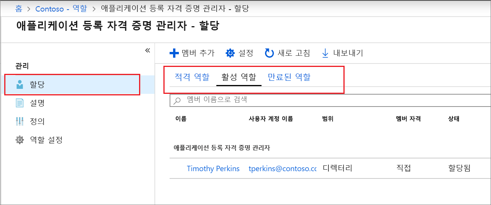

# Privileged Identity Management에서 Azure AD 사용자 지정 역할 할당

이 문서에서는 PIM(Privileged Identity Management)을 사용하여 Azure AD(Azure Active Directory) 관리 환경에서 애플리케이션을 관리하기 위해 만든 사용자 지정 역할에 대한 Just-In-Time 및 시간 제한 할당을 만드는 방법에 대해 설명합니다.

- Azure AD에서 애플리케이션 관리를 위임하기 위한 사용자 지정 역할을 만드는 방법에 대한 자세한 내용은 [Azure Active Directory의 사용자 지정 관리자 역할(미리 보기)](../users-groups-roles/roles-custom-overview.md)을 참조하세요.
- Privileged Identity Management를 아직 사용하지 않은 경우 [PIM 사용](pim-getting-started.md)에서 자세한 정보를 확인하세요.
- 다른 관리자에게 Privileged Identity Management를 관리하기 위한 액세스 권한을 부여하는 방법에 대한 자세한 내용은 [PIM 관리를 위해 다른 관리자에게 액세스 권한 부여](pim-how-to-give-access-to-pim.md)를 참조하세요.

> [!NOTE]
> Azure AD 사용자 지정 역할은 미리 보기 동안 기본 제공 디렉터리 역할과 통합되지 않습니다. 이 기능을 일반적으로 사용할 수 있게 되면 기본 제공 역할 환경에서 역할 관리가 수행됩니다.

## 역할 할당

Privileged Identity Management는 Azure AD(Azure Active Directory) 애플리케이션 관리에서 만들 수 있는 사용자 지정 역할을 관리할 수 있습니다.  다음 단계에서는 사용자 지정 디렉터리 역할에 대한 적격 할당을 수행합니다.

1. 권한 있는 역할 관리자 역할에 할당된 사용자 계정을 사용하여 Azure Portal에서 [Privileged Identity Management](https://portal.azure.com/?Microsoft_AAD_IAM_enableCustomRoleManagement=true&Microsoft_AAD_IAM_enableCustomRoleAssignment=true&feature.rbacv2roles=true&feature.rbacv2=true&Microsoft_AAD_RegisteredApps=demo#blade/Microsoft_Azure_PIMCommon/CommonMenuBlade/quickStart)에 로그인합니다.
1. **Azure AD 사용자 지정 역할(미리 보기)** 을 선택합니다.

    

1. **역할**을 선택하여 Azure AD 애플리케이션에 대한 사용자 지정 역할 목록을 표시합니다.

    

1. **멤버 추가**를 선택하여 할당 창을 엽니다.
1. 역할 할당 범위를 단일 애플리케이션으로 제한하려면 **범위**를 선택하여 애플리케이션 범위를 지정합니다.

    

1. **역할 선택**을 선택하여 **역할 선택** 목록을 엽니다.

    

1. 할당하려는 역할을 클릭한 다음, **선택**을 클릭합니다. **멤버 선택** 목록이 열립니다.

    

1. 역할에 할당하려는 사용자를 선택한 다음, **선택**을 클릭합니다. **멤버 자격 설정** 목록이 열립니다.

    

1. **멤버 자격 설정** 페이지에서 **적격** 또는 **활성**을 선택합니다.

    - **적격** 할당에서는 역할을 사용하기 전에 해당 역할에 할당된 사용자가 작업을 수행해야 합니다. 여기에는 다단계 인증 확인을 전달하거나, 비즈니스 근거를 제공하거나, 지정된 승인자의 승인을 요청하는 작업이 포함될 수 있습니다.
    - **활성** 할당에서는 할당된 사용자가 역할을 사용하기 위한 작업을 수행할 필요가 없습니다. 활성 사용자에게는 항상 역할에 할당된 권한이 있습니다.

1. **영구** 확인란이 있고 역할 설정에 따라 사용 가능한 경우 해당 할당이 영구적인지 여부를 지정할 수 있습니다. 영구 적격 할당으로 적용하거나 영구적으로 할당하려면 이 확인란을 선택합니다. 할당 기간을 지정하려면 이 확인란의 선택을 취소합니다.
1. 새 역할 할당을 만들려면 **저장**, **추가**를 차례로 클릭합니다. 그러면 할당 프로세스 상태에 대한 알림이 표시됩니다.

역할 할당을 확인하려면 열린 역할에서 **할당** > **할당**을 차례로 선택하고, 역할 할당이 적격 또는 활성으로 올바르게 식별되었는지 확인합니다.

 

## 다음 단계

- [Azure AD 사용자 지정 역할 활성화](azure-ad-custom-roles-assign.md)
- [Azure AD 사용자 지정 역할 할당 제거 또는 업데이트](azure-ad-custom-roles-update-remove.md)
- [Azure AD 사용자 지정 역할 할당 구성](azure-ad-custom-roles-configure.md)
- [Azure AD의 역할 정의](../users-groups-roles/directory-assign-admin-roles.md)
