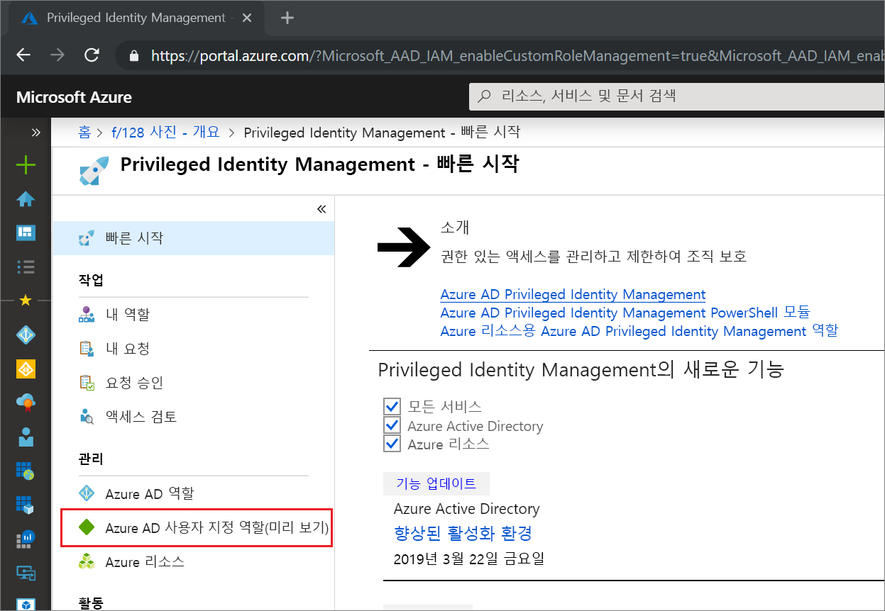
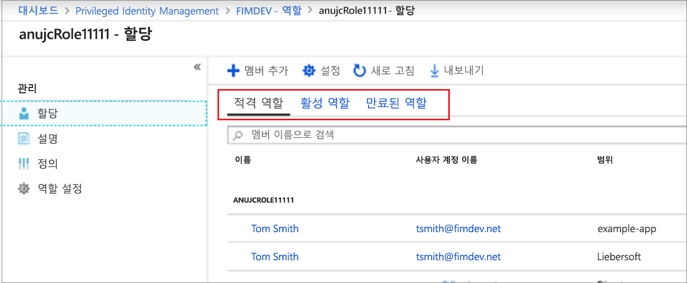
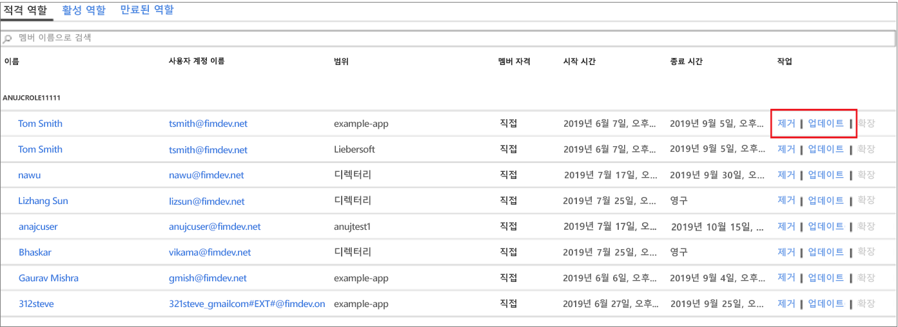

# Privileged Identity Management에서 할당된 Azure AD 사용자 지정 역할 업데이트 또는 제거

이 문서에서는 PIM(Privileged Identity Management)을 사용하여 Azure AD(Azure Active Directory) 관리 환경에서 애플리케이션 관리를 위해 만든 사용자 지정 역할에 대한 Just-In-Time 및 시간 제한 할당을 업데이트하거나 제거하는 방법에 대해 설명합니다. 

- Azure AD에서 애플리케이션 관리를 위임하기 위한 사용자 지정 역할을 만드는 방법에 대한 자세한 내용은 [Azure Active Directory의 사용자 지정 관리자 역할(미리 보기)](../users-groups-roles/roles-custom-overview.md)을 참조하세요. 
- Privileged Identity Management를 아직 사용하지 않은 경우 [Privileged Identity Management 사용 시작](pim-getting-started.md)에서 자세한 정보를 확인하세요.

> [!NOTE]
> 미리 보기 기간 중에는 Azure AD 사용자 지정 역할이 기본 제공 디렉터리 역할과 통합되지 않습니다. 이 기능이 일반 공급되면 기본 제공 역할 환경에서 역할 관리가 수행됩니다. 다음 배너가 표시되면 기본 제공 [역할 환경에서](pim-how-to-add-role-to-user.md) 이러한 역할을 관리해야 하며 이 문서는 적용되지 않습니다.
>
> 

## 할당 업데이트 또는 제거

기존 사용자 지정 역할 할당을 업데이트하거나 제거하려면 다음 단계를 수행합니다.

1. 권한 있는 역할 관리자 역할에 할당된 사용자 계정을 사용하여 Azure Portal에서 [Privileged Identity Management](https://portal.azure.com/?Microsoft_AAD_IAM_enableCustomRoleManagement=true&Microsoft_AAD_IAM_enableCustomRoleAssignment=true&feature.rbacv2roles=true&feature.rbacv2=true&Microsoft_AAD_RegisteredApps=demo#blade/Microsoft_Azure_PIMCommon/CommonMenuBlade/quickStart)에 로그인합니다.
1. **Azure AD 사용자 지정 역할(미리 보기)** 을 선택합니다.

    

1. **역할**을 선택하여 Azure AD 애플리케이션에 대한 사용자 지정 역할의 **할당** 목록을 표시합니다.

    

1. 업데이트 또는 제거하려는 역할을 선택합니다.
1. **적격 역할** 또는 **활성 역할** 탭에서 역할 할당을 찾습니다.
1. **업데이트** 또는 **제거**를 선택하여 역할 할당을 업데이트하거나 제거합니다.

    

## 다음 단계

- [Azure AD 사용자 지정 역할 활성화](azure-ad-custom-roles-assign.md)
- [Azure AD 사용자 지정 역할 할당](azure-ad-custom-roles-assign.md)
- [Azure AD 사용자 지정 역할 할당 구성](azure-ad-custom-roles-configure.md)
