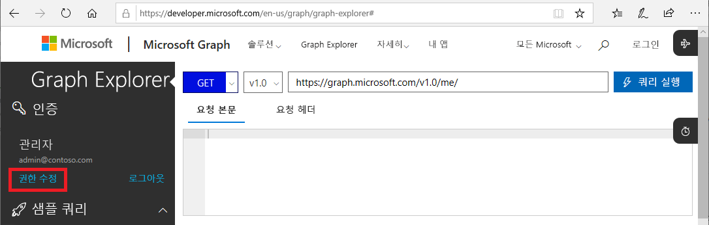
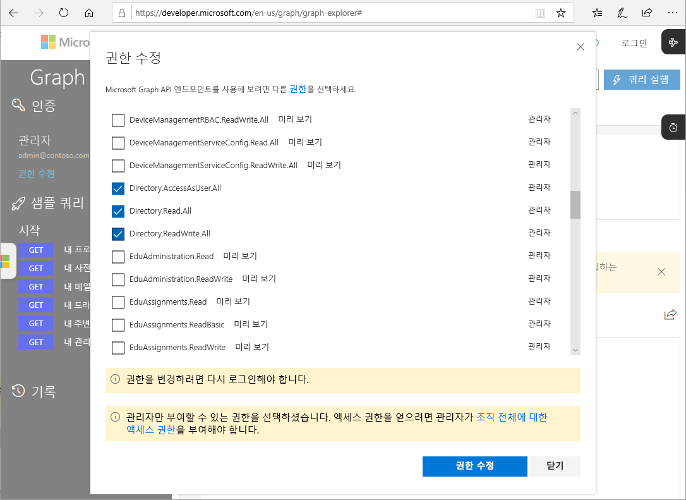

# PIM용 Microsoft Graph API(미리 보기)

Azure AD Privileged Identity Management(PIM)에서 Azure Portal을 사용하여 수행할 수 있는 대부분의 작업은 [Microsoft Graph API](https://developer.microsoft.com/graph/docs/concepts/overview)를 통해서도 수행할 수 있습니다. 이 문서에서는 PIM용 Microsoft Graph API를 사용하는 경우의 중요 개념 몇 가지를 설명합니다. Microsoft Graph API에 대한 자세한 내용은 [Azure AD Privileged Identity Management API 참고 자료](https://developer.microsoft.com/graph/docs/api-reference/beta/resources/privilegedidentitymanagement_root)를 참조하세요.

> [!IMPORTANT]
> Microsoft Graph의 /베타 버전 아래에 있는 API는 미리 보기 상태이며 변경될 가능성이 있습니다. 프로덕션 애플리케이션에서는 이러한 API의 사용이 지원되지 않습니다.

## 필요한 사용 권한

PIM용 Microsoft Graph API를 호출하려면 다음 권한이 **하나 이상** 있어야 합니다.

- `Directory.AccessAsUser.All`
- `Directory.Read.All`
- `Directory.ReadWrite.All`
- `PrivilegedAccess.ReadWrite.AzureAD`

### 권한 설정

PIM용 Microsoft Graph API를 호출하는 애플리케이션에는 필요한 권한이 있어야 합니다. 필요한 권한을 지정하는 가장 쉬운 방법은 [Azure AD 동의 프레임워크](../develop/consent-framework.md)를 사용하는 것입니다.

### Graph Explorer에서 권한 설정

Graph Explorer를 사용하여 호출을 테스트하는 경우 도구에서 사용 권한을 지정할 수 있습니다.

1. [Graph Explorer](https://developer.microsoft.com/graph/graph-explorer)에 글로벌 관리자로 로그인합니다.

1. **권한 수정**을 클릭합니다.

    

1. 포함하려는 권한 옆에 있는 확인 표시를 추가합니다. `PrivilegedAccess.ReadWrite.AzureAD`는 아직 Graph Explorer에서 사용할 수 없습니다.

    

1. **권한 수정**을 클릭하여 권한 변경 사항을 적용합니다.

## 다음 단계

- [Azure AD Privileged Identity Management API 참고 자료](https://developer.microsoft.com/graph/docs/api-reference/beta/resources/privilegedidentitymanagement_root)
