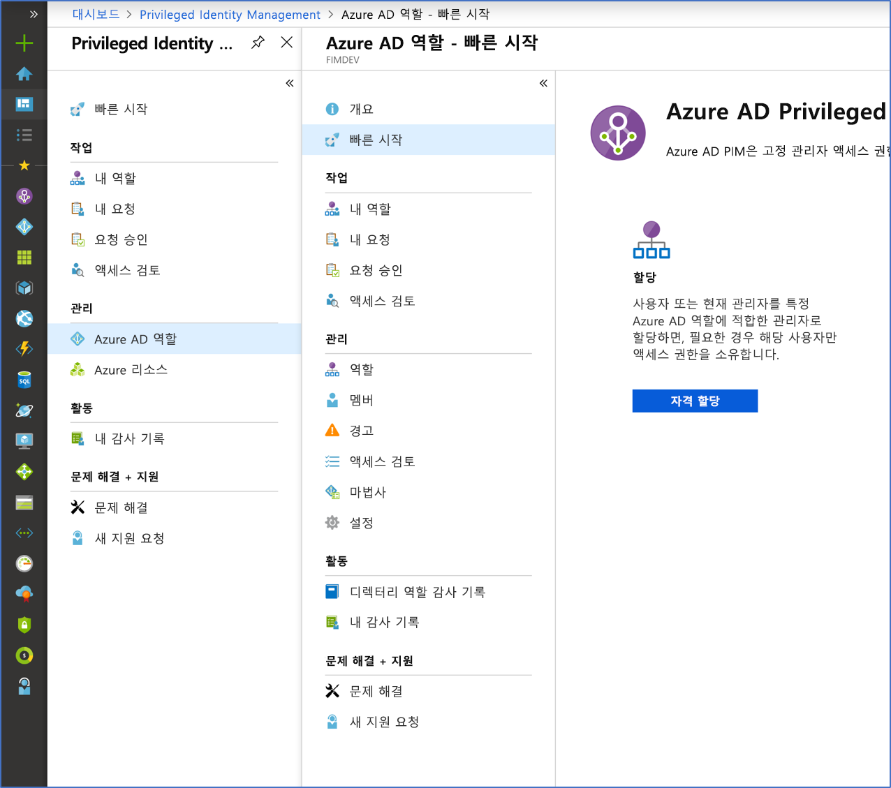

# Azure AD Privileged Identity Management란?

Azure AD(Azure Active Directory) PIM(Privileged Identity Management)은 조직에서 중요한 리소스에 대한 액세스를 관리, 제어 및 모니터링할 수 있습니다. 여기에는 Azure AD, Azure 리소스 및 기타 Microsoft Online Services(예: Office 365 또는 Microsoft Intune)의 리소스에 대한 액세스가 포함됩니다.

## PIM을 사용해야 하는 이유는 무엇인가요?

악의적인 작업자가 해당 액세스 권한을 얻거나 권한이 있는 사용자가 실수로 중요한 리소스에 영향을 줄 수 있으므로 조직에서는 보호되는 정보 또는 리소스에 액세스할 수 있는 사용자의 수를 최소화하려고 합니다. 그러나 사용자는 여전히 Azure AD, Azure, Office 365 또는 SaaS 응용 프로그램에서 권한 있는 작업을 수행해야 합니다. 조직은 사용자에게 Azure 리소스 및 Azure AD에 대한 JIT(Just-In-Time) 권한 있는 액세스를 제공할 수 있습니다. 이러한 사용자가 해당 관리자 권한으로 수행하는 작업에 대한 감시 요구 사항이 있습니다. PIM은 과도하거나 필요하지 않거나 잘못 사용되는 액세스 권한의 위험을 완화하는 데 도움이 됩니다.

## PIM으로 무엇을 할 수 있나요?

PIM은 기본적으로 사용자가 관심 있는 리소스에 대해 누가, 무엇을, 언제, 어디서 그리고 왜 관리해야 하는지를 지원합니다. PIM의 몇 가지 주요 기능은 다음과 같습니다.

- Azure AD 및 Azure 리소스에 대한 **JIT(Just-In-Time)** 권한 있는 액세스 제공
- 시작 및 종료 날짜를 사용하여 리소스에 **시간 범위** 액세스 할당
- 권한 있는 역할을 활성화하기 위해 **승인** 필요
- **다단계 인증**을 적용하여 모든 역할 활성화
- **근거**를 사용하여 사용자가 활성화하는 이유 이해
- 권한 있는 역할이 활성화되면 **알림** 가져오기
- **액세스 검토**를 수행하여 사용자에게 여전히 역할이 필요한지 확인
- 내부 또는 외부 감사를 위해 **감사 기록** 다운로드

## 용어

PIM 및 설명서를 보다 정확하게 이해하려면 다음 용어를 검토해야 합니다.

| 용어 또는 개념 | 역할 할당 범주 | 설명 |
| --- | --- | --- |
| 적격 | Type | 사용자가 역할을 사용하기 위해 하나 이상의 작업을 수행해야 하는 역할 할당입니다. 사용자가 역할에 대한 자격을 얻은 경우 권한 있는 작업을 수행해야 할 때 해당 역할을 활성화할 수 있음을 의미합니다. 영구 및 적격 역할 할당을 비교했을 때 이 둘을 통해 다른 사람에게 주어진 액세스에는 차이가 없습니다. 유일한 차이는 사람들이 그 액세스를 항상 필요로 하지 않는다는 점입니다. |
| 활성 | Type | 사용자가 역할을 사용하기 위해 어떤 작업을 수행할 필요가 없는 역할 할당입니다. 활성으로 할당된 사용자에게는 역할에 할당된 권한이 있습니다. |
| 활성화 |  | 사용자가 자격이 있는 역할을 사용하기 위해 하나 이상의 작업을 수행하는 프로세스입니다. 작업은 MFA(Multi-Factor Authentication) 검사를 수행하고, 비즈니스 근거를 제공하거나 지정된 승인자의 승인을 요청하는 과정을 포함할 수 있습니다. |
| 할당됨 | 시스템 상태 | 활성 역할 할당이 있는 사용자입니다. |
| 활성화됨 | 시스템 상태 | 적격 역할 할당이 있고, 역할을 활성화하기 위한 작업을 수행했으며, 현재 활성화된 사용자입니다.  활성화되면 사용자는 미리 구성된 기간 동안 역할을 사용할 수 있으며, 이 기간이 끝나면 다시 활성화해야 합니다. |
| 영구 적격 | 기간 | 사용자가 항상 역할을 활성화할 수 있는 자격이 있는 역할 할당입니다. |
| 영구 활성 | 기간 | 사용자가 어떤 작업도 수행하지 않고 항상 역할을 사용할 수 있는 역할 할당입니다. |
| 만료 적격 | 기간 | 사용자가 지정된 시작 및 종료 날짜 내에 역할을 활성화할 수 있는 자격이 있는 역할 할당입니다. |
| 만료 활성화 | 기간 | 사용자가 지정된 시작 및 종료 날짜 내에 어떤 작업도 수행하지 않고 역할을 사용할 수 있는 역할 할당입니다. |
| JIT(Just In Time) 액세스 |  | 사용자가 권한 있는 작업을 수행하기 위해 임시 사용 권한을 받는 모델이며, 악의적 또는 권한이 없는 사용자가 권한이 만료된 후 액세스 권한을 획득하는 것을 방지합니다. 액세스 권한은 사용자에게 필요한 경우에만 부여됩니다. |
| 최소 권한 액세스 원칙 |  | 모든 사용자에게 수행할 권한이 있는 작업을 수행하는 데 필요한 최소 권한만 제공하는 권장 보안 방법입니다. 이 방법은 글로벌 관리자 수를 최소화하고, 그 대신 특정 시나리오에 특정 관리자 역할을 사용합니다. |

## PIM은 어떻게 표시되나요?

PIM을 설정하면 **작업**, **관리** 및 **활동** 옵션이 왼쪽 탐색 메뉴에 표시됩니다. 관리자는 **Azure AD 역할** 및 **Azure 리소스** 관리 중에서 선택합니다. 관리할 역할 유형을 선택하면 해당 역할 유형에 대한 유사한 옵션 세트가 표시됩니다.

## PIM에서 누가 어떤 일을 수행하나요?

PIM을 처음 사용하는 경우 해당 사용자에게 디렉터리에 대한 [보안 관리자](../users-groups-roles/directory-assign-admin-roles.md#security-administrator) 및 [권한 있는 역할 관리자](../users-groups-roles/directory-assign-admin-roles.md#privileged-role-administrator) 역할이 자동으로 할당됩니다.

Azure AD 역할의 경우 권한 있는 역할 관리자 역할에 있는 사용자만 PIM의 다른 관리자에 대한 할당을 관리할 수 있습니다. [PIM 관리를 위해 다른 관리자에게 액세스 권한을 부여](pim-how-to-give-access-to-pim.md)할 수 있습니다. 글로벌 관리자, 보안 관리자 및 보안 읽기 권한자는 PIM에서 Azure AD 역할에 대한 할당을 볼 수 있습니다.

Azure 리소스 역할의 경우 구독 관리자, 리소스 소유자 또는 리소스 사용자 액세스 관리자만 PIM에서 다른 관리자에 대한 할당을 관리할 수 있습니다. 권한 있는 역할 관리자, 보안 관리자 또는 보안 읽기 권한자인 사용자는 기본적으로 PIM에서 Azure 리소스 역할에 대한 할당을 볼 수 있는 액세스 권한을 가지고 있지 않습니다.

## 시나리오

PIM은 다음과 같은 시나리오를 지원합니다.

**권한 있는 역할 관리자는 다음을 수행할 수 있습니다.**

- 특정 역할에 대한 승인을 사용하도록 설정
- 요청을 승인할 승인자 사용자 및/또는 그룹 지정
- 모든 권한 있는 역할에 대한 요청 및 승인 기록 보기

**승인자는 다음을 수행할 수 있습니다.**

- 보류 중인 승인(요청) 보기
- 역할 상승 요청(단일 및/또는 대량) 승인 또는 거부
- 승인/거부에 대한 근거 제공 

**적격 역할 사용자는 다음을 수행할 수 있습니다.**

- 승인이 필요한 역할의 활성화 요청
- 활성화 요청 상태 보기
- 활성화가 승인되면 Azure AD에서 작업 수행

## 라이선스 요구 사항

[!INCLUDE [Azure AD Premium P2 license](../../../includes/active-directory-p2-license.md)]

사용자의 라이선스에 대한 자세한 내용은 [PIM을 사용하기 위한 라이선스 요구 사항](subscription-requirements.md)을 참조하세요.

## 다음 단계

- [PIM을 사용하기 위한 라이선스 요구 사항](subscription-requirements.md)
- [Azure AD에서 하이브리드 및 클라우드 배포를 위한 권한 있는 액세스 보안](../users-groups-roles/directory-admin-roles-secure.md?toc=%2fazure%2factive-directory%2fprivileged-identity-management%2ftoc.json)
- [PIM 배포](pim-deployment-plan.md)
