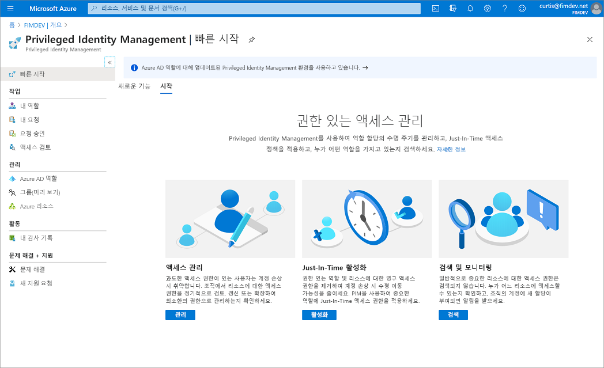

# Azure AD Privileged Identity Management란?

 PIM(Privileged Identity Management)은 조직에서 중요한 리소스에 대한 액세스를 관리, 제어 및 모니터링할 수 있는 Azure AD(Azure Active Directory)의 서비스입니다. 이러한 리소스에는 Azure AD, Azure 및 Microsoft 365 또는 Microsoft Intune과 같은 기타 Microsoft Online Services의 리소스가 포함됩니다. 다음 비디오에서는 중요한 PIM 개념 및 기능을 소개합니다.
  

> [!VIDEO https://www.youtube.com/embed/f-0K7mRUPpQ]

## 사용 이유

조직에서는 악의적인 사용자가 해당 액세스 권한을 갖게 될 가능성을 줄일 수 있기 때문에

- 보안 정보 또는 리소스에 액세스하는 사용자 수를 최소화하려고 합니다.
- 권한 있는 사용자가 실수로 중요한 리소스에 영향을 미치는 경우

그러나 사용자는 여전히 Azure AD, Azure, Microsoft 365 또는 SaaS 앱에서 권한 있는 작업을 수행해야 합니다. 조직은 사용자에게 Azure 및 Azure AD 리소스에 대한 Just-In-Time 권한 있는 액세스 권한을 부여하고 해당 사용자가 권한 있는 액세스로 수행하는 작업을 감독할 수 있습니다.

## 라이선스 요구 사항

[!INCLUDE [Azure AD Premium P2 license](../../../includes/active-directory-p2-license.md)]

사용자의 라이선스에 대한 자세한 내용은 [Privileged Identity Management를 사용하기 위한 라이선스 요구 사항](subscription-requirements.md)을 참조하세요.

## 수행하는 작업

Privileged Identity Management는 중요한 리소스에 대한 과도한, 불필요한 또는 잘못 사용된 액세스 권한의 위험을 완화할 수 있도록 시간 기반 및 승인 기반 역할 활성화를 제공합니다. 다음은 Privileged Identity Management의 주요 기능입니다.

- Azure AD 및 Azure 리소스에 대한 **JIT(Just-In-Time)** 권한 있는 액세스 제공
- 시작 및 종료 날짜를 사용하여 리소스에 **시간 범위** 액세스 할당
- 권한 있는 역할을 활성화하기 위해 **승인** 필요
- **다단계 인증** 을 적용하여 모든 역할 활성화
- **근거** 를 사용하여 사용자가 활성화하는 이유 이해
- 권한 있는 역할이 활성화되면 **알림** 가져오기
- **액세스 검토** 를 수행하여 사용자에게 여전히 역할이 필요한지 확인
- 내부 또는 외부 감사를 위해 **감사 기록** 다운로드
- **마지막 활성 전역 관리자** 역할 할당 제거 방지

## Privileged Identity Management로 무엇을 할 수 있나요?

Privileged Identity Management를 설정하면 **작업**, **관리** 및 **활동** 옵션이 왼쪽 탐색 메뉴에 표시됩니다. 관리자는 **Azure AD 역할** 관리, **Azure 리소스** 역할 또는 권한 있는 액세스 그룹 관리 등의 옵션 중에서 선택합니다. 관리할 항목을 선택하면 해당 옵션에 대한 적절한 옵션 세트가 표시됩니다.

## 누가 무엇을 할 수 있나요?

Privileged Identity Management의 Azure AD 역할의 경우 권한 있는 역할 관리자 또는 전역 관리자 역할에 있는 사용자만이 다른 관리자에 대한 할당을 관리할 수 있습니다. 또한 전역 관리자, 보안 관리자, 글로벌 읽기 권한자 및 보안 읽기 권한자는 Privileged Identity Management에서 Azure AD 역할에 대한 할당을 볼 수 있습니다.

Privileged Identity Management의 Azure 리소스 역할의 경우 구독 관리자, 리소스 소유자 또는 리소스 사용자 액세스 관리자만이 다른 관리자에 대한 할당을 관리할 수 있습니다. 권한 있는 역할 관리자, 보안 관리자 또는 보안 읽기 권한자인 사용자는 기본적으로 Privileged Identity Management에서 Azure 리소스 역할에 대한 할당을 볼 수 있는 액세스 권한을 가지고 있지 않습니다.

## 용어

Privileged Identity Management 및 설명서를 보다 정확하게 이해하려면 다음 용어를 검토해야 합니다.

| 용어 또는 개념 | 역할 할당 범주 | Description |
| --- | --- | --- |
| 적격 | Type | 사용자가 역할을 사용하기 위해 하나 이상의 작업을 수행해야 하는 역할 할당입니다. 사용자가 역할에 대한 자격을 얻은 경우 권한 있는 작업을 수행해야 할 때 해당 역할을 활성화할 수 있음을 의미합니다. 영구 및 적격 역할 할당을 비교했을 때 이 둘을 통해 다른 사람에게 주어진 액세스에는 차이가 없습니다. 유일한 차이는 사람들이 그 액세스를 항상 필요로 하지 않는다는 점입니다. |
| 활성 | Type | 사용자가 역할을 사용하기 위해 어떤 작업을 수행할 필요가 없는 역할 할당입니다. 활성으로 할당된 사용자에게는 역할에 할당된 권한이 있습니다. |
| 활성화 |  | 사용자가 자격이 있는 역할을 사용하기 위해 하나 이상의 작업을 수행하는 프로세스입니다. 작업은 MFA(Multi-Factor Authentication) 검사를 수행하고, 비즈니스 근거를 제공하거나 지정된 승인자의 승인을 요청하는 과정을 포함할 수 있습니다. |
| 할당됨 | 시스템 상태 | 활성 역할 할당이 있는 사용자입니다. |
| 활성화됨 | 시스템 상태 | 적격 역할 할당이 있고, 역할을 활성화하기 위한 작업을 수행했으며, 현재 활성화된 사용자입니다. 활성화되면 사용자는 미리 구성된 기간 동안 역할을 사용할 수 있으며, 이 기간이 끝나면 다시 활성화해야 합니다. |
| 영구 적격 | Duration | 사용자가 항상 역할을 활성화할 수 있는 자격이 있는 역할 할당입니다. |
| 영구 활성 | Duration | 사용자가 어떤 작업도 수행하지 않고 항상 역할을 사용할 수 있는 역할 할당입니다. |
| 시간 범위 적격 | Duration | 사용자가 시작 및 종료 날짜 내에만 역할을 활성화할 수 있는 자격이 있는 역할 할당입니다. |
| 시간 범위 활성 | Duration | 사용자가 시작 및 종료 날짜에만 역할을 사용할 수 있는 역할 할당입니다. |
| JIT(Just In Time) 액세스 |  | 사용자가 권한 있는 작업을 수행하기 위해 임시 사용 권한을 받는 모델이며, 악의적 또는 권한이 없는 사용자가 권한이 만료된 후 액세스 권한을 획득하는 것을 방지합니다. 액세스 권한은 사용자에게 필요한 경우에만 부여됩니다. |
| 최소 권한 액세스 원칙 |  | 모든 사용자에게 수행할 권한이 있는 작업을 수행하는 데 필요한 최소 권한만 제공하는 권장 보안 방법입니다. 이 방법은 글로벌 관리자 수를 최소화하고, 그 대신 특정 시나리오에 대해 구체적 관리자 역할을 사용합니다. |

## 할당 확장 또는 갱신

시간이 제한된 소유자 또는 멤버 할당을 설정한 후 할당이 만료되면 어떻게 될까요? 이 새 버전에서는 이 시나리오에 대한 다음 두 가지 옵션이 제공됩니다.

- 연장 – 역할 할당이 만료될 시기가 다가오면 사용자는 Privileged Identity Management를 사용하여 역할 할당 연장을 요청할 수 있습니다.
- 갱신 – 역할 할당이 이미 만료된 경우 사용자는 Privileged Identity Management를 사용하여 역할 할당 갱신을 요청할 수 있습니다.

사용자가 시작하는 두 작업은 전역 관리자 또는 권한 있는 역할 관리자의 승인이 필요합니다. 관리자는 할당 만료를 관리할 필요가 없습니다. 간단한 승인 또는 거부를 위해 연장 또는 갱신 요청이 도착할 때까지 기다릴 수 있습니다.

## 시나리오

Privileged Identity Management에서 지원하는 시나리오는 다음과 같습니다.

### 권한 있는 역할 관리자 권한

- 특정 역할에 대한 승인을 사용하도록 설정
- 요청을 승인할 승인자 사용자 또는 그룹 지정
- 모든 권한 있는 역할에 대한 요청 및 승인 기록 보기

### 승인자 사용 권한

- 보류 중인 승인(요청) 보기
- 역할 상승 요청 승인 또는 거부(단일 및 대량)
- 승인 또는 거부에 대한 근거 제공

### 적격 역할 사용자 사용 권한

- 승인이 필요한 역할의 활성화 요청
- 활성화 요청 상태 보기
- 활성화가 승인되면 Azure AD에서 작업 수행

## 권한 있는 액세스 Azure AD 그룹 관리(미리 보기)

이제 PIM(Privileged Identity Management)에서 권한 있는 액세스 그룹의 멤버 자격 또는 소유권에 대한 자격을 할당할 수 있습니다. 이 미리 보기부터 클라우드 그룹에 Azure AD(Azure Active Directory) 기본 제공 역할을 할당하고 PIM을 사용하여 그룹 멤버 및 소유자 자격과 활성화를 관리할 수 있습니다. Azure AD의 역할 할당 가능 그룹에 대한 자세한 내용은 [클라우드 그룹을 사용하여 Azure Active Directory의 역할 할당 관리(미리 보기)](../roles/groups-concept.md)를 참조하세요.

>[!Important]
> Exchange, 보안 및 규정 준수 센터 또는 SharePoint에 대한 관리 액세스 역할에 권한 있는 액세스 그룹을 할당하려면 권한 있는 액세스 그룹 환경이 아닌 Azure AD 포털 **역할 및 관리자** 환경을 사용하여 그룹에 활성화하기에 적합한 사용자 또는 그룹을 만듭니다.

### 그룹별로 다른 Just-In-Time 정책

일부 조직에서는 Azure AD B2B 협업 같은 도구를 사용하여 파트너를 Azure AD 조직에 게스트로 초대합니다. 권한 있는 역할에 대한 모든 할당에 단일 Just-In-Time 정책을 사용하는 대신, 자체 정책을 사용하여 두 개의 서로 다른 권한 있는 액세스 그룹을 만들 수 있습니다. 신뢰할 수 있는 직원에게는 덜 엄격한 요구 사항을 적용하고, 할당된 그룹 활성화를 요청하는 파트너에게는 승인 워크플로와 같은 더 엄격한 요구 사항을 적용할 수 있습니다.

### 하나의 요청에서 여러 역할 할당 활성화

권한 있는 액세스 그룹 미리 보기를 사용하면 단일 Just-In-Time 요청을 통해 워크로드별 관리자에게 여러 역할에 대한 신속한 액세스 권한을 제공할 수 있습니다. 예를 들어 계층 3 Office 관리자는 매일 인시던트를 철저히 조사하기 위해 Exchange 관리자, Office 앱 관리자, Teams 관리자 및 검색 관리자 역할에 대한 Just-In-Time 액세스가 필요할 수 있습니다. 이전에는 4회 연속 요청이 필요했으며, 이 프로세스에 다소 시간이 걸렸습니다. 이제는 "계층 3 Office 관리자"라는 역할 할당 가능 그룹을 만들고, 앞에서 설명한 네 가지 역할(또는 Azure AD 기본 제공 역할)에 할당하고, 그룹의 작업 섹션에서 권한 있는 액세스에 사용하도록 설정할 수 있습니다. 권한 있는 액세스에 사용하도록 설정하면 그룹의 멤버에 대한 Just-In-Time 설정을 구성하고 관리자 및 소유자를 적격 대상으로 할당할 수 있습니다. 관리자가 그룹으로 승격되면 네 가지 Azure AD 역할의 멤버가 됩니다.

## 게스트 사용자 초대 및 Privileged Identity Management에서 Azure 리소스 역할 할당

Azure Active Directory(Azure AD) 게스트 사용자는 Azure AD 내의 B2B(Business-to-Business) 협업 기능의 일부로 외부 게스트 사용자 및 공급업체를 게스트로 관리할 수 있습니다. 예를 들어 특정 Azure 리소스에 대한 액세스 권한 할당, 할당 기간 및 종료 날짜 지정, 활성 할당 또는 활성화 시 2단계 인증 요구 등 Azure ID 작업에 이러한 Privileged Identity Management 기능을 게스트와 함께 사용할 수 있습니다. 조직에 게스트를 초대하고 액세스를 관리하는 방법에 대한 자세한 내용은 [Azure AD 포털에서 B2B 협업 사용자 추가](../external-identities/add-users-administrator.md)를 참조하세요.

### 언제 게스트를 초대하나요?

다음은 조직에 게스트를 초대할 수 있는 몇 가지 경우입니다.

- 이메일 계정만 있는 외부 자영업자가 프로젝트에 대한 Azure 리소스에 액세스할 수 있도록 허용합니다.
- 온-프레미스 Active Directory Federation Services를 사용하는 대규모 조직의 외부 사용자가 비용 애플리케이션에 액세스할 수 있도록 허용합니다.
- 고객 조직에 속하지 않은 지원 엔지니어(예: Microsoft 지원)가 문제 해결을 위해 일시적으로 고객의 Azure 리소스에 액세스할 수 있도록 허용합니다.

### B2B 게스트를 사용한 협업은 어떤 방식으로 작동하나요?

B2B 협업을 사용하는 경우 외부 사용자를 조직에 게스트로 초대할 수 있습니다. 게스트는 조직에서 사용자로 관리될 수 있지만 Azure AD 조직이 아닌 홈 조직에서 인증되어야 합니다. 즉, 게스트가 자신의 홈 조직에 액세스할 수 없는 경우 해당 조직에도 액세스할 수 없습니다. 예를 들어, 게스트가 조직을 떠나면 아무런 조치를 취하지 않아도 Azure AD에서 공유된 모든 리소스에 대한 액세스 권한을 자동으로 잃게 됩니다. B2B 협업에 대한 자세한 내용은 [Azure Active Directory B2B에서 게스트 사용자 엑세스란?](../external-identities/what-is-b2b.md)을 참조하세요.

## 다음 단계

- [Privileged Identity Management를 사용하기 위한 라이선스 요구 사항](subscription-requirements.md)
- [Azure AD에서 하이브리드 및 클라우드 배포를 위한 권한 있는 액세스 보안](../roles/security-planning.md?toc=%2fazure%2factive-directory%2fprivileged-identity-management%2ftoc.json)
- [Privileged Identity Management 배포](pim-deployment-plan.md)
