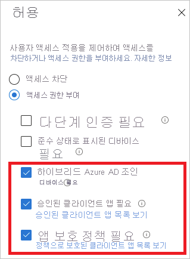
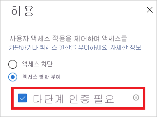

# Azure AD의 로그인 진단 시나리오

Azure AD의 로그인 진단을 사용하여 로그인 시도 중 발생한 상황을 분석하고 Microsoft 지원을 받지 않고도 문제를 해결할 수 있는 권장 사항을 얻을 수 있습니다.  

이 문서에서는 이 도구를 사용할 때 식별하고 해결할 수 있는 시나리오 유형을 개략적으로 설명합니다.

## 지원되는 시나리오

Azure AD의 로그인 진단은 다음 시나리오를 지원합니다.

- **조건부 액세스**

    - 조건부 액세스를 통해 차단  

    - 조건부 액세스 실패  

    - 조건부 액세스를 통한 MFA(다단계 인증)  

    - 조건부 액세스로 인한 B2B 차단된 로그인 

- **MFA(다단계 인증) 사용**  

    - 다른 요구 사항의 MFA  

    - MFA 증명 필요  

    - MFA 증명 필요(위험한 로그인 위치)  

- **올바른 자격 증명 및 잘못된 자격 증명**  

    - 로그인 완료  

    - 계정이 잠김  

    - 잘못된 사용자 이름 또는 암호  

- **엔터프라이즈 앱**  

    - 엔터프라이즈 앱 서비스 공급자  

    - 엔터프라이즈 앱 구성  

- **기타 시나리오**   

    - 보안 기본값  
    
    - 오류 코드 인사이트  

    - 레거시 인증  

    - 위험 정책에 따라 차단됨 

## 조건부 액세스  

### 조건부 액세스를 통해 차단 

이 시나리오에서는 조건부 액세스 정책에 따라 로그인 시도가 차단되었습니다. 

이 시나리오의 진단 섹션에는 사용자 로그인 이벤트 및 적용된 정책에 대한 세부 정보가 표시됩니다. 

 

### 조건부 액세스 실패 

이 시나리오는 일반적으로 조건부 액세스 정책의 요구 사항이 충족되지 않아 실패한 로그인 시도의 결과입니다. 일반적인 예제는 다음과 같습니다. 

- 하이브리드 Azure AD 조인 디바이스 필요 

- 승인된 클라이언트 앱 필요 

- 앱 보호 정책 필요 

이 시나리오의 진단 섹션에는 사용자 로그인 시도 및 적용된 정책에 대한 세부 정보가 표시됩니다. 

 

### 조건부 액세스의 MFA 

이 시나리오의 조건부 액세스 정책에는 다단계 인증 집합을 사용하여 로그인해야 합니다. 

이 시나리오의 진단 섹션에는 사용자 로그인 시도 및 적용된 정책에 대한 세부 정보가 표시됩니다. 

 

 

## Multi-Factor Authentication  

### 다른 요구 사항의 MFA 

이 시나리오의 조건부 액세스 정책에는 다단계 인증 요구 사항이 적용되지 않았습니다. 예를 들어 사용자별 다단계 인증이 있습니다. 

 

이 진단 시나리오는 다음에 대한 자세한 정보를 제공하기 위한 것입니다. 

- 중단된 다단계 인증의 출처 

- 클라이언트 상호 작용의 결과 

또한 사용자 로그인 시도에 대한 모든 세부 정보를 볼 수도 있습니다. 

 

### MFA 증명 필요 

이 시나리오의 로그인 시도는 다단계 인증을 설정하라는 요청에 의해 중단되었습니다. 이 설정을 증명이라고도 합니다. 

 

사용자가 다단계 인증을 사용해야 하지만 아직 구성하지 않았거나 관리자가 사용자에게 이를 구성하도록 요구한 경우에 다단계 인증 증명이 발생합니다. 

 

이 진단 시나리오에서는 다단계 인증 중단이 사용자 구성 부족으로 인해 발생합니다. 사용자가 증명을 완료하는 것이 좋습니다. 

 

### MFA 증명 필요(위험한 로그인 위치) 

이 시나리오의 로그인 시도는 위험한 로그인 위치에서 다단계 인증을 설정하라는 요청에 의해 중단되었습니다. 

 

이 진단 시나리오에서는 다단계 인증 중단이 사용자 구성 부족으로 인해 발생합니다. 사용자가 특히 위험하지 않은 네트워크 위치에서 증명을 완료하는 것이 좋습니다. 

 

이 시나리오의 예로는 정책에 따라 사용자가 신뢰할 수 있는 네트워크 위치에서만 MFA를 설정해야 하지만 사용자가 신뢰할 수 없는 네트워크 위치에서 로그인하는 경우가 있습니다. 

 

## 올바른 자격 증명 및 잘못된 자격 증명

### 로그인 완료 

이 시나리오에서 로그인 이벤트는 조건부 액세스 또는 다단계 인증에 의해 중단되지 않습니다.  

 

이 진단 시나리오에서는 조건부 액세스 정책 또는 다단계 인증으로 인해 중단되어야 하는 사용자 로그인 이벤트에 관한 세부 정보를 제공합니다. 

 

### 계정이 잠김 

이 시나리오에서는 사용자가 너무 많이 잘못된 자격 증명으로 로그인했습니다. 이 시나리오는 잘못된 자격 증명으로 너무 많은 암호 기반 로그인을 시도한 경우 발생합니다. 진단 시나리오는 관리자가 시도의 출처와 합법적인 사용자 로그인 시도인지 여부를 확인하는 정보를 제공합니다. 

 

이 진단 시나리오는 앱, 시도 횟수, 사용된 디바이스, 운영 체제, IP 주소 등에 관한 세부 정보를 제공합니다. 

 

이 항목에 관한 자세한 내용은 Azure AD Smart Lock 설명서를 참조하세요. 

 

 

### 잘못된 사용자 이름 또는 암호 

이 시나리오에서 사용자는 잘못된 사용자 이름이나 암호를 사용하여 로그인하려고 했습니다. 진단은 관리자가 잘못된 자격 증명을 입력하는 사용자나 이전 암호를 캐시하고 다시 제출하는 클라이언트 및/또는 애플리케이션과 관련된 문제가 있는지 확인할 수 있도록 하기 위한 것입니다. 

 

이 진단 시나리오는 앱, 시도 횟수, 사용된 디바이스, 운영 체제, IP 주소 등에 관한 세부 정보를 제공합니다. 

 

## 엔터프라이즈 앱 

엔터프라이즈 애플리케이션에는 문제가 발생할 수 있는 두 가지 지점이 있습니다. 

- ID 공급자(Azure AD) 애플리케이션 구성 
- 서비스 공급자(애플리케이션 서비스, SaaS 애플리케이션이라고도 함) 쪽

 

이러한 문제의 진단은 해결을 위해 확인해야 하는 문제의 부분과 수행할 작업을 처리합니다. 

 

### 엔터프라이즈 앱 서비스 공급자 

이 시나리오에서 사용자는 애플리케이션에 로그인하려고 했습니다. 로그인 흐름의 애플리케이션(서비스 공급자라고도 함) 쪽과 관련된 문제로 인해 로그인에 실패했습니다. 이 진단으로 검색된 문제는 일반적으로 애플리케이션 서비스에서 구성을 변경하거나 문제를 수정하여 해결해야 합니다.  

이 시나리오의 해결은 다른 서비스에 로그인하고 진단 지침에 따라 일부 구성을 변경하는 것을 의미합니다. 

 

### 엔터프라이즈 앱 구성 

이 시나리오에서는 애플리케이션의 Azure AD 쪽에 대한 애플리케이션 구성 문제로 인해 로그인에 실패했습니다. 

 

이 시나리오를 해결하려면 애플리케이션의 엔터프라이즈 애플리케이션 블레이드 항목에서 애플리케이션 구성을 검토하고 업데이트해야 합니다. 

 

## 기타 시나리오 

### 보안 기본값 

이 시나리오에서는 보안 기본값 설정으로 인해 사용자의 로그인이 중단된 로그인 이벤트를 다룹니다. 보안 기본값은 조직의 모범 사례 보안을 적용하며 암호 스프레이, 재생 공격, 피싱 시도 등이 성공하지 못하도록 대부분 시나리오에서 MFA(다단계 인증)를 구성하도록 요구합니다. 

자세한 내용은 [보안 기본값이란?](../fundamentals/concept-fundamentals-security-defaults.md)을 참조하세요. 

### 오류 코드 인사이트 

이벤트에 로그인 진단의 상황별 분석이 없는 경우 업데이트된 오류 코드 설명과 관련 콘텐츠가 표시될 수 있습니다. 오류 코드 인사이트에는 시나리오에 관한 자세한 텍스트, 문제 해결 방법, 문제와 관련하여 참조할 콘텐츠가 포함됩니다. 

### 레거시 인증 

이 진단 시나리오는 클라이언트가 기본(레거시라고도 함) 인증을 사용하려고 했기 때문에 차단되거나 중단된 로그인 이벤트를 진단합니다. 

보안을 위해 레거시 인증 로그인을 방지하는 것이 좋습니다. POP, SMTP, IMAP, MAPI와 같은 레거시 인증 프로토콜은 MFA(다단계 인증)를 적용할 수 없으므로 악의적 사용자가 조직을 공격하기 위해 선호하는 진입점이 됩니다. 

자세한 내용은 [조건부 액세스를 사용하여 Azure AD에 대한 레거시 인증을 차단하는 방법](../conditional-access/block-legacy-authentication.md)을 참조하세요. 

### 조건부 액세스로 인한 B2B 차단된 로그인 

이 진단 시나리오는 다른 조직의 사용자가 조건부 액세스 정책에 따라 클라이언트의 디바이스가 리소스 테넌트에 조인되어야 하는 B2B 로그인을 시도하기 때문에 차단되거나 중단된 로그인을 검색합니다. 

자세한 내용은 [B2B 협업 사용자에 대한 조건부 액세스](../external-identities/conditional-access.md)를 참조하세요. 

### 위험 정책에 따라 차단됨 

이 시나리오에서 ID 보호 정책은 로그인 시도가 위험한 것으로 식별되었기 때문에 로그인 시도를 차단합니다. 

자세한 내용은 [위험 정책을 구성하고 사용하도록 설정하는 방법](../identity-protection/howto-identity-protection-configure-risk-policies.md)을 참조하세요. 

## 다음 단계

- [Azure AD의 로그인 진단이란?](overview-sign-in-diagnostics.md)
