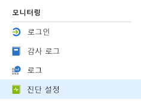
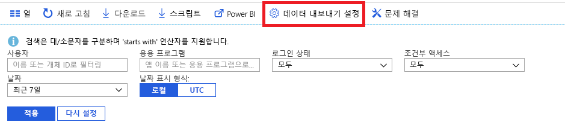

# Azure Active Directory 모니터링이란? (미리 보기)

이제 Azure AD(Azure Active Directory) 모니터링을 사용하여 Azure AD 활동 로그를 다른 엔드포인트로 라우팅할 수 있습니다. 그런 다음, 활동 로그를 장기간 사용할 수 있도록 보존할 수도 있고, 타사 SIEM(보안 정보 및 이벤트 관리) 도구와 통합하여 환경에 대한 인사이트를 얻을 수도 있습니다.

현재 로그를 다음 위치로 라우팅할 수 있습니다.

- Azure 저장소 계정.
- Azure 이벤트 허브. 따라서 Splunk 및 Sumologic 인스턴스와 통합할 수 있습니다.
- Azure Log Analytics 작업 영역. 여기서 데이터를 분석하고, 대시보드를 만들고, 특정 이벤트에 대해 경고할 수 있습니다.

> [!VIDEO https://www.youtube.com/embed/syT-9KNfug8]

## 진단 설정 구성

Azure AD 활동 로그에 대한 모니터링 설정을 구성하려면 먼저 [Azure Portal](https://portal.azure.com)에 로그인한 다음, **Azure Active Directory**를 선택합니다. 여기서 두 가지 방법으로 진단 설정 구성 페이지에 액세스할 수 있습니다.

* **모니터링** 섹션 아래에서 **진단 설정**을 선택합니다.

    
    
* **감사 로그** 또는 **로그인**을 선택하고, **설정 내보내기**를 선택합니다. 

    

## 저장소 계정으로 로그 라우팅

Azure 저장소 계정으로 로그를 라우팅하면 [보존 정책](reference-reports-data-retention.md)에 설명된 기본 보존 기간보다 더 오래 보존할 수 있습니다. [데이터를 저장소 계정으로 라우팅](quickstart-azure-monitor-route-logs-to-storage-account.md)하는 방법을 알아보세요.

## 이벤트 허브로 로그 스트리밍

로그를 Azure 이벤트 허브로 라우팅하면 Sumologic 및 Splunk 같은 타사 SIEM 도구와 통합할 수 있습니다. 이 통합을 통해 Azure AD 활동 로그 데이터를 SIEM에서 관리하는 다른 데이터와 결합하여 환경에 보다 풍부한 인사이트를 얻을 수 있습니다. [로그를 이벤트 허브로 스트리밍](tutorial-azure-monitor-stream-logs-to-event-hub.md)하는 방법을 알아보세요.

## Azure Monitor 로그에 로그 보내기

[Azure Monitor 로그](https://docs.microsoft.com/azure/log-analytics/log-analytics-overview)는 여러 원본의 모니터링 데이터를 통합하고, 애플리케이션 및 리소스의 작업에 대한 인사이트를 제공하는 쿼리 언어 및 분석 엔진을 제공하는 솔루션입니다. Azure AD 활동 로그를 Azure Monitor 로그에 보내면 수집된 데이터를 빠르게 검색, 모니터링 및 경고할 수 있습니다. [데이터를 Azure Monitor 로그에 보내는 방법](howto-integrate-activity-logs-with-log-analytics.md)에 대해 알아보세요.

Azure AD 활동 로그용으로 미리 작성된 보기를 설치하여 로그인 및 감사 이벤트가 관련된 일반적인 시나리오를 모니터링할 수 있습니다. [Azure AD 활동 로그에 대한 Log Analytics 보기를 설치하고 사용하는 방법](howto-install-use-log-analytics-views.md)에 대해 알아보세요.

## 다음 단계

* [Azure Monitor의 활동 로그](concept-activity-logs-azure-monitor.md)
* [이벤트 허브로 로그 스트리밍](tutorial-azure-monitor-stream-logs-to-event-hub.md)
* [Azure Monitor 로그에 로그 보내기](howto-integrate-activity-logs-with-log-analytics.md)
