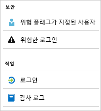

# Azure Active Directory 보고서란?

Azure AD(Azure Active Directory) 보고서는 환경에서 작업의 포괄적인 보기를 제공합니다. 제공된 데이터를 통해 다음을 수행할 수 있습니다.

- 사용자가 앱과 서비스를 활용하는 방식을 결정합니다.
- 환경의 상태에 영향을 줄 수 있는 잠재적인 위험을 검색합니다.
- 사용자가 자신의 작업을 완료하지 못하게 하는 문제를 해결합니다.  

보고 아키텍처는 다음 두 가지 주요 요소로 구성됩니다.

- [보안 보고서](#security-reports)
- [작업 보고서](#activity-reports)

## 보안 보고서

보안 보고서는 조직의 ID를 보호하는 데 도움이 됩니다. 두 가지 형식의 보안 보고서가 있습니다.

- **위험 플래그가 지정된 사용자** - [위험 플래그가 지정된 사용자 보안 보고서](concept-user-at-risk.md)에서 손상되었을 수 있는 사용자 계정에 대한 개요를 얻을 수 있습니다.

- **위험한 로그인** - [위험한 로그인 보안 보고서](concept-risky-sign-ins.md)를 사용하면 사용자 계정의 정당한 소유자가 아닌 사람이 수행한 로그인 시도에 대한 지표를 얻을 수 있습니다. 

### 보안 보고서에 액세스하는 데 필요한 Azure AD 라이선스는 무엇인가요?  

모든 Azure AD 버전에서는 위험 플래그가 지정된 사용자 보고서 및 위험한 로그인 보고서를 제공합니다. 그러나 보고서의 세분성 수준은 다음과 같이 버전에 따라 다릅니다. 

- **Azure Active Directory Free 및 Basic 버전**에는 위험 플래그가 지정된 사용자 및 위험한 로그인 목록이 있습니다. 

- **Azure Active Directory Premium 1** 버전은 각 보고서에서 검색된 기본 위험 이벤트 중 일부를 검사할 수 있게 함으로써 이 모델을 확장합니다. 

- **Azure Active Directory Premium 2** 버전은 기본 위험 이벤트에 대한 가장 자세한 정보를 제공하며, 구성된 위험 수준에 자동으로 응답하는 보안 정책을 구성할 수도 있습니다.

## 작업 보고서

작업 보고서는 조직에서 사용자의 동작을 이해하는 데 도움이 됩니다. Azure AD에는 두 가지 형식의 작업 보고서가 있습니다.

- **감사 로그** - [감사 로그 활동 보고서](concept-audit-logs.md)는 테넌트에서 수행된 모든 작업 기록에 대한 액세스를 제공합니다.

- **로그인** - [로그인 활동 보고서](concept-sign-ins.md)를 사용하면 감사 로그 보고서에서 보고한 작업을 수행한 사람을 확인할 수 있습니다.

### 감사 로그 보고서 

[감사 로그 보고서](concept-audit-logs.md)는 규정 준수에 대한 시스템 활동 기록을 제공합니다. 이 데이터를 사용하면 다음과 같은 일반적인 시나리오를 처리할 수 있습니다.

- 내 테넌트의 누군가가 관리 그룹에 액세스할 수 있었습니다. 이들에게 액세스 권한을 부여한 사람을 알고 싶습니다. 

- 최근에 앱을 등록한 이후 특정 앱에 로그인하고 있는 사용자의 목록과 앱이 잘 작동하는지의 여부를 알고 싶습니다.

- 내 테넌트에서 발생하고 있는 암호 재설정 횟수를 알고 싶습니다.

#### 감사 로그 보고서에 액세스하는 데 필요한 Azure AD 라이선스는 무엇인가요?  

감사 로그 보고서는 라이선스가 있는 기능에 대해 사용할 수 있습니다. 특정 기능에 대한 라이선스가 있으면 해당 기능에 대한 감사 로그 정보에 액세스할 수도 있습니다. 자세한 내용은 [Azure Active Directory 기능 및 특성](https://www.microsoft.com/cloud-platform/azure-active-directory-features)을 참조하세요.   

### 로그인 보고서

[로그인 보고서](concept-sign-ins.md)를 통해 다음 질문에 대한 대답을 찾을 수 있습니다.

- 사용자의 로그인 패턴이란?
- 한 주 동안 얼마나 많은 사용자가 로그인했나요?
- 이러한 로그인의 상태란?

#### 로그인 작업 보고서에 액세스하는 데 필요한 Azure AD 라이선스는 무엇인가요?  

로그인 활동 보고서에 액세스하려면 이와 연결된 Azure AD Premium 라이선스가 테넌트에 있어야 합니다.

## 프로그래밍 방식 액세스

Azure AD에서는 사용자 인터페이스 외에도 일련의 REST 기반 API를 통한 [프로그래밍 방식 액세스](concept-reporting-api.md)를 보고서 데이터에 제공합니다. 다양한 프로그래밍 언어 및 도구에서 이러한 API를 호출할 수 있습니다. 

## 다음 단계

- [위험한 로그인 보고서](concept-risky-sign-ins.md)
- [감사 로그 보고서](concept-audit-logs.md)
- [로그인 로그 보고서](concept-sign-ins.md)