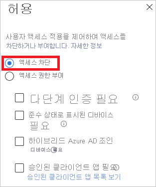
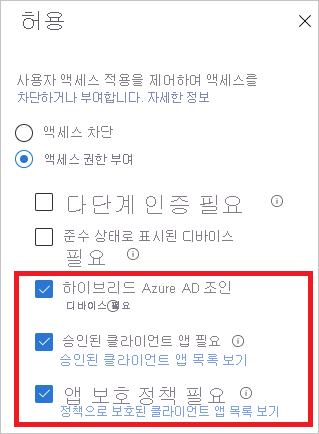
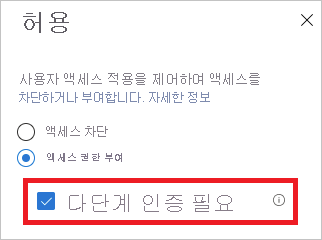

# Azure AD의 로그인 진단이란?

Azure AD(Azure Active Directory)는 사용자가 관리되는 리소스를 사용하여 수행할 수 있는 작업을 제어하는 유연한 보안 모델을 제공합니다. 이러한 리소스에 대한 액세스는 액세스하는 *사용자* 및 *방법* 에 따라 제어됩니다. 일반적으로 유연한 모델은 사용하는 구성 옵션의 수로 인해 어느 정도 복잡합니다. 복잡성은 오류 위험을 높일 수 있습니다.

IT 관리자에게는 시스템의 활동에 대한 인사이트를 제공하는 솔루션이 필요합니다. 이러한 가시성을 통해 발생하는 문제를 진단하고 해결할 수 있습니다. Azure AD의 로그인 진단은 이러한 솔루션에 대한 예입니다. 이 진단을 사용하여 로그인 시도 중 발생한 상황을 분석하고 Microsoft 지원을 받지 않고도 문제를 해결할 수 있는 추천 사항을 얻을 수 있습니다.

이 문서에서는 솔루션에서 수행하는 작업 및 이를 사용하는 방법에 대해 간략히 설명합니다.

## 요구 사항

로그인 진단은 Azure AD의 모든 버전에서 사용할 수 있습니다.

이를 사용하려면 Azure AD의 전역 관리자여야 합니다.

## 작동 방식

Azure AD에서 로그인 시도에 대한 응답은 테넌트에 로그인하는 *사용자* 및 액세스하는 *방법* 과 관련이 있습니다. 예를 들어 관리자는 일반적으로 회사 네트워크에서 로그인할 때 테넌트의 모든 측면을 구성할 수 있습니다. 그러나 신뢰할 수 없는 네트워크에서 동일한 계정으로 로그인하는 경우 동일한 사용자가 차단될 수 있습니다.

로그인 시도에 응답할 수 있는 시스템의 유연성이 높으므로 로그인 문제를 해결해야 하는 시나리오가 될 수 있습니다. 로그인 진단은 다음과 같은 기능입니다.

- 로그인 이벤트에서 데이터를 분석합니다.

- 발생한 결과를 표시합니다.

- 문제를 해결하는 방법에 대한 추천 사항을 제공합니다.

Azure AD의 로그인 진단은 로그인 오류를 자체 진단할 수 있도록 설계되었습니다. 진단 프로세스를 완료하려면 다음을 수행해야 합니다.

1. 관심 있는 로그인 이벤트의 범위를 정의합니다.

2. 검토하려는 로그인을 선택합니다.

3. 진단 결과를 검토합니다.

4. 작업을 수행합니다.

### 범위 정의

이 단계에서는 조사할 로그인 이벤트의 범위를 정의합니다. 범위는 사용자 또는 식별자(correlationId, requestId) 및 시간 범위를 기반으로 합니다. 범위를 더 좁히기 위해 앱 이름을 지정할 수 있습니다. Azure AD는 범위 정보를 사용하여 사용자에게 적절한 이벤트를 찾습니다.  

### 로그인 선택  

Azure AD는 검색 조건에 따라 일치하는 모든 로그인 이벤트를 검색하여 인증 요약 목록 보기에 표시합니다.

이 보기에 표시되는 열을 사용자 지정할 수 있습니다.

### 진단 검토

Azure AD는 선택한 로그인 이벤트에 대한 진단 결과를 제공합니다.

이러한 결과는 발생한 결과를 몇 개의 문장으로 설명하는 평가로 시작됩니다. 설명은 시스템의 동작을 이해하는 데 도움이 됩니다.

다음으로, 선택한 로그인 이벤트에 적용된 관련 조건부 액세스 정책에 대한 요약을 가져옵니다. 진단 결과에는 문제를 해결하는 데 추천되는 수정 단계도 포함됩니다. 추가 지원을 통해 문제를 해결할 수 있는 경우가 있으므로 추천 단계가 지원 티켓을 여는 것일 수 있습니다.

### 작업 수행

이 시점에서 문제를 해결하는 데 필요한 정보가 있어야 합니다.

## 시나리오

로그인 진단에서 다루는 시나리오는 다음과 같습니다.

- 조건부 액세스를 통해 차단

- 조건부 액세스 실패

- 조건부 액세스를 통한 MFA(다단계 인증)

- 다른 요구 사항의 MFA

- MFA 증명 필요

- MFA 증명 필요(위험한 로그인 위치)

- 로그인 완료

### 조건부 액세스를 통해 차단

이 시나리오에서는 조건부 액세스 정책에 따라 로그인 시도가 차단되었습니다.

이 시나리오의 진단 섹션에는 사용자 로그인 이벤트 및 적용된 정책에 대한 세부 정보가 표시됩니다.

### 조건부 액세스 실패

이 시나리오는 일반적으로 조건부 액세스 정책의 요구 사항이 충족되지 않아 실패한 로그인 시도의 결과입니다. 일반적인 예제는 다음과 같습니다.

- 하이브리드 Azure AD 조인 디바이스 필요

- 승인된 클라이언트 앱 필요

- 앱 보호 정책 필요

이 시나리오의 진단 섹션에는 사용자 로그인 시도 및 적용된 정책에 대한 세부 정보가 표시됩니다.

### 조건부 액세스의 MFA

이 시나리오의 조건부 액세스 정책에는 다단계 인증 집합을 사용하여 로그인해야 합니다.

이 시나리오의 진단 섹션에는 사용자 로그인 시도 및 적용된 정책에 대한 세부 정보가 표시됩니다.

### 다른 요구 사항의 MFA

이 시나리오의 조건부 액세스 정책에는 다단계 인증 요구 사항이 적용되지 않았습니다. 예를 들어 사용자별 다단계 인증이 있습니다.

이 진단 시나리오는 다음에 대한 자세한 정보를 제공하기 위한 것입니다.

- 다단계 인증 중단의 원본
- 클라이언트 상호 작용의 결과

또한 사용자 로그인 시도에 대한 모든 세부 정보를 볼 수도 있습니다.

### MFA 증명 필요

이 시나리오의 로그인 시도는 다단계 인증을 설정하라는 요청에 의해 중단되었습니다. 이 설정을 증명이라고도 합니다.

사용자가 다단계 인증을 사용해야 하지만 아직 구성하지 않았거나 관리자가 사용자에게 이를 구성하도록 요구한 경우에 다단계 인증 증명이 발생합니다.

이 진단 시나리오에서는 다단계 인증 중단이 사용자 구성 부족으로 인해 발생합니다. 사용자가 증명을 완료하는 것이 좋습니다.

### MFA 증명 필요(위험한 로그인 위치)

이 시나리오의 로그인 시도는 위험한 로그인 위치에서 다단계 인증을 설정하라는 요청에 의해 중단되었습니다.

이 진단 시나리오에서는 다단계 인증 중단이 사용자 구성 부족으로 인해 발생합니다. 사용자가 특히 위험하지 않은 네트워크 위치에서 증명을 완료하는 것이 좋습니다.

예를 들어 회사 네트워크가 명명된 위치로 정의된 경우 사용자는 회사 네트워크에서 증명을 대신 시도해야 합니다.

### 로그인 완료

이 시나리오에서 로그인 이벤트는 조건부 액세스 또는 다단계 인증에 의해 중단되지 않았습니다.

이 진단 시나리오에서는 조건부 액세스 정책 또는 다단계 인증으로 인해 중단되어야 하는 사용자 로그인 이벤트에 대한 세부 정보를 제공합니다.

## 다음 단계

- [Azure Active Directory 보고서란?](overview-reports.md)
- [Azure Active Directory 모니터링이란?](overview-monitoring.md)
