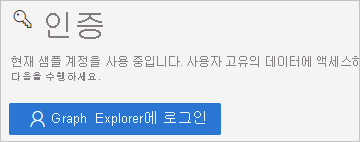
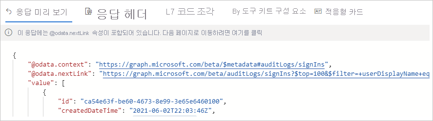

# 빠른 시작: Microsoft Graph API를 사용하여 Azure AD 로그에 액세스 

Azure AD 로그인 로그의 정보를 사용하여 사용자 로그인이 실패한 경우 발생하는 상황을 파악할 수 있습니다. 이 빠른 시작에서는 Graph API를 사용하여 로그인 로그에 액세스하는 방법을 알아봅니다.

## 필수 구성 요소

이 빠른 시작의 시나리오를 완료하려면 다음이 필요합니다.

- **Azure AD 테넌트에 액세스** - Azure AD 테넌트에 액세스할 수 없는 경우 [지금 Azure 체험 계정 만들기](https://azure.microsoft.com/free/?WT.mc_id=A261C142F)를 참조하세요. 
- **Isabella Simonsen이라고 하는 테스트 계정** - 테스트 계정을 만드는 방법을 모르는 경우 [클라우드 기반 사용자 추가](../fundamentals/add-users-azure-active-directory.md#add-a-new-user)를 참조하세요.

## 실패한 로그인 수행

이 단계의 목표는 Azure AD 로그인 로그에서 실패한 로그인의 레코드를 만드는 것입니다.

**이 단계를 완료하려면:**

1. 잘못된 암호를 사용하여 Isabella Simonsen으로 [Azure Portal](https://portal.azure.com/)에 로그인합니다.

2. 로그인 로그에서 로그인 레코드를 찾을 수 있는지 확인할 때까지 5분 동안 기다립니다. 자세한 내용은 [활동 보고서](reference-reports-latencies.md#activity-reports)를 참조하세요.

## 실패한 로그인 찾기

이 섹션에서는 Graph API를 사용하여 로그인에 대한 정보를 가져오는 단계를 제공합니다.

    

**실패한 로그인을 검토하려면:**

1. [Microsoft Graph 탐색기](https://developer.microsoft.com/en-us/graph/graph-explorer)로 이동합니다.

2. 전역 관리자 권한으로 테넌트에 로그인합니다.

       

3. **HTTP 동사 드롭다운 목록** 에서 **GET** 을 선택합니다.

4. **API 버전 드롭다운 목록** 에서 **베타** 를 선택합니다.

5. **요청 쿼리 주소 표시줄** 에 `https://graph.microsoft.com/beta/auditLogs/signIns?$top=100&$filter=userDisplayName eq 'Isabella Simonsen'`을 입력합니다.
 
6. **쿼리 실행** 을 클릭합니다.

쿼리의 결과를 검토합니다.

    

## 리소스 정리

더 이상 필요하지 않은 경우 테스트 사용자를 삭제합니다. Azure AD 사용자를 삭제하는 방법을 모르겠으면 [Azure AD에서 사용자 삭제](../fundamentals/add-users-azure-active-directory.md#delete-a-user)를 참조하세요.

## 다음 단계

> [!div class="nextstepaction"]
> [Azure Active Directory 보고서란?](overview-reports.md)
