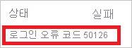
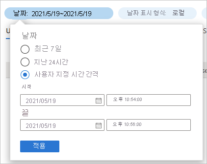
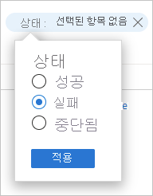

# 빠른 시작: Azure AD 로그인 로그를 사용하여 로그인 분석 

Azure AD 로그인 로그의 정보를 사용하여 사용자 로그인이 실패한 경우 발생하는 상황을 파악할 수 있습니다. 이 빠른 시작에서는 로그인 로그를 사용하여 실패한 로그인을 찾을 수 있는 방법을 보여 줍니다.

## 필수 구성 요소

이 빠른 시작의 시나리오를 완료하려면 다음이 필요합니다.

- **Azure AD 테넌트에 액세스** - Azure AD 테넌트에 액세스할 수 없는 경우 [지금 Azure 체험 계정 만들기](https://azure.microsoft.com/free/?WT.mc_id=A261C142F)를 참조하세요. 
- **Isabella Simonsen이라고 하는 테스트 계정** - 테스트 계정을 만드는 방법을 모르는 경우 [클라우드 기반 사용자 추가](../fundamentals/add-users-azure-active-directory.md#add-a-new-user)를 참조하세요.

## 실패한 로그인 수행

이 단계의 목표는 Azure AD 로그인 로그에서 실패한 로그인의 레코드를 만드는 것입니다.

**이 단계를 완료하려면:**

1. 잘못된 암호를 사용하여 Isabella Simonsen으로 [Azure Portal](https://portal.azure.com/)에 로그인합니다.

2. 로그인 로그에서 로그인 레코드를 찾을 수 있는지 확인할 때까지 5분 동안 기다립니다. 자세한 내용은 [활동 보고서](reference-reports-latencies.md#activity-reports)를 참조하세요.

## 실패한 로그인 찾기

이 섹션에서는 실패한 로그인을 분석하는 단계를 제공합니다.

- **로그인 필터링**: 분석과 관련이 없는 모든 레코드를 제거합니다. 예를 들어, 특정 사용자의 레코드만 표시하도록 필터를 설정합니다.
- **추가 오류 정보 조회**: 로그인 로그에서 찾을 수 있는 정보 외에도 [로그인 오류 조회 도구](https://login.microsoftonline.com/error)를 사용하여 오류를 조회할 수도 있습니다. 이 도구는 로그인 오류에 관한 추가 정보를 제공할 수 있습니다. 

**실패한 로그인을 검토하려면:**

1. [로그인 로그](https://portal.azure.com/#blade/Microsoft_AAD_IAM/ActiveDirectoryMenuBlade/SignIns)로 이동합니다.

2. Isabella Simonsen에 대한 레코드만 나열하려면 다음을 수행합니다.

    a. 도구 모음에서 **필터 추가** 를 클릭합니다.
    
       

    b. **필드 선택** 목록에서 **사용자** 를 선택한 다음, **적용** 을 클릭합니다.

    다. **사용자 이름** 텍스트 상자에 **Isabella Simonsen** 을 입력한 다음, **적용** 을 클릭합니다.

    d. 도구 모음에서 **새로 고침** 을 클릭합니다.

3. 문제를 분석하려면 **문제 해결 및 지원** 을 클릭합니다.

       

4. **로그인 오류 코드** 를 복사합니다.

       

5. [로그인 오류 조회 도구](https://login.microsoftonline.com/error)의 텍스트 상자에 오류 코드를 붙여넣은 다음, **제출** 을 클릭합니다.

도구의 결과를 검토하고 추가 정보를 제공하는지 여부를 확인합니다.

## 추가 테스트

이름으로 로그인 로그에서 항목을 찾는 방법을 알고 있으므로, 이제 다음 필터를 사용하여 레코드를 찾아야 합니다.

- **날짜** - **시작** 및 **끝** 을 사용하여 Isabella를 찾습니다.

    

- **상태** -**상태: 실패** 를 사용하여 Isabella를 찾습니다.

    

## 리소스 정리

더 이상 필요하지 않은 경우 테스트 사용자를 삭제합니다. Azure AD 사용자를 삭제하는 방법을 모르겠으면 [Azure AD에서 사용자 삭제](../fundamentals/add-users-azure-active-directory.md#delete-a-user)를 참조하세요.

## 다음 단계

> [!div class="nextstepaction"]
> [Azure Active Directory 보고서란?](overview-reports.md)
