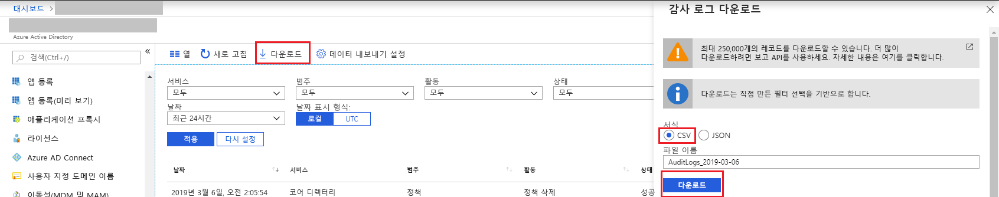

# 빠른 시작: Azure Portal을 사용하여 감사 보고서 다운로드

이 빠른 시작에서는 지난 24시간 동안 테넌트에 대한 감사 로그를 다운로드하는 방법을 알아봅니다.

## 필수 조건

다음 작업을 수행해야 합니다.

* Azure Active Directory 테넌트. 
* 테넌트에 대한 보안 관리자, 보안 읽기 권한자 또는 전역 관리자 역할의 사용자. 또한 테넌트의 모든 사용자는 자신의 감사 로그에 액세스할 수 있습니다.

## 빠른 시작: 감사 보고서 다운로드

1. [Azure Portal](https://portal.azure.com)로 이동합니다.
2. 왼쪽 탐색 창에서 **Azure Active Directory**를 선택하고 **디렉터리 전환** 단추를 사용하여 Active Directory를 선택합니다.
3. 대시보드에서 **Azure Active Directory**를 선택한 다음, **감사 로그**를 선택합니다. 
4. **날짜 범위** 필터 드롭다운에서 **지난 24시간**을 선택하고 **적용**을 선택하여 지난 24시간 동안의 감사 로그를 확인합니다. 
5. **다운로드** 단추를 선택하여 필터링된 레코드를 포함하는 CSV 파일을 다운로드합니다. 

## 다음 단계

* [Azure Active Directory 포털의 로그인 활동 보고서](concept-sign-ins.md)
* [Azure Active Directory Reporting 보존](reference-reports-data-retention.md)
* [Azure Active Directory Reporting 대기 시간](reference-reports-latencies.md)
