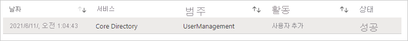
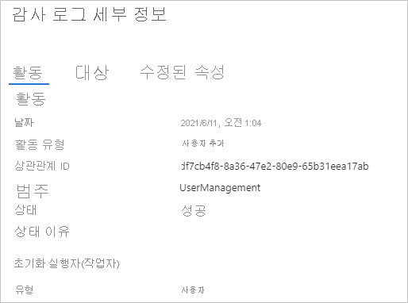

# 빠른 시작: Azure AD 감사 로그 필터링 

Azure AD 감사 로그의 정보를 사용하여 규정 준수를 위한 시스템 활동 레코드에 액세스할 수 있습니다. 이 빠른 시작에서는 감사 로그에서 새로 만든 사용자 계정을 찾는 방법을 보여 줍니다.

## 필수 구성 요소

이 빠른 시작의 시나리오를 완료하려면 다음이 필요합니다.

- **Azure AD 테넌트에 액세스** - Azure AD 테넌트에 액세스할 수 없는 경우 [지금 Azure 체험 계정 만들기](https://azure.microsoft.com/free/?WT.mc_id=A261C142F)를 참조하세요. 
- **Isabella Simonsen이라고 하는 테스트 계정** - 테스트 계정을 만드는 방법을 모르는 경우 [클라우드 기반 사용자 추가](../fundamentals/add-users-azure-active-directory.md#add-a-new-user)를 참조하세요.

## 새 사용자 계정 찾기

이 섹션에서는 감사 로그를 필터링하는 단계를 제공합니다.

**새 사용자를 찾으려면** 다음을 수행합니다.

1. [감사 로그](https://portal.azure.com/#blade/Microsoft_AAD_IAM/ActiveDirectoryMenuBlade/Audit)로 이동합니다.

2. Isabella Simonsen에 대한 레코드만 나열하려면 다음을 수행합니다.

    a. 도구 모음에서 **필터 추가** 를 클릭합니다.
    
       

    b. **필드 선택** 목록에서 **대상** 을 선택한 다음, **적용** 을 클릭합니다.

    다. **대상** 텍스트 상자에 **사용자 계정 이름** 으로 **Isabella Simonsen** 을 입력한 다음, **적용** 을 클릭합니다.

3. 필터링된 항목을 클릭합니다.

      

4.  **감사 로그 세부 정보** 를 검토합니다.
 
      
 
  

## 리소스 정리

더 이상 필요하지 않은 경우 테스트 사용자를 삭제합니다. Azure AD 사용자를 삭제하는 방법을 모르겠으면 [Azure AD에서 사용자 삭제](../fundamentals/add-users-azure-active-directory.md#delete-a-user)를 참조하세요.

## 다음 단계

> [!div class="nextstepaction"]
> [Azure Active Directory 보고서란?](overview-reports.md)
