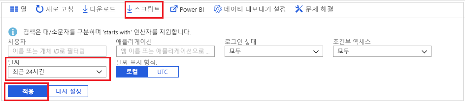
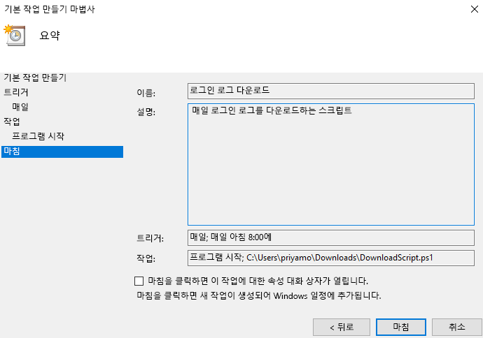

# 자습서: 스크립트를 다운로드하고 사용하여 로그인 기록에 액세스하는 방법

Azure Portal 외부에서 작업하려는 경우 로그인 활동 데이터를 다운로드할 수 있습니다. Azure Portal의 **다운로드** 옵션을 사용하면 최근의 5,000개 레코드의 CSV 파일을 만듭니다. 더 많은 유연성이 필요한 경우(예: 한 번에 5,000개가 넘는 레코드를 다운로드하거나 예약된 간격으로 로그를 다운로드) PowerShell 스크립트를 생성하는 **스크립트** 단추를 사용하여 데이터를 다운로드합니다.

이 자습서에서는 최근 24시간 동안의 모든 로그인 로그를 다운로드하는 스크립트를 생성하고 매일 실행되도록 예약하는 방법을 알아봅니다. 

## 필수 조건

다음 항목이 필요합니다.

* 프리미엄 (P1/P2) 라이선스를 사용하는 Azure Active Directory 테넌트 
* 테넌트에 대한 **글로벌 관리자**, **보안 관리자**, **보안 읽기 권한자** 또는 **보고서 읽기 권한자** 역할의 사용자 또한 모든 사용자는 고유한 로그인에 액세스할 수 있습니다. 
* Windows 10 머신에서 다운로드된 스크립트를 실행하려는 경우 [AzureRM 모듈을 설정하고 실행 정책을 설정](concept-sign-ins.md#running-the-script-on-a-windows-10-machine)합니다.

## 자습서

1. [Azure Portal](https://portal.azure.com)로 이동하고 디렉터리를 선택합니다.
2. **모니터링** 섹션에서 **Azure Active Directory**를 선택하고, **로그인**을 선택합니다. 
3. **날짜 범위** 필터 드롭다운을 사용하고, **24시간**을 선택하여 최근 24시간의 데이터를 가져옵니다. 
4. **적용**을 선택하여 필터가 예상대로 적용되었는지 확인합니다. 
5. 위쪽 메뉴에서 **스크립트**를 선택하여 적용된 필터를 사용하여 PowerShell 스크립트를 다운로드합니다.

     
     
6. Windows 머신에서 **작업 스케줄러** 애플리케이션을 열고, **기본 작업 만들기**를 선택합니다.
7. 작업의 이름 및 설명을 입력하고, **다음**을 클릭합니다.
8. **매일** 라디오 단추를 선택하여 작업을 매일 실행하고 시작 날짜와 시간을 입력할 수 있습니다.
9. 작업 메뉴에서 **프로그램 시작**을 선택하고, 다운로드된 스크립트를 선택하고, **다음**을 선택합니다. 
10. 예약된 작업을 검토하고 **완료**를 선택하여 작업을 만듭니다.

     

이제 작업이 매일 실행되고 **AAD_SignInReport_YYYYMMDD_HHMMSS.csv** 형식의 파일로 지난 24시간 동안의 로그인 레코드를 저장합니다. 다른 파일 이름으로 저장하거나 다운로드된 레코드의 수를 수정하도록 다운로드된 PowerShell 스크립트를 편집할 수도 있습니다. 

## 다음 단계

* [Azure Active Directory 보고서 보존 정책](reference-reports-data-retention.md)
* [Azure Active Directory 보고 API 시작](concept-reporting-api.md)
* [인증서를 사용하여 보고 API에 액세스](tutorial-access-api-with-certificates.md)
