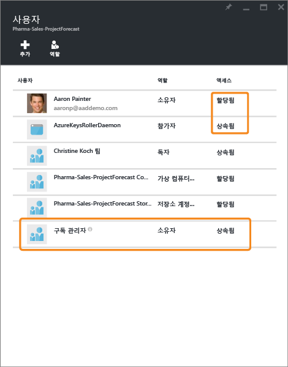
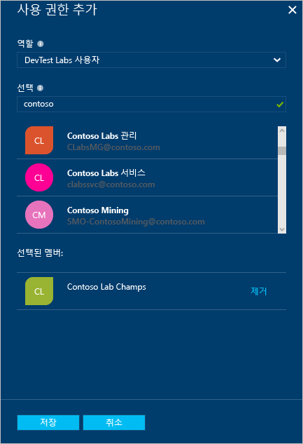
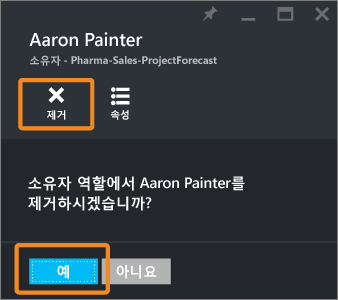

<properties
	pageTitle="Azure Active Directory 역할 기반 액세스 제어 | Microsoft Azure"
	description="Azure 포털에서 Azure 역할 기반 액세스 제어를 통해 액세스 관리를 시작합니다. 디렉터리에서 사용 권한을 할당하기 위해 역할 할당을 사용합니다."
	services="active-directory"
	documentationCenter=""
	authors="kgremban"
	manager="stevenpo"
	editor=""/>

<tags
	ms.service="active-directory"
	ms.devlang="na"
	ms.topic="get-started-article"
	ms.tgt_pltfrm="na"
	ms.workload="identity"
	ms.date="03/30/2016"
	ms.author="kgremban"/>

# Azure 역할 기반 액세스 제어

## 역할 기반 액세스 제어
Azure RBAC(역할 기반 액세스 제어)를 통해 Azure에 대한 세밀한 액세스 관리가 가능합니다. RBAC를 사용하여 DevOps 팀 내에서 업무를 분리하고 사용자에게 해당 작업을 수행하는 데 필요한 만큼의 권한만 부여할 수 있습니다. 이 문서에서는 액세스 관리의 기본 사항을 소개하고 Azure 포털에서 RBAC로 준비 및 실행할 수 있도록 지원합니다.

### Azure에서 액세스 관리의 기본 사항
각각의 Azure 구독은 하나의 Azure AD(Active Directory) 디렉터리와 연결됩니다. 사용자, 그룹 및 해당 디렉터리에서 응용 프로그램은 Azure 구독에서 리소스를 관리할 수 있습니다. 이러한 액세스 권한은 Azure 포털, Azure 명령줄 도구 또는 Azure 관리 API를 사용하여 부여합니다.

특정 범위에서 사용자, 그룹 및 응용 프로그램에 적절한 RBAC 역할을 할당하여 액세스 권한을 부여합니다. 역할 할당의 범위는 구독, 리소스 그룹 또는 단일 리소스일 수 있습니다. 부모 범위에서 할당된 역할은 역할 내에 포함된 하위 항목에 대한 액세스를 부여합니다. 예를 들어 리소스 그룹에 액세스할 수 있는 사용자는 웹 사이트, 가상 컴퓨터 및 서브넷을 포함하여 그 안에 포함된 모든 리소스를 관리할 수 있습니다.

할당하는 RBAC 역할에 따라 해당 범위 내에서 사용자, 그룹 또는 응용 프로그램이 관리할 수 있는 리소스가 결정됩니다.

### 기본 제공 역할
Azure RBAC에는 모든 리소스 유형에 적용되는 3가지 기본 역할이 있습니다.

- **소유자**는 액세스 권한을 다른 사용자에게 위임할 수 있는 권한을 포함하여 모든 리소스에 대한 전체 액세스 권한을 보유합니다.
- **참여자**는 모든 유형의 Azure 리소스를 만들고 관리할 수 있지만 다른 사용자에게 액세스 권한을 부여할 수 없습니다.
- **읽기 권한자**는 기존 Azure 리소스를 볼 수 있습니다.

Azure의 나머지 RBAC 역할은 특정 Azure 리소스의 관리를 허용합니다. 예를 들어 가상 컴퓨터 참여자 역할을 사용하면 사용자가 가상 컴퓨터를 만들고 관리할 수 있습니다. 가상 컴퓨터가 연결된 가상 네트워크 또는 서브넷에 액세스할 권한을 부여하지 않습니다.

[RBAC 기본 제공 역할](role-based-access-built-in-roles.md)은 Azure에서 사용할 수 있는 역할을 나열합니다. 각 기본 제공 역할이 사용자에게 부여하는 작업 및 범위를 지정합니다. 더 많은 제어를 위해 사용자 고유의 역할을 정의하려는 경우 [Azure RBAC에서 사용자 지정 역할](role-based-access-control-custom-roles.md)을 빌드하는 방법을 참조하세요.

### 리소스 계층 구조 및 액세스 상속
- Azure에서 각 **구독**은 하나의 디렉터리에만 속해 있습니다.
- 각 **리소스 그룹**은 하나의 구독에만 속해 있습니다.
- 각 **리소스**는 하나의 리소스 그룹에만 속해 있습니다.

부모 범위에서 부여되는 액세스 권한은 자식 범위에서 상속됩니다. 예를 들면 다음과 같습니다.

- 구독 범위에서 Azure AD 그룹에 읽기 권한자 역할을 할당합니다. 해당 그룹의 멤버는 구독에서 모든 리소스 그룹 및 리소스를 볼 수 있습니다.  
- 리소스 그룹 범위에서 응용 프로그램에 참가자 역할을 할당합니다. 해당 리소스 그룹에서 모든 종류의 리소스를 관리할 수 있지만 구독에서 다른 리소스 그룹을 관리할 수 없습니다.

### Azure RBAC와 클래식 구독 관리자 비교
클래식 구독 관리자와 공동 관리자는 Azure 구독에 대한 모든 권한을 보유합니다. 이들은 [Azure 포털](https://portal.azure.com)의 Azure Resource Manager API를 사용하거나 [Azure 클래식 포털](https://manage.windowsazure.com) 및 Azure 서비스 관리 API를 사용하여 리소스를 관리할 수 있습니다. RBAC 모델에서는 클래식 관리자에게 구독 범위에서 소유자 역할이 할당됩니다.

Azure 포털 및 새 Azure Resource Manager API만이 Azure RBAC를 지원합니다. RBAC 역할이 할당되는 사용자 및 응용 프로그램에서는 클래식 관리 포털 및 Azure 서비스 관리 API를 사용할 수 없습니다.

### 관리를 위한 권한 부여와 데이터 작업 비교
Azure RBAC는 Azure 포털 및 Azure Resource Manager API에서 Azure 리소스의 관리 작업만을 지원합니다. RBAC를 통해 Azure 리소스의 모든 데이터 수준 작업에 대한 권한을 부여할 수 있는 것은 아닙니다. 예를 들어, RBAC를 사용하여 저장소 계정을 관리할 수 있지만 저장소 계정 내의 Blob 또는 테이블로는 불가능합니다. 마찬가지로 SQL 데이터베이스를 관리할 수 있지만 그 안의 테이블은 관리할 수 없습니다.

## Azure 포털을 사용하여 액세스 관리
### 액세스 보기
[Azure 포털](https://portal.azure.com)의 기본 블레이드에서 리소스, 리소스 그룹 또는 구독에 대한 액세스 권한이 있는 사용자를 볼 수 있습니다. 예를 들어 리소스 그룹 중 하나에 대한 액세스 권한이 있는 사용자를 확인하려는 경우 다음과 같이 합니다.

1. 왼쪽 탐색 모음에서 **리소스 그룹** 아이콘을 선택합니다.
2. **리소스 그룹** 블레이드에서 검사하려는 리소스 그룹 이름을 선택합니다.
3. 리소스 그룹 블레이드의 오른쪽 위에서 **사용자** 아이콘을 선택합니다.
4. **사용자** 블레이드에 리소스 그룹에 대한 액세스가 부여된 모든 사용자, 그룹 및 응용 프로그램이 나열됩니다.

일부 사용자는 액세스가 **할당되는** 반면 일부는 **상속됩**니다. 액세스는 리소스 그룹에 특별히 할당되거나 부모 구독에 할당된 내용에서 상속됩니다.

> [AZURE.NOTE] 클래식 구독 관리자와 공동 관리자는 새 RBAC 모델에서 구독의 소유자로 간주됩니다.

### 액세스 추가
역할 할당의 범위인 리소스, 리소스 그룹 또는 구독 내에서 액세스 권한을 부여합니다.

1. **사용자** 블레이드에서 **추가** 아이콘을 선택합니다. 
2. 할당하고자 하는 역할을 선택합니다.
3. 액세스 권한을 부여할 디렉터리에서 사용자, 그룹 또는 응용 프로그램을 선택합니다. 표시 이름, 전자 메일 주소 및 개체 식별자를 사용하여 디렉터리를 검색할 수 있습니다. 

### 액세스 제거

1. **사용자** 블레이드에서 제거할 역할 할당을 선택합니다.
2. 할당 세부 정보 블레이드에서 **제거** 아이콘을 클릭합니다.
3. **예**를 클릭하여 제거를 확인합니다.

하위 범위에서 상속된 할당을 제거할 수 있습니다. 상위 범위로 이동하여 역할 할당을 제거합니다.

## 액세스를 관리하는 기타 도구
Azure 포털 이외의 도구에서 Azure RBAC 명령을 사용하여 역할을 할당하고 액세스를 관리할 수 있습니다. 필수 조건 및 Azure RBAC 명령을 시작하는 방법에 대한 링크를 따라가세요.

- [Azure PowerShell](role-based-access-control-manage-access-powershell.md)
- [Azure 명령줄 인터페이스](role-based-access-control-manage-access-azure-cli.md)
- [REST API](role-based-access-control-manage-access-rest.md)

## 다음 단계
- [액세스 변경 기록 보고서 만들기](role-based-access-control-access-change-history-report.md)
- [RBAC 기본 제공 역할](role-based-access-built-in-roles.md) 참조
- [Azure RBAC에서 사용자 지정 역할](role-based-access-control-custom-roles.md) 정의

<!---HONumber=AcomDC_0406_2016-->