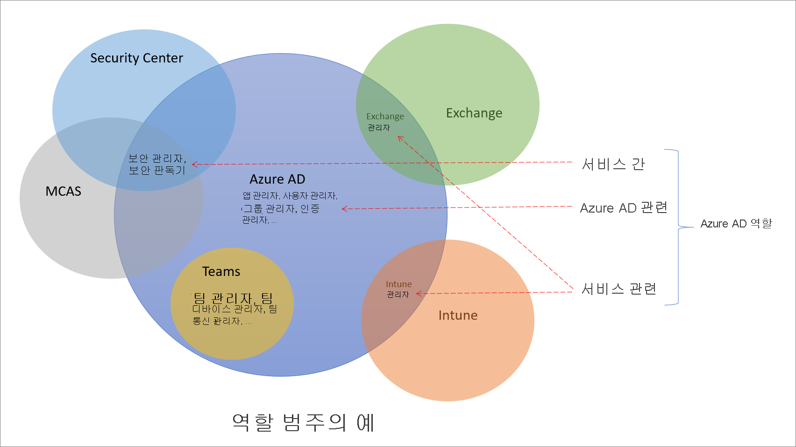

# Azure Active Directory의 역할 이해

고정된 역할 권한 집합이 있는 역할인 60개의 Azure AD(Azure Active Directory) 기본 제공 역할에 대한 것입니다. 기본 제공 역할을 보완하기 위해 Azure AD는 사용자 지정 역할도 지원합니다. 사용자 지정 역할을 사용하여 원하는 역할 권한을 선택합니다. 예를 들어 애플리케이션 또는 서비스 주체와 같은 특정 Azure AD 리소스를 관리하기 위해 하나를 만들 수 있습니다.

이 문서에서는 Azure AD 역할 및 사용 방법에 대해 설명합니다.

## Azure AD 역할이 다른 Microsoft 365 역할과 어떻게 다른지 설명합니다.

Azure AD 및 Intune과 같은 다양한 Microsoft 365 서비스가 있습니다. 이러한 서비스 중 일부에는 자체 역할 기반 액세스 제어 시스템이 있습니다. 구체적으로 다음과 같습니다.

- Azure AD
- Exchange
- Intune
- Security Center
- Compliance Center
- Microsoft Cloud App Security
- 상거래

Teams, SharePoint 및 관리형 데스크톱과 같은 다른 서비스에는 별도의 역할 기반 액세스 제어 시스템이 없습니다. 관리 액세스를 위해 Azure AD 역할을 사용합니다. Azure에는 가상 머신과 같은 Azure 리소스에 대한 자체 역할 기반 액세스 제어 시스템이 있으며, 이 시스템은 Azure AD 역할과 동일하지 않습니다.

별도의 역할 기반 액세스 제어 시스템을 말하는 경우 역할 정의 및 역할 할당이 저장되는 다른 데이터 저장소가 있음을 의미합니다. 마찬가지로, 액세스 검사가 발생하는 다른 정책 결정 지점이 있습니다. 자세한 내용은 [Azure AD의 Microsoft 365 서비스에 대한 역할](m365-workload-docs.md) 및 [클래식 구독 관리자 역할, Azure 역할 및 Azure AD 역할](../../role-based-access-control/rbac-and-directory-admin-roles.md)을 참조하세요.

## 일부 Azure AD 역할이 다른 서비스에 대한 것인 이유

Microsoft 365에는 시간에 따라 독립적으로 개발된 여러 가지 역할 기반 액세스 제어 시스템이 있으며, 각각 고유한 서비스 포털이 있습니다. Azure AD 포털의 Microsoft 365에서 ID를 편리하게 관리할 수 있도록 하기 위해 일부 서비스 관련 기본 제공 역할을 추가했습니다. 각 역할은 Microsoft 365 서비스에 대한 관리 액세스 권한을 부여합니다. 이러한 추가의 예제로 Azure AD의 Exchange 관리자 역할이 있습니다. 이 역할은 Exchange 역할 기반 액세스 제어 시스템에서 [조직 관리 역할 그룹](/exchange/organization-management-exchange-2013-help)과 동일하며, Exchange의 모든 측면을 관리할 수 있습니다. 마찬가지로 Intune 관리자 역할, 팀 관리자, SharePoint 관리자 등을 추가했습니다. 서버스 관련 역할은 다음 섹션에서 Azure AD 기본 제공 역할의 한 범주입니다.

## Azure AD 역할의 범주

Azure AD 기본 제공 역할은 다음과 같은 세 가지 광범위한 범주에 해당하는 사용할 수 있는 위치와 다릅니다.

- **Azure AD 특정 역할**: 이러한 역할은 Azure AD 내에서만 리소스를 관리할 수 있는 권한을 부여합니다. 예를 들어, 사용자 관리자, 애플리케이션 관리자, 그룹 관리자는 모두 Azure AD에 있는 리소스를 관리할 수 있는 권한을 부여합니다.
- **서비스 관련 역할**: 주요 Microsoft 365 서비스(비 Azure AD)의 경우 서비스 내의 모든 기능을 관리할 수 있는 권한을 부여하는 서비스 관련 역할을 구축했습니다.  예를 들어 Exchange 관리자, Intune 관리자, SharePoint 관리자 및 팀 관리자 역할은 해당 서비스를 사용하여 기능을 관리할 수 있습니다. Exchange 관리자는 사서함을 관리할 수 있고, Intune 관리자는 디바이스 정책을 관리할 수 있으며, SharePoint 관리자는 사이트 모음을 관리하고, 팀 관리자는 호출 품질을 관리할 수 있습니다.
- **서비스 간 역할**: 서비스를 확장하는 몇 가지 역할이 있습니다. 전역 관리자와 전역 판독기라는 두 가지 글로벌 역할이 있습니다. 모든 Microsoft 365 서비스는 이러한 두 역할을 적용합니다. 또한 Microsoft 365 내의 여러 보안 서비스에서 액세스 권한을 부여하는 보안 관리자 및 보안 판독기와 같은 몇 가지 보안 관련 역할이 있습니다. 예를 들어 Azure AD에서 보안 관리자 역할을 사용하여 Microsoft 365 Security Center, Microsoft Defender Advanced Threat Protection 및 Microsoft Cloud App Security를 관리할 수 있습니다. 마찬가지로, 규정 준수 관리자 역할에서 Microsoft 365 규정 준수 센터, Exchange 등의 규정 준수 관련 설정을 관리할 수 있습니다.

다음 표에서는 이러한 역할 범주를 이해하는 데 도움이 되는 내용을 제공합니다. 범주 이름은 임의로 지정되며 [문서화된 역할 사용 권한](permissions-reference.md) 이외의 다른 기능을 의미하지는 않습니다.

범주 | 역할
---- | ----
Azure AD 특정 역할 | 애플리케이션 관리자 애플리케이션 개발자 인증 관리자 B2C IEF 키 세트 관리자 B2C IEF 정책 관리자 클라우드 애플리케이션 관리자 클라우드 디바이스 관리자 조건부 액세스 관리자 디바이스 관리자 디렉터리 읽기 권한자 디렉터리 동기화 계정 디렉터리 작성자 외부 ID 사용자 흐름 관리자 외부 ID 사용자 흐름 특성 관리자 외부 ID 공급자 관리자 그룹 관리자 게스트 초대자 기술 지원팀 관리자 하이브리드 ID 관리자 라이선스 관리자 파트너 계층1 지원 파트너 계층2 지원 암호 관리자 권한 있는 인증 관리자 권한 있는 역할 관리자 보고서 구독자 사용자 계정 관리자
서비스 간 역할 | 전역 관리자 규정 준수 관리자 규정 준수 데이터 관리자 전역 Reader 보안 관리자 보안 운영자 보안 Reader 서비스 지원 관리자
서비스 관련 역할 | Azure DevOps 관리자 Azure Information Protection 관리자 대금 청구 관리자 CRM 서비스 관리자 고객 LockBox 액세스 승인자 데스크톱 분석 관리자 Exchange 서비스 관리자 Insights 관리자 Insights 비즈니스 리더 Intune 서비스 관리자 Kaizala 관리자 Lync 서비스 관리자 메시지 센터 개인 정보 읽기 권한자 메시지 센터 읽기 권한자 최신 Commerce 사용자 네트워크 관리자 Office 앱 관리자 Power BI 서비스 관리자 Power Platform 관리자 프린터 관리자 프린터 기술자 Search 관리자 Search 편집자 SharePoint 서비스 관리자 Teams 통신 관리자 Teams 통신 지원 엔지니어 Teams 통신 지원 전문가 Teams 디바이스 관리자 Teams 서비스 관리자

## 다음 단계

- [Azure AD 역할 기반 액세스 제어 개요](custom-overview.md)
- [Azure Portal, Azure AD PowerShell 및 Graph API](custom-create.md)를 사용하여 역할 할당 만들기
- [역할 할당 나열](view-assignments.md)
