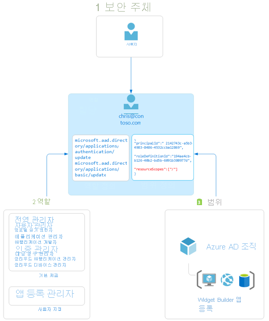

# Azure Active Directory의 역할 기반 액세스 제어 개요

이 문서에서는 Azure AD(Azure Active Directory) 역할 기반 액세스 제어를 이해하는 방법을 설명합니다. Azure AD 역할을 사용하면 최소 권한 원칙에 따라 관리자에게 세부적인 사용 권한을 부여할 수 있습니다. Azure AD 기본 제공 및 사용자 지정 역할은 [Azure 리소스에 대한 역할 기반 액세스 제어 시스템](../../role-based-access-control/overview.md)(Azure 역할)에서 볼 수 있는 것과 유사한 개념으로 작동합니다. [이러한 두 역할 기반 액세스 제어 시스템 간의 차이점](../../role-based-access-control/rbac-and-directory-admin-roles.md)은 다음과 같습니다.

- Azure AD 역할은 Graph API를 사용하여 사용자, 그룹 및 애플리케이션과 같은 Azure AD 리소스에 대한 액세스를 제어합니다.
- Azure 역할은 Azure 리소스 관리를 사용하여 가상 머신 또는 스토리지와 같은 Azure 리소스에 대한 액세스를 제어합니다.

두 시스템 모두 유사하게 사용되는 역할 정의 및 역할 할당을 포함합니다. 그러나 Azure AD 역할 권한은 Azure 사용자 지정 역할에서 사용할 수 없으며 그 반대의 경우도 마찬가지입니다.

## Azure AD 역할 기반 액세스 제어의 이해
Azure AD는 두 가지 유형의 역할 정의를 지원합니다. 
* [기본 제공 역할](./permissions-reference.md)
* [사용자 지정 역할](./custom-create.md)

기본 제공 역할은 고정된 권한 세트가 있는 기본 제공 역할입니다. 이러한 역할 정의는 수정할 수 없습니다. Azure AD에서 지원하는 다양한 [기본 제공 역할](./permissions-reference.md)이 있으며 목록이 증가하고 있습니다. 가장자리를 반올림하고 정교한 요구 사항을 충족하기 위해 Azure AD는 [사용자 지정 역할](./custom-create.md)도 지원합니다. 사용자 지정 Azure AD 역할을 사용하여 권한을 부여하는 작업은 사용자 지정 역할 정의를 만든 후 역할 할당을 사용하여 할당하는 두 단계로 이루어진 프로세스입니다. 사용자 지정 역할 정의는 사전 설정 목록에서 추가하는 권한 컬렉션입니다. 이러한 권한은 기본 제공 역할에 사용되는 권한과 동일한 권한입니다.  

사용자 지정 역할 정의를 생성(또는 기본 제공 역할 사용)한 후에는 역할 할당을 만들어 사용자에게 할당할 수 있습니다. 역할 할당은 지정된 범위의 역할 정의에서 사용자에게 권한을 부여합니다. 이 2단계 프로세스를 통해 단일 역할 정의를 만든 후 여러 범위에서 여러 번 할당할 수 있습니다. 범위는 역할 멤버가 액세스할 수 있는 Azure AD 리소스 세트를 정의합니다. 가장 일반적인 범위는 조직 전체 범위입니다. 조직 전체 범위에서 사용자 지정 역할을 할당할 수 있으며, 이렇게 하면 역할 멤버가 조직의 모든 리소스에 대한 역할 권한을 갖습니다. 개체 범위에서 사용자 지정 역할을 할당할 수도 있습니다. 개체 범위의 예로는 단일 애플리케이션이 있습니다. 조직 내 모든 애플리케이션에 대해 동일한 역할을 한 사용자에게 할당한 다음, 범위가 Contoso Expense Reports 앱인 다른 사용자에게 할당할 수 있습니다.  

Azure AD 기본 제공 및 사용자 지정 역할은 [Azure RBAC(Azure 역할 기반 액세스 제어)](../develop/access-tokens.md#payload-claims)와 유사한 방식으로 작동합니다. [두 역할 기반 액세스 제어 시스템 간의 차이점](../../role-based-access-control/rbac-and-directory-admin-roles.md)은 Azure RBAC는 Azure Resource Management를 사용하는 가상 머신 또는 스토리지와 같은 Azure 리소스에 대한 액세스를 제어하고, Azure AD 사용자 지정 역할은 Graph API를 사용하여 Azure AD 리소스에 대한 액세스를 제어한다는 것입니다. 두 시스템 모두 역할 정의 및 역할 할당이라는 개념을 활용합니다. Azure AD RBAC 권한은 Azure 역할에 포함될 수 없으며 그 반대의 경우도 마찬가지입니다.

### Azure AD에서 사용자가 리소스에 대한 액세스 권한을 갖고 있는지 확인하는 방법

다음은 사용자가 관리 리소스에 액세스할 수 있는지 확인하기 위해 Azure AD에서 사용하는 단계에 대한 간략한 정보입니다. 이 정보를 사용하여 액세스 문제를 해결할 수 있습니다.

1. 사용자(또는 서비스 주체)가 Microsoft Graph 또는 Azure AD Graph 엔드포인트에 대한 토큰을 획득합니다.
1. 사용자가 발급된 토큰을 사용하여 Microsoft Graph 또는 Azure AD Graph를 통해 Azure AD(Azure Active Directory)에 대한 API 호출을 수행합니다.
1. 환경에 따라 Azure AD에서 다음 작업 중 하나를 수행합니다.
   - 사용자의 액세스 토큰에서 [wids 클레임](../../active-directory-b2c/access-tokens.md)을 기반으로 사용자의 역할 멤버 자격을 평가합니다.
   - 직접 또는 그룹 멤버 자격을 통해 작업을 수행할 리소스에 적용되는 사용자의 모든 역할 할당을 검색합니다.
1. Azure AD는 사용자가 이 리소스에 대해 갖는 역할에 API 호출의 작업이 포함되는지 여부를 결정합니다.
1. 사용자에게 요청된 범위에서 작업에 대한 역할이 없으면 액세스 권한이 부여되지 않습니다. 그렇지 않으면 액세스 권한이 부여됩니다.

## 역할 할당

역할 할당은 특정 *범위* 에서 *역할 정의* 를 *사용자* 에게 연결하여 Azure AD 리소스에 대한 액세스 권한을 부여하는 Azure AD 리소스입니다. 역할 할당을 만들어서 액세스 권한을 부여하고, 역할 할당을 제거하여 액세스 권한을 취소합니다. 그 내부를 보면 역할 할당은 다음과 같은 세 가지 요소로 구성됩니다.

- Azure AD 사용자
- 역할 정의
- 리소스 범위

Azure portal, Azure AD PowerShell 또는 Graph API를 사용하여 [역할 할당 만들기](custom-create.md)를 수행할 수 있습니다. [사용자 지정 역할의 할당 보기](custom-view-assignments.md#view-the-assignments-of-a-role)도 가능합니다.

다음 다이어그램은 역할 할당의 예를 보여줍니다. 이 예제에서 Chris Green에게는 Contoso Widget Builder 앱 등록 범위에서 앱 등록 관리자 사용자 지정 역할이 할당되었습니다. 이렇게 할당하면 이 특정 앱 등록에 대해서만 Chris에게 앱 등록 관리자 역할 권한이 부여됩니다.

### 보안 주체

보안 주체는 Azure AD 리소스에 대한 액세스 권한을 할당할 사용자를 나타냅니다. 사용자는 Azure Active Directory에 프로필이 있는 개인입니다.

### 역할

역할 정의 또는 역할은 권한 컬렉션입니다. 역할 정의는 만들기. 읽기, 업데이트 및 삭제와 같이 Azure AD 리소스에 대해 수행할 수 있는 작업을 나열합니다. Azure AD에는 다음과 같은 두 가지 유형의 역할이 있습니다.

- Microsoft에서 만들었으며 변경할 수 없는 기본 제공 역할
- 조직에서 만들고 관리하는 사용자 지정 역할

### 범위

범위는 역할 할당의 일부로 허용되는 작업을 특정 Azure AD 리소스로 제한하는 것입니다. 역할을 할당할 때 관리자의 액세스를 특정 리소스로 제한하는 범위를 지정할 수 있습니다. 예를 들어 개발자에게 특정 애플리케이션 등록만 관리하는 사용자 지정 역할을 부여하려면 특정 애플리케이션 등록을 역할 할당의 범위로 포함하면 됩니다.

## 필요한 라이선스 계획

Azure AD에서 기본 제공 역할을 사용하는 것은 무료이지만, 사용자 지정 역할에는 Azure AD Premium P1 라이선스가 필요합니다. 요구 사항에 적합한 라이선스를 찾으려면 [Free, Basic 및 Premium 버전의 일반적으로 사용할 수 있는 기능 비교](https://azure.microsoft.com/pricing/details/active-directory)를 참조하세요.

## 다음 단계

- [Azure AD 역할 이해](concept-understand-roles.md)
- [Azure Portal, Azure AD PowerShell 및 Graph API](custom-create.md)를 사용하여 사용자 지정 역할 할당 만들기
- [사용자 지정 역할의 할당 보기](custom-view-assignments.md)