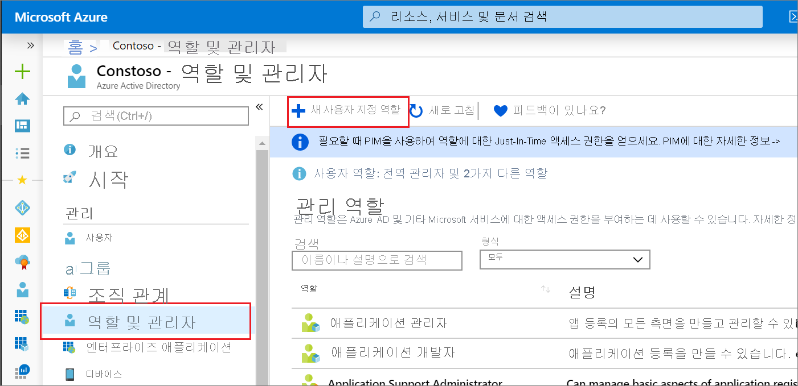
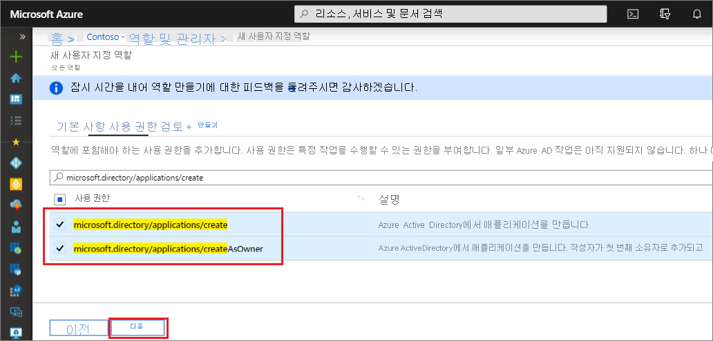

# <a name="quickstart-grant-permission-to-create-unlimited-app-registrations"></a>빠른 시작: 무제한 앱 등록 만들기에 대한 사용 권한 부여

이 빠른 시작 가이드에서는 갯수 제한 없이 앱 등록을 만들 수 있는 권한이 있는 사용자 지정 역할을 만든 다음, 해당 역할을 사용자에게 할당합니다. 그러면 할당된 사용자는 Azure AD 포털, Azure AD PowerShell 또는 Microsoft Graph API를 사용하여 애플리케이션 등록을 만들 수 있습니다. 기본 제공 애플리케이션 개발자 역할과 달리 이 사용자 지정 역할은 애플리케이션 등록을 무제한으로 만들 수 있는 기능을 부여합니다. 애플리케이션 개발자 역할은 기능을 부여하지만, [디렉터리 차원의 개체 할당량](../enterprise-users/directory-service-limits-restrictions.md)을 초과하지 않도록 생성된 개체의 총 수는 250개로 제한됩니다. Azure AD 사용자 지정 역할을 만들고 할당하는 데 필요한 최소 권한 있는 역할은 권한 있는 역할 관리자입니다.

Azure 구독이 아직 없는 경우 시작하기 전에 [체험](https://azure.microsoft.com/free/) 계정을 만듭니다.

## <a name="create-a-custom-role-using-the-azure-ad-portal"></a>Azure AD 포털을 사용하여 사용자 지정 역할 만들기

1. Azure AD 조직에서 권한 있는 역할 관리자 또는 전역 관리자 권한으로 [Azure AD 관리 센터](https://aad.portal.azure.com)에 로그인합니다.
1. **Azure Active Directory** 를 선택하고 **역할 및 관리자** 를 선택한 다음, **새 사용자 지정 역할** 을 선택합니다.

    

1. **기본** 탭에서 역할의 이름에 “애플리케이션 등록 작성자”를 입력하고 역할 설명에 “애플리케이션 등록을 무제한으로 만들 수 있음”을 선택한 후, **다음** 을 선택합니다.

    

1. **사용 권한** 탭에서 검색 상자에 “microsoft.directory/applications/create”를 입력한 다음, 원하는 사용 권한 옆의 확인란을 선택한 후 **다음** 을 선택합니다.

    

1. **검토 + 만들기** 탭에서 권한을 검토하고 **만들기** 를 선택합니다.

### <a name="assign-the-role-in-the-azure-ad-portal"></a>Azure AD 포털에서 역할 할당

1. Azure AD 조직에서 권한 있는 역할 관리자 또는 전역 관리자 권한으로 [Azure AD 관리 센터](https://aad.portal.azure.com)에 로그인합니다.
1. **Azure Active Directory** 를 선택한 다음, **역할 및 관리자** 를 선택합니다.
1. 애플리케이션 등록 작성자 역할을 선택하고 **할당 추가** 를 선택합니다.
1. 원하는 사용자를 선택하고 **선택** 을 클릭하여 사용자를 역할에 추가합니다.

완료되었습니다. 이 빠른 시작에서는 갯수 제한 없이 앱 등록을 만들 수 있는 권한이 있는 사용자 지정 역할을 만든 다음, 해당 역할을 사용자에게 할당했습니다.

> [!TIP]
> Azure AD 포털을 사용하여 애플리케이션에 역할을 할당하려면 할당 페이지의 검색 상자에 애플리케이션의 이름을 입력합니다. 애플리케이션은 기본적으로 목록에 표시되지 않지만 검색 결과에 반환됩니다.

### <a name="app-registration-permissions"></a>앱 등록 권한

애플리케이션 등록을 만들 수 있는 기능을 부여하는 데 사용할 수 있는 두 가지 권한은 각기 다른 동작입니다.

- microsoft.directory/applications/createAsOwner: 이 권한을 할당하면 생성된 앱 등록의 첫 번째 소유자로 작성자가 추가되고 생성된 앱 등록은 작성자의 250개 생성된 개체 할당량에 대해 계산됩니다.
- microsoft.directory/applications/create: 이 권한을 할당하면 생성된 앱 등록의 첫 번째 소유자로 작성자가 추가되지 않으며 생성된 앱 등록이 작성자의 250개 생성된 개체 할당량에 대해 계산되지 않습니다. 디렉터리 수준 할당량에 도달할 때까지는 담당자가 앱 등록 생성을 막을 수 없으므로 이 권한을 신중하게 사용하세요. 두 권한이 모두 할당된 경우 이 권한이 우선적으로 적용됩니다.

## <a name="create-a-custom-role-in-azure-ad-powershell"></a>Azure AD PowerShell에서 사용자 지정 역할 만들기

### <a name="prepare-powershell"></a>PowerShell 준비

먼저 [PowerShell 갤러리](https://www.powershellgallery.com/packages/AzureADPreview/2.0.0.17)에서 Azure AD PowerShell 모듈을 설치합니다. 그런 다음, 다음 명령을 사용하여 Azure AD PowerShell 미리 보기 모듈을 가져옵니다.

```powershell
import-module azureadpreview
```

모듈을 사용할 준비가 되었는지 확인하려면 다음 명령에서 반환된 버전을 여기에 나열된 버전과 일치시킵니다.

```powershell
get-module azureadpreview
  ModuleType Version      Name                         ExportedCommands
  ---------- ---------    ----                         ----------------
  Binary     2.0.0.115    azureadpreview               {Add-AzureADAdministrati...}
```

### <a name="create-the-custom-role-in-azure-ad-powershell"></a>Azure AD PowerShell에서 사용자 지정 역할 만들기

다음 PowerShell 스크립트를 사용하여 새 역할을 만듭니다.

```powershell

# Basic role information
$displayName = "Application Registration Creator"
$description = "Can create an unlimited number of application registrations."
$templateId = (New-Guid).Guid

# Set of permissions to grant
$allowedResourceAction =
@(
    "microsoft.directory/applications/create"
    "microsoft.directory/applications/createAsOwner"
)
$rolePermissions = @{'allowedResourceActions'= $allowedResourceAction}

# Create new custom admin role
$customRole = New-AzureAdMSRoleDefinition -RolePermissions $rolePermissions -DisplayName $displayName -Description $description -TemplateId $templateId -IsEnabled $true
```

### <a name="assign-the-role-in-azure-ad-powershell"></a>Azure AD PowerShell에서 역할 할당

다음 PowerShell 스크립트를 사용하여 역할을 할당합니다.

```powershell
# Get the user and role definition you want to link
$user = Get-AzureADUser -Filter "userPrincipalName eq 'Adam@contoso.com'"
$roleDefinition = Get-AzureADMSRoleDefinition -Filter "displayName eq 'Application Registration Creator'"

# Get resource scope for assignment
$resourceScope = '/'

# Create a scoped role assignment
$roleAssignment = New-AzureADMSRoleAssignment -ResourceScope $resourceScope -RoleDefinitionId $roleDefinition.Id -PrincipalId $user.objectId
```

## <a name="create-a-custom-role-in-the-microsoft-graph-api"></a>Microsoft Graph API에서 사용자 지정 역할 만들기

사용자 지정 역할을 만들기 위한 HTTP 요청.

POST

``` HTTP
https://graph.microsoft.com/beta/roleManagement/directory/roleDefinitions
```

본문

```HTTP
{
    "description":"Can create an unlimited number of application registrations.",
    "displayName":"Application Registration Creator",
    "isEnabled":true,
    "rolePermissions":
    [
        {
            "resourceActions":
            {
                "allowedResourceActions":
                [
                    "microsoft.directory/applications/create"
                    "microsoft.directory/applications/createAsOwner"
                ]
            },
            "condition":null
        }
    ],
    "templateId":"<PROVIDE NEW GUID HERE>",
    "version":"1"
}
```

### <a name="assign-the-role-in-the-microsoft-graph-api"></a>Microsoft Graph API에서 역할 할당

역할 할당은 보안 주체 ID(사용자 또는 서비스 주체일 수 있음), 역할 정의(역할) ID 및 Azure AD 리소스 범위를 결합합니다.

사용자 지정 역할을 할당하기 위한 HTTP 요청.

POST

``` HTTP
https://graph.microsoft.com/beta/roleManagement/directory/roleAssignments
```

본문

``` HTTP
{
    "principalId":"<PROVIDE OBJECTID OF USER TO ASSIGN HERE>",
    "roleDefinitionId":"<PROVIDE OBJECTID OF ROLE DEFINITION HERE>",
    "resourceScopes":["/"]
}
```

## <a name="next-steps"></a>다음 단계

- [Azure AD 관리 역할 포럼](https://feedback.azure.com/forums/169401-azure-active-directory?category_id=166032)에서 경험을 자유롭게 공유하세요.
- Azure AD 역할 할당에 대한 자세한 내용은 [관리자 역할 할당](permissions-reference.md)을 참조하세요.
- 기본 사용자 권한에 대한 자세한 내용은 [기본 게스트 및 멤버 사용자 권한 비교](../fundamentals/users-default-permissions.md)를 참조하세요.
