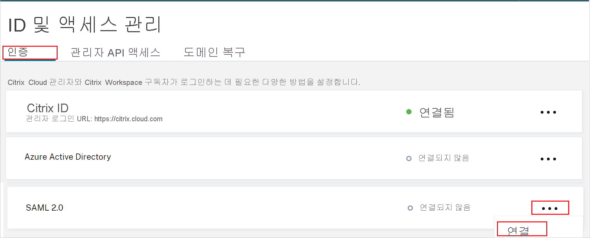

# 자습서: Citrix Cloud SAML SSO와 Azure Active Directory SSO(Single Sign-On) 통합

이 자습서에서는 Azure AD(Azure Active Directory)와 Citrix Cloud SAML SSO를 통합하는 방법을 알아봅니다. Azure AD와 Citrix Cloud SAML SSO를 통합하면 다음을 수행할 수 있습니다.

* Citrix Cloud SAML SSO에 대한 액세스 권한이 있는 사용자를 Azure AD에서 제어합니다.
* 사용자가 자신의 Azure AD 계정으로 Citrix Cloud SAML SSO에 자동으로 로그인되도록 설정합니다.
* 단일 중앙 위치인 Azure Portal에서 계정을 관리합니다.

## 사전 요구 사항

시작하려면 다음 항목이 필요합니다.

* Azure AD 구독 구독이 없는 경우 [체험 계정](https://azure.microsoft.com/free/)을 얻을 수 있습니다.
* Citrix Cloud 구독 구독이 없는 경우 구독에 등록합니다. 

## 시나리오 설명

이 자습서에서는 테스트 환경에서 Azure AD SSO를 구성하고 테스트합니다.

* Citrix Cloud SAML SSO에서 **SP** 시작 SSO를 지원합니다.

> [!NOTE]
> 이 애플리케이션의 식별자는 고정 문자열 값이므로 하나의 테넌트에서 하나의 인스턴스만 구성할 수 있습니다.

## 갤러리에서 Citrix Cloud SAML SSO 추가

Citrix Cloud SAML SSO가 Azure AD로 통합되도록 구성하려면 갤러리의 Citrix Cloud SAML SSO를 관리형 SaaS 앱 목록에 추가해야 합니다.

1. Azure Portal에 회사 또는 학교 계정, 개인 Microsoft 계정으로 로그인합니다.
1. 왼쪽 탐색 창에서 **Azure Active Directory** 서비스를 선택합니다.
1. **엔터프라이즈 애플리케이션** 으로 이동한 다음, **모든 애플리케이션** 을 선택합니다.
1. 새 애플리케이션을 추가하려면 **새 애플리케이션** 을 선택합니다.
1. **갤러리에서 추가** 섹션의 검색 상자에 **Citrix Cloud SAML SSO** 를 입력합니다.
1. 결과 패널에서 **Citrix Cloud SAML SSO** 를 선택한 다음, 앱을 추가합니다. 앱이 테넌트에 추가될 때까지 잠시 동안 기다려 주세요.

## Citrix Cloud SAML SSO에 대한 Azure AD SSO 구성 및 테스트

**B.Simon** 이라는 테스트 사용자를 사용하여 Citrix Cloud SAML SSO에서 Azure AD SSO를 구성하고 테스트합니다. SSO가 작동하려면 Azure AD 사용자와 Citrix Cloud SAML SSO의 관련 사용자 간에 연결 관계를 설정해야 합니다. 이 사용자는 Azure AD 구독에 대한 Azure AD Connect와 동기화되는 Active Directory에도 존재해야 합니다.

Citrix Cloud SAML SSO에서 Azure AD SSO를 구성하고 테스트하려면 다음 단계를 수행합니다.

1. **[Azure AD SSO 구성](#configure-azure-ad-sso)** - 사용자가 이 기능을 사용할 수 있도록 합니다.
    1. **[Azure AD 테스트 사용자 만들기](#create-an-azure-ad-test-user)** - B.Simon을 사용하여 Azure AD Single Sign-On을 테스트합니다.
    1. **[Azure AD 테스트 사용자 할당](#assign-the-azure-ad-test-user)** - B. Simon이 Azure AD Single Sign-On을 사용할 수 있도록 합니다.
1. **[Citrix Cloud SAML SSO 구성](#configure-citrix-cloud-saml-sso)** - 애플리케이션 쪽에서 Single Sign-On 설정을 구성합니다.
1. **[SSO 테스트](#test-sso)** - 구성이 작동하는지 여부를 확인합니다.

## Azure AD SSO 구성

Azure Portal에서 Azure AD SSO를 사용하도록 설정하려면 다음 단계를 수행합니다.

1. Azure Portal의 **Citrix Cloud SAML SSO** 애플리케이션 통합 페이지에서 **관리** 섹션을 찾고, **Single Sign-On** 을 선택합니다.
1. **Single Sign-On 방법 선택** 페이지에서 **SAML** 을 선택합니다.
1. **SAML로 Single Sign-On 설정** 페이지에서 **기본 SAML 구성** 에 대한 연필 아이콘을 클릭하여 설정을 편집합니다.

   

1. **기본 SAML 구성** 섹션에서 다음 단계를 수행합니다.

    **로그인 URL** 텍스트 상자에서 `https://<SUBDOMAIN>.cloud.com` 패턴을 사용하여 URL을 입력합니다.

    > [!NOTE]
    > 이 값은 실제 값이 아닙니다. Citrix 작업 영역 URL로 값을 업데이트합니다. Citrix Cloud 계정에 액세스하여 값을 가져옵니다. Azure Portal의 **기본 SAML 구성** 섹션에 표시된 패턴을 참조할 수도 있습니다.

1. Citrix Cloud SAML SSO 애플리케이션에는 SAML 토큰 특성 구성에 사용자 지정 특성 매핑을 추가해야 하는 특정 형식의 SAML 어설션이 필요합니다. 다음 스크린샷에서는 기본 특성의 목록을 보여 줍니다.

    

1. 위에서 언급한 특성 외에도 Citrix Cloud SAML SSO 애플리케이션에서는 아래 나와 있는 몇 가지 추가 특성을 SAML 응답으로 다시 전달해야 합니다. 이러한 특성도 미리 채워져 있지만 요구 사항에 따라 검토할 수 있습니다. SAML 응답으로 전달된 값은 사용자의 Active Directory 특성에 매핑되어야 합니다.
    
    | 속성 | 원본 특성 |
    | -----|-----|
    | cip_sid | user.onpremisesecurityidentifier |
    | cip_upn | user.userprincipalname |
    | cip_oid | ObjectGUID(확장 특성) |
    | cip_email | user.mail |
    | displayName | user.displayname |

    > [!NOTE]
    > ObjectGUID는 요구 사항에 따라 수동으로 구성해야 합니다.

1. **SAML로 Single Sign-On 설정** 페이지의 **SAML 서명 인증서** 섹션에서 **인증서(PEM)** 를 찾고 **다운로드** 를 선택하여 인증서를 다운로드하고 컴퓨터에 저장합니다.

    

1. **Citrix Cloud SAML SSO 설정** 섹션에서 요구 사항에 따라 적절한 URL을 복사합니다.

    

### Azure AD 테스트 사용자 만들기

이 섹션에서는 Azure Portal에서 B.Simon이라는 테스트 사용자를 만듭니다.

1. Azure Portal의 왼쪽 창에서 **Azure Active Directory**, **사용자**, **모든 사용자** 를 차례로 선택합니다.
1. 화면 위쪽에서 **새 사용자** 를 선택합니다.
1. **사용자** 속성에서 다음 단계를 수행합니다.
   1. **이름** 필드에 `B.Simon`을 입력합니다.  
   1. **사용자 이름** 필드에서 username@companydomain.extension을 입력합니다. `B.Simon@contoso.com`)을 입력합니다.
   1. **암호 표시** 확인란을 선택한 다음, **암호** 상자에 표시된 값을 적어둡니다.
   1. **만들기** 를 클릭합니다.

    > [!NOTE]
    > 이 사용자는 Active Directory에서 동기화되어야 합니다. SSO가 작동하려면 Azure AD 사용자와 Citrix Cloud SAML SSO의 관련 사용자 간에 연결 관계를 설정해야 합니다.
    
### Azure AD 테스트 사용자 할당

이 섹션에서는 Azure Single Sign-On을 사용할 수 있도록 B.Simon에게 Citrix Cloud SAML SSO에 대한 액세스 권한을 부여합니다.

1. Azure Portal에서 **엔터프라이즈 애플리케이션** 을 선택한 다음, **모든 애플리케이션** 을 선택합니다.
1. 애플리케이션 목록에서 **Citrix Cloud SAML SSO** 를 선택합니다.
1. 앱의 개요 페이지에서 **관리** 섹션을 찾고 **사용자 및 그룹** 을 선택합니다.
1. **사용자 추가** 를 선택한 다음, **할당 추가** 대화 상자에서 **사용자 및 그룹** 을 선택합니다.
1. **사용자 및 그룹** 대화 상자의 사용자 목록에서 **B.Simon** 을 선택한 다음, 화면 아래쪽에서 **선택** 단추를 클릭합니다.
1. 사용자에게 역할을 할당할 것으로 예상되는 경우 **역할 선택** 드롭다운에서 선택할 수 있습니다. 이 앱에 대한 역할이 설정되지 않은 경우 "기본 액세스" 역할이 선택된 것으로 표시됩니다.
1. **할당 추가** 대화 상자에서 **할당** 단추를 클릭합니다.

## Citrix Cloud SAML SSO 구성

1. Citrix Cloud SAML SSO 회사 사이트에 관리자 권한으로 로그인합니다.

1. Citrix Cloud 메뉴로 이동하고 **ID 및 액세스 관리** 를 선택합니다.

     

1. **인증** 에서 **SAML 2.0** 을 찾고 줄임표 메뉴에서 **연결** 을 선택합니다.

    

1. **SAML 구성** 페이지에서 다음 단계를 수행합니다.

    

    a. Azure Portal에서 복사한 **Azure AD 식별자** 값을 **엔터티 ID** 텍스트 상자에 붙여넣습니다.

    b. **인증 요청에 서명** 에서 **아니요** 를 선택합니다.

    c. **SSO 서비스 URL** 텍스트 상자에 Azure Portal에서 복사한 **로그인 URL** 값을 붙여넣습니다.

    d. 드롭다운에서 **바인딩 메커니즘** 을 선택합니다. **HTTP-POST** 또는 **HTTP-Redirect** 바인딩을 선택할 수 있습니다.

    e. **SAML 응답** 아래 드롭다운에서 **응답 또는 어설션에 서명** 을 선택합니다.

    f. Azure Portal의 **인증서(PEM)** 를 **X.509 인증서** 섹션으로 업로드합니다.

    g. **인증 컨텍스트** 의 드롭다운에서 **지정되지 않음** 및 **정확하게 일치** 를 선택합니다.

    h. **테스트 및 마침** 을 클릭합니다.

## SSO 테스트 

이 섹션에서는 다음 옵션을 사용하여 Azure AD Single Sign-On 구성을 테스트합니다. 

* Citrix 작업 영역 URL에 직접 액세스하고 해당 위치에서 로그인 흐름을 시작합니다.

* AD로 동기화된 Active Directory 사용자로 Citrix 작업 영역에 로그인하여 테스트를 완료합니다.

## 다음 단계

Citrix Cloud SAML SSO가 구성되면 세션 제어를 적용하여 조직의 중요한 데이터의 반출 및 반입을 실시간으로 보호할 수 있습니다. 세션 제어는 조건부 액세스에서 확장됩니다. [Microsoft Cloud App Security를 사용하여 세션 제어를 적용하는 방법을 알아봅니다](/cloud-app-security/proxy-deployment-aad).