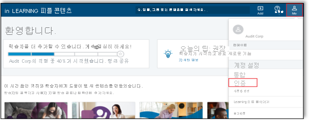
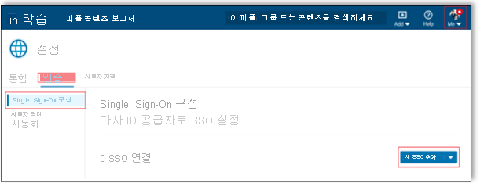
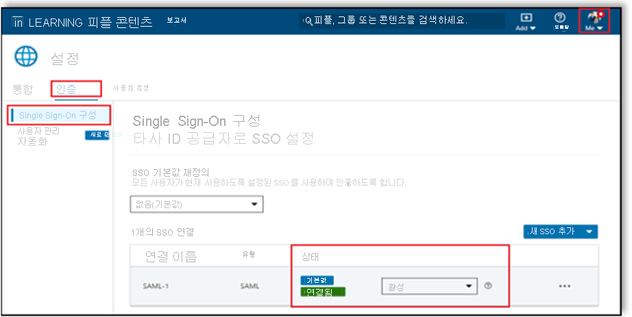

# 자습서: LinkedIn Learning과 Azure Active Directory SSO(Single Sign-On) 연결 | Microsoft Docs

이 자습서에서는 LinkedIn Learning을 Azure AD(Azure Active Directory)와 연결하는 방법에 대해 알아봅니다. Azure AD와 LinkedIn Learning을 연결하면 다음을 수행할 수 있습니다.

* Azure AD에서 LinkedIn Learning에 액세스할 수 있는 사용자를 제어합니다.
* 사용자가 자신의 Azure AD 계정으로 LinkedIn Learning에 자동으로 로그인되도록 설정합니다.
* 단일 중앙 위치인 Azure Portal에서 계정을 관리합니다.

## 사전 요구 사항

시작하려면 다음 항목이 필요합니다.

* Azure AD 구독 구독이 없는 경우 [체험 계정](https://azure.microsoft.com/free/)을 얻을 수 있습니다.
* LinkedIn Learning SSO(Single Sign-On)가 설정된 구독

## 시나리오 설명

이 자습서에서는 테스트 환경에서 Azure AD SSO를 구성하고 테스트합니다.

* LinkedIn Learning은 **SP 및 IDP** 시작 SSO를 지원합니다.
* LinkedIn Learning은 **Just In Time** 사용자 프로비저닝을 지원합니다.

## 갤러리에서 LinkedIn Learning 추가

LinkedIn Learning이 Azure AD에 통합되도록 구성하려면 LinkedIn Learning을 갤러리에서 관리되는 SaaS 앱 목록에 추가해야 합니다.

1. Azure Portal에 회사 또는 학교 계정, 개인 Microsoft 계정으로 로그인합니다.
1. 왼쪽 탐색 창에서 **Azure Active Directory** 서비스를 선택합니다.
1. **엔터프라이즈 애플리케이션** 으로 이동한 다음, **모든 애플리케이션** 을 선택합니다.
1. 새 애플리케이션을 추가하려면 **새 애플리케이션** 을 선택합니다.
1. **갤러리에서 추가** 섹션의 검색 상자에 **LinkedIn Learning** 을 입력합니다.
1. 결과 패널에서 **LinkedIn Learning** 을 선택한 다음, 앱을 추가합니다. 앱이 테넌트에 추가될 때까지 잠시 동안 기다려 주세요.

## LinkedIn Learning에 대한 Azure AD SSO 구성 및 테스트

**B.Simon** 이라는 테스트 사용자를 사용하여 LinkedIn Learning에서 Azure AD SSO를 구성하고 테스트합니다. SSO가 작동하려면 Azure AD 사용자와 LinkedIn Learning의 관련 사용자 간에 연결 관계를 설정해야 합니다.

LinkedIn Learning에서 Azure AD SSO를 구성하고 테스트하려면 다음 단계를 수행합니다.

1. **[Azure AD SSO 구성](#configure-azure-ad-sso)** - 사용자가 이 기능을 사용할 수 있도록 합니다.
    1. **[Azure AD 테스트 사용자 만들기](#create-an-azure-ad-test-user)** - B.Simon을 사용하여 Azure AD Single Sign-On을 테스트합니다.
    1. **[Azure AD 테스트 사용자 할당](#assign-the-azure-ad-test-user)** - B. Simon이 Azure AD Single Sign-On을 사용할 수 있도록 합니다.
1. **[LinkedIn Learning SSO 구성](#configure-linkedin-learning-sso)** - 애플리케이션 쪽에서 Single Sign-On 설정을 구성합니다.
    1. **[라이선스 할당](#assign-licenses)** - B.Simon의 Azure AD 표현과 연결된 해당 사용자를 LinkedIn Learning에서 만듭니다.
1. **[SSO 테스트](#test-sso)** - 구성이 작동하는지 여부를 확인합니다.

## Azure AD SSO 구성

Azure Portal에서 Azure AD SSO를 사용하도록 설정하려면 다음 단계를 수행합니다.

1. Azure Portal의 **LinkedIn Learning** 애플리케이션 통합 페이지에서 **관리** 섹션을 찾아 **Single Sign-On** 을 선택합니다.
1. **Single Sign-On 방법 선택** 페이지에서 **SAML** 을 선택합니다.
1. **SAML로 Single Sign-On 설정** 페이지에서 **기본 SAML 구성** 에 대한 연필 아이콘을 클릭하여 설정을 편집합니다.

   

1. **IDP** 시작 모드에서 애플리케이션을 구성하려면 **기본 SAML 구성** 섹션에서 다음 단계를 수행합니다.

    a. **식별자** 텍스트 상자에서 LinkedIn 포털로부터 복사한 **엔터티 ID** 를 입력합니다. 

    b. **회신 URL** 텍스트 상자에서 LinkedIn 포털로부터 복사한 **ACS(Assertion Consumer Service) URL** 을 입력합니다.

    다. **SP 시작** 모드에서 애플리케이션을 구성하려면 **기본 SAML 구성** 섹션에서 **추가 URL 설정** 옵션을 클릭하여 로그인 URL을 지정합니다. 자체 로그인 URL을 만들려면 **ACS(Access Control Server) URL** 을 복사하여 /saml/을 /login/으로 바꿉니다. 완료된 후에는 로그온 URL에 다음과 같은 패턴이 포함됩니다.

    `https://www.linkedin.com/checkpoint/enterprise/login/<AccountId>?application=learning&applicationInstanceId=<InstanceId>`

    > [!NOTE]
    > 이러한 값은 실제 값이 아닙니다. 자습서의 뒷부분에 있는 **LinkedIn Learning SSO 구성** 섹션에서 설명하는 실제 식별자, 회신 URL, 로그온 URL로 해당 값을 업데이트합니다.

1. LinkedIn Learning 애플리케이션에는 특정 형식의 SAML 어설션이 필요하기 때문에 SAML 토큰 특성 구성에 사용자 지정 특성 매핑을 추가해야 합니다. 다음 스크린샷에서는 **nameidentifier** 가 **user.userprincipalname** 과 매핑되는 기본 특성 목록을 보여줍니다. LinkedIn Learning 애플리케이션에서는 **nameidentifier** 가 **user.mail** 에 매핑되는 것으로 예상하므로, 특성 매핑을 변경하기 위해 **편집** 아이콘을 클릭하여 특성 매핑을 편집해야 합니다.

    

1. **SAML로 Single Sign-On 설정** 페이지의 **SAML 서명 인증서** 섹션에서 **페더레이션 메타데이터 XML** 을 찾고, **다운로드** 를 선택하여 인증서를 컴퓨터에 다운로드 및 저장합니다.

    

1. **LinkedIn Learning 설정** 섹션에서 요구 사항에 따라 적절한 URL을 복사합니다.

    

### Azure AD 테스트 사용자 만들기

이 섹션에서는 Azure Portal에서 B.Simon이라는 테스트 사용자를 만듭니다.

1. Azure Portal의 왼쪽 창에서 **Azure Active Directory**, **사용자**, **모든 사용자** 를 차례로 선택합니다.
1. 화면 위쪽에서 **새 사용자** 를 선택합니다.
1. **사용자** 속성에서 다음 단계를 수행합니다.
   1. **이름** 필드에 `B.Simon`을 입력합니다.  
   1. **사용자 이름** 필드에서 username@companydomain.extension을 입력합니다. `B.Simon@contoso.com`)을 입력합니다.
   1. **암호 표시** 확인란을 선택한 다음, **암호** 상자에 표시된 값을 적어둡니다.
   1. **만들기** 를 클릭합니다.

### Azure AD 테스트 사용자 할당

이 섹션에서는 Azure Single Sign-On을 사용할 수 있도록 B.Simon에게 LinkedIn Learning에 대한 액세스 권한을 부여합니다.

1. Azure Portal에서 **엔터프라이즈 애플리케이션** 을 선택한 다음, **모든 애플리케이션** 을 선택합니다.
1. 애플리케이션 목록에서 **LinkedIn Learning** 을 선택합니다.
1. 앱의 개요 페이지에서 **관리** 섹션을 찾고 **사용자 및 그룹** 을 선택합니다.
1. **사용자 추가** 를 선택한 다음, **할당 추가** 대화 상자에서 **사용자 및 그룹** 을 선택합니다.
1. **사용자 및 그룹** 대화 상자의 사용자 목록에서 **B.Simon** 을 선택한 다음, 화면 아래쪽에서 **선택** 단추를 클릭합니다.
1. 사용자에게 역할을 할당할 것으로 예상되는 경우 **역할 선택** 드롭다운에서 선택할 수 있습니다. 이 앱에 대한 역할이 설정되지 않은 경우 "기본 액세스" 역할이 선택된 것으로 표시됩니다.
1. **할당 추가** 대화 상자에서 **할당** 단추를 클릭합니다.

## LinkedIn Learning SSO 구성

1. 관리자 권한으로 LinkedIn Learning 회사 사이트에 로그인합니다.

1. **관리자로 이동** > **본인** > **인증** 을 선택합니다. 

     

1. **인증** 에서 **Single Sign-On 구성** 을 선택하고 **새 SSO 추가** 를 클릭합니다.    

    

1. **새 SSO 추가** 드롭다운에서 **SAML** 을 선택합니다.

    

1. **기본 사항** 탭에서 **SAML 연결 이름** 을 입력하고 **다음** 을 클릭합니다.

    

1. **ID 공급자 설정** 탭으로 이동한 다음, **파일 다운로드** 를 클릭하여 메타데이터 파일을 다운로드하고 컴퓨터에 저장한 후 **다음** 을 클릭합니다.

    

    > [!NOTE]    
    > 이 파일을 ID 공급자로 가져오지 못할 수도 있습니다. 예를 들어 Okta에는 이 기능이 없습니다. 구성 요구 사항과 일치하는 경우 개별 필드 작업을 계속 진행합니다.

1. **ID 공급자 설정** 탭에서 **필드에서 정보 로드 및 복사** 를 클릭하여 필수 필드를 복사하고 Azure Portal의 **기본 SAML 구성** 섹션에 붙여넣은 후 **다음** 을 클릭합니다.

    

1. **SSO 설정** 탭으로 이동한 다음, **XML 파일 업로드** 를 클릭하여 Azure Portal에서 다운로드한 **페더레이션 메타데이터 XML** 파일을 업로드합니다.

    

1. Azure Portal에서 복사한 필수 필드를 **SSO 설정** 탭 아래에 수동으로 채웁니다.

    

1. **SSO 설정** 에서 요구 사항에 따라 SSO 옵션을 선택하고 **저장** 을 클릭합니다.

    

#### Single Sign-On 사용

구성을 완료한 후 SSO 상태 드롭다운에서 **활성** 을 선택하여 SSO를 사용하도록 설정합니다.

  

### 라이선스 할당

SSO를 사용하도록 설정한 후 **자동으로 라이선스 프로비저닝** 을 **켜기** 로 토글하고 **저장** 을 클릭하면 직원에게 라이선스를 자동으로 할당할 수 있습니다. 이 옵션을 사용하도록 설정하면 사용자가 처음으로 인증될 때 라이선스가 자동으로 부여됩니다.

   

> [!NOTE]   
> 이 옵션을 사용하도록 설정하지 않는 경우 관리자가 사용자 탭에서 사용자를 수동으로 추가해야 합니다. LinkedIn Learning은 사용자를 메일 주소로 식별합니다.

## SSO 테스트 

이 섹션에서는 다음 옵션을 사용하여 Azure AD Single Sign-On 구성을 테스트합니다. 

#### SP 시작:

* Azure Portal에서 **이 애플리케이션 테스트** 를 클릭합니다. 그러면 로그인 흐름을 시작할 수 있는 LinkedIn Learning 로그온 URL로 리디렉션됩니다.  

* LinkedIn Learning 로그온 URL로 직접 이동하여 해당 위치에서 로그인 흐름을 시작합니다.

#### IDP 시작:

* Azure Portal에서 **이 애플리케이션 테스트** 를 클릭하면 SSO를 설정한 LinkedIn Learning에 자동으로 로그인됩니다. 

Microsoft 내 앱을 사용하여 모든 모드에서 애플리케이션을 테스트할 수도 있습니다. 내 앱에서 LinkedIn Learning 타일을 클릭하면 SP 모드로 구성된 경우 로그인 흐름을 시작하기 위해 애플리케이션 로그온 페이지로 리디렉션되고, IDP 모드로 구성된 경우 SSO를 설정한 LinkedIn Learning에 자동으로 로그인됩니다. 내 앱에 대한 자세한 내용은 [내 앱 소개](../user-help/my-apps-portal-end-user-access.md)를 참조하세요.

## 다음 단계

LinkedIn Learning을 구성한 후에는 세션 제어를 적용하여 조직의 중요한 데이터의 반출 및 침입을 실시간으로 보호할 수 있습니다. 세션 제어는 조건부 액세스에서 확장됩니다. [Microsoft Cloud App Security를 사용하여 세션 제어를 적용하는 방법을 알아봅니다](/cloud-app-security/proxy-deployment-aad).
