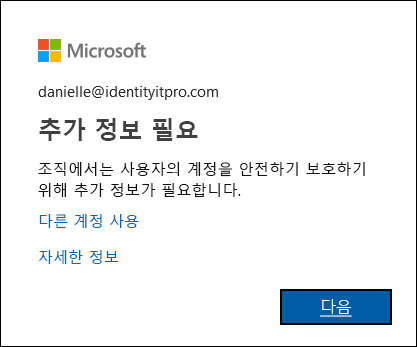

# 추가 확인 페이지란?

IT 팀원 또는 상사로부터 조직에서 계정에 보안 확인 절차를 추가했다는 내용의 이메일을 받았습니다. 이것은 무슨 의미일까요? 조직에서 사용자가 로그인할 때 사용자의 신분을 정확하게 확인하기 위한 단계를 추가했다는 의미입니다. 2단계 인증이라고도 하는 이 추가 확인은 사용자 이름, 암호 및 모바일 디바이스 또는 휴대폰 조합을 통해 수행됩니다.

2단계 인증은 사용자가 알고 있는 것과 휴대하는 것, 두 가지 형태의 인증을 사용하기 때문에 단순 암호에 비해 더 안전합니다. 사용자가 알고 있는 것은 암호입니다. 사용자가 휴대하는 것은 사용자가 흔히 휴대하는 전화 또는 디바이스입니다. 2단계 인증은 악의적인 해커가 사용자를 가장하지 못하게 차단하는 효과가 있습니다. 해커가 사용자의 암호를 알아내더라도 사용자의 디바이스까지 손에 넣을 가능성은 별로 높지 않기 때문입니다.

>[!Important]
>이 문서는 회사 또는 학교 계정(예: alain@contoso.com)에서 2단계 인증을 사용하려는 사용자를 위해 작성되었습니다. 직원 또는 다른 사용자에 대해 2단계 인증을 설정하는 방법에 대한 정보를 찾는 관리자는 [Azure Active Directory Authentication 설명서](https://docs.microsoft.com/azure/active-directory/authentication/)를 참조하세요.

## 이 기능의 사용 여부는 누가 결정하나요?

계정 유형에 따라 사용자가 2단계 인증을 사용하도록 조직에서 결정할 수도 있고, 사용자가 직접 결정할 수도 있습니다.

- **회사 또는 학교 계정** 회사 또는 학교 계정(예: alain@contoso.com)을 사용하는 경우 특정 인증 방법과 함께 2단계 인증을 사용해야 하는지 여부는 조직에서 결정합니다. 조직에서 이 기능을 사용해야 한다고 결정했으므로 개별적으로 해제할 수 있는 방법이 없습니다.

- **개인 Microsoft 계정.** 개인 Microsoft 계정에 2단계 인증을 설정하도록 선택할 수 있습니다(예: alain@outlook.com). 2단계 확인 및 개인 Microsoft 계정에 문제가 있는 경우 [Microsoft 계정에 대해 2단계 확인 켜기 또는 끄기](https://support.microsoft.com/help/4028586/microsoft-account-turning-two-step-verification-on-or-off)를 참조하세요. 이 기능을 사용할지 여부를 선택하므로 원할 때마다 설정하거나 해제할 수 있습니다.

    >[!Note]
    >2단계 인증 및 개인 Microsoft 계정(예: danielle@outlook.com)에 문제가 발생하는 경우 [Microsoft 계정으로 2단계 인증을 사용하는 방법](https://support.microsoft.com/help/12408/microsoft-account-how-to-use-two-step-verification)에 대한 제안을 시도해 볼 수 있습니다.

## 추가 보안 확인 페이지에 액세스

조직에서 2단계 확인을 설정하면 계정을 안전하게 유지하는 데 도움이 되는 추가 정보를 제공하라는 메시지가 표시됩니다.

### 추가 보안 확인 페이지에 액세스하려면

1. **추가 정보 요구** 프롬프트에서 **다음**을 선택합니다.

    **추가 보안 확인** 페이지가 표시됩니다.

2. **추가 보안 확인** 페이지에서 회사 또는 학교 계정에 로그인한 후 사용자가 누구인지 확인하는 데 사용할 2단계 확인 방법을 결정해야 합니다. 선택 옵션:

    | 연락 방법 | Description |
    | --- | --- |
    | 모바일 앱 | <ul><li>**확인 시 알림 수신.** 이 옵션은 스마트폰이나 태블릿의 인증자 앱에 푸시 알림을 보냅니다. 알림을 확인한 후 올바르면 앱에서 **인증**을 선택합니다. 회사 또는 학교에서는 인증 전에 PIN을 입력해야 할 수 있습니다.</li><li>**확인 코드 사용.** 이 모드에서 인증자 앱은 30초마다 업데이트되는 확인 코드를 생성합니다. 로그인 화면에서 최신 확인 코드를 입력합니다. [Android](https://go.microsoft.com/fwlink/?linkid=866594) 및 [iOS](https://go.microsoft.com/fwlink/?linkid=866594) 디바이스의 경우 Microsoft Authenticator 앱을 사용할 수 있습니다.</li></ul> |
    | 인증 전화 | <ul><li>**전화 통화**는 제공한 전화 번호로 자동화된 음성 통화를 신청합니다. 전화를 받고, 휴대폰 키패드에서 #(파운드 키)을 눌러 인증합니다.</li><li>**문자 메시지**는 확인 코드가 포함된 문자 메시지를 종료합니다. 텍스트에 있는 프롬프트에 따라 문자 메시지에 회신하거나 로그인 인터페이스에 제공한 확인 코드를 입력합니다.</li></ul> |
    | 사무실 전화 | 제공한 전화 번호에 자동으로 음성 전화를 겁니다. 전화를 받고, 휴대폰 키패드에서 #(파운드 키)을 눌러 인증합니다. |

## 다음 단계

**추가 보안 확인** 페이지에 액세스하면 2단계 확인 방법을 선택하여 설정해야 합니다.

- [확인 방법으로 모바일 디바이스 설정](multi-factor-authentication-setup-phone-number.md)

- [확인 방법으로 사무실 전화 설정](multi-factor-authentication-setup-office-phone.md)

- [확인 방법으로 Microsoft Authenticator 앱 설정](multi-factor-authentication-setup-auth-app.md)

## 관련 리소스

- [2단계 인증 방법 설정 관리](multi-factor-authentication-end-user-manage-settings.md)

- [앱 암호 관리](multi-factor-authentication-end-user-app-passwords.md)

- [2단계 인증을 사용하여 로그인](multi-factor-authentication-end-user-signin.md)

- [2단계 확인에 대한 도움말 보기](multi-factor-authentication-end-user-troubleshoot.md) 
