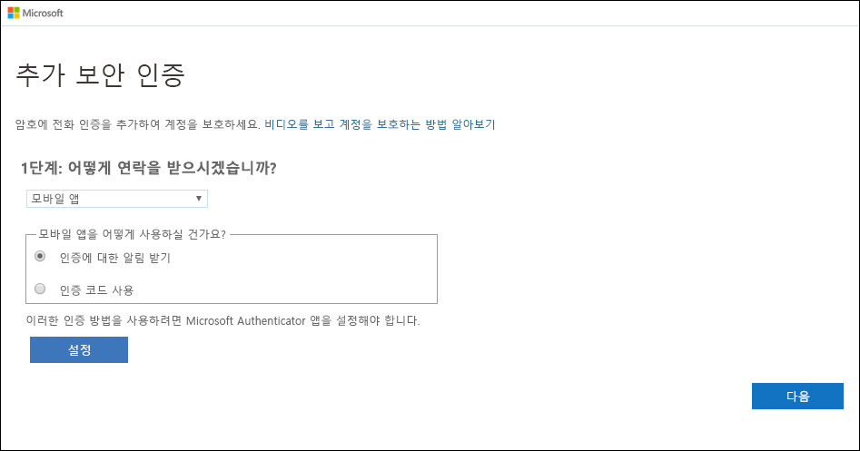
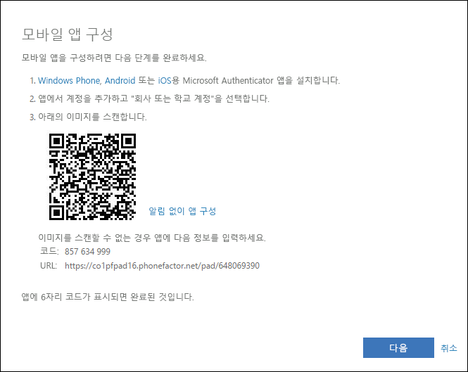
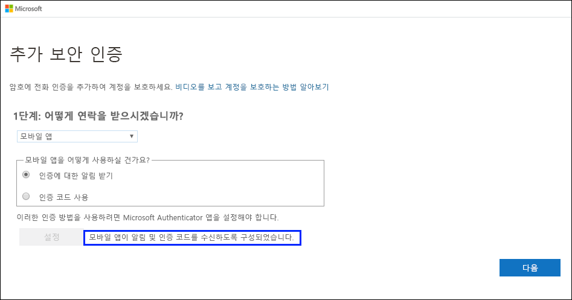
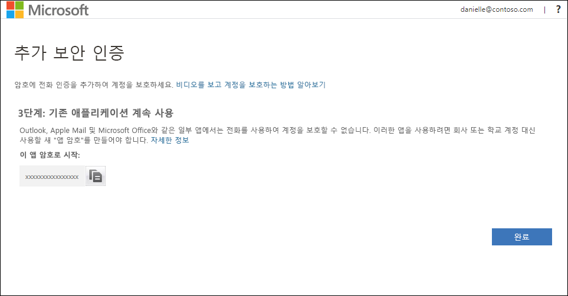
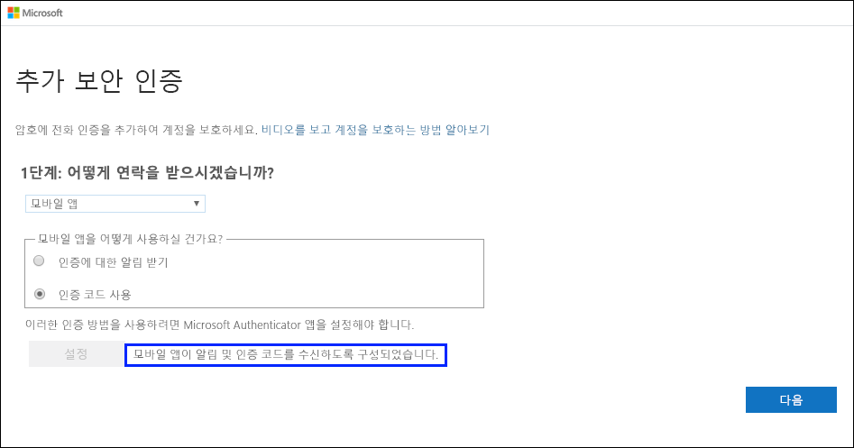
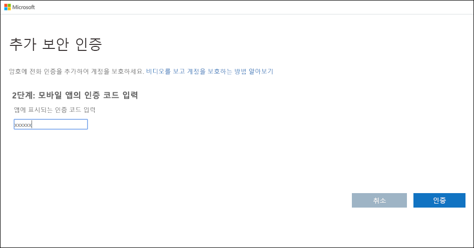

# 2단계 인증 방법으로 인증자 앱 설정

모바일 디바이스에 알림을 보내도록 또는 보안 인증 방법으로 확인 코드를 전송하도록 인증자 앱을 설정할 수 있습니다. 반드시 Microsoft Authenticator 앱을 사용할 필요는 없으며, 설정 과정에서 다른 앱을 선택할 수 있습니다. 단, 이 문서에서는 Microsoft Authenticator 앱을 사용합니다.

>[!Important]
>계정을 추가하려면 Microsoft Authenticator 앱을 다운로드하여 설치해야 합니다. [앱 다운로드 및 설치](user-help-auth-app-download-install.md) 문서의 단계를 아직 진행하지 않은 경우 지금 진행하세요.

>[!Note]
> 모바일 앱 옵션이 회색으로 표시되는 경우 조직에서 인증 앱을 인증에 사용하는 것을 허용하지 않았을 가능성이 있습니다. 이 경우 다른 방법을 선택하거나 관리자에게 도움을 요청해야 합니다.

## 알림을 보내도록 Microsoft Authenticator 앱 설정

1. [추가 보안 인증](https://account.activedirectory.windowsazure.com/proofup.aspx?proofup=1) 페이지에서 **모바일 앱**을 선택합니다. **1단계: 사용자에게 연락하는 방법** 영역에서 찾을 수 있습니다.

2. **모바일 앱을 사용하시겠습니까?** 영역에서 **확인 시 알림 수신**을 선택한 다음, **설정**을 선택합니다.

    

    **모바일 앱 구성** 페이지가 나타납니다.

    

3. Microsoft Authenticator 앱을 열고 오른쪽 위에 있는 **사용자 지정 및 제어** 아이콘에서 **계정 추가**를 선택한 다음, **회사 또는 학교 계정**을 선택합니다.

    >[!Note]
    >Microsoft Authenticator 앱을 처음으로 설정하는 경우 앱에서 카메라에 액세스할 수 있도록 허용할지(iOS) 아니면 앱에서 사진을 촬영하고 비디오를 녹화할 수 있도록 허용할지(Android) 묻는 메시지를 받을 수 있습니다. 인증자 앱이 카메라에 액세스하여 다음 단계에서 QR 코드의 사진을 찍을 수 있도록 **허용**을 선택해야 합니다. 카메라를 허용하지 않는 경우에도 여전히 인증자 앱을 설정할 수 있지만 코드 정보를 수동으로 추가해야 합니다. 코드를 수동으로 추가하는 방법에 대한 자세한 내용은 [수동으로 앱에 계정 추가](user-help-auth-app-add-account-manual.md)를 참조하세요.

4. 디바이스의 카메라를 사용하여 컴퓨터의 **모바일 앱 구성** 화면에서 QR 코드를 스캔하고 **다음**을 선택합니다.

5. 컴퓨터로 돌아가서 **추가 보안 인증** 페이지에서 구성이 완료되었다는 메시지가 표시되는지 확인하고 **다음**을 선택합니다.

    

    인증자 앱은 테스트 목적으로 모바일 디바이스에 알림을 보냅니다.

6. 모바일 디바이스에서 **승인**을 선택합니다.

7. 컴퓨터에서 모바일 디바이스 전화 번호를 **3단계: 모바일 앱에 액세스할 방법을 잊은 경우** 영역에 추가하고 **다음**을 선택합니다.

    어떤 이유로 모바일 앱에 액세스할 수 없거나 사용할 수 없는 경우 백업 역할을 할 모바일 디바이스 전화 번호를 추가할 것을 강력하게 권장합니다.

8. **4단계: 기존 애플리케이션 사용 유지** 영역에 제공된 앱 암호를 복사하여 안전한 곳에 붙여넣습니다.

    

    >[!Note]
    >이전 앱에서 앱 암호를 사용하는 방법에 대한 자세한 내용은 [앱 암호 관리](multi-factor-authentication-end-user-app-passwords.md)를 참조하세요. 2단계 인증을 지원하지 않는 이전 앱을 계속 사용하려는 경우에만 앱 암호를 사용해야 합니다.

9. **완료** 를 선택합니다.

## 확인 코드를 사용하도록 Microsoft Authenticator 앱 설정

1. **추가 보안 인증** 페이지에서 **모바일 앱**을 선택합니다. **1단계: 사용자에게 연락하는 방법** 영역에서 찾을 수 있습니다.

2. **모바일 앱을 사용하시겠습니까?** 영역에서 **확인 코드 사용**을 선택한 다음, **설정**을 선택합니다.

    

    **모바일 앱 구성** 페이지가 나타납니다.

    

3. Microsoft Authenticator 앱을 열고 오른쪽 위에 있는 **사용자 지정 및 제어** 아이콘에서 **계정 추가**를 선택한 다음, **회사 또는 학교 계정**을 선택합니다.

    >[!Note]
    >Microsoft Authenticator 앱을 처음으로 설정하는 경우 앱에서 카메라에 액세스할 수 있도록 허용할지(iOS) 아니면 앱에서 사진을 촬영하고 비디오를 녹화할 수 있도록 허용할지(Android) 묻는 메시지를 받을 수 있습니다. 인증자 앱이 카메라에 액세스하여 다음 단계에서 QR 코드의 사진을 찍을 수 있도록 **허용**을 선택해야 합니다. 카메라를 허용하지 않는 경우에도 여전히 인증자 앱을 설정할 수 있지만 코드 정보를 수동으로 추가해야 합니다. 코드를 수동으로 추가하는 방법에 대한 자세한 내용은 [수동으로 앱에 계정 추가](user-help-auth-app-add-account-manual.md)를 참조하세요.

4. 디바이스의 카메라를 사용하여 컴퓨터의 **모바일 앱 구성** 화면에서 QR 코드를 스캔하고 **다음**을 선택합니다.

5. 컴퓨터로 돌아가서 **추가 보안 인증** 페이지에서 구성이 완료되었다는 메시지가 표시되는지 확인하고 **다음**을 선택합니다.

    

    인증자 앱이 테스트를 위해 확인 코드를 요청합니다.

6. Microsoft Authenticator 앱에서 회사 또는 학교 계정이 나올 때까지 아래로 스크롤하고, 앱의 6자리 코드를 복사하여 컴퓨터의 **2단계: 모바일 앱에서 확인 코드 입력하기** 상자에 붙여넣은 다음, **확인**을 선택합니다.

    

7. 컴퓨터에서 모바일 디바이스 전화 번호를 **3단계: 모바일 앱에 액세스할 방법을 잊은 경우** 영역에 추가하고 **다음**을 선택합니다.

    어떤 이유로 모바일 앱에 액세스할 수 없거나 사용할 수 없는 경우 백업 역할을 할 모바일 디바이스 전화 번호를 추가할 것을 강력하게 권장합니다.

8. **4단계: 기존 애플리케이션 사용 유지** 영역에 제공된 앱 암호를 복사하여 안전한 곳에 붙여넣습니다.

    

    >[!Note]
    >이전 앱에서 앱 암호를 사용하는 방법에 대한 자세한 내용은 [앱 암호 관리](multi-factor-authentication-end-user-app-passwords.md)를 참조하세요. 2단계 인증을 지원하지 않는 이전 앱을 계속 사용하려는 경우에만 앱 암호를 사용해야 합니다.

9. **완료** 를 선택합니다.

## 다음 단계

2단계 인증 방법을 설정한 후에 추가 방법을 추가하거나, 설정 및 앱 암호를 관리하거나, 로그인하거나, 몇 가지 일반적인 2단계 인증 관련 문제에 대한 도움을 받을 수 있습니다.

- [2단계 인증 방법 설정 관리](multi-factor-authentication-end-user-manage-settings.md)

- [앱 암호 관리](multi-factor-authentication-end-user-app-passwords.md)

- [2단계 인증을 사용하여 로그인](multi-factor-authentication-end-user-signin.md)

- [2단계 확인에 대한 도움말 보기](multi-factor-authentication-end-user-troubleshoot.md)
