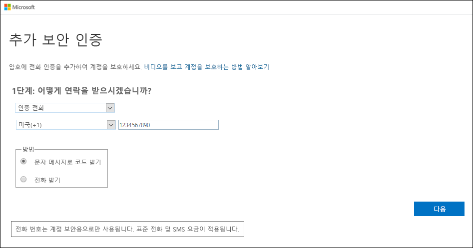
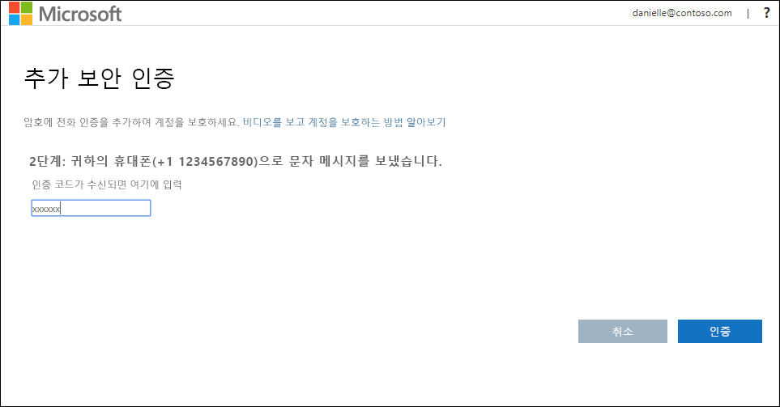
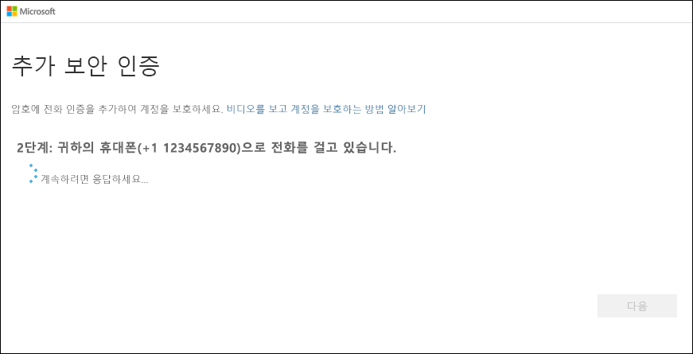

# 2단계 인증 방법으로 모바일 디바이스 설정

2단계 인증 방법으로 모바일 디바이스를 설정할 수 있습니다. 휴대폰으로 인증 코드를 포함한 문자 메시지 또는 전화 통화를 받을 수 있습니다.

>[!Note]
> 인증 전화 옵션이 보이지 않는 경우 인증에 전화 번호 또는 문자 메시지를 사용하는 것을 조직에서 허용하지 않기 때문일 수 있습니다. 이 경우 다른 방법을 선택하거나 관리자에게 도움을 요청해야 합니다.

## 인증 방법으로 문자 메시지를 사용하도록 모바일 디바이스 설정

1. **추가 보안 인증** 페이지에서 **인증 전화**를 **1단계: 사용자에게 연락하는 방법** 영역에서 선택하고, 드롭다운 목록에서 사용자의 국가 또는 지역을 선택합니다. 그런 다음, 모바일 디바이스 전화 번호를 입력합니다.

2. **방법** 영역에서 **문자 메시지로 코드 보내기**를 선택하고 **다음**을 선택합니다.

    

3. Microsoft로부터 전송된 문자 메시지의 인증 코드를 **2단계: 휴대폰으로 문자 메시지를 전송했습니다** 영역에 입력한 다음, **확인**을 선택합니다.

    

4. **3단계: 기존 애플리케이션 사용 유지** 영역에 제공된 앱 암호를 복사하여 안전한 곳에 붙여넣습니다.

    

    >[!Note]
    >이전 앱에서 앱 암호를 사용하는 방법에 대한 자세한 내용은 [앱 암호 관리](multi-factor-authentication-end-user-app-passwords.md)를 참조하세요. 2단계 인증을 지원하지 않는 이전 앱을 계속 사용하려는 경우에만 앱 암호를 사용해야 합니다.

5. **완료** 를 선택합니다.

## 휴대폰 통화를 수신하도록 모바일 디바이스 설정

1. **추가 보안 인증** 페이지에서 **인증 전화**를 **1단계: 사용자에게 연락하는 방법** 영역에서 선택하고, 드롭다운 목록에서 사용자의 국가 또는 지역을 선택합니다. 그런 다음, 모바일 디바이스 전화 번호를 입력합니다.

2. **방법** 영역에서 **내게 전화 걸기**를 선택한 다음, **다음**을 선택합니다.

    

3. Microsoft에서 전화가 걸려오면 모바일 디바이스에서 우물 정자 키(#)를 눌러 본인 여부를 확인합니다.

    

4. **3단계: 기존 애플리케이션 사용 유지** 영역에 제공된 앱 암호를 복사하여 안전한 곳에 붙여넣습니다.

    

    >[!Note]
    >이전 앱에서 앱 암호를 사용하는 방법에 대한 자세한 내용은 [앱 암호 관리](multi-factor-authentication-end-user-app-passwords.md)를 참조하세요. 2단계 인증을 지원하지 않는 이전 앱을 계속 사용하려는 경우에만 앱 암호를 사용해야 합니다.

5. **완료** 를 선택합니다.

## 다음 단계

2단계 인증 방법을 설정한 후에 추가 방법을 추가하거나, 설정 및 앱 암호를 관리하거나, 로그인하거나, 몇 가지 일반적인 2단계 인증 관련 문제에 대한 도움을 받을 수 있습니다.

- [2단계 인증 방법 설정 관리](multi-factor-authentication-end-user-manage-settings.md)

- [앱 암호 관리](multi-factor-authentication-end-user-app-passwords.md)

- [2단계 인증을 사용하여 로그인](multi-factor-authentication-end-user-signin.md)

- [2단계 확인에 대한 도움말 보기](multi-factor-authentication-end-user-troubleshoot.md)
