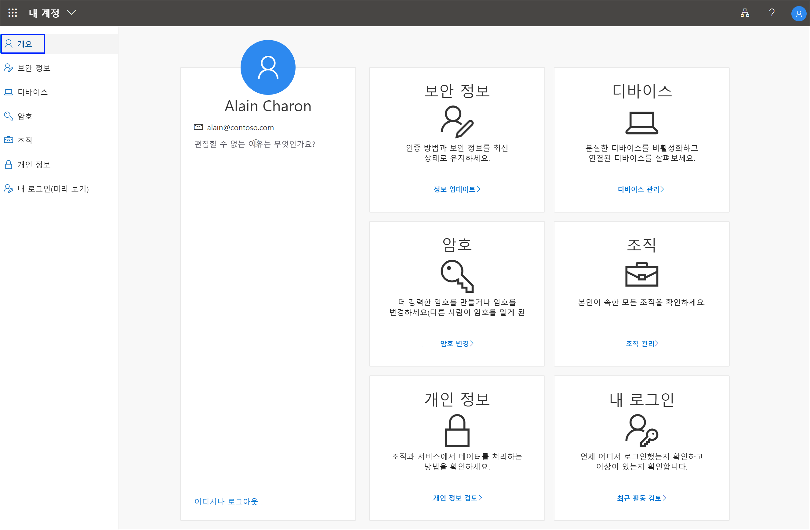

# 내 계정 포털이란?

**내 계정** 포털에서는 보안 정보를 설정 및 관리하고, 연결된 조직 및 디바이스를 관리하고, 조직이 데이터를 사용하는 방식을 확인하여 회사 또는 학교 계정을 관리할 수 있습니다.

다음 브라우저 중 하나의 최신 버전에서 **내 계정** 포털(https://myaccount.microsoft.com) )로 이동할 수 있습니다.

- Chrome
- Microsoft Edge
- Safari
- Firefox
- Internet Explorer 11

>[!Important]
>이 문서는 해당 보안 정보, 디바이스 정보, 암호, 연결된 조직, 언어 설정, 개인 정보 또는 이전 로그인 정보를 업데이트하기 위해 내 계정 포털에 가져오려는 사용자를 위해 작성되었습니다. 직원 및 기타 용도로 인증 및 기타 Azure AD(Azure Active Directory) 기능을 설정하는 방법에 대한 정보를 찾는 관리자는 [관리자를 위한 Azure AD 설명서](../index.yml)를 참조하세요.

## 다음 단계

- [보안 정보](./security-info-setup-signin.md)를 보거나 관리하려면 선택합니다.

- 연결된 [디바이스](my-account-portal-devices-page.md) 보기 또는 관리

- [조직](my-account-portal-organizations-page.md) 보기 및 관리

- [로그인 활동](my-account-portal-sign-ins-page.md) 보기

- 조직에서 [개인 정보 관련 데이터를 사용](my-account-portal-privacy-page.md)하는 방법 보기

- [내 계정 포털 설정](my-account-portal-settings.md) 변경

## 관련 Microsoft Office 콘텐츠

- [로그인하여 Office 제품 관리](https://support.office.com/article/sign-in-to-manage-your-office-product-959ac957-8d37-4ae4-b1b6-d6e4874e013f)

- [Office **내 계정** 페이지로 이동](https://portal.office.com/account/)

- [Office **내 설치** 페이지로 이동](https://portal.office.com/account/#installs)

- [Office **구독** 페이지로 이동](https://portal.office.com/account/#subscriptions)