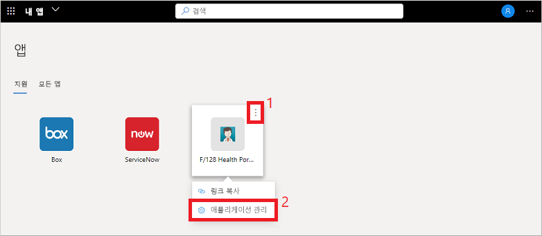
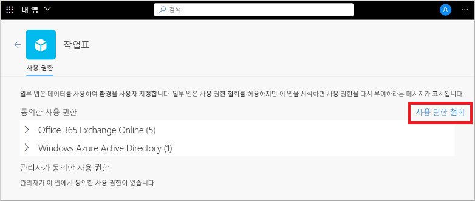

# 내 앱 포털에서 애플리케이션 사용 권한 편집 또는 해지

**내 앱** 포털에서 조직 애플리케이션을 사용하는 경우 사용 권한을 부여하고 계정 정보를 저장하는 경우가 많습니다. 데이터를 안전하게 유지하려면 사용 권한을 검토 및 취소하거나 저장된 계정 자격 증명을 지워야 할 수 있습니다. 사용 권한 또는 계정을 제거하면 일부 앱 기능이 손상될 수 있습니다. 사용 권한이나 계정을 제거한 후에 문제가 발생하면 조직의 기술 지원 팀에 문의하여 추가 지원을 요청하세요.

[!INCLUDE [preview-notice](../../../includes/active-directory-end-user-my-apps-and-workspaces.md)]

>[!Important]
>이 콘텐츠는 사용자를 위한 것입니다. 관리자인 경우 [애플리케이션 관리 설명서](https://docs.microsoft.com/azure/active-directory/manage-apps/access-panel-workspaces)에서 클라우드 기반 앱을 설정 및 관리하는 방법에 대한 더 자세한 정보를 확인할 수 있습니다.

## 애플리케이션 사용 권한 관리

사용자 또는 관리자가 동의한 권한을 확인하려면 마우스가 **내 앱** 포털의 앱을 가리키면 **...** 를 선택하고 **애플리케이션 관리**를 선택합니다.

사용 권한 창의 맨 위 부분에는 개인적으로 동의한 항목이 표시됩니다. 앱 사용 권한 예에는 일정, 연락처 또는 카메라에 액세스하는 기능이 있습니다.

**사용 권한 취소**를 선택하여 동의한 권한을 취소할 수 있지만, 사용 권한을 제거하면 일부 앱 기능이 손상될 수 있습니다. 사용 권한이나 계정을 제거한 후에 문제가 발생하면 조직의 기술 지원 팀에 문의하여 추가 지원을 요청하세요.

사용 권한 창의 하단에는 관리자가 사용자 대신 동의한 내용이 표시됩니다. 관리자가 동의한 권한이 없는 경우 이 섹션은 표시되지 않습니다. 이러한 사용 권한은 관리자가 동의했고 조직의 정책에 필요한 경우가 많기 때문에 취소할 수 없습니다.

## 다음 단계

**내 앱** 포털에서 앱 사용 권한 및 저장된 계정을 관리한 후에 다음을 수행할 수 있습니다.

- 조직에서 만들고 제공하는 다양한 범주로 앱을 구성합니다. 자세한 내용은 [내 앱 포털에서 컬렉션 액세스 및 사용](my-applications-portal-workspaces.md)을 참조하세요.

## 관련 문서

- [프로필 및 계정 정보 업데이트](my-account-portal-overview.md) **내 프로필** 포털에 표시되는 개인 정보를 업데이트하는 방법에 대한 지침입니다.

- [조직 관리](my-account-portal-organizations-page.md). **내 프로필** 포털의 **조직** 페이지에서 조직 관련 정보를 확인하고 관리하는 방법에 대한 지침입니다.

- [연결된 디바이스 관리](my-account-portal-devices-page.md). **내 프로필** 포털의 **디바이스** 페이지에서 회사 또는 학교 계정을 사용하여 연결하는 디바이스를 관리하는 방법에 대한 지침입니다.
