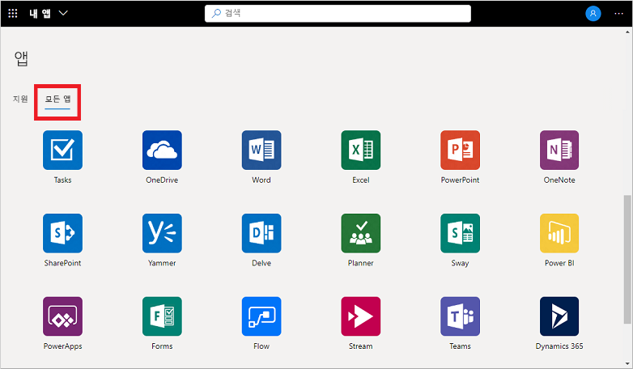
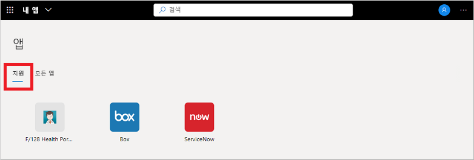

# 내 앱 포털에서 컬렉션 사용

컬렉션은 **내 앱** 포털에 표시되는 다양한 앱 보기입니다. 예를 들어, 부서 기능 또는 사용자 역할을 사용하여 앱을 컬렉션으로 그룹화할 수 있습니다. 사용 가능한 컬렉션이나 범주가 표시되지 않으면 관리자가 설정하지 않았거나 사용자와 공유하지 않은 것입니다. 공유 작업 영역을 보기 위한 추가 지원이나 권한을 조직의 기술 지원 팀에 요청하세요.

[!INCLUDE [preview-notice](../../../includes/active-directory-end-user-my-apps-and-workspaces.md)]

>[!Important]
>이 콘텐츠는 **내 앱** 사용자를 위한 것입니다. 관리자인 경우 [애플리케이션 관리 설명서](https://docs.microsoft.com/azure/active-directory/manage-apps/access-panel-workspaces)에서 클라우드 기반 앱을 설정 및 관리하는 방법에 대한 더 자세한 정보를 확인할 수 있습니다.

## 컬렉션을 사용하여 앱 액세스

**내 앱** 포털의 컬렉션 목록에는 기본적으로 사용자에게 액세스 권한이 있는 모든 앱이 포함된 **모든 앱**이 표시됩니다.

이 목록에 표시되는 다른 컬렉션은 관리자가 만들고 사용자와 공유하고 있습니다. 다음 예제에서는 이러한 컬렉션 중 하나를 선택하여 *지원*과 같은 범위가 지정된 추가 앱 세트를 볼 수 있습니다.

컬렉션을 선택하고 표시하면 사용자가 액세스할 수 있는 기본 애플리케이션만 표시됩니다.

## 다음 단계

앱을 **내 앱** 포털에서 다양한 범주로 구성한 후에는 다음을 수행할 수 있습니다.

- 애플리케이션에 부여된 권한을 검토, 업데이트 또는 취소 합니다. 자세한 내용은 [내 앱 포털에서 애플리케이션 사용 권한 편집 또는 해지](my-applications-portal-permissions-saved-accounts.md)를 참조하세요.

## 관련 문서

- [프로필 및 계정 정보 업데이트](my-account-portal-overview.md) **내 프로필** 포털에 표시되는 개인 정보를 업데이트하는 방법에 대한 지침입니다.

- [조직 관리](my-account-portal-organizations-page.md). **내 프로필** 포털의 **조직** 페이지에서 조직 관련 정보를 확인하고 관리하는 방법에 대한 지침입니다.

- [연결된 디바이스 관리](my-account-portal-devices-page.md). **내 프로필** 포털의 **디바이스** 페이지에서 회사 또는 학교 계정을 사용하여 연결하는 디바이스를 관리하는 방법에 대한 지침입니다.