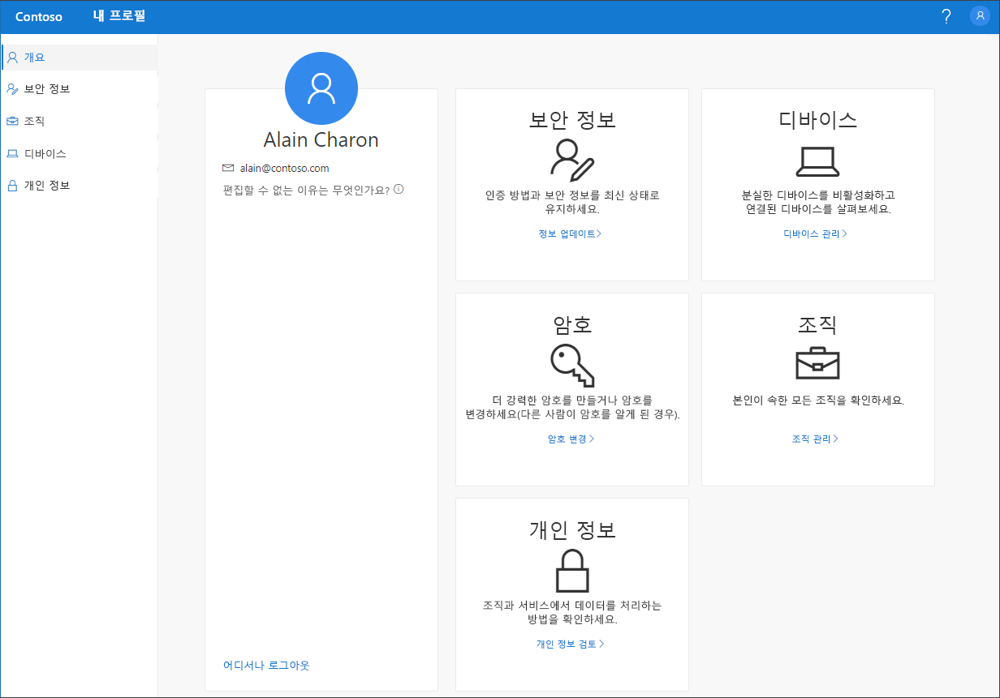

# 내 프로필(미리 보기) 포털 개요

[!INCLUDE [preview-notice](../../../includes/active-directory-end-user-preview-notice-myprofile.md)]

**내 프로필**(미리 보기) 포털에서는 보안 정보를 설정 및 관리하고, 연결된 조직 및 디바이스를 관리하고, 조직이 데이터를 사용하는 방식을 확인하여 회사 또는 학교 계정을 관리할 수 있습니다.

>[!Important]
>이 콘텐츠는 사용자를 위한 것입니다. 관리자의 경우 [Azure Active Directory 문서](https://docs.microsoft.com/azure/active-directory)에서 Azure AD(Azure Active Directory) 환경을 설정하고 관리하는 방법에 대한 자세한 정보를 찾을 수 있습니다.

## 내 프로필 포털로 이동

다음 브라우저 중 하나의 최신 버전에서 https://myprofile.microsoft.com)으로 이동하여 **내 프로필** 포털로 이동할 수 있습니다.

- Chrome
- Microsoft Edge
- Safari
- Firefox
- Internet Explorer 11

## 내 프로필 포털 문서

**내 프로필** 포털에서 확인할 수 있는 항목에 대한 자세한 내용 및 지침에 대해서는 다음 문서를 참조하세요.

|문서 |설명 |
|------|------------|
|[보안 정보 추가](user-help-security-info-overview.md)| Microsoft Authenticator 앱, 문자 메시지 또는 전화 통화를 인증 방법으로 설정하는 방법에 대한 지침을 제공하는 일부 문서입니다. 또한 필요한 경우 잊어버린 본인 암호를 재설정할 수 있도록 메일 주소 또는 미리 정의된 본인 확인 질문을 추가하는 방법에 대한 문서도 포함되어 있습니다.|
|[연결된 조직 보기 또는 조직에서 나오기](myprofile-portal-organizations-page.md)| 회사 또는 학교 계정에 연결된 조직을 보고 조직에서 나오는 방법에 대한 지침입니다.|
|[연결된 디바이스 보기 또는 사용하지 않도록 설정](myprofile-portal-devices-page.md)| 회사 또는 학교 계정에 연결한 모든 디바이스를 보거나 사용하지 않도록 설정하는 방법에 대한 지침입니다.|
|[개인 정보 관련 정보 보기](myprofile-portal-privacy-page.md)| 조직의 사용 약관과 함께, 회사 또는 학교 계정에 연결된 온라인 서비스를 보는 방법에 대한 지침입니다.|