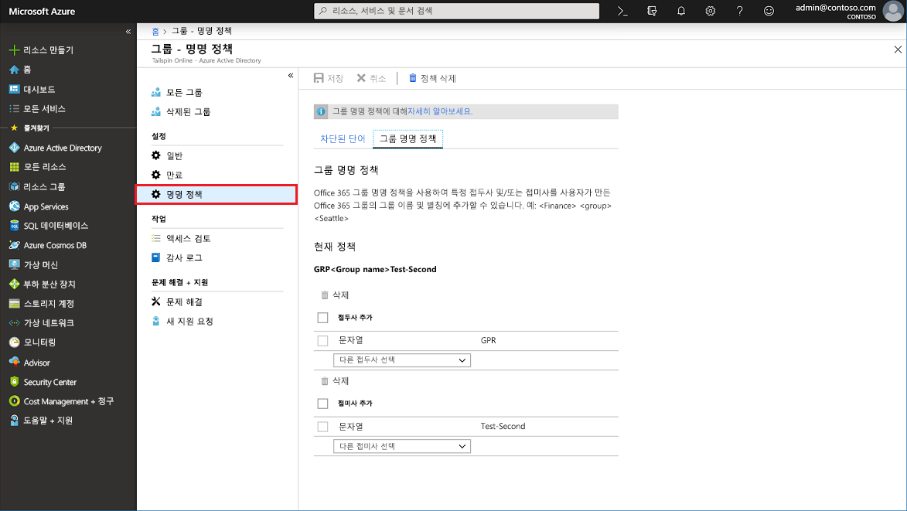
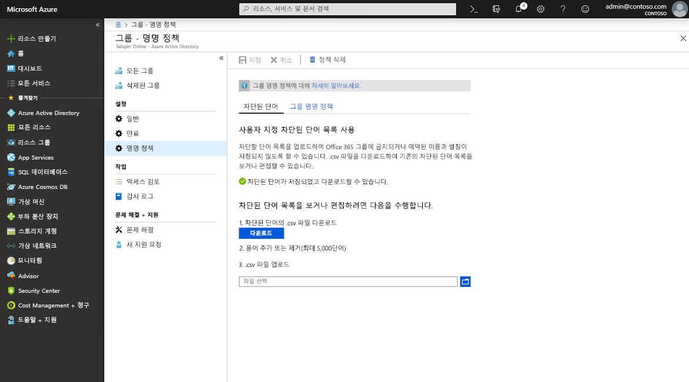

# <a name="enforce-a-naming-policy-on-office-365-groups-in-azure-active-directory"></a>Azure Active Directory에서 Office 365 그룹 명명 정책 적용

사용자가 생성하거나 편집한 Office 365 그룹에 대해 일관된 명명 규칙을 적용하려면 Azure AD(Azure Active Directory)에서 테넌트에 대한 그룹 명명 정책을 설정하세요. 예를 들어 명명 정책을 사용하여 그룹의 기능, 멤버 자격, 지리적 영역 또는 그룹을 만든 사람 정보를 전달할 수 있습니다. 또한 명명 정책을 사용하여 주소록에서 그룹을 범주화할 수 있습니다. 이 정책을 사용하여 그룹 이름 및 별칭에 특정 단어를 사용하지 않도록 차단할 수 있습니다.

> [!IMPORTANT]
> Office 365 그룹에 대 한 Azure AD 명명 정책을 사용 하 여 소유 하지만 반드시 Azure Active Directory Premium P1 라이선스 또는 하나 이상의 Office 365 그룹의 멤버인 각 고유 사용자에 대 한 Azure AD Basic EDU 라이선스를 할당 하는 필요 합니다.

명명 정책은 그룹을 만드는 데 적용되거나 워크로드(예: Outlook, Microsoft Team, SharePoint, Exchange 또는 Planner)에서 만든 그룹을 편집하는 데 적용됩니다. 이 정책은 그룹 이름 및 그룹 별칭 둘 다에 적용됩니다. Azure AD에서 명명 정책을 설정 하 고 기존 Exchange 그룹 명명 정책이 있는 경우 조직에서 Azure AD 명명 정책이 적용 됩니다.

## <a name="naming-policy-features"></a>명명 정책 기능

두 가지 방법으로 그룹에 대 한 명명 정책을 적용할 수 있습니다.

- **접두사-접미사 명명 정책** 접두사 또는 접미사는 정의할 수 있으며, 정의된 접두사 또는 접미사는 자동으로 추가되어 그룹에 명명 규칙을 적용합니다(예: 그룹 이름 “GRP\_JAPAN\_My Group\_Engineering”, GRP\_JAPAN\_은 접두사이고 \_Engineering은 접미사임). 

- **사용자 정의 차단 단어** 조직에 적용할 차단 단어 집합(예: “CEO, Payroll, HR”)을 업로드하여 사용자가 만든 그룹에서 차단할 수 있습니다.

### <a name="prefix-suffix-naming-policy"></a>접두사-접미사 명명 정책

명명 규칙의 일반 구조는 ‘접두사[GroupName]접미사’입니다. 여러 접두사 및 접미사를 정의할 수 있지만 설정에서는 [GroupName]의 인스턴스가 하나만 있을 수 있습니다. 접두사 또는 접미사는 그룹을 만든 사용자를 기반으로 대체되는 \[부서\]와 같은 사용자 속성 또는 고정 문자열일 수 있습니다. 결합된 접두사 및 접미사 문자열에 허용되는 문자 수는 53자입니다. 

접두사 및 접미사에는 그룹 이름 및 그룹 별칭에서 지원되는 특수 문자를 포함할 수 있습니다. 그룹 별칭에서 지원되지 않는 접두사 또는 접미사의 문자는 그룹 이름에는 계속해서 표시되지만 그룹 별칭에서는 제거됩니다. 이러한 제한 사항으로 인해 그룹 이름에 적용된 접두사 및 접미사는 그룹 별칭에 적용된 접미부와 다를 수 있습니다. 

#### <a name="fixed-strings"></a>고정 문자열

문자열을 사용하여 전체 주소 목록의 그룹과 그룹 워크로드의 왼쪽 탐색 링크에 있는 그룹을 쉽게 검색하고 구별할 수 있습니다. 일부 공통 접두사는 ‘Grp\_Name’ , ‘\#Name’, ‘\_Name’과 같은 키워드입니다.

#### <a name="user-attributes"></a>사용자 특성

사용자가 그룹을 만든 부서, 사무실 또는 지리적 지역을 식별하는 데 도움이 되는 특성을 사용할 수 있습니다. 예를 들어, 명명 정책을 `PrefixSuffixNamingRequirement = "GRP [GroupName] [Department]"` 및 `User’s department = Engineering`으로 정의하면 적용된 그룹 이름은 “GRP 내 그룹 엔지니어링”이 될 수 있습니다. 지원되는 Azure AD 속성은 \[Department\], \[Company\], \[Office\], \[StateOrProvince\], \[CountryOrRegion\], \[Title\]입니다. 지원되지 않는 사용자 속성은 고정 문자열로 처리됩니다(예: “\[ postalCode \]”). 확장 속성 및 사용자 정의 속성은 지원되지 않습니다.

조직의 모든 사용자에 대해 입력된 값이 있는 속성을 사용하고 long 값이 있는 속성은 사용하지 않는 것이 좋습니다.

### <a name="custom-blocked-words"></a>사용자 정의 차단 단어

차단된 단어 목록은 그룹 이름 및 별칭에 대해 차단할 구문의 쉼표로 구분된 목록입니다. 하위 문자열 검색이 수행되지 않습니다. 실패를 트리거하려면 그룹 이름과 하나 이상의 사용자 정의 차단 단어가 정확하게 일치해야 합니다. ‘Class’는 차단된 단어임에도 불구하고 사용자가 ‘Class’와 같은 일반적인 단어를 사용할 수 있도록 하위 문자열 검색이 수행되지 않습니다.

차단된 단어 목록 규칙:

- 차단된 단어는 대소문자가 구분되지 않습니다.
- 사용자가 그룹 이름의 일부로 차단된 단어를 입력하면 차단된 해당 단어와 함께 오류 메시지가 표시됩니다.
- 차단된 단어에는 문자 제한이 없습니다.
- 차단된 단어 목록에서 구성할 수 있는 문구에는 5000개의 상한이 있습니다. 

### <a name="administrator-override"></a>관리자 재정의

선택한 관리자는 모든 그룹 워크로드와 엔드포인트에서 이러한 정책으로부터 제외될 수 있어 차단된 단어와 고유한 명명 규칙을 사용하여 그룹을 생성할 수 있습니다. 다음은 그룹 명명 정책이 적용되지 않는 관리자 역할 목록입니다.

- 전역 관리자
- 파트너 계층 1 지원
- 파트너 계층 2 지원
- 사용자 관리자
- 디렉터리 작성자

## <a name="configure-naming-policy-in-azure-portal"></a>Azure portal에서 명명 정책 구성

1. 사용자 관리자 계정을 사용하여 [Azure AD 관리 센터](https://aad.portal.azure.com)에 로그인합니다.
1. **그룹**을 선택한 다음, **명명 정책**을 선택하여 명명 정책 페이지를 엽니다.

    

### <a name="view-or-edit-the-prefix-suffix-naming-policy"></a>접두사-접미사 명명 정책 편집 또는 보기

1. **명명 정책** 페이지에서 **그룹 명명 정책**을 선택합니다.
1. 명명 정책의 일부로 적용하려는 특성 또는 문자열을 선택하여 현재 접두사 또는 접미사 명명 정책을 개별적으로 보거나 편집할 수 있습니다.
1. 목록에서 접두사 또는 접미사를 제거하려면 접두사 또는 접미사를 선택한 다음, **삭제**를 선택합니다. 동시에 여러 항목을 삭제할 수 있습니다.
1. 새 정책 선택 하 여 시행에 대 한 변경 내용을 저장 **저장할**합니다.

### <a name="edit-custom-blocked-words"></a>사용자 정의 차단된 단어를 편집 합니다.

1. **명명 정책** 페이지에서 **차단된 단어**를 선택합니다.

    

1. **다운로드**를 선택하여 사용자 지정 차단 단어의 현재 목록을 보거나 편집합니다.
1. 파일 아이콘을 선택하여 사용자 지정 차단 단어의 새로운 목록을 업로드합니다.
1. 새 정책 선택 하 여 시행에 대 한 변경 내용을 저장 **저장할**합니다.

## <a name="install-powershell-cmdlets"></a>PowerShell cmdlet 설치

PowerShell 명령을 실행하기 전에 Windows PowerShell용 그래프 모듈에 대한 Azure Active Directory PowerShell의 이전 버전을 제거하고 [그래프용 Azure Active Directory PowerShell - 공용 미리 보기 릴리스 2.0.0.137](https://www.powershellgallery.com/packages/AzureADPreview/2.0.0.137)을 설치해야 합니다.

1. 관리자로 Windows PowerShell 앱을 엽니다.
2. AzureADPreview의 이전 버전을 제거합니다.
  
   ``` PowerShell
   Uninstall-Module AzureADPreview
   ```

3. AzureADPreview의 최신 버전을 설치합니다.
  
   ``` PowerShell
   Install-Module AzureADPreview
   ```

   신뢰할 수 없는 리포지토리에 액세스 하는 방법에 대 한 메시지가 표시 되 면 **Y**합니다. 새 모듈을 설치하는 데 몇 분 정도 걸릴 수 있습니다.

## <a name="configure-naming-policy-in-powershell"></a>PowerShell에서 명명 정책 구성

1. 컴퓨터에서 Windows PowerShell 창을 엽니다. 높은 권한이 없으면 이 창이 열리지 않습니다.

1. 다음 명령을 실행하여 cmdlet 실행을 준비합니다.
  
   ``` PowerShell
   Import-Module AzureADPreview
   Connect-AzureAD
   ```

   **계정에 로그인** 화면이 열리면 관리자 계정 및 암호를 입력하여 서비스에 연결하고 **로그인**을 선택합니다.

1. [그룹 설정을 구성하는 Azure Active Directory cmdlet](groups-settings-cmdlets.md)의 단계에 따라 이 테넌트에 대한 그룹 설정을 만듭니다.

### <a name="view-the-current-settings"></a>현재 설정 보기

1. 현재 설정을 보려면 현재 명명 정책을 가져옵니다.
  
   ``` PowerShell
   $Setting = Get-AzureADDirectorySetting -Id (Get-AzureADDirectorySetting | where -Property DisplayName -Value "Group.Unified" -EQ).id
   ```
  
1. 현재 그룹 설정을 표시합니다.
  
   ``` PowerShell
   $Setting.Values
   ```
  
### <a name="set-the-naming-policy-and-custom-blocked-words"></a>명명 정책 및 사용자 정의 차단 단어 설정

1. Azure AD PowerShell에서 그룹 이름 접두사 및 접미사를 설정합니다. 기능이 제대로 작동하려면 [GroupName]이 설정에 포함되어야 합니다.
  
   ``` PowerShell
   $Setting["PrefixSuffixNamingRequirement"] =“GRP_[GroupName]_[Department]"
   ```
  
1. 제한하려는 사용자 정의 차단 단어를 설정합니다. 다음 예제는 고유한 사용자 정의 단어를 추가하는 방법을 보여줍니다.
  
   ``` PowerShell
   $Setting["CustomBlockedWordsList"]=“Payroll,CEO,HR"
   ```
  
1. 다음 예제에서와 같은 효과를 이동할 새 정책에 대 한 설정을 저장 합니다.
  
   ``` PowerShell
   Set-AzureADDirectorySetting -Id (Get-AzureADDirectorySetting | where -Property DisplayName -Value "Group.Unified" -EQ).id -DirectorySetting $Setting
   ```
  
이것으로 끝입니다. 명명 정책을 설정하고 차단된 단어를 추가했습니다.

## <a name="export-or-import-custom-blocked-words"></a>사용자 정의 차단된 단어를 가져오거나 내보내기

자세한 내용은 [그룹 설정 구성을 위한 Azure Active Directory cmdlet](groups-settings-cmdlets.md) 문서를 참조하세요.

다음은 여러 차단된 단어를 내보내는 PowerShell 스크립트 예제입니다.

``` PowerShell
$Words = (Get-AzureADDirectorySetting).Values | Where-Object -Property Name -Value CustomBlockedWordsList -EQ 
Add-Content "c:\work\currentblockedwordslist.txt" -Value $words.value.Split(",").Replace("`"","")  
```

다음은 여러 차단된 단어를 가져오는 PowerShell 스크립트 예제입니다.

``` PowerShell
$BadWords = Get-Content "C:\work\currentblockedwordslist.txt"
$BadWords = [string]::join(",", $BadWords)
$Settings = Get-AzureADDirectorySetting | Where-Object {$_.DisplayName -eq "Group.Unified"}
if ($Settings.Count -eq 0)
    {$Template = Get-AzureADDirectorySettingTemplate | Where-Object {$_.DisplayName -eq "Group.Unified"}
    $Settings = $Template.CreateDirectorySetting()
    New-AzureADDirectorySetting -DirectorySetting $Settings
    $Settings = Get-AzureADDirectorySetting | Where-Object {$_.DisplayName -eq "Group.Unified"}}
$Settings["CustomBlockedWordsList"] = $BadWords
Set-AzureADDirectorySetting -Id $Settings.Id -DirectorySetting $Settings 
```

## <a name="remove-the-naming-policy"></a>명명 정책 제거

### <a name="remove-the-naming-policy-using-azure-portal"></a>Azure portal을 사용 하 여 명명 정책 제거

1. **명명 정책** 페이지에서 **정책 삭제**를 선택합니다.
1. 삭제를 확인한 후 모든 접두사-접미사 명명 정책 및 모든 사용자 지정 차단 단어를 비롯한 명명 정책이 제거됩니다.

### <a name="remove-the-naming-policy-using-azure-ad-powershell"></a>Azure AD PowerShell을 사용 하 여 명명 정책 제거

1. Azure AD PowerShell에서 그룹 이름 접두사 및 접미사를 비웁니다.
  
   ``` PowerShell
   $Setting["PrefixSuffixNamingRequirement"] =""
   ```
  
1. 사용자 지정 차단 단어를 비웁니다.
  
   ``` PowerShell
   $Setting["CustomBlockedWordsList"]=""
   ```
  
1. 설정을 저장합니다.
  
   ``` PowerShell
   Set-AzureADDirectorySetting -Id (Get-AzureADDirectorySetting | where -Property DisplayName -Value "Group.Unified" -EQ).id -DirectorySetting $Setting
   ```

## <a name="experience-across-office-365-apps"></a>Office 365 앱 환경

Azure AD에서 그룹 명명 정책을 설정한 후 사용자가 Office 365 앱에서 그룹을 만들면 다음 항목이 표시됩니다.

- 사용자가 그룹 이름을 입력하면 바로 명명 정책에 따라 (접두사 및 접미사와 함께) 이름 미리 보기가 표시됩니다.
- 사용자가 차단된 단어를 입력하면 차단된 단어를 제거할 수 있도록 오류 메시지가 표시됩니다.

워크로드 | 준수
----------- | -------------------------------
Azure Active Directory 포털 | Azure AD 포털 및 액세스 패널 포털에는 그룹을 작성하거나 편집할 때 사용자가 그룹 이름을 입력하면 명명 정책이 적용된 이름이 표시됩니다. 사용자 정의 차단 단어를 입력하면 사용자가 이를 제거할 수 있도록 차단된 단어와 함께 오류 메시지가 표시됩니다.
OWA(Outlook Web Access) | Outlook Web Access는 사용자가 그룹 이름 또는 그룹 별칭을 입력할 때 명명 정책이 적용된 이름을 표시합니다. 사용자 정의 차단 단어를 입력하면 사용자가 이를 제거할 수 있도록 차단된 단어와 함께 UI에 오류 메시지가 표시됩니다.
Outlook 데스크톱 | Outlook 데스크톱에서 생성된 그룹은 명명 정책 설정을 준수합니다. Outlook 데스크톱 앱에는 적용된 그룹 이름의 미리 보기가 표시되지 않으며 사용자가 그룹 이름을 입력할 때 사용자 정의 차단 단어 오류를 반환하지 않습니다. 그러나 그룹을 만들거나 편집할 때 명명 정책이 자동으로 적용되며 그룹 이름 또는 별칭에 사용자 정의 차단 단어가 포함된 경우 오류 메시지가 표시됩니다.
Microsoft 팀 | Microsoft 팀은 사용자가 팀 이름을 입력할 때 그룹 명명 정책이 적용된 이름을 표시합니다. 사용자 정의 차단 단어를 입력하면 사용자가 해당 단어를 제거할 수 있도록 차단된 단어와 함께 오류 메시지가 표시됩니다.
SharePoint  |  SharePoint에는 사용자가 사이트 이름 또는 그룹 메일 주소를 입력할 때 명명 정책이 적용되는 이름이 표시됩니다. 사용자 정의 차단 단어를 입력하면 사용자가 해당 단어를 제거할 수 있도록 차단된 단어와 함께 오류 메시지가 표시됩니다.
Microsoft Stream | Microsoft Stream은 사용자가 그룹 이름 또는 그룹 메일 별칭을 입력할 때 그룹 명명 정책이 적용된 이름을 표시합니다. 사용자 정의 차단 단어를 입력하면 사용자가 해당 단어를 제거할 수 있도록 차단된 단어와 함께 오류 메시지가 표시됩니다.
Outlook iOS 및 Android 앱 | Outlook 앱에서 만든 그룹은 구성된 명명 정책을 준수합니다. Outlook 모바일 앱은 명명 정책이 적용된 이름의 미리 보기를 아직 표시하지 않으며 사용자가 그룹 이름을 입력하면 사용자 정의 차단 단어 오류를 반환하지 않습니다. 그러나 생성/편집 클릭 시 명명 정책은 자동으로 적용되며 그룹 이름 또는 별칭에 사용자 정의 차단 단어가 있는 경우에는 오류 메시지가 표시됩니다.
그룹 모바일 앱 | 그룹 모바일 앱에서 만든 그룹은 명명 정책을 준수합니다. 그룹 모바일 앱은 명명 정책의 미리 보기를 표시하지 않으며 사용자가 그룹 이름을 입력할 때 사용자 정의 차단 단어 오류를 반환하지 않습니다. 그러나 명명 정책은 자동으로 적용되며 그룹 이름 또는 별칭에 사용자 정의 차단 단어가 있는 경우 그룹 생성 또는 편집 시 적절한 오류가 표시됩니다.
Planner | Planner는 명명 정책을 준수합니다. 계획 이름을 입력하면 Planner에 명명 정책 미리 보기가 표시됩니다. 사용자 정의 차단 단어를 입력하면 계획을 생성할 때 오류 메시지가 표시됩니다.
Dynamics 365 for Customer Engagement | Dynamics 365 for Customer Engagement는 명명 정책을 준수합니다. 사용자가 그룹 이름 또는 그룹 메일 별칭을 입력하면 Dynamics 365에는 명명 규칙이 적용된 이름이 표시됩니다. 사용자 정의 차단 단어를 입력하면 사용자가 해당 단어를 제거할 수 있도록 차단된 단어와 함께 오류 메시지가 표시됩니다.
SDS(학교 데이터 동기화) | SDS를 통해 만든 그룹은 명명 정책을 준수하지만 명명 정책이 자동으로 적용되지 않습니다. SDS 관리자는 그룹을 작성한 다음, SDS로 업로드해야 하는 그룹의 클래스 이름에 접두사 및 접미사를 추가해야 합니다. 그렇지 않으면 그룹 작성 또는 편집이 실패하지 않습니다.
OCM(Outlook Customer Manager) | Outlook Customer Manager는 Outlook Customer Manager에서 생성된 그룹에 자동으로 적용되는 이름 명명 정책을 준수합니다. 사용자 정의 차단 단어가 검색되면 OCM에서 그룹 생성이 차단되고 사용자의 OCM 애플리케이션 앱 사용이 차단됩니다.
교실 앱 | 교실 앱에서 만든 그룹은 명명 정책을 준수하지만 명명 정책은 자동으로 적용되지 않으며 교실 그룹 이름을 입력하는 동안 명명 정책 미리 보기가 사용자에게 표시되지 않습니다. 사용자는 접두사 및 접미사와 함께 적용된 교실 그룹 이름을 입력해야 합니다. 그렇지 않으면 교실 그룹 생성 또는 편집 작업에 실패하고 오류가 발생합니다.
Power BI | Power BI 작업 공간은 명명 정책을 준수합니다.    
Yammer | Azure Active Directory 계정을 사용하여 Yammer에 로그인한 사용자가 그룹을 만들거나 그룹 이름을 편집할 때는 그룹 이름이 이름 지정 정책을 준수해야 합니다. 이것은 Office 365 연결 그룹 및 다른 모든 Yammer 그룹에 적용됩니다.<br>Office 365 연결 그룹이 이름 지정 정책이 적용되기 이전에 생성된 경우 이 그룹 이름은 자동으로 이름 지정 규칙을 따르지 않습니다. 사용자가 해당 그룹 이름을 편집할 때 접두사와 접미사를 추가하라는 메시지가 표시됩니다.
StaffHub  | StaffHub 팀은 명명 정책을 따르지 않지만 기본 Office 365 그룹은 명명 정책을 따릅니다. StaffHub 팀 이름은 접두사 및 접미사를 적용하지 않으며 사용자 정의 차단 단어를 확인하지 않습니다. 그러나 StaffHub는 접두사 및 접미사를 적용하고 기본 Office 365 그룹에서 차단된 단어를 제거합니다.
Exchange PowerShell | Exchange PowerShell cmdlet은 명명 정책을 준수합니다. 그룹 이름 및 그룹 별칭(mailNickname)의 명명 정책을 따르지 않는 경우 제안되는 접두사 및 접미사와 함께 사용자 정의 차단 단어에 해당하는 오류 메시지가 표시됩니다.
Azure Active Directory PowerShell cmdlet | Azure Active Directory PowerShell cmdlet은 명명 정책을 준수합니다. 그룹 이름 및 그룹 별칭의 명명 정책을 따르지 않는 경우 제안되는 접두사 및 접미사와 함께 사용자 정의 차단 단어에 해당하는 오류 메시지가 표시됩니다.
Exchange 관리 센터 | Exchange 관리 센터는 명명 정책을 준수합니다. 그룹 이름 및 그룹 별칭의 명명 정책을 따르지 않는 경우 제안되는 접두사 및 접미사와 함께 사용자 정의 차단 단어에 해당하는 오류 메시지가 표시됩니다.
Microsoft 365 관리 센터 | Microsoft 365 관리 센터는 명명 정책을 준수 합니다. 사용자가 그룹 이름을 작성하거나 편집할 때 명명 정책이 자동으로 적용되며 사용자 정의 차단 단어를 입력하면 적절한 오류가 표시됩니다. Microsoft 365 관리 센터를 명명 정책의 미리 보기를 아직 표시 되지 않습니다 및 사용자 그룹 이름을 입력 하는 경우 사용자 정의 차단된 단어 오류를 반환 하지 않습니다.

## <a name="next-steps"></a>다음 단계

이러한 문서는 Azure AD 그룹에 대한 추가 정보를 제공합니다.

- [기존 그룹 보기](../fundamentals/active-directory-groups-view-azure-portal.md)
- [Office 365 그룹에 대한 만료 정책](groups-lifecycle.md)
- [그룹의 설정 관리](../fundamentals/active-directory-groups-settings-azure-portal.md)
- [그룹의 멤버 관리](../fundamentals/active-directory-groups-members-azure-portal.md)
- [그룹의 멤버 자격 관리](../fundamentals/active-directory-groups-membership-azure-portal.md)
- [그룹의 사용자에 대한 동적 규칙 관리](groups-dynamic-membership.md)
