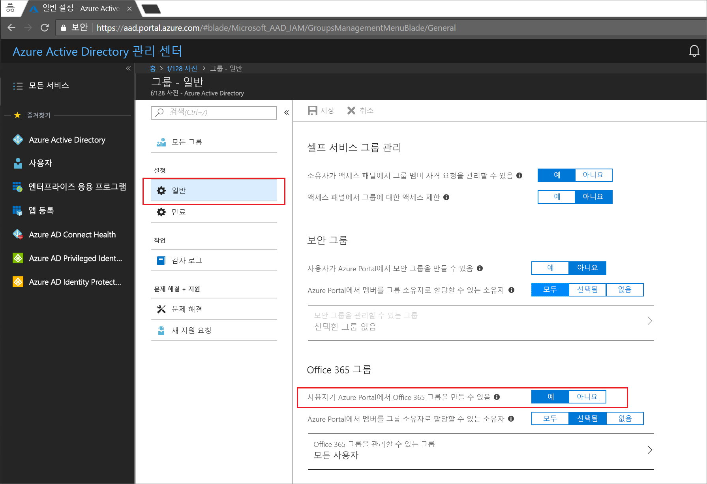
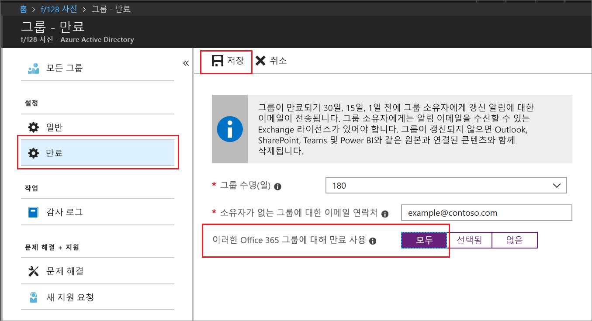

# 빠른 시작: Azure Active Directory에서 Office 365 그룹이 만료되도록 설정

이 빠른 시작에서는 Office 365 그룹에 대한 만료 정책을 설정합니다. 사용자가 자신의 그룹을 설정할 수 있는 경우 사용되지 않는 그룹이 증가할 수 있습니다. 사용되지 않은 그룹을 관리하는 한 가지 방법은 그룹이 만료되도록 설정하는 것입니다. 그러면 수동으로 그룹을 삭제해야 하는 유지 관리의 번거로움을 줄일 수 있습니다.

만료 정책은 간단합니다.

* 그룹 소유자에게는 곧 만료될 그룹을 갱신하라는 알림이 제공됩니다.
* 갱신하지 않은 그룹은 삭제됩니다.
* 삭제된 Office 365 그룹은 30일 내에 그룹 소유자 또는 Azure AD 관리자가 복원할 수 있습니다.

Azure 구독이 아직 없는 경우 시작하기 전에 [체험](https://azure.microsoft.com/free/) 계정을 만듭니다.

## 필수 요소

 그룹 만료 설정에 필요한 최소 권한 역할은 조직의 사용자 관리자입니다.

## 그룹에 대한 사용자 만들기 기능 켜기

1. 사용자 관리자 계정으로 [Azure Portal](https://portal.azure.com)에 로그인합니다.

2. **그룹**을 선택한 다음, **일반**을 선택합니다.
  
   

3. **사용자가 Office 365 그룹을 만들 수 있음**을 **예**로 설정합니다.

4. 모두 마쳤으면 **저장**을 선택하여 그룹 설정을 저장합니다.

## 그룹 만료 설정

1. [Azure Portal](https://portal.azure.com)에 로그인하고, **Azure Active Directory** > **그룹** > **만료**를 차례로 선택하여 만료 설정을 엽니다.
  
   

2. 만료 간격을 설정합니다. 미리 설정된 값을 선택하거나 31일보다 큰 사용자 지정 값을 입력합니다. 

3. 그룹에 소유자가 없는 경우 만료 알림을 전송할 이메일 주소를 입력합니다.

4. 이 빠른 시작에서는 **이러한 Office 365 그룹에 만료 사용**을 **모두**로 설정하겠습니다.

5. 모두 마쳤으면 **저장**을 선택하여 만료 설정을 저장합니다.

이것으로 끝입니다. 이 빠른 시작에서는 선택한 Office 365 그룹의 만료 정책을 설정했습니다.

## 리소스 정리

### 만료 정책을 제거하려면

1. 해당 테넌트의 글로벌 관리자인 계정으로 [Azure Portal](https://portal.azure.com)에 로그인합니다.
2. **Azure Active Directory** > **그룹** > **만료**를 선택합니다.
3. **이러한 Office 365 그룹에 만료 사용**을 **없음**으로 설정합니다.

### 그룹에 대한 사용자 만들기를 해제하려면

1. **Azure Active Directory** > **그룹** > **일반**을 선택합니다. 
2. **사용자가 Azure Portal에서 Office 365 그룹을 만들 수 있음**을 **아니요**로 설정합니다.

## 다음 단계

PowerShell 지침 및 기술 제약 조건을 포함한 만료에 대한 자세한 내용은 다음 문서를 참조하세요.

> [!div class="nextstepaction"]
> [만료 정책 PowerShell](groups-lifecycle.md)
