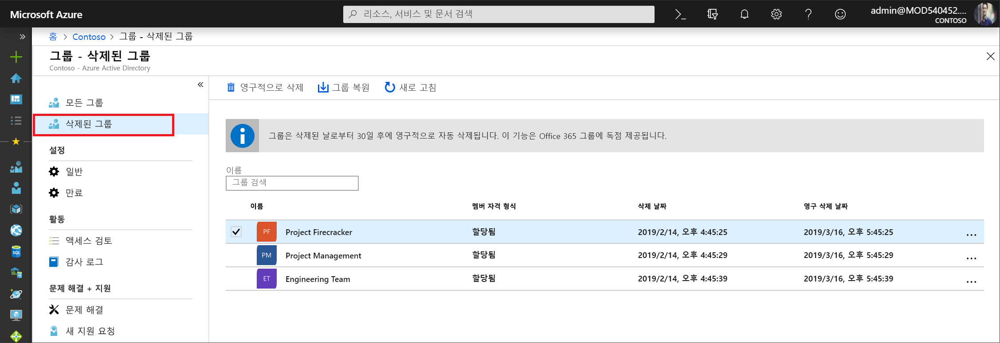

# <a name="restore-a-deleted-office-365-group-in-azure-active-directory"></a>Azure Active Directory에서 삭제된 Office 365 그룹 복원

Azure AD(Azure Active Directory)에서 Office 365 그룹을 삭제하는 경우 삭제된 그룹은 유지되지만 삭제일로부터 30일 동안 표시되지 않습니다. 이 동작에 따라 필요한 경우 그룹 및 해당 콘텐츠를 복원할 수 있습니다. 이 기능은 Azure AD의 Office 365 그룹에만 제한됩니다. 보안 그룹 및 배포 그룹에는 사용할 수 없습니다.

> [!NOTE]
> `Remove-MsolGroup`을 사용하면 그룹이 영구적으로 제거되므로 사용하지 않도록 합니다. 항상 `Remove-AzureADMSGroup`을 사용하여 Office 365 그룹을 삭제하세요.

그룹을 복원하는 데 필요한 사용 권한은 다음 중 하나일 수 있습니다.

역할 | 권한
--------- | ---------
글로벌 관리자, 파트너 계층 2 지원 및 Intune 관리자 | 모든 삭제된 Office 365 그룹을 복원할 수 있음
사용자 관리자 및 파트너 계층 1 지원 | 회사 관리자 역할에 할당된 그룹을 제외한 모든 삭제된 Office 365 그룹을 복원할 수 있음
사용자 | 소유한 Office 365 그룹 중 삭제된 모든 그룹을 복원할 수 있음

## <a name="view-and-manage-the-deleted-office-365-groups-that-are-available-to-restore"></a>복원할 수 있는 삭제된 Office 365 그룹 보기 및 관리

1. 사용자 관리자 계정을 사용하여 [Azure AD 관리 센터](https://aad.portal.azure.com)에 로그인합니다.

2. **그룹**을 선택한 다음, **삭제된 그룹**을 선택하여 복원할 수 있는 삭제된 그룹을 확인합니다.

    

3. **삭제된 그룹** 블레이드에서 다음을 수행할 수 있습니다.

   - **그룹 복원**을 선택하여 삭제된 그룹과 해당 내용을 복원합니다.
   - **영구적으로 삭제**를 선택하여 삭제된 그룹을 영구적으로 제거합니다. 그룹을 영구적으로 제거하려면 관리자여야 합니다.

## <a name="view-the-deleted-office-365-groups-that-are-available-to-restore-using-powershell"></a>Powershell을 사용하여 복원할 수 있는 삭제된 Office 365 그룹 보기
다음 cmdlet을 사용하여 관심 있는 그룹이 영구적으로 제거되었는지 확인하기 위해 삭제된 그룹을 볼 수 있습니다. 이러한 cmdlet은 [Azure AD PowerShell 모듈](https://www.powershellgallery.com/packages/AzureAD/)에 포함됩니다. 이 모듈에 대한 자세한 정보는 [Azure Active Directory PowerShell 버전 2](/powershell/azure/install-adv2?view=azureadps-2.0) 문서에서 찾을 수 있습니다.

1.  다음 cmdlet을 실행하여 여전히 복원할 수 있는 테넌트의 모든 삭제된 Office 365 그룹을 표시합니다.
   
    ```
    Get-AzureADMSDeletedGroup
    ```

2.  또는 특정 그룹의 objectID를 아는 경우(및 1단계의 cmdlet에서 가져올 수 있는 경우) 다음 cmdlet을 실행하여 삭제된 특정 그룹이 영구적으로 제거되었는지 확인합니다.

    ```
    Get-AzureADMSDeletedGroup –Id <objectId>
    ```

## <a name="how-to-restore-your-deleted-office-365-group-using-powershell"></a>Powershell을 사용하여 삭제된 Office 365 그룹을 복원하는 방법
그룹을 복원할 수 있는지 확인한 후 다음 단계 중 하나를 사용하여 삭제된 그룹을 복원합니다. 그룹에 문서, SP 사이트 또는 기타 영구 개체가 포함된 경우 그룹 및 해당 내용을 완전히 복원하는 데 최대 24시간이 걸릴 수 있습니다.

1. 다음 cmdlet을 실행하여 그룹 및 해당 내용을 복원합니다.
 
   ```
    Restore-AzureADMSDeletedDirectoryObject –Id <objectId>
    ``` 

2. 또는 다음 cmdlet을 실행하여 삭제된 그룹을 영구적으로 제거할 수 있습니다.
    
    ```
    Remove-AzureADMSDeletedDirectoryObject –Id <objectId>
    ```

## <a name="how-do-you-know-this-worked"></a>작동되었는지 어떻게 알 수 있습니까?

Office 365 그룹을 성공적으로 복원했는지 확인하려면 `Get-AzureADGroup –ObjectId <objectId>` cmdlet을 실행하여 그룹에 대한 정보를 표시합니다. 복원 후 요청이 완료됩니다.

- 그룹은 Exchange의 왼쪽 탐색 모음에 표시됩니다.
- 그룹에 대한 계획은 Planner에 표시됩니다.
- 모든 SharePoint 사이트와 모든 해당 콘텐츠를 사용할 수 있습니다.
- Office 365 그룹을 지원하는 Exchange 엔드포인트 및 다른 Office 365 워크로드 중 하나에서 그룹에 액세스할 수 있습니다.

## <a name="next-steps"></a>다음 단계
이러한 문서는 Azure Active Directory 그룹에 대한 추가 정보를 제공합니다.

* [기존 그룹 보기](../fundamentals/active-directory-groups-view-azure-portal.md)
* [그룹의 설정 관리](../fundamentals/active-directory-groups-settings-azure-portal.md)
* [그룹의 멤버 관리](../fundamentals/active-directory-groups-members-azure-portal.md)
* [그룹의 멤버 자격 관리](../fundamentals/active-directory-groups-membership-azure-portal.md)
* [그룹의 사용자에 대한 동적 규칙 관리](groups-dynamic-membership.md)
