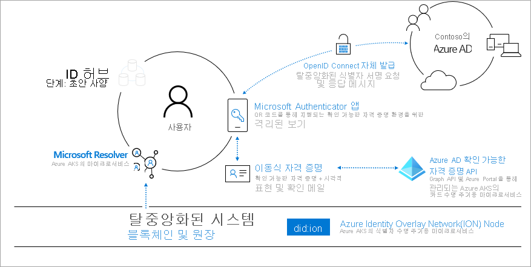
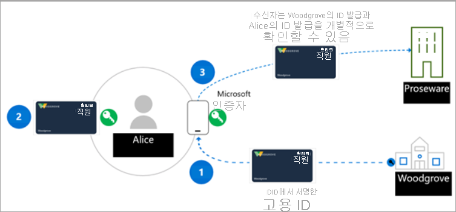

# <a name="introduction-to-azure-active-directory-verifiable-credentials-preview"></a>Azure Active Directory 확인 가능한 자격 증명 소개(미리 보기)

> [!IMPORTANT]
> Azure Active Directory 확인 가능한 자격 증명은 현재 공개 미리 보기로 제공됩니다.
> 이 미리 보기 버전은 서비스 수준 계약 없이 제공되며 프로덕션 워크로드에는 사용하지 않는 것이 좋습니다. 특정 기능이 지원되지 않거나 기능이 제한될 수 있습니다. 자세한 내용은 [Microsoft Azure Preview에 대한 추가 사용 약관](https://azure.microsoft.com/support/legal/preview-supplemental-terms/)을 참조하세요.

실생활과 디지털 생활에서 다양한 환경에 액세스하기 위해 앱, 서비스 및 디바이스에 연결하는 경우가 점점 더 늘어나고 있습니다. 이러한 디지털 혁신 덕분에 전에는 상상할 수 없던 방식으로 수백 곳의 회사나 수천 명의 다른 사용자와 상호 작용이 가능합니다.

하지만 보안 위반으로 인해 신원 데이터가 노출되는 경우가 너무 빈번합니다. 이러한 위반은 사회적, 직업적, 재정적 생활에 영향을 주어 사람들의 삶에 영향을 미칩니다. Microsoft에서는 더 나은 방법이 있다고 확신합니다. 모든 사람에게는 자신이 소유하고 통제하는 ID에 대해 디지털 ID의 요소를 안전하게 보관하고 프라이버시를 보호할 권한이 있습니다. 이 입문서에서는 개인 및 조직을 위해 신뢰할 수 있고 상호 운용 가능한 개방형 표준 기반 DID(탈중앙화 ID) 솔루션을 구축하기 위해 다양한 커뮤니티와 협력하는 방식을 설명합니다.

## <a name="why-we-need-decentralized-identity"></a>탈중앙화 ID가 필요한 이유

현재 디지털 ID는 직장과 집은 물론 우리가 사용하는 모든 앱, 서비스, 디바이스에 사용됩니다. 실생활에서 말하고 행동하고 경험하는 모든 것(이벤트용 티켓 구매, 호텔 체크인, 점심 식사 주문 등)을 구성하고 있습니다. 현재 우리의 ID와 모든 디지털 상호 작용은 다른 당사자가 소유 및 통제하고 있으며, 그 중 일부는 우리가 알지도 못합니다.

일반적으로 사용자는 여러 앱과 디바이스에 동의를 허락합니다. 이러한 방식은 누가 어떤 정보에 액세스 권한이 있는지 추적하기 위해 사용자 측에서 높은 수준의 경계가 필요합니다. 기업 측에서는, 소비자 및 파트너와의 협업을 위해 관련된 모든 사람의 개인 정보 및 보안을 유지하는 방식으로 데이터를 안전하게 교환하기 위한 하이 터치 오케스트레이션이 필요합니다.

표준 기반의 탈중앙화 ID 시스템을 통해 사용자와 조직이 자체 데이터를 더 잘 통제하고 앱, 디바이스 및 서비스 공급자를 위해 더 높은 수준의 보안과 신뢰를 제공할 수 있는 새로운 환경을 제공할 수 있습니다.

## <a name="lead-with-open-standards"></a>개방형 표준 주도

당사는 고객, 파트너, 커뮤니티와 긴밀하게 협력하면서 차세대 탈중앙화 ID 기반 환경을 구현하기 위해 최선을 다하고 있으며, 이 분야에서 놀라운 기여를 하고 있는 개인 및 조직과 협력하게 된 것을 기쁘게 생각합니다. DID 에코시스템이 성장하기 위해서는 표준, 기술 구성 요소, 코드 결과물이 오픈 소스여야 하며 누구나 액세스가 가능해야 합니다.

Microsoft는 DIF(Decentralized Identity Foundation), W3C Credentials Community Group 및 보다 광범위한 ID 커뮤니티의 멤버와 활발하게 협력하고 있습니다. 당사는 이러한 그룹과 협력하여 중요한 표준을 확인 및 개발하고 있으며 당사의 서비스에는 다음과 같은 표준이 구현되어 있습니다.

* [W3C 탈중앙화 식별자](https://www.w3.org/TR/did-core/)
* [W3C 확인 가능한 자격 증명](https://www.w3.org/TR/vc-data-model/)
* [DIF Sidetree](https://identity.foundation/sidetree/spec/)
* [DIF Well Known DID Configuration](https://identity.foundation/specs/did-configuration/)
* [DIF DID-SIOP](https://identity.foundation/did-siop/)
* [DIF Presentation Exchange](https://identity.foundation/presentation-exchange/)


## <a name="what-are-dids"></a>DID란?

DID를 이해하려면 먼저 현재 ID 시스템과 비교하는 것이 좋습니다. 이메일 주소와 소셜 네트워크 ID는 협업용으로 사용자에게 친숙한 별칭이지만, 협업을 능가하는 많은 시나리오에서 데이터 액세스를 위한 제어 지점 역할을 하기에는 이제 지나치게 부담스럽습니다. 이러한 ID에 대한 액세스 권한은 외부 당사자가 언제든지 제거할 수 있기 때문에 잠재적인 문제가 발생할 수 있습니다.

DID(탈중앙화 ID)는 다릅니다. DID는 사용자가 생성하고, 자체 소유하며, 전역적으로 고유한 식별자이며 ION과 같은 탈중앙화 시스템에 뿌리를 두고 있습니다. 여기에는 불변성 보장 강화, 검열 저항, 변조 어려움과 같은 독특한 특징이 있습니다. 이러한 특성은 자체 소유권 및 사용자 제어를 제공하려는 ID 시스템에 매우 중요합니다. 

Microsoft의 확인 가능한 자격 증명 솔루션은 신뢰 당사자(검증자) 자신이 확인 가능한 자격 증명의 소유자임을 증명하는 정보를 입증한다는 증거로 DID(탈중앙화 자격 증명)를 사용하여 암호화 방식으로 서명합니다. 따라서 Microsoft 제품을 기반으로 확인 가능한 자격 증명 솔루션을 만드는 사용자에게는 탈중앙화 식별자에 대한 기본적인 이해가 필요합니다.
## <a name="what-are-verifiable-credentials"></a>확인 가능한 자격 증명이란?

 ID는 매일 실생활에 사용됩니다. 운전 면허증은 자동차 운전 능력의 증거로 사용됩니다. 대학이 발급한 졸업장은 특정 수준의 교육에 도달했음을 증명합니다. 여권은 외국에 도착할 때 해당 국가에 자신이 누구인지 증명하는 데 사용됩니다. 데이터 모델은 인터넷을 통해 작업할 때 이러한 유형의 시나리오를 처리하는(단, 사용자의 개인 정보를 존중하는 안전한 방식으로) 방법을 설명합니다. 자세한 내용은 [확인 가능한 자격 증명 데이터 모델 1.0](https://www.w3.org/TR/vc-data-model/)을 참조하세요.

간단히 말해, 확인 가능한 자격 증명은 주체에 대한 정보를 입증하는 발급자가 만든 클레임으로 구성된 데이터 개체입니다. 이러한 클레임은 스키마로 식별되며 DID 발급자와 주체를 포함합니다. 발급자의 DID는 이런 정보를 입증한다는 증거로 디지털 서명을 만듭니다.


## <a name="how-does-decentralized-identity-work"></a>탈중앙화 ID 작동 원리

새로운 형태의 ID가 필요합니다. 자체 소유권 및 검열 저항과 같은 주요 ID 특성을 제공하기 위해 기술과 표준을 결합하는 ID가 필요합니다. 이러한 기능은 기존 시스템을 사용하여 구현하기 어렵습니다.

이러한 약속을 이행하기 위해 7가지 주요 혁신으로 구성된 기술 기반이 필요합니다. 한 가지 주요 혁신은 사용자가 소유한 식별자, 이러한 식별자와 연결된 키를 관리하는 사용자 에이전트, 암호화된 사용자 제어 데이터 저장소입니다.



**1. W3C DID(Decentralized Identifiers)** ID 사용자는 조직이나 정부와 독립적으로 생성, 소유 및 제어합니다. DID는 공개 키 자료, 인증 설명자, 서비스 엔드포인트를 포함하는 JSON 문서로 구성된 DPKI(Decentralized Public Key Infrastructure) 메타데이터에 연결된 전역적으로 고유한 식별자입니다.

**2. 탈중앙화 시스템: ION(Identity Overlay Network)** ION은 완전히 결정적인 Sidetree 프로토콜을 기반으로 하는 계층 2 개방형, 무허가성 네트워크이며, 여기에는 특별 토큰, 신뢰할 수 있는 검사기 또는 기타 합의 메커니즘이 필요하지 않습니다. 운영에 필요한 것은 비트코인 타임 체인의 선형적인 진행뿐입니다. ION 네트워크 작업을 앱 및 서비스에 쉽게 통합할 수 있는 [오픈 소스 npm 패키지](https://www.npmjs.com/package/@decentralized-identity/ion-tools)가 있습니다. 라이브러리에는 새 DID 생성, 키 생성 및 비트코인 블록체인에 DID 고정이 포함됩니다. 

**3. DID 사용자 에이전트/월렛: Microsoft Authenticator 앱** 실제 사람들이 탈중앙화 ID 및 확인 가능한 자격 증명을 사용할 수 있도록 합니다. Authenticator는 DID를 만들고, 확인 가능한 자격 증명에 대한 발급 및 프레젠테이션 요청을 용이하게 하며, 암호화된 월렛 파일을 통해 DID 시드 백업을 관리합니다.

**4. Microsoft Resolver** ION 노드에 연결하여 ```did:ion``` 메서드를 사용하여 DID를 조회 및 확인하고 DDO(DID 문서 개체)를 반환하는 API입니다. DDO에는 DID와 연결된 DPKI 메타데이터(예: 공개 키 및 서비스 엔드포인트)가 포함됩니다. 

**5. Azure Active Directory 확인 가능한 자격 증명 서비스** ```did:ion``` 메서드로 서명된 [W3C Verifiable Credentials](https://www.w3.org/TR/vc-data-model/)용 오픈 소스 SDK와 발급 및 확인 API입니다. 이를 통해 ID 소유자는 클레임을 생성, 제시 및 확인할 수 있습니다. 이것은 시스템 사용자 간에 신뢰의 기초를 형성합니다.

## <a name="a-sample-scenario"></a>샘플 시나리오

VC 작동 원리를 설명하는 데 사용하는 시나리오에는 다음이 포함됩니다.

- Woodgrove Inc.라는 회사
- Woodgrove 직원 할인을 제공하는 Proseware라는 회사
- Proseware에서 할인을 받으려는 Woodgrove, Inc.의 직원인 Alice


오늘 Alice는 Woodgrove의 네트워크 환경에 로그인하기 위해 사용자 이름과 암호를 제공합니다. Woodgrove는 Alice가 Woodgrove의 직원임을 증명할 수 있는 보다 관리하기 쉬운 방법을 제공하기 위해 VC 솔루션을 배포하고 있습니다. Proseware는 Woodgrove의 VC 솔루션과 호환되는 VC 솔루션을 사용하고 있으며, Woodgrove에서 발급한 자격 증명을 고용 증명으로 허용합니다.

자격 증명 발급자인 Woodgrove Inc.는 공개 키와 프라이빗 키를 만듭니다. 공개 키는 ION에 저장됩니다. 키가 인프라에 추가되면 항목은 블록체인 기반 탈중앙화 원장에 기록됩니다. 발급자는 Alice에게 월렛 애플리케이션에 저장된 프라이빗 키를 제공합니다. Alice가 프라이빗 키를 성공적으로 사용할 때마다 트랜잭션이 월렛 애플리케이션에 기록됩니다.


## <a name="roles-in-a-verifiable-credential-solution"></a>확인 가능한 자격 증명 솔루션의 역할 

확인 가능한 자격 증명 솔루션에는 세 가지 주요 행위자가 있습니다. 다음 다이어그램에서:

- **1단계**, **사용자** 는 발급자에게 확인 가능한 자격 증명을 요청합니다.
- **2단계**, 자격 증명 **발급자** 는 사용자가 제공한 증거가 정확함을 입증하고 DID로 서명된 확인 가능한 자격 증명을 만들고 사용자의 DID가 주체입니다.
- **3단계에서**, 사용자는 자신의 DID로 VP(확인 가능한 프레젠테이션)에 서명하여 **검증자** 에게 보냅니다. 그런 다음, 검증자는 DPKI에 있는 공개 키와 매칭하여 자격 증명의 유효성을 검사합니다.

이 시나리오의 역할은 다음과 같습니다.



**발급자** – 발급자는 사용자에게 정보를 요청하는 발급 솔루션을 만드는 조직입니다. 이 정보는 사용자의 ID를 확인하는 데 사용됩니다. 예를 들어 Woodgrove, Inc.에는 VC(확인 가능한 자격 증명)를 만들고 모든 직원에게 배포할 수 있는 발급 솔루션이 있습니다. 직원은 Authenticator 앱을 사용하여 사용자 이름과 암호로 로그인하며, ID 토큰이 발급 서비스에 전달됩니다. Woodgrove, Inc.에서 제출된 ID 토큰의 유효성이 검사된 후, 발급 솔루션은 직원에 대한 클레임이 포함되고 Woodgrove, Inc. DID로 서명된 VC를 만듭니다. 이제 직원은 고용주가 서명한 확인 가능한 자격 증명을 갖게 되며 여기에는 직원 DID가 주제 DID로 포함됩니다.  

**사용자** – 사용자는 VC를 요청하는 개인 또는 엔터티입니다. 예를 들어 Alice는 Woodgrove, Inc.의 신입 사원이며 이전에 고용 증명의 확인 가능한 자격 증명을 발급받았습니다. Proseware에서 할인을 받기 위해 Alice가 고용 증명을 제공해야 하는 경우, Alice가 DID의 소유자임을 증명하는 확인 가능한 프레젠테이션에 서명하여 Authenticator 앱에서 자격 증명에 대한 액세스 권한을 부여할 수 있습니다. Proseware는 자격 증명이 Woodgrove, Inc.에서 발급되었고 Alice가 자격 증명의 소유자인것을 확인할 수 있습니다. 

**검증자** – 검증자는 신뢰할 수 있는 발급자 하나 이상의 클레임을 검증해야 하는 회사 또는 엔터티입니다. 예를 들어 Proseware는 Woodgrove, Inc.가 직원의 ID를 확인하며 확실하고 유효한 VC를 발급하는 합당한 작업을 수행한다고 신뢰합니다. Alice가 업무에 필요한 장비를 주문하려고 하면, Proseware는 SIOP 및 Presentation Exchange와 같은 개방형 표준을 사용하여 사용자가 Woodgrove, Inc.의 직원임을 증명하는 자격 증명을 요청합니다. 예를 들어 Proseware는 Alice에게 휴대폰 카메라로 스캔할 QR 코드가 있는 웹 사이트 링크를 제공할 수 있습니다. 이를 통해 특정 VC에 대한 요청이 시작되며, Authenticator는 분석 후 Alice에게 Proseware에 고용된 것을 증명하는 요청을 승인할 수 있는 권한을 부여합니다. Proseware는 확인 가능한 자격 증명 서비스 API 또는 SDK를 사용하여 확인 가능한 프레젠테이션의 신뢰성을 확인할 수 있습니다. Alice가 제공한 정보를 기반으로 Alice에게 할인을 제공합니다. Woodgrove, Inc.가 자사 직원에게 VC를 발급한다는 사실을 다른 회사와 조직이 아는 경우에는 그들도 검증자 솔루션을 만들고 Woodgrove, Inc. 확인 가능한 자격 증명을 사용하여 Woodgrove, Inc. 직원을 위한 특별 제안을 제공할 수 있습니다.

## <a name="next-steps"></a>다음 단계

DID 및 확인 가능한 자격 증명에 대해 알아보았으면, 시작 문서 또는 확인 가능한 자격 증명 개념에 대한 자세한 내용을 제공하는 문서 중 하나를 참고하여 직접 시도해보십시오.

- [확인 가능한 자격 증명 시작](get-started-verifiable-credentials.md)
- [자격 증명을 사용자 지정하는 방법](credential-design.md)
- [확인 가능한 자격 증명 FAQ](verifiable-credentials-faq.md)