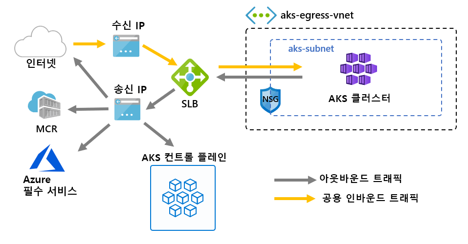

# <a name="customize-cluster-egress-with-a-user-defined-route-preview"></a>사용자 정의 경로를 사용 하 여 클러스터 송신 사용자 지정 (미리 보기)

AKS 클러스터에서 송신은 특정 시나리오에 맞게 사용자 지정할 수 있습니다. 기본적으로 AKS는 설정 하 고 송신에 사용할 표준 SKU Load Balancer를 프로 비전 합니다. 그러나 공용 Ip가 허용 되지 않거나 송신에 대 한 추가 홉이 필요한 경우에는 기본 설정이 모든 시나리오의 요구 사항을 충족 하지 못할 수 있습니다.

이 문서에서는 공용 Ip를 허용 하지 않고 클러스터가 NVA (네트워크 가상 어플라이언스) 뒤에 있어야 하는 경우와 같은 사용자 지정 네트워크 시나리오를 지원 하기 위해 클러스터의 송신 경로를 사용자 지정 하는 방법을 안내 합니다.

> [!IMPORTANT]
> AKS 미리 보기 기능은 셀프 서비스 이며 옵트인 기반으로 제공 됩니다. 미리 *보기는 그대로 제공* 되며 *사용 가능* 하 고 SLA (서비스 수준 계약) 및 제한 된 보증에서 제외 됩니다. AKS 미리 보기는 *최상의 노력* 을 기반으로 고객 지원을 통해 부분적으로 검사 됩니다. 따라서이 기능은 프로덕션 용도로 사용 되지 않습니다. 자세한 내용은 다음 지원 문서를 참조 하세요.
>
> * [AKS 지원 정책](support-policies.md)
> * [Azure 지원 FAQ](faq.md)

## <a name="prerequisites"></a>사전 요구 사항
* Azure CLI 버전 2.0.81 이상
* Azure CLI Preview 확장 버전 0.4.28 이상
* `2020-01-01` 이상의 API 버전

## <a name="install-the-latest-azure-cli-aks-preview-extension"></a>최신 Azure CLI AKS Preview 확장을 설치 합니다.
클러스터의 아웃 바운드 유형을 설정 하려면 Azure CLI AKS Preview 확장 버전 0.4.18 이상이 필요 합니다. Az extension add 명령을 사용 하 여 Azure CLI AKS Preview 확장을 설치 하 고 다음 az extension update 명령을 사용 하 여 사용 가능한 업데이트를 확인 합니다.

```azure-cli
# Install the aks-preview extension
az extension add --name aks-preview

# Update the extension to make sure you have the latest version installed
az extension update --name aks-preview
```

## <a name="limitations"></a>제한 사항
* 미리 보기 중에는 클러스터를 만들 때에만 `outboundType`을 정의할 수 있으며 나중에 업데이트할 수 없습니다.
* 미리 보기 중에 `outboundType` AKS 클러스터는 Azure CNI를 사용 해야 합니다. Kubenet 구성 가능, 사용에는 AKS 서브넷에 대 한 경로 테이블의 수동 연결이 필요 합니다.
* `outboundType`를 설정 하려면 `Standard`의 `VirtualMachineScaleSets` 및 `load-balancer-sku` `vm-set-type` 있는 AKS 클러스터가 필요 합니다.
* `outboundType`를 `UDR` 값으로 설정 하려면 클러스터에 대 한 유효한 아웃 바운드 연결을 사용 하는 사용자 정의 경로가 필요 합니다.
* `outboundType`를 `UDR` 값으로 설정 하면 부하 분산 장치로 라우팅되는 수신 원본 IP가 클러스터의 나가는 송신 대상 주소 **와 일치 하지** 않을 수 있습니다.

## <a name="overview-of-outbound-types-in-aks"></a>AKS의 아웃 바운드 형식 개요

AKS 클러스터는 부하 분산 장치 또는 사용자 정의 라우팅 형식의 고유한 `outboundType`를 사용 하 여 사용자 지정할 수 있습니다.

> [!IMPORTANT]
> 아웃 바운드 유형은 클러스터의 송신 트래픽에만 영향을 줍니다. 자세한 내용은 [수신 컨트롤러 설정](ingress-basic.md) 을 참조 하세요.

### <a name="outbound-type-of-loadbalancer"></a>LoadBalancer의 아웃 바운드 유형

`loadBalancer` 설정 된 경우 AKS는 다음 설치를 자동으로 완료 합니다. 부하 분산 장치는 AKS 할당 된 공용 IP를 통해 송신 하는 데 사용 됩니다. 아웃 바운드 형식의 `loadBalancer`는 AKS 리소스 공급자에서 만든 부하 분산 장치에서 송신 하는 것으로 간주 되는 `loadBalancer`형식의 Kubernetes 서비스를 지원 합니다.

AKS에 의해 다음과 같은 설정이 수행 됩니다.
   * 공용 IP 주소는 클러스터 송신을 위해 프로 비전 됩니다.
   * 공용 IP 주소는 부하 분산 장치 리소스에 할당 됩니다.
   * 부하 분산 장치의 백 엔드 풀은 클러스터의 에이전트 노드에 대해 설정 됩니다.

다음은 기본적으로 AKS 클러스터에 배포 된 네트워크 토폴로지에서, `loadBalancer``outboundType`을 사용 합니다.



### <a name="outbound-type-of-userdefinedrouting"></a>UserDefinedRouting의 아웃 바운드 유형

> [!NOTE]
> 아웃 바운드 유형 사용은 고급 네트워킹 시나리오 이며 적절 한 네트워크 구성이 필요 합니다.

`userDefinedRouting` 설정 된 경우 AKS는 자동으로 송신 경로를 구성 하지 않습니다. **사용자**가 다음을 수행 해야 합니다.

클러스터는 구성 된 서브넷을 사용 하 여 기존 가상 네트워크에 배포 해야 합니다. 유효한 UDR (사용자 정의 경로)가 아웃 바운드 연결을 사용 하는 서브넷에 있어야 합니다.

AKS 리소스 공급자는 SLB (표준 부하 분산 장치)를 배포 합니다. 부하 분산 장치는 규칙을 사용 하 여 구성 되지 않으며 [규칙이 배치 될 때까지 요금이 부과 되지](https://azure.microsoft.com/pricing/details/load-balancer/)않습니다. AKS는 SLB 프런트 엔드에 대 한 공용 IP 주소를 자동으로 프로 비전 **하지 않습니다** . AKS는 부하 분산 장치 백 엔드 풀을 자동으로 구성 **하지 않습니다** .

## <a name="deploy-a-cluster-with-outbound-type-of-udr-and-azure-firewall"></a>아웃 바운드 형식의 UDR 및 Azure 방화벽을 사용 하 여 클러스터 배포

사용자 정의 경로를 사용 하 여 아웃 바운드 유형의 클러스터 응용 프로그램을 설명 하기 위해 Azure 방화벽을 사용 하 여 피어 링 가상 네트워크에서 클러스터를 구성할 수 있습니다.


* 수신이 방화벽 필터를 통해 강제 전달 됨
   * 격리 된 서브넷은 에이전트 노드로 라우팅하기 위한 내부 부하 분산 장치를 보유 합니다.
   * 에이전트 노드가 전용 서브넷에서 격리 됨
* 아웃 바운드 요청은 사용자 정의 경로를 사용 하 여 에이전트 노드에서 Azure 방화벽 내부 IP로 시작 합니다.
   * AKS agent 노드의 요청은 AKS 클러스터가 배포 된 서브넷에 배치 된 UDR을 따릅니다.
   * 공용 IP 프런트 엔드에서 가상 네트워크에서 egresses 하는 Azure 방화벽
   * AKS 제어 평면에 대 한 액세스는 방화벽 프런트 엔드 IP 주소를 사용 하도록 설정 된 NSG에 의해 보호 됩니다.
   * 방화벽 프런트 엔드 IP 주소에서 들어오고 나가는 공용 인터넷 또는 기타 Azure 서비스에 대 한 액세스

### <a name="set-configuration-via-environment-variables"></a>환경 변수를 통해 구성 설정

리소스 만들기에 사용할 환경 변수 집합을 정의 합니다.

```bash
PREFIX="contosofin"
RG="${PREFIX}-rg"
LOC="eastus"
NAME="${PREFIX}outboundudr"
AKS_NAME="${PREFIX}aks"
VNET_NAME="${PREFIX}vnet"
AKSSUBNET_NAME="${PREFIX}akssubnet"
SVCSUBNET_NAME="${PREFIX}svcsubnet"
# DO NOT CHANGE FWSUBNET_NAME - This is currently a requirement for Azure Firewall.
FWSUBNET_NAME="AzureFirewallSubnet"
FWNAME="${PREFIX}fw"
FWPUBLICIP_NAME="${PREFIX}fwpublicip"
FWIPCONFIG_NAME="${PREFIX}fwconfig"
FWROUTE_TABLE_NAME="${PREFIX}fwrt"
FWROUTE_NAME="${PREFIX}fwrn"
FWROUTE_NAME_INTERNET="${PREFIX}fwinternet"
DEVSUBNET_NAME="${PREFIX}dev"
```

그런 다음 구독 Id를 설정 합니다.

```azure-cli
# Get ARM Access Token and Subscription ID - This will be used for AuthN later.

ACCESS_TOKEN=$(az account get-access-token -o tsv --query 'accessToken')

# NOTE: Update Subscription Name
# Set Default Azure Subscription to be Used via Subscription ID

az account set -s <SUBSCRIPTION_ID_GOES_HERE>

# NOTE: Update Subscription Name for setting SUBID

SUBID=$(az account show -s '<SUBSCRIPTION_NAME_GOES_HERE>' -o tsv --query 'id')
```

## <a name="create-a-virtual-network-with-multiple-subnets"></a>여러 서브넷이 있는 가상 네트워크 만들기

클러스터에 대해 하나씩, 방화벽에 대해 하나, 서비스를 수신 하기 위해 하나씩, 3 개의 개별 서브넷을 사용 하 여 가상 네트워크를 프로 비전 합니다.


모든 리소스를 저장할 리소스 그룹을 만듭니다.

```azure-cli
# Create Resource Group

az group create --name $RG --location $LOC
```

AKS 클러스터와 Azure 방화벽을 호스트 하는 두 개의 가상 네트워크를 만듭니다. 각에는 자체 서브넷이 있습니다. AKS 네트워크부터 시작 해 보겠습니다.

```
# Dedicated virtual network with AKS subnet

az network vnet create \
    --resource-group $RG \
    --name $VNET_NAME \
    --address-prefixes 100.64.0.0/16 \
    --subnet-name $AKSSUBNET_NAME \
    --subnet-prefix 100.64.1.0/24

# Dedicated subnet for K8s services

az network vnet subnet create \
    --resource-group $RG \
    --vnet-name $VNET_NAME \
    --name $SVCSUBNET_NAME \
    --address-prefix 100.64.2.0/24

# Dedicated subnet for Azure Firewall (Firewall name cannot be changed)

az network vnet subnet create \
    --resource-group $RG \
    --vnet-name $VNET_NAME \
    --name $FWSUBNET_NAME \
    --address-prefix 100.64.3.0/24
```

## <a name="create-and-setup-an-azure-firewall-with-a-udr"></a>UDR을 사용 하 여 Azure 방화벽 만들기 및 설정

Azure 방화벽 인바운드 및 아웃 바운드 규칙을 구성 해야 합니다. 방화벽의 주요 목적은 조직에서 AKS 클러스터에 대 한 세분화 된 수신 및 송신 트래픽 규칙을 설정 및 외부로 설정 하는 것입니다.


Azure 방화벽 프런트 엔드 주소로 사용 되는 표준 SKU 공용 IP 리소스를 만듭니다.

```azure-cli
az network public-ip create -g $RG -n $FWPUBLICIP_NAME -l $LOC --sku "Standard"
```

Preview cli-확장을 등록 하 여 Azure 방화벽을 만듭니다.
```azure-cli
# Install Azure Firewall preview CLI extension

az extension add --name azure-firewall

# Deploy Azure Firewall

az network firewall create -g $RG -n $FWNAME -l $LOC
```

이제 이전에 만든 IP 주소를 방화벽 프런트 엔드에 할당할 수 있습니다.
> [!NOTE]
> Azure 방화벽에 대 한 공용 IP 주소를 설정 하는 데 몇 분 정도 걸릴 수 있습니다.
> 
> 아래 명령에서 오류를 반복적으로 받은 경우 기존 방화벽과 공용 IP를 삭제 하 고 동시에 포털을 통해 공용 IP 및 Azure 방화벽을 프로 비전 합니다.

```azure-cli
# Configure Firewall IP Config

az network firewall ip-config create -g $RG -f $FWNAME -n $FWIPCONFIG_NAME --public-ip-address $FWPUBLICIP_NAME --vnet-name $VNET_NAME
```

이전 명령이 성공한 경우 나중에 구성에 대 한 방화벽 프런트 엔드 IP 주소를 저장 합니다.

```bash
# Capture Firewall IP Address for Later Use

FWPUBLIC_IP=$(az network public-ip show -g $RG -n $FWPUBLICIP_NAME --query "ipAddress" -o tsv)
FWPRIVATE_IP=$(az network firewall show -g $RG -n $FWNAME --query "ipConfigurations[0].privateIpAddress" -o tsv)
```

### <a name="create-a-udr-with-a-hop-to-azure-firewall"></a>홉을 사용 하 여 Azure 방화벽에 대 한 UDR 만들기

Azure는 Azure 서브넷, 가상 네트워크 및 온-프레미스 네트워크 간에 트래픽을 자동으로 라우트합니다. Azure의 기본 라우팅 중 하나를 변경하려면 경로 테이블을 만듭니다.

지정 된 서브넷과 연결할 빈 경로 테이블을 만듭니다. 경로 테이블은 위에서 만든 Azure 방화벽으로 다음 홉을 정의 합니다. 각 서브넷에는 0 또는 하나의 경로 테이블이 연결될 수 있습니다.

```azure-cli
# Create UDR and add a route for Azure Firewall

az network route-table create -g $RG --name $FWROUTE_TABLE_NAME
az network route-table route create -g $RG --name $FWROUTE_NAME --route-table-name $FWROUTE_TABLE_NAME --address-prefix 0.0.0.0/0 --next-hop-type VirtualAppliance --next-hop-ip-address $FWPRIVATE_IP --subscription $SUBID
az network route-table route create -g $RG --name $FWROUTE_NAME_INTERNET --route-table-name $FWROUTE_TABLE_NAME --address-prefix $FWPUBLIC_IP/32 --next-hop-type Internet
```

Azure의 기본 시스템 경로를 재정의 하거나 서브넷의 경로 테이블에 추가 경로를 추가 하는 방법에 대 한 [가상 네트워크 경로 테이블 설명서](../virtual-network/virtual-networks-udr-overview.md#user-defined) 를 참조 하세요.

## <a name="adding-network-firewall-rules"></a>네트워크 방화벽 규칙 추가

> [!WARNING]
> 다음은 방화벽 규칙을 추가 하는 한 가지 예입니다. AKS 클러스터가 작동 하려면 [필요한 송신 끝점](egress.md) 에 정의 된 모든 송신 끝점을 응용 프로그램 방화벽 규칙에서 사용 하도록 설정 해야 합니다. 이러한 끝점을 사용 하도록 설정 하지 않으면 클러스터가 작동 하지 않습니다.

네트워크 및 응용 프로그램 규칙의 예는 다음과 같습니다. 모든 프로토콜, 원본 주소, 대상 주소 및 대상 포트를 허용 하는 네트워크 규칙을 추가 합니다. 또한 AKS에 필요한 **일부** 끝점에 대 한 응용 프로그램 규칙도 추가 합니다.

프로덕션 시나리오에서는 응용 프로그램에 대 한 필수 끝점과 [AKS 필요 송신](egress.md)에 정의 된 끝점에만 액세스를 사용 하도록 설정 해야 합니다.

```
# Add Network FW Rules

az network firewall network-rule create -g $RG -f $FWNAME --collection-name 'aksfwnr' -n 'netrules' --protocols 'Any' --source-addresses '*' --destination-addresses '*' --destination-ports '*' --action allow --priority 100

# Add Application FW Rules
# IMPORTANT: Add AKS required egress endpoints

az network firewall application-rule create -g $RG -f $FWNAME \
    --collection-name 'AKS_Global_Required' \
    --action allow \
    --priority 100 \
    -n 'required' \
    --source-addresses '*' \
    --protocols 'http=80' 'https=443' \
    --target-fqdns \
        'aksrepos.azurecr.io' \
        '*blob.core.windows.net' \
        'mcr.microsoft.com' \
        '*cdn.mscr.io' \
        '*.data.mcr.microsoft.com' \
        'management.azure.com' \
        'login.microsoftonline.com' \
        'ntp.ubuntu.com' \
        'packages.microsoft.com' \
        'acs-mirror.azureedge.net'
```

Azure 방화벽 서비스에 대해 자세히 알아보려면 [Azure 방화벽 설명서](https://docs.microsoft.com/azure/firewall/overview) 를 참조 하세요.

## <a name="associate-the-route-table-to-aks"></a>AKS에 경로 테이블 연결

클러스터를 방화벽과 연결 하려면 클러스터의 서브넷에 대 한 전용 서브넷이 위에서 만든 경로 테이블을 참조 해야 합니다. 클러스터와 방화벽을 모두 보유 하는 가상 네트워크에 대 한 명령을 실행 하 여 클러스터의 서브넷에 대 한 경로 테이블을 업데이트 하 여 연결을 수행할 수 있습니다.

```azure-cli
# Associate route table with next hop to Firewall to the AKS subnet

az network vnet subnet update -g $RG --vnet-name $VNET_NAME --name $AKSSUBNET_NAME --route-table $FWROUTE_TABLE_NAME
```

## <a name="deploy-aks-with-outbound-type-of-udr-to-the-existing-network"></a>아웃 바운드 형식의 UDR을 사용 하 여 기존 네트워크에 AKS 배포

이제 기존 가상 네트워크 설정에 AKS 클러스터를 배포할 수 있습니다. 클러스터 아웃 바운드 유형을 사용자 정의 라우팅으로 설정 하기 위해 기존 서브넷을 AKS에 제공 해야 합니다.


### <a name="create-a-service-principal-with-access-to-provision-inside-the-existing-virtual-network"></a>기존 가상 네트워크 내에서 프로 비전 할 수 있는 액세스 권한이 있는 서비스 주체 만들기

AKS에서 서비스 주체를 사용 하 여 클러스터 리소스를 만듭니다. 만든 시간에 전달 된 서비스 주체는 AKS에서 사용 하는 Vm, 저장소 및 부하 분산 장치와 같은 기본 AKS 리소스를 만드는 데 사용 됩니다. 너무 적은 사용 권한을 부여 하는 경우 AKS 클러스터를 프로 비전 할 수 없습니다.

```azure-cli
# Create SP and Assign Permission to Virtual Network

az ad sp create-for-rbac -n "${PREFIX}sp" --skip-assignment
```

이제 이전 명령 출력에 의해 자동으로 생성 된 서비스 사용자 appid 및 서비스 주체 암호를 사용 하 여 `APPID` 및 `PASSWORD`를 바꿉니다. AKS에서 리소스를 배포할 수 있도록 서비스 주체에 대 한 사용 권한을 부여 하는 VNET 리소스 ID를 참조 합니다.

```azure-cli
APPID="<SERVICE_PRINCIPAL_APPID_GOES_HERE>"
PASSWORD="<SERVICEPRINCIPAL_PASSWORD_GOES_HERE>"
VNETID=$(az network vnet show -g $RG --name $VNET_NAME --query id -o tsv)

# Assign SP Permission to VNET

az role assignment create --assignee $APPID --scope $VNETID --role Contributor

# View Role Assignment
az role assignment list --assignee $APPID --all -o table
```

### <a name="deploy-aks"></a>AKS 배포

마지막으로, AKS 클러스터를 클러스터 전용의 기존 서브넷에 배포할 수 있습니다. 에 배포할 대상 서브넷은 환경 변수 `$SUBNETID`로 정의 됩니다.

서브넷에 존재 하는 UDR을 따르도록 아웃 바운드 형식을 정의 하 고, AKS에서 부하 분산 장치에 대 한 설정 및 IP 프로 비전을 건너뛸 수 있도록 허용 합니다.

Api [server 권한이 부여 된 IP 범위](api-server-authorized-ip-ranges.md) 에 대 한 AKS 기능을 추가 하 여 api 서버 액세스를 방화벽의 공용 끝점 으로만 제한할 수 있습니다. 권한 있는 IP 범위 기능은 다이어그램에서 제어 평면에 액세스 하기 위해 전달 해야 하는 NSG로 표시 됩니다. 권한 있는 IP 범위 기능을 사용 하도록 설정 하 여 API 서버 액세스를 제한 하는 경우 개발자 도구는 방화벽의 가상 네트워크에서 jumpbox을 사용 하거나 모든 개발자 끝점을 권한 있는 IP 범위에 추가 해야 합니다.

> [!TIP]
> (개인 클러스터) []와 같은 클러스터 배포에 추가 기능을 추가할 수 있습니다. 권한 있는 IP 범위를 사용 하는 경우 API 서버에 액세스 하기 위해 클러스터 네트워크 내에 jumpbox가 필요 합니다.

```azure-cli
az aks create -g $RG -n $AKS_NAME -l $LOC \
  --node-count 3 \
  --network-plugin azure --generate-ssh-keys \
  --service-cidr 192.168.0.0/16 \
  --dns-service-ip 192.168.0.10 \
  --docker-bridge-address 172.22.0.1/29 \
  --vnet-subnet-id $SUBNETID \
  --service-principal $APPID \
  --client-secret $PASSWORD \
  --load-balancer-sku standard \
  --outbound-type userDefinedRouting \
  --api-server-authorized-ip-ranges $FWPUBLIC_IP
  ```

### <a name="enable-developer-access-to-the-api-server"></a>API 서버에 대 한 개발자 액세스 사용

클러스터에 대 한 권한 있는 IP 범위 설정으로 인해 API 서버에 액세스 하기 위해 승인 된 IP 범위의 AKS 클러스터 목록에 개발자 도구 IP 주소를 추가 해야 합니다. 또 다른 옵션은 방화벽의 가상 네트워크에서 별도의 서브넷 내에 필요한 도구를 사용 하 여 jumpbox을 구성 하는 것입니다.

다음 명령을 사용 하 여 승인 된 범위에 다른 IP 주소를 추가 합니다.

```bash
# Retrieve your IP address
CURRENT_IP=$(dig @resolver1.opendns.com ANY myip.opendns.com +short)

# Add to AKS approved list
az aks update -g $RG -n $AKS_NAME --api-server-authorized-ip-ranges $CURRENT_IP/32

```

### <a name="setup-the-internal-load-balancer"></a>내부 부하 분산 장치 설정

AKS가 [내부 부하 분산](internal-lb.md)장치로 설정할 수 있는 클러스터를 사용 하 여 부하 분산 장치를 배포 했습니다.

내부 부하 분산 장치를 만들려면 다음 예제와 같이 서비스 유형 LoadBalancer 및 azure-부하 분산 장치-내부 주석을 사용 하 여 internal-lb. yaml 이라는 서비스 매니페스트를 만듭니다.

```yaml
apiVersion: v1
kind: Service
metadata:
  name: internal-app
  annotations:
    service.beta.kubernetes.io/azure-load-balancer-internal: "true"
    service.beta.kubernetes.io/azure-load-balancer-internal-subnet: "contosofinsvcsubnet"
spec:
  type: LoadBalancer
  ports:
  - port: 80
  selector:
    app: internal-app
```

Kubectl apply를 사용 하 여 내부 부하 분산 장치를 배포 하 고 YAML 매니페스트의 이름을 지정 합니다.

```bash
kubectl apply -f internal-lb.yaml
```

## <a name="deploy-a-kubernetes-service"></a>Kubernetes 서비스 배포

클러스터 아웃 바운드 형식이 UDR로 설정 되어 있기 때문에 부하 분산 장치에 대 한 백 엔드 풀과 에이전트 노드를 연결 하는 것은 클러스터를 만들 때 AKS에서 자동으로 완료 되지 않습니다. 그러나 백 엔드 풀 연결은 Kubernetes 서비스가 배포 될 때 Kubernetes Azure 클라우드 공급자에 의해 처리 됩니다.

다음 yaml을 `example.yaml`이라는 파일로 복사 하 여 Azure 투표 앱 응용 프로그램을 배포 합니다.

```yaml
apiVersion: apps/v1
kind: Deployment
metadata:
  name: azure-vote-back
spec:
  replicas: 1
  selector:
    matchLabels:
      app: azure-vote-back
  template:
    metadata:
      labels:
        app: azure-vote-back
    spec:
      nodeSelector:
        "beta.kubernetes.io/os": linux
      containers:
      - name: azure-vote-back
        image: redis
        resources:
          requests:
            cpu: 100m
            memory: 128Mi
          limits:
            cpu: 250m
            memory: 256Mi
        ports:
        - containerPort: 6379
          name: redis
---
apiVersion: v1
kind: Service
metadata:
  name: azure-vote-back
spec:
  ports:
  - port: 6379
  selector:
    app: azure-vote-back
---
apiVersion: apps/v1
kind: Deployment
metadata:
  name: azure-vote-front
spec:
  replicas: 1
  selector:
    matchLabels:
      app: azure-vote-front
  template:
    metadata:
      labels:
        app: azure-vote-front
    spec:
      nodeSelector:
        "beta.kubernetes.io/os": linux
      containers:
      - name: azure-vote-front
        image: microsoft/azure-vote-front:v1
        resources:
          requests:
            cpu: 100m
            memory: 128Mi
          limits:
            cpu: 250m
            memory: 256Mi
        ports:
        - containerPort: 80
        env:
        - name: REDIS
          value: "azure-vote-back"
---
apiVersion: v1
kind: Service
metadata:
  name: azure-vote-front
  annotations:
    service.beta.kubernetes.io/azure-load-balancer-internal: "true"
    service.beta.kubernetes.io/azure-load-balancer-internal-subnet: "contosofinsvcsubnet"
spec:
  type: LoadBalancer
  ports:
  - port: 80
  selector:
    app: azure-vote-front
```

다음을 실행 하 여 서비스를 배포 합니다.

```bash
kubectl apply -f example.yaml
```

## <a name="add-a-dnat-rule-to-azure-firewall"></a>Azure 방화벽에 DNAT 규칙 추가

인바운드 연결을 구성 하려면 Azure 방화벽에 DNAT 규칙을 써야 합니다. 클러스터에 대 한 연결을 테스트 하기 위해 내부 서비스에서 노출 하는 내부 IP로 라우팅하는 방화벽 프런트 엔드 공용 IP 주소에 대 한 규칙이 정의 됩니다.

액세스할 방화벽의 포트인 대상 주소를 사용자 지정할 수 있습니다. 변환 된 주소는 내부 부하 분산 장치의 IP 주소 여야 합니다. 변환 된 포트는 Kubernetes 서비스에 대해 노출 된 포트 여야 합니다.

Kubernetes 서비스에서 만든 부하 분산 장치에 할당 되는 내부 IP 주소를 지정 해야 합니다. 다음을 실행 하 여 주소를 검색 합니다.

```bash
kubectl get services
```

필요한 IP 주소는 다음과 유사 하 게 외부 IP 열에 나열 됩니다.

```bash
NAME               TYPE           CLUSTER-IP       EXTERNAL-IP   PORT(S)        AGE
azure-vote-back    ClusterIP      192.168.92.209   <none>        6379/TCP       23m
azure-vote-front   LoadBalancer   192.168.19.183   100.64.2.5    80:32106/TCP   23m
kubernetes         ClusterIP      192.168.0.1      <none>        443/TCP        4d3h
```

```azure-cli
az network firewall nat-rule create --collection-name exampleset --destination-addresses $FWPUBLIC_IP --destination-ports 80 --firewall-name $FWNAME --name inboundrule --protocols Any --resource-group $RG --source-addresses '*' --translated-port 80 --action Dnat --priority 100 --translated-address <INSERT IP OF K8s SERVICE>
```

## <a name="clean-up-resources"></a>리소스 정리

> [!NOTE]
> Kubernetes 내부 서비스를 삭제 하는 경우 서비스에서 내부 부하 분산 장치를 더 이상 사용 하지 않는 경우 Azure 클라우드 공급자가 내부 부하 분산 장치를 삭제 합니다. 다음 서비스 배포에서는 요청 된 구성으로 찾을 수 없는 경우 부하 분산 장치를 배포 합니다.

Azure 리소스를 정리 하려면 AKS 리소스 그룹을 삭제 합니다.

```azure-cli
az group delete -g $RG
```

## <a name="validate-connectivity"></a>연결 유효성 검사

브라우저에서 Azure 방화벽 프런트 엔드 IP 주소로 이동 하 여 연결의 유효성을 검사 합니다.

Azure 투표 앱의 이미지가 표시 됩니다.

## <a name="next-steps"></a>다음 단계

[Azure 네트워킹 UDR 개요](https://docs.microsoft.com/azure/virtual-network/virtual-networks-udr-overview)를 참조 하세요.

[경로 테이블을 만들거나, 변경 하거나, 삭제 하는 방법](https://docs.microsoft.com/azure/virtual-network/manage-route-table)을 참조 하세요.