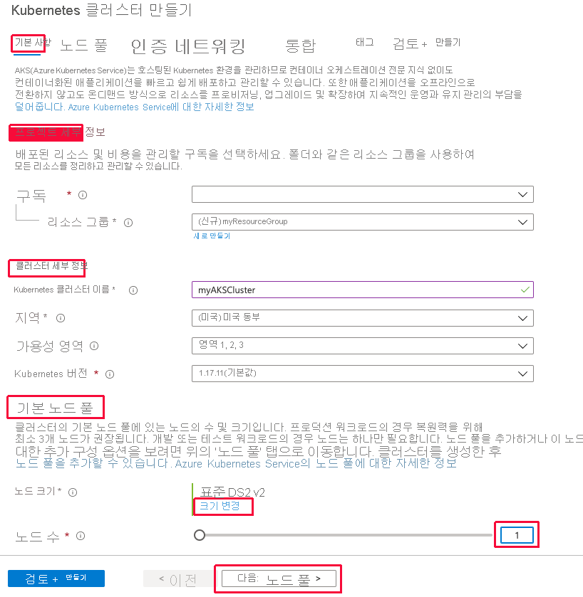
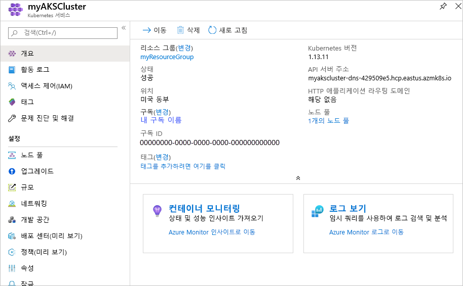
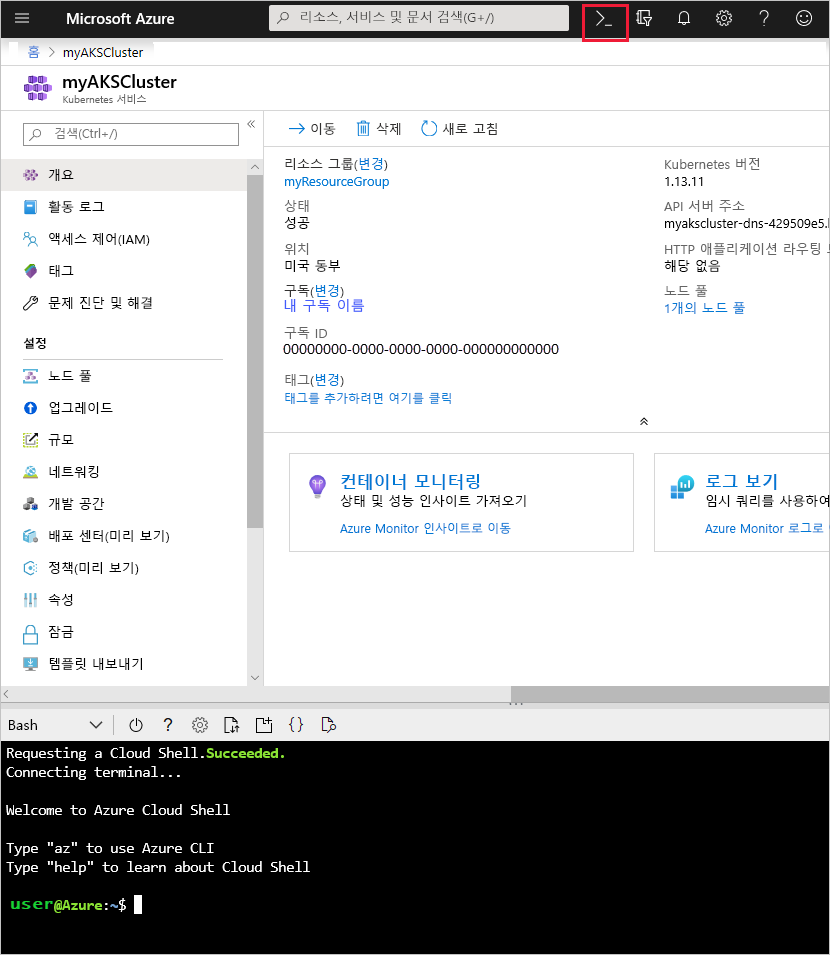
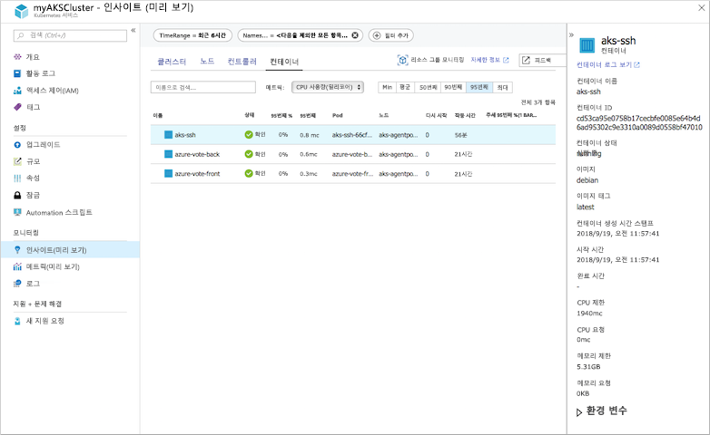
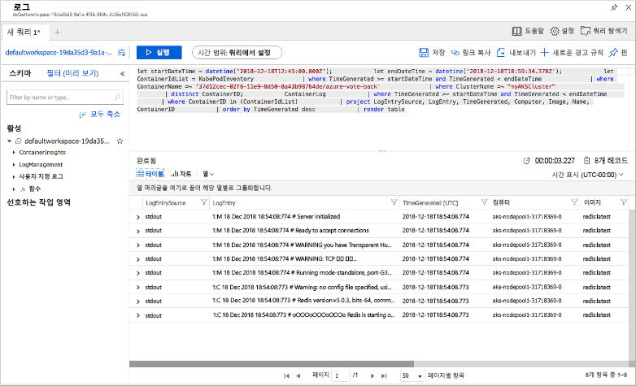

# <a name="quickstart-deploy-an-azure-kubernetes-service-aks-cluster"></a>빠른 시작: AKS(Azure Kubernetes Service) 클러스터 배포

이 빠른 시작에서는 Azure Portal을 사용하여 AKS 클러스터를 배포합니다. 웹 프런트 엔드 및 Redis 인스턴스로 구성된 다중 컨테이너 응용 프로그램이 클러스터에서 실행됩니다. 완료되면 인터넷을 통해 애플리케이션에 액세스할 수 있습니다.


이 빠른 시작에서는 Kubernetes 기본 개념을 이해하고 있다고 가정합니다. Kubernetes에 대한 자세한 내용은 [Kubernetes 설명서][kubernetes-documentation]를 참조하세요.

Azure 구독이 아직 없는 경우 시작하기 전에 [체험 계정](https://azure.microsoft.com/free/?WT.mc_id=A261C142F)을 만듭니다.

## <a name="sign-in-to-azure"></a>Azure에 로그인

https://portal.azure.com 에서 Azure Portal에 로그인합니다.

## <a name="create-an-aks-cluster"></a>AKS 클러스터 만들기

Azure Portal의 왼쪽 위 모서리에서 **리소스 만들기** > **Kubernetes Service**를 선택합니다.

AKS 클러스터를 만들려면 다음 단계를 완료합니다.

1. **기본** - 다음 옵션을 구성합니다.
    - 프로젝트 세부 정보: Azure 구독을 선택하고 *myResourceGroup* 같은 Azure 리소스 그룹을 선택하거나 만듭니다. *myAKSCluster* 같은 **Kubernetes 클러스터 이름**을 입력합니다.
    - 클러스터 세부 정보: AKS 클러스터의 지역, Kubernetes 버전 및 DNS 이름 접두사를 선택합니다.
    - 크기 조정: AKS 노드의 VM 크기를 선택합니다. AKS 클러스터를 배포한 후에는 VM 크기를 변경할 수 **없습니다**.
        - 클러스터에 배포할 노드 수를 선택합니다. 이 빠른 시작에서는 **노드 수**를 *1*로 설정합니다. 클러스터를 배포한 후에 노드 수를 조정할 수 **있습니다**.
    
    

    완료되면 **다음: 인증**을 선택합니다.

1. **인증**: 다음 옵션을 구성합니다.
    - 새 서비스 주체를 만들거나 기존 서비스 주체를 사용하도록 *구성*합니다. 기존 SPN을 사용하는 경우 SPN 클라이언트 ID와 암호를 제공해야 합니다.
    - Kubernetes RBAC(역할 기반 액세스 제어)에 대한 옵션을 사용하도록 설정합니다. 이러한 컨트롤을 사용하면 AKS 클러스터에 배포된 Kubernetes 리소스에 대한 액세스를 정밀하게 제어할 수 있습니다.

    완료되면 **다음: 네트워킹**을 선택합니다.

1. **네트워킹**: 다음과 같은 네트워킹 옵션을 구성합니다.
    
    - **Http 응용 프로그램 라우팅** - 자동 공용 DNS 이름 만들기를 사용하여 통합된 수신 컨트롤러를 구성하려면 **예**를 선택합니다. Http 라우팅에 대한 자세한 내용은 [AKS HTTP 라우팅 및 DNS][http-routing]를 참조하세요.
    - **네트워크 구성** - [Azure CNI][azure-cni]를 사용하는 고급 네트워킹 구성 대신 [kubenet][kubenet] Kubernetes 플러그 인을 사용하는 **기본** 네트워크 구성을 선택합니다. 네트워킹 옵션에 대한 자세한 내용은 [AKS 네트워킹 개요][aks-network]를 참조하세요.
    
    완료되면 **다음: 모니터링**을 선택합니다.

1. AKS 클러스터를 배포할 때 AKS 클러스터 및 클러스터에서 실행 중인 Pod의 상태를 모니터링하도록 컨테이너용 Azure Monitor를 구성할 수 있습니다. 컨테이너 상태 모니터링에 대한 자세한 내용은 [Azure Kubernetes Service 상태 모니터링][aks-monitor]을 참조하세요.

    **예**를 선택하여 컨테이너 모니터링을 사용하도록 설정하고 기존 Log Analytics 작업 영역을 선택하거나 새로 만듭니다.
    
    **검토 + 만들기**를 선택하고, 완료되면 **만들기**를 선택합니다.

AKS 클러스터를 만들고 사용 준비를 마칠 때까지 몇 분 정도 걸립니다. *myResourceGroup* 같은 AKS 클러스터 리소스 그룹으로 이동하여 *myAKSCluster* 같은 AKS 리소스를 선택합니다. 다음 예제 스크린샷처럼 AKS 클러스터 대시보드가 표시됩니다.



## <a name="connect-to-the-cluster"></a>클러스터에 연결

Kubernetes 클러스터를 관리하려면 [kubectl][kubectl] Kubernetes 명령줄 클라이언트를 사용합니다. `kubectl` 클라이언트가 Azure Cloud Shell에 사전 설치됩니다.

Azure Portal 오른쪽 위 모서리에 있는 단추를 사용하여 Cloud Shell을 엽니다.



[az aks get-credentials][az-aks-get-credentials] 명령을 사용하여 Kubernetes 클러스터에 연결하도록 `kubectl`을 구성합니다. 다음 예제는 *myResourceGroup*이라는 리소스 그룹에서 *myAKSCluster*라는 클러스터의 자격 증명을 가져옵니다.

```azurecli-interactive
az aks get-credentials --resource-group myResourceGroup --name myAKSCluster
```

클러스터에 대한 연결을 확인하려면 [kubectl get][kubectl-get] 명령을 사용하여 클러스터 노드 목록을 반환합니다.

```azurecli-interactive
kubectl get nodes
```

다음 예제 출력은 이전 단계에서 만든 단일 노드를 보여줍니다. 노드 상태가 “준비”인지 확인합니다.

```
NAME                       STATUS    ROLES     AGE       VERSION
aks-agentpool-14693408-0   Ready     agent     10m       v1.11.2
```

## <a name="run-the-application"></a>애플리케이션 실행

Kubernetes 매니페스트 파일은 어떤 컨테이너 이미지가 실행되는지 등과 같은 클러스터에 대해 원하는 상태를 정의합니다. 이 빠른 시작에서 매니페스트는 샘플 Azure Vote 애플리케이션을 실행하는 데 필요한 모든 개체를 만드는 데 사용됩니다. 이러한 개체에는 두 개의 [Kubernetes 배포][kubernetes-deployment]가 포함되는데, 하나는 Azure Vote 프런트 엔드용이고 다른 하나는 Redis 인스턴스용입니다. 또한 두 개의 [Kubernetes Services][kubernetes-service]가 만들어집니다. 하나는 Redis 인스턴스용 내부 서비스이고, 다른 하나는 인터넷에서 Azure Vote 애플리케이션에 액세스하기 위한 외부 서비스입니다.

> [!TIP]
> 이 빠른 시작에서는 응용 프로그램 매니페스트를 수동으로 만들어 AKS 클러스터에 배포합니다. 더 많은 실제 시나리오에서는 [Azure Dev Spaces][azure-dev-spaces]를 사용하여 AKS 클러스터에서 직접 코드를 신속하게 반복하고 디버깅할 수 있습니다. OS 플랫폼 및 개발 환경 전반에서 Dev Spaces를 사용하고 다른 팀원과 함께 작업할 수 있습니다.

`azure-vote.yaml`이라는 파일을 만들고 다음 YAML 코드에 복사합니다. Azure Cloud Shell에서 작업하는 경우 가상 시스템 또는 실제 시스템에서 작업하는 것처럼 `vi` 또는 `Nano`를 사용하여 파일을 만듭니다.

```yaml
apiVersion: apps/v1
kind: Deployment
metadata:
  name: azure-vote-back
spec:
  replicas: 1
  selector:
    matchLabels:
      app: azure-vote-back
  template:
    metadata:
      labels:
        app: azure-vote-back
    spec:
      containers:
      - name: azure-vote-back
        image: redis
        resources:
          requests:
            cpu: 100m
            memory: 128Mi
          limits:
            cpu: 250m
            memory: 256Mi
        ports:
        - containerPort: 6379
          name: redis
---
apiVersion: v1
kind: Service
metadata:
  name: azure-vote-back
spec:
  ports:
  - port: 6379
  selector:
    app: azure-vote-back
---
apiVersion: apps/v1
kind: Deployment
metadata:
  name: azure-vote-front
spec:
  replicas: 1
  selector:
    matchLabels:
      app: azure-vote-front
  template:
    metadata:
      labels:
        app: azure-vote-front
    spec:
      containers:
      - name: azure-vote-front
        image: microsoft/azure-vote-front:v1
        resources:
          requests:
            cpu: 100m
            memory: 128Mi
          limits:
            cpu: 250m
            memory: 256Mi
        ports:
        - containerPort: 80
        env:
        - name: REDIS
          value: "azure-vote-back"
---
apiVersion: v1
kind: Service
metadata:
  name: azure-vote-front
spec:
  type: LoadBalancer
  ports:
  - port: 80
  selector:
    app: azure-vote-front
```

애플리케이션을 실행하려면 [kubectl apply][kubectl-apply] 명령을 사용합니다.

```azurecli-interactive
kubectl apply -f azure-vote.yaml
```

다음 예제 출력은 AKS 클러스터에 만들어진 Kubernetes 리소스를 보여줍니다.

```
deployment "azure-vote-back" created
service "azure-vote-back" created
deployment "azure-vote-front" created
service "azure-vote-front" created
```

## <a name="test-the-application"></a>애플리케이션 테스트

애플리케이션이 실행되면 애플리케이션을 인터넷에 공개하는 [Kubernetes 서비스][kubernetes-service]가 만들어집니다. 이 프로세스를 완료하는 데 몇 분이 걸릴 수 있습니다.

진행 상황을 모니터링하려면 `--watch` 인수와 함께 [kubectl get service][kubectl-get] 명령을 사용합니다.

```azurecli-interactive
kubectl get service azure-vote-front --watch
```

처음에는 *azure-vote-front* 서비스에 대한 *EXTERNAL-IP*가 *보류 중*으로 표시됩니다.

```
NAME               TYPE           CLUSTER-IP   EXTERNAL-IP   PORT(S)        AGE
azure-vote-front   LoadBalancer   10.0.37.27   <pending>     80:30572/TCP   6s
```

*EXTERNAL-IP* 주소가 *보류 중*에서 *IP 주소*로 변경되면 `CTRL-C`를 사용하여 kubectl 조사식 프로세스를 중지합니다.

```
azure-vote-front   LoadBalancer   10.0.37.27   52.179.23.131   80:30572/TCP   2m
```

다음 예제처럼 웹 브라우저를 서비스의 외부 IP 주소로 열어서 Azure Vote 앱을 확인합니다.


## <a name="monitor-health-and-logs"></a>상태 및 로그 모니터링

클러스터를 만들 때 컨테이너 인사이트 모니터링이 활성화되었습니다. 이 모니터링 기능은 클러스터에서 실행되는 AKS 클러스터와 Pod의 상태 메트릭을 제공합니다. 컨테이너 상태 모니터링에 대한 자세한 내용은 [Azure Kubernetes Service 상태 모니터링][aks-monitor]을 참조하세요.

이 데이터로 Azure Portal을 채우는 데 몇 분 정도 걸릴 수 있습니다. Azure Vote Pod의 현재 상태, 작동 시간 및 리소스 사용량을 보려면 Azure Portal에서 *myAKSCluster* 같은 AKS 리소스로 돌아갑니다. 그런 다음, 다음과 같이 상태에 액세스할 수 있습니다.

1. 왼쪽에 있는 **모니터링** 아래에서 **인사이트(미리 보기)** 를 선택합니다.
1. 상단에서 **+ 필터 추가**를 클릭합니다.
1. *네임스페이스*를 속성으로 선택한 다음, *\<All but kube-system\>* 을 선택합니다.
1. **컨테이너** 보기를 선택합니다.

다음 예와 같이 *azure-vote-back* 및 *azure-vote-front* 컨테이너가 표시됩니다.



`azure-vote-front` Pod에 대한 로그를 보려면 컨테이너 목록의 오른쪽에서 **컨테이너 로그 보기** 링크를 선택합니다. 이러한 로그는 컨테이너의 *stdout* 및 *stderr* 스트림을 포함합니다.



## <a name="delete-cluster"></a>클러스터 삭제

클러스터가 더 이상 필요하지 않은 경우 클러스터 리소스를 삭제합니다. 그러면 연결된 모든 리소스도 삭제됩니다. 이 작업은 Azure Portal의 AKS 클러스터 대시보드에서 **삭제** 단추를 선택하여 완료할 수 있습니다. 또는 Cloud Shell에서 [az aks delete][az-aks-delete] 명령을 사용할 수도 있습니다.

```azurecli-interactive
az aks delete --resource-group myResourceGroup --name myAKSCluster --no-wait
```

> [!NOTE]
> 클러스터를 삭제할 때, AKS 클러스터에 사용되는 Azure Active Directory 서비스 주체는 제거되지 않습니다. 서비스 주체를 제거하는 방법에 대한 단계는 [AKS 서비스 주체 고려 사항 및 삭제][sp-delete]를 참조하세요.

## <a name="get-the-code"></a>코드 가져오기

이 빠른 시작에서는 Kubernetes 배포를 만드는 데 미리 생성된 컨테이너 이미지를 사용했습니다. 관련된 애플리케이션 코드, Dockerfile 및 Kubernetes 매니페스트 파일을 GitHub에서 사용할 수 있습니다.

[https://github.com/Azure-Samples/azure-voting-app-redis][azure-vote-app]

## <a name="next-steps"></a>다음 단계

이 빠른 시작에서는 Kubernetes 클러스터를 배포하고, 이 클러스터에 다중 컨테이너 응용 프로그램을 배포했습니다.

AKS에 대해 자세히 알아보고 배포 예제에 대한 전체 코드를 연습해 보려면 Kubernetes 클러스터 자습서를 계속 진행합니다.

> [!div class="nextstepaction"]
> [AKS 자습서][aks-tutorial]

<!-- LINKS - external -->
[azure-vote-app]: https://github.com/Azure-Samples/azure-voting-app-redis.git
[azure-cni]: https://github.com/Azure/azure-container-networking/blob/master/docs/cni.md
[kubectl]: https://kubernetes.io/docs/user-guide/kubectl/
[kubectl-apply]: https://kubernetes.io/docs/reference/generated/kubectl/kubectl-commands#apply
[kubectl-get]: https://kubernetes.io/docs/reference/generated/kubectl/kubectl-commands#get
[kubenet]: https://kubernetes.io/docs/concepts/cluster-administration/network-plugins/#kubenet
[kubernetes-deployment]: https://kubernetes.io/docs/concepts/workloads/controllers/deployment/
[kubernetes-documentation]: https://kubernetes.io/docs/home/
[kubernetes-service]: https://kubernetes.io/docs/concepts/services-networking/service/

<!-- LINKS - internal -->
[az-aks-get-credentials]: /cli/azure/aks?view=azure-cli-latest#az-aks-get-credentials
[az-aks-delete]: /cli/azure/aks#az-aks-delete
[aks-monitor]: ../monitoring/monitoring-container-health.md
[aks-network]: ./concepts-network.md
[aks-tutorial]: ./tutorial-kubernetes-prepare-app.md
[http-routing]: ./http-application-routing.md
[sp-delete]: kubernetes-service-principal.md#additional-considerations
[azure-dev-spaces]: https://docs.microsoft.com/azure/dev-spaces/
