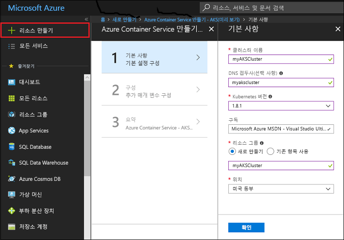

# <a name="quickstart-deploy-an-azure-container-service-aks-cluster"></a>빠른 시작: AKS(Azure Container Service) 클러스터 배포

이 빠른 시작에서는 Azure Portal을 사용하여 AKS 클러스터를 배포합니다. 웹 프런트 엔드 및 Redis 인스턴스로 구성된 다중 컨테이너 응용 프로그램이 클러스터에서 실행됩니다. 완료되면 인터넷을 통해 응용 프로그램에 액세스할 수 있습니다.


이 빠른 시작에서는 Kubernetes 기본 개념을 이해하고 있다고 가정합니다. Kubernetes에 대한 자세한 내용은 [Kubernetes 설명서][kubernetes-documentation]를 참조하세요.

## <a name="sign-in-to-azure"></a>Azure에 로그인

[Azure Portal][auzre portal]에 로그인합니다.

## <a name="create-service-principal"></a>서비스 주체 만들기

Azure Portal에서 AKS 클러스터를 만들기 전에 서비스 주체를 만들어야 합니다. Azure에서는 AKS 클러스터와 연결된 인프라를 관리하기 위해 이 서비스 주체를 사용합니다.

**Azure Active Directory** > **앱 등록** > **새 응용 프로그램 등록**을 선택합니다.

응용 프로그램에 대한 이름(모든 값이 될 수 있음)을 입력합니다. 응용 프로그램 종류에 대해 **웹앱/API**를 선택합니다. **로그온 URL**에 대한 값을 입력합니다. 이 값은 유효한 URL 형식일 수 있지만 실제 끝점일 필요는 없습니다.

작업을 완료하면 **만들기**를 선택합니다.


새로 만든 응용 프로그램 등록을 선택하고 응용 프로그램 ID를 기록해 둡니다. AKS 클러스터를 만들 때 이 값이 필요합니다.


다음으로 서비스 주체에 대한 암호를 만들어야 합니다. **모든 설정** > **키**를 선택하고 키 설명에 대한 값을 입력합니다. 서비스 주체가 유효한 시간인 기간을 선택합니다.

**저장**을 클릭하고 암호 값을 기록해 둡니다. AKS 클러스터를 만들 때 암호가 필요합니다.


## <a name="create-aks-cluster"></a>AKS 클러스터 만들기

**리소스 만들기** > **컨테이너** > **Azure Container Service - AKS(미리 보기)**를 선택합니다.

클러스터에 대한 클러스터 이름, DNS 접두사, 리소스 그룹 이름, 위치 및 Kubernetes 버전을 제공합니다. 클러스터에 연결할 때 필요하므로 클러스터 이름 및 리소스 그룹 이름을 기록해 둡니다.

완료되면 **확인**을 선택합니다.



구성 양식에서 다음을 입력합니다.

- 사용자 이름 - 클러스터 노드에서 관리 계정에 지정된 이름입니다.
- SSH 공개 키 - 클러스터 노드에 액세스하는 데 사용할 키와 연결됩니다.
- 서비스 주체 클라이언트 ID - 이 문서 앞부분에서 만든 서비스 주체의 응용 프로그램 ID입니다.
- 서비스 주체 클라이언트 암호 - 이 문서 앞부분에서 만든 서비스 주체의 암호입니다.
- 노드 수 - 만들려는 AKS 노드 수입니다.
- 노드 가상 머신 크기- AKS 노드에 대한 VM 크기
- OS 디스크 크기 - AKS 노드 OS 디스크의 크기입니다.

완료되면 **확인**을 선택하고 유효성 검사가 완료되면 **확인**을 다시 선택합니다.


잠시 기다리면 ASK 클러스터가 배포되고 사용할 준비가 됩니다.

## <a name="connect-to-the-cluster"></a>클러스터에 연결

Kubernetes 클러스터를 관리하려면 [kubectl][kubectl] Kubernetes 명령줄 클라이언트를 사용합니다. kubectl 클라이언트가 Azure Cloud Shell에 사전 설치됩니다.

Azure Portal 오른쪽 위 모서리에 있는 단추를 사용하여 Cloud Shell을 엽니다.


Kubernetes 클러스터에 연결하도록 kubectl을 구성하려면 [az aks get-credentials][az-aks-get-credentials] 명령을 사용합니다.

다음 명령을 Cloud Shell에 복사하여 붙여넣습니다. 필요한 경우 리소스 그룹 및 클러스터 이름을 수정합니다.

```azurecli-interactive
az aks get-credentials --resource-group myAKSCluster --name myAKSCluster
```

클러스터에 대한 연결을 확인하려면 [kubectl get][kubectl-get] 명령을 사용하여 클러스터 노드 목록을 반환합니다.

```azurecli-interactive
kubectl get nodes
```

출력

```
NAME                       STATUS    ROLES     AGE       VERSION
aks-agentpool-14693408-0   Ready     agent     6m        v1.8.1
aks-agentpool-14693408-1   Ready     agent     6m        v1.8.1
aks-agentpool-14693408-2   Ready     agent     7m        v1.8.1
```

## <a name="run-the-application"></a>응용 프로그램 실행

Kubernetes 매니페스트 파일은 어떤 컨테이너 이미지가 실행되는지 등과 같은 클러스터에 대해 원하는 상태를 정의합니다. 이 예제에서는 Azure Vote 응용 프로그램을 실행하는 데 필요한 모든 개체를 만드는 데 매니페스트를 사용합니다.

`azure-vote.yaml`이라는 파일을 만들고 다음 YAML 코드에 복사합니다. Azure Cloud Shell에서 작업하고 있는 경우, 가상 또는 실제 시스템에서 작업하고 있는 것처럼 vi 또는 Nano를 사용하여 파일을 만들 수 있습니다.

```yaml
apiVersion: apps/v1beta1
kind: Deployment
metadata:
  name: azure-vote-back
spec:
  replicas: 1
  template:
    metadata:
      labels:
        app: azure-vote-back
    spec:
      containers:
      - name: azure-vote-back
        image: redis
        ports:
        - containerPort: 6379
          name: redis
---
apiVersion: v1
kind: Service
metadata:
  name: azure-vote-back
spec:
  ports:
  - port: 6379
  selector:
    app: azure-vote-back
---
apiVersion: apps/v1beta1
kind: Deployment
metadata:
  name: azure-vote-front
spec:
  replicas: 1
  template:
    metadata:
      labels:
        app: azure-vote-front
    spec:
      containers:
      - name: azure-vote-front
        image: microsoft/azure-vote-front:v1
        ports:
        - containerPort: 80
        env:
        - name: REDIS
          value: "azure-vote-back"
---
apiVersion: v1
kind: Service
metadata:
  name: azure-vote-front
spec:
  type: LoadBalancer
  ports:
  - port: 80
  selector:
    app: azure-vote-front
```

응용 프로그램을 실행하려면 [kubectl create][kubectl-create] 명령을 사용합니다.

```azurecli-interactive
kubectl create -f azure-vote.yaml
```

출력

```
deployment "azure-vote-back" created
service "azure-vote-back" created
deployment "azure-vote-front" created
service "azure-vote-front" created
```

## <a name="test-the-application"></a>응용 프로그램 테스트

응용 프로그램이 실행되면 응용 프로그램 프런트 엔드를 인터넷에 공개하는 [Kubernetes 서비스][kubernetes-service]가 만들어집니다. 이 프로세스를 완료하는 데 몇 분이 걸릴 수 있습니다.

진행 상황을 모니터링하려면 `--watch` 인수와 함께 [kubectl get service][kubectl-get] 명령을 사용합니다.

```azurecli-interactive
kubectl get service azure-vote-front --watch
```

처음에는 *azure-vote-front* 서비스에 대한 *EXTERNAL-IP*가 *보류 중*으로 표시됩니다.

```
NAME               TYPE           CLUSTER-IP   EXTERNAL-IP   PORT(S)        AGE
azure-vote-front   LoadBalancer   10.0.37.27   <pending>     80:30572/TCP   6s
```

*EXTERNAL-IP* 주소가 *보류 중*에서 *IP 주소*로 변경되면 `CTRL-C`를 사용하여 kubectl 조사식 프로세스를 중지합니다.

```
azure-vote-front   LoadBalancer   10.0.37.27   52.179.23.131   80:30572/TCP   2m
```

이제 외부 IP 주소로 이동하여 Azure Vote 앱을 볼 수 있습니다.


## <a name="delete-cluster"></a>클러스터 삭제

클러스터가 더 이상 필요하지 않은 경우 클러스터 리소스 그룹을 삭제할 수 있으며 그러면 연결된 모든 리소스가 삭제됩니다. 이 작업은 Azure Portal에서 리소스 그룹을 선택하고 [삭제] 단추를 클릭하여 완료할 수 있습니다. 또는 Cloud Shell에서 [az group delete][az-group-delete] 명령을 사용할 수 있습니다.

```azurecli-interactive
az group delete --name myAKSCluster --no-wait
```

## <a name="get-the-code"></a>코드 가져오기

이 빠른 시작에서는 Kubernetes 배포를 만드는 데 미리 생성된 컨테이너 이미지를 사용했습니다. 관련된 응용 프로그램 코드, Dockerfile 및 Kubernetes 매니페스트 파일을 GitHub에서 사용할 수 있습니다.

[https://github.com/Azure-Samples/azure-voting-app-redis][azure-vote-app]

## <a name="next-steps"></a>다음 단계

이 빠른 시작에서는 Kubernetes 클러스터를 배포하고, 이 클러스터에 다중 컨테이너 응용 프로그램을 배포했습니다.

AKS에 대해 자세히 알아보고 배포 예제에 대한 전체 코드를 연습해 보려면 Kubernetes 클러스터 자습서를 계속 진행합니다.

> [!div class="nextstepaction"]
> [AKS 자습서][aks-tutorial]

<!-- LINKS - external -->
[auzre portal]: https://portal.azure.com
[azure-vote-app]: https://github.com/Azure-Samples/azure-voting-app-redis.git
[kubectl]: https://kubernetes.io/docs/user-guide/kubectl/
[kubectl-create]: https://kubernetes.io/docs/reference/generated/kubectl/kubectl-commands#create
[kubectl-get]: https://kubernetes.io/docs/reference/generated/kubectl/kubectl-commands#get
[kubernetes-documentation]: https://kubernetes.io/docs/home/
[kubernetes-service]: https://kubernetes.io/docs/concepts/services-networking/service/

<!-- LINKS - internal -->
[az-aks-get-credentials]: /cli/azure/aks?view=azure-cli-latest#az_aks_get_credentials
[az-group-delete]: /cli/azure/group#delete
[aks-tutorial]: ./tutorial-kubernetes-prepare-app.md


