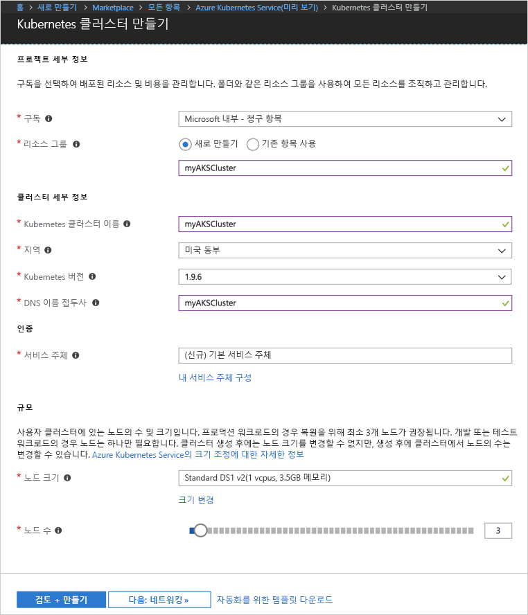
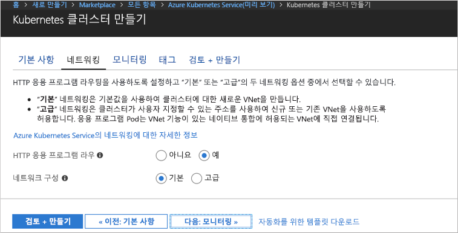
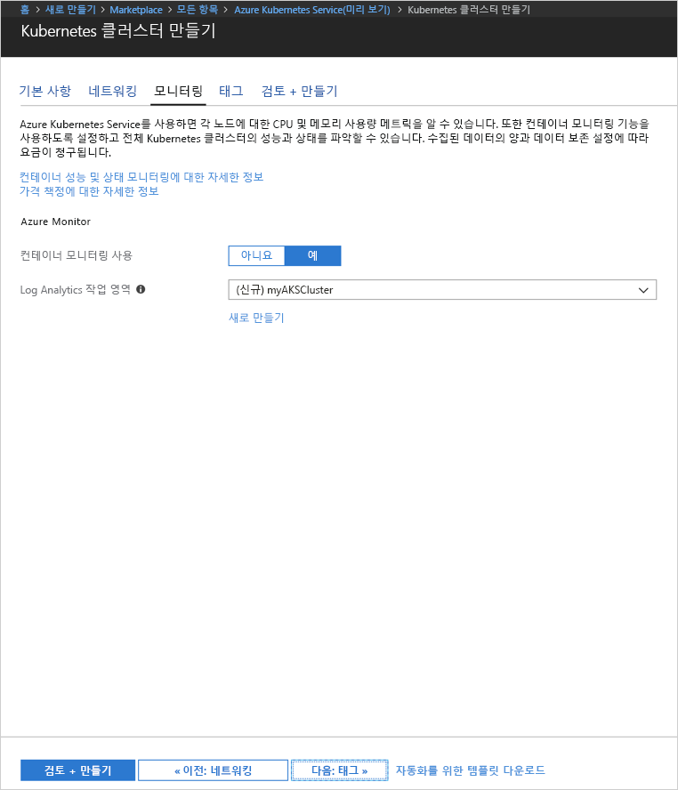
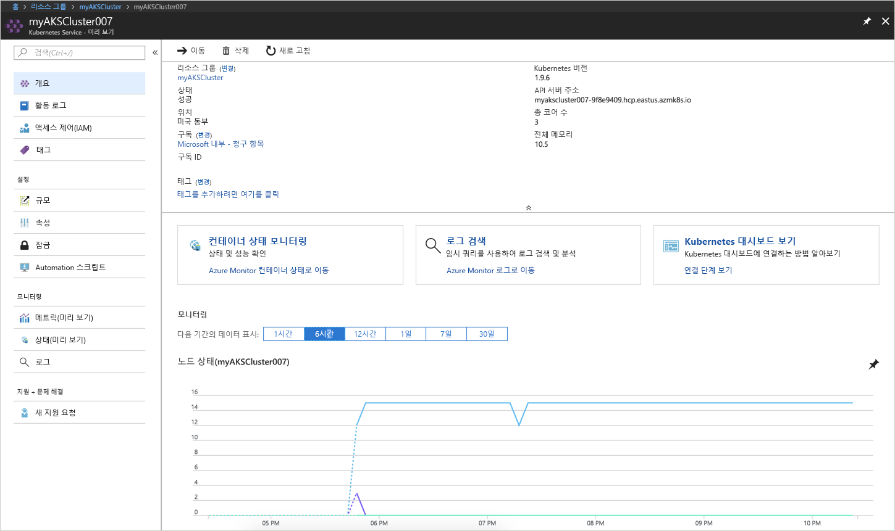
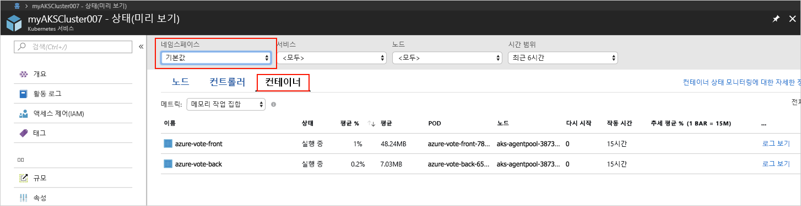
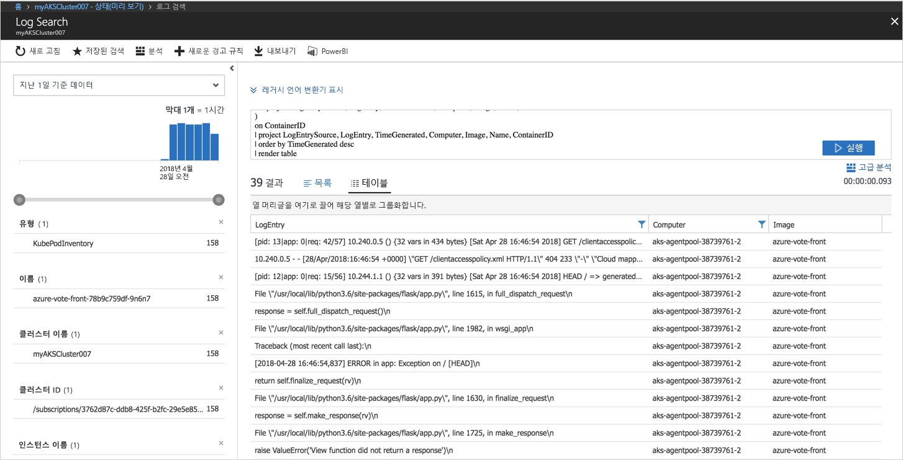

# <a name="quickstart-deploy-an-azure-kubernetes-service-aks-cluster"></a>빠른 시작: AKS(Azure Kubernetes Service) 클러스터 배포

이 빠른 시작에서는 Azure Portal을 사용하여 AKS 클러스터를 배포합니다. 웹 프런트 엔드 및 Redis 인스턴스로 구성된 다중 컨테이너 응용 프로그램이 클러스터에서 실행됩니다. 완료되면 인터넷을 통해 응용 프로그램에 액세스할 수 있습니다.


이 빠른 시작에서는 Kubernetes 기본 개념을 이해하고 있다고 가정합니다. Kubernetes에 대한 자세한 내용은 [Kubernetes 설명서][kubernetes-documentation]를 참조하세요.

## <a name="sign-in-to-azure"></a>Azure에 로그인

http://portal.azure.com에서 Azure Portal에 로그인합니다.


## <a name="create-aks-cluster"></a>AKS 클러스터 만들기

**리소스 만들기**를 선택하고 **Kubernetes**를 검색한 후 **Azure Kubernetes Service(미리 보기)** > **만들기**를 선택합니다.

AKS 클러스터 만들기 양식의 각 머리글 아래에 있는 다음 단계를 완료합니다.

- **프로젝트 세부 정보**: Azure 구독과 새로운 또는 기존 Azure 리소스 그룹을 선택합니다.
- **클러스터 세부 정보**: AKS 클러스터의 이름, 지역, 버전 및 DNS 이름 접두사를 입력합니다.
- **인증**: 새 서비스 주체를 만들거나 기존 서비스 주체를 사용합니다. 기존 SPN을 사용하는 경우 SPN 클라이언트 ID와 암호를 제공해야 합니다.
- **크기 조정**: AKS 노드의 VM 크기를 선택합니다. AKS 클러스터를 배포한 후에는 VM 크기를 변경할 수 **없습니다**. 또한 클러스터에 배포할 노드 수를 선택합니다. 클러스터를 배포한 후에 노드 수를 조정할 수 **있습니다**.

완료되면 **다음: 네트워킹**을 선택합니다.



다음과 같은 네트워킹 옵션을 구성합니다.

- **Http 응용 프로그램 라우팅** - 자동 공용 DNS 이름 만들기를 사용하여 통합된 수신 컨트롤러를 구성합니다. Http 라우팅에 대한 자세한 내용은 [AKS HTTP 라우팅 및 DNS][http-routing]를 참조하세요.
- **네트워크 구성** - [kubenet][kubenet] Kubernetes 플러그 인을 사용하는 기본 네트워크 구성 또는 [Azure CNI][azure-cni]를 사용하는 고급 네트워킹 구성 중에서 선택합니다. 네트워킹 옵션에 대한 자세한 내용은 [AKS 네트워킹 개요][aks-network]를 참조하세요.

완료되면 **다음: 모니터링**을 선택합니다.



AKS 클러스터를 배포할 때 AKS 클러스터 및 클러스터에서 실행되는 Pod의 상태를 모니터링하도록 Azure Container Insights를 구성할 수 있습니다. 컨테이너 상태 모니터링에 대한 자세한 내용은 [Azure Kubernetes Service 상태 모니터링][aks-monitor]을 참조하세요.

**예**를 선택하여 컨테이너 모니터링을 사용하도록 설정하고 기존 Log Analytics 작업 영역을 선택하거나 새로 만듭니다.

**검토 + 만들기**를 선택한 후 완료되면 **만들기**를 선택합니다.



잠시 기다리면 ASK 클러스터가 배포되고 사용할 준비가 됩니다. AKS 클러스터 리소스 그룹으로 이동한 후 AKS 리소스를 선택하면 AKS 클러스터 대시보드가 표시됩니다.



## <a name="connect-to-the-cluster"></a>클러스터에 연결

Kubernetes 클러스터를 관리하려면 [kubectl][kubectl] Kubernetes 명령줄 클라이언트를 사용합니다. kubectl 클라이언트가 Azure Cloud Shell에 사전 설치됩니다.

Azure Portal 오른쪽 위 모서리에 있는 단추를 사용하여 Cloud Shell을 엽니다.


Kubernetes 클러스터에 연결하도록 kubectl을 구성하려면 [az aks get-credentials][az-aks-get-credentials] 명령을 사용합니다.

다음 명령을 Cloud Shell에 복사하여 붙여넣습니다. 필요한 경우 리소스 그룹 및 클러스터 이름을 수정합니다.

```azurecli-interactive
az aks get-credentials --resource-group myAKSCluster --name myAKSCluster
```

클러스터에 대한 연결을 확인하려면 [kubectl get][kubectl-get] 명령을 사용하여 클러스터 노드 목록을 반환합니다.

```azurecli-interactive
kubectl get nodes
```

출력

```
NAME                       STATUS    ROLES     AGE       VERSION
aks-agentpool-11482510-0   Ready     agent     9m        v1.9.6
aks-agentpool-11482510-1   Ready     agent     8m        v1.9.6
aks-agentpool-11482510-2   Ready     agent     9m        v1.9.6
```

## <a name="run-the-application"></a>응용 프로그램 실행

Kubernetes 매니페스트 파일은 어떤 컨테이너 이미지가 실행되는지 등과 같은 클러스터에 대해 원하는 상태를 정의합니다. 이 예제에서는 Azure Vote 응용 프로그램을 실행하는 데 필요한 모든 개체를 만드는 데 매니페스트를 사용합니다. 이러한 개체에는 Azure Vote 프런트 엔드와 Redis 인스턴스 각각에 대한 두 개의 [Kubernetes 배포][kubernetes-deployment]가 포함됩니다. 또한 두 개의 [Kubernetes Services][kubernetes-service], Redis 인스턴스에 대한 내부 서비스, 인터넷에서 Azure Vote 응용 프로그램에 액세스하기 위한 외부 서비스가 만들어집니다.

`azure-vote.yaml`이라는 파일을 만들고 다음 YAML 코드에 복사합니다. Azure Cloud Shell에서 작업하는 경우 가상 또는 실제 시스템에서 작업하는 것처럼 vi 또는 Nano를 사용하여 파일을 만듭니다.

```yaml
apiVersion: apps/v1beta1
kind: Deployment
metadata:
  name: azure-vote-back
spec:
  replicas: 1
  template:
    metadata:
      labels:
        app: azure-vote-back
    spec:
      containers:
      - name: azure-vote-back
        image: redis
        ports:
        - containerPort: 6379
          name: redis
---
apiVersion: v1
kind: Service
metadata:
  name: azure-vote-back
spec:
  ports:
  - port: 6379
  selector:
    app: azure-vote-back
---
apiVersion: apps/v1beta1
kind: Deployment
metadata:
  name: azure-vote-front
spec:
  replicas: 1
  template:
    metadata:
      labels:
        app: azure-vote-front
    spec:
      containers:
      - name: azure-vote-front
        image: microsoft/azure-vote-front:v1
        ports:
        - containerPort: 80
        env:
        - name: REDIS
          value: "azure-vote-back"
---
apiVersion: v1
kind: Service
metadata:
  name: azure-vote-front
spec:
  type: LoadBalancer
  ports:
  - port: 80
  selector:
    app: azure-vote-front
```

응용 프로그램을 실행하려면 [kubectl create][kubectl-create] 명령을 사용합니다.

```azurecli-interactive
kubectl create -f azure-vote.yaml
```

출력

```
deployment "azure-vote-back" created
service "azure-vote-back" created
deployment "azure-vote-front" created
service "azure-vote-front" created
```

## <a name="test-the-application"></a>응용 프로그램 테스트

응용 프로그램이 실행되면 응용 프로그램을 인터넷에 공개하는 [Kubernetes 서비스][kubernetes-service]가 만들어집니다. 이 프로세스를 완료하는 데 몇 분이 걸릴 수 있습니다.

진행 상황을 모니터링하려면 `--watch` 인수와 함께 [kubectl get service][kubectl-get] 명령을 사용합니다.

```azurecli-interactive
kubectl get service azure-vote-front --watch
```

처음에는 *azure-vote-front* 서비스에 대한 *EXTERNAL-IP*가 *보류 중*으로 표시됩니다.

```
NAME               TYPE           CLUSTER-IP   EXTERNAL-IP   PORT(S)        AGE
azure-vote-front   LoadBalancer   10.0.37.27   <pending>     80:30572/TCP   6s
```

*EXTERNAL-IP* 주소가 *보류 중*에서 *IP 주소*로 변경되면 `CTRL-C`를 사용하여 kubectl 조사식 프로세스를 중지합니다.

```
azure-vote-front   LoadBalancer   10.0.37.27   52.179.23.131   80:30572/TCP   2m
```

이제 외부 IP 주소로 이동하여 Azure Vote 앱을 봅니다.


## <a name="monitor-health-and-logs"></a>상태 및 로그 모니터링

컨테이너 정보 모니터링이 사용되도록 설정되면 AKS 클러스터와 클러스터에서 실행되는 Pod 둘 다에 대한 상태 메트릭을 AKS 클러스터 대시보드에서 사용할 수 있습니다. 컨테이너 상태 모니터링에 대한 자세한 내용은 [Azure Kubernetes Service 상태 모니터링][aks-monitor]을 참조하세요.

Azure Vote Pod에 대한 현재 상태, 가동 시간 및 리소스 사용량을 보려면 AKS 리소스로 다시 이동한 후 **컨테이너 상태 모니터링** > **기본** 네임스페이스 > **컨테이너**를 선택합니다. 이 데이터로 Azure Portal을 채우는 데 몇 분 정도 걸릴 수 있습니다.



`azure-vote-front` Pod에 대한 로그를 보려면 **로그 보기** 링크를 선택합니다. 이러한 로그는 컨테이너의 stdout 및 stderr 스트림을 포함합니다.



## <a name="delete-cluster"></a>클러스터 삭제

클러스터가 더 이상 필요하지 않은 경우 클러스터 리소스를 삭제합니다. 그러면 연결된 모든 리소스도 삭제됩니다. 이 작업은 Azure Portal의 Azure 클러스터 대시보드에서 삭제 단추를 선택하여 완료할 수 있습니다. 또는 Cloud Shell에서 [az aks delete][az-aks-delete] 명령을 사용할 수도 있습니다.

```azurecli-interactive
az aks delete --resource-group myAKSCluster --name myAKSCluster --no-wait
```

## <a name="get-the-code"></a>코드 가져오기

이 빠른 시작에서는 Kubernetes 배포를 만드는 데 미리 생성된 컨테이너 이미지를 사용했습니다. 관련된 응용 프로그램 코드, Dockerfile 및 Kubernetes 매니페스트 파일을 GitHub에서 사용할 수 있습니다.

[https://github.com/Azure-Samples/azure-voting-app-redis][azure-vote-app]

## <a name="next-steps"></a>다음 단계

이 빠른 시작에서는 Kubernetes 클러스터를 배포하고, 이 클러스터에 다중 컨테이너 응용 프로그램을 배포했습니다.

AKS에 대해 자세히 알아보고 배포 예제에 대한 전체 코드를 연습해 보려면 Kubernetes 클러스터 자습서를 계속 진행합니다.

> [!div class="nextstepaction"]
> [AKS 자습서][aks-tutorial]

<!-- LINKS - external -->
[azure-vote-app]: https://github.com/Azure-Samples/azure-voting-app-redis.git
[azure-cni]: https://github.com/Azure/azure-container-networking/blob/master/docs/cni.md
[kubectl]: https://kubernetes.io/docs/user-guide/kubectl/
[kubectl-create]: https://kubernetes.io/docs/reference/generated/kubectl/kubectl-commands#create
[kubectl-get]: https://kubernetes.io/docs/reference/generated/kubectl/kubectl-commands#get
[kubenet]: https://kubernetes.io/docs/concepts/cluster-administration/network-plugins/#kubenet
[kubernetes-deployment]: https://kubernetes.io/docs/concepts/workloads/controllers/deployment/
[kubernetes-documentation]: https://kubernetes.io/docs/home/
[kubernetes-service]: https://kubernetes.io/docs/concepts/services-networking/service/

<!-- LINKS - internal -->
[az-aks-get-credentials]: /cli/azure/aks?view=azure-cli-latest#az_aks_get_credentials
[az-aks-delete]: /cli/azure/aks#az-aks-delete
[aks-monitor]: ../log-analytics/log-analytics-containers.md
[aks-network]: ./networking-overview.md
[aks-tutorial]: ./tutorial-kubernetes-prepare-app.md
[http-routing]: ./http-application-routing.md