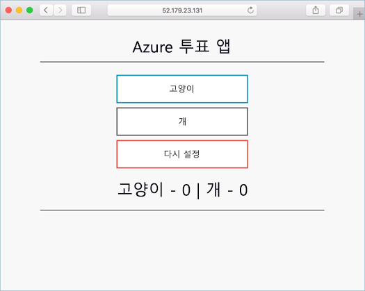
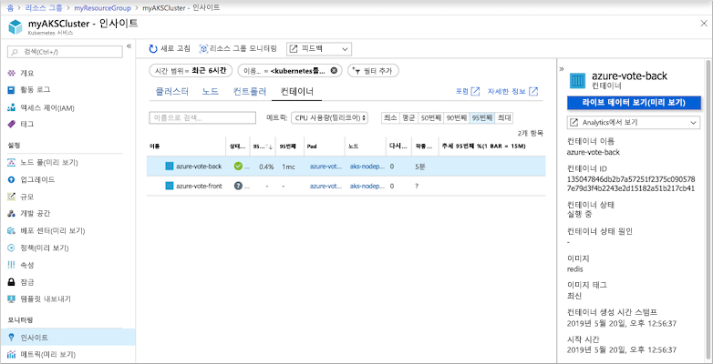
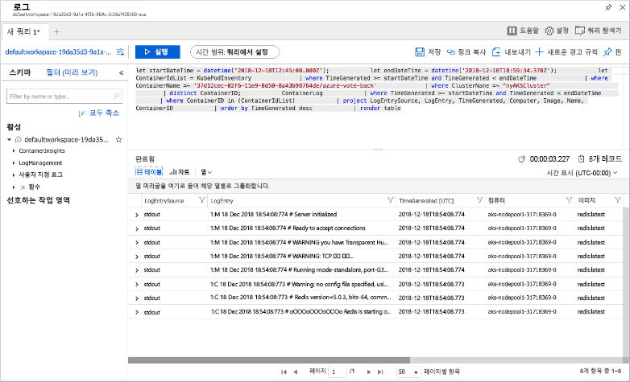

# <a name="quickstart-deploy-an-azure-kubernetes-service-aks-cluster-using-the-azure-cli"></a>빠른 시작: Azure CLI를 사용하여 AKS(Azure Kubernetes Service) 클러스터 배포

AKS(Azure Kubernetes Service)는 클러스터를 빠르게 배포하고 관리할 수 있는 관리형 Kubernetes 서비스입니다. 이 빠른 시작에서는 Azure CLI를 사용하여 AKS 클러스터를 배포합니다. 웹 프런트 엔드 및 Redis 인스턴스를 포함하는 다중 컨테이너 애플리케이션이 클러스터에서 실행됩니다. 그런 다음, 애플리케이션을 실행하는 Pod 및 클러스터의 상태를 모니터링하는 방법이 표시됩니다.

Windows Server 컨테이너(AKS에서 현재 미리 보기 상태)를 사용하려면 [Windows Server 컨테이너를 지원하는 AKS 클러스터 만들기][windows-container-cli]를 참조하세요.



이 빠른 시작에서는 Kubernetes 기본 개념을 이해하고 있다고 가정합니다. 자세한 내용은 [AKS(Azure Kubernetes Service)의 Kubernetes 핵심 개념][kubernetes-concepts]을 참조하세요.

Azure 구독이 아직 없는 경우 시작하기 전에 [체험 계정](https://azure.microsoft.com/free/?WT.mc_id=A261C142F)을 만듭니다.

[!INCLUDE [cloud-shell-try-it.md](../../includes/cloud-shell-try-it.md)]

CLI를 로컬로 설치하여 사용하도록 선택한 경우 이 빠른 시작에서 Azure CLI 버전 2.0.64 이상을 실행해야 합니다. `az --version`을 실행하여 버전을 찾습니다. 설치 또는 업그레이드해야 하는 경우 [Azure CLI 설치][azure-cli-install]를 참조하세요.

## <a name="create-a-resource-group"></a>리소스 그룹 만들기

Azure 리소스 그룹은 Azure 리소스가 배포되고 관리되는 논리 그룹입니다. 리소스 그룹을 만들 때 위치를 지정하라는 메시지가 나타납니다. 이 위치는 리소스 그룹 메타데이터가 저장되는 위치이며 리소스를 만드는 동안 다른 지역을 지정하지 않으면 리소스가 Azure에서 실행되는 위치입니다. [az group create][az-group-create] 명령을 사용하여 리소스 그룹을 만듭니다.

다음 예제에서는 *eastus* 위치에 *myResourceGroup*이라는 리소스 그룹을 만듭니다.

```azurecli-interactive
az group create --name myResourceGroup --location eastus
```

다음 예제 출력에서는 성공적으로 만들어진 리소스 그룹이 나와 있습니다.

```json
{
  "id": "/subscriptions/<guid>/resourceGroups/myResourceGroup",
  "location": "eastus",
  "managedBy": null,
  "name": "myResourceGroup",
  "properties": {
    "provisioningState": "Succeeded"
  },
  "tags": null
}
```

## <a name="create-aks-cluster"></a>AKS 클러스터 만들기

[az aks create][az-aks-create] 명령을 사용하여 AKS 클러스터를 만듭니다. 다음 예제에서는 하나의 노드가 있는 *myAKSCluster*라는 클러스터를 만듭니다. 컨테이너용 Azure Monitor는 *--enable-addons monitoring* 매개 변수를 사용하여 설정할 수도 있습니다.

```azurecli-interactive
az aks create \
    --resource-group myResourceGroup \
    --name myAKSCluster \
    --node-count 1 \
    --enable-addons monitoring \
    --generate-ssh-keys
```

몇 분 후 명령이 완료되면 클러스터에 대한 JSON 형식 정보가 반환됩니다.

## <a name="connect-to-the-cluster"></a>클러스터에 연결

Kubernetes 클러스터를 관리하려면 [kubectl][kubectl] Kubernetes 명령줄 클라이언트를 사용합니다. Azure Cloud Shell을 사용하는 경우 `kubectl`이 이미 설치되어 있습니다. `kubectl`을 로컬로 설치하려면 [az aks install-cli][az-aks-install-cli] 명령을 사용합니다.

```azurecli
az aks install-cli
```

Kubernetes 클러스터에 연결하도록 `kubectl`을 구성하려면 [az aks get-credentials][az-aks-get-credentials] 명령을 사용합니다. 이 명령은 자격 증명을 다운로드하고 Kubernetes CLI가 해당 자격 증명을 사용하도록 구성합니다.

```azurecli-interactive
az aks get-credentials --resource-group myResourceGroup --name myAKSCluster
```

클러스터에 대한 연결을 확인하려면 [kubectl get][kubectl-get] 명령을 사용하여 클러스터 노드 목록을 반환합니다.

```azurecli-interactive
kubectl get nodes
```

다음 예제 출력은 이전 단계에서 만든 단일 노드를 보여줍니다. 노드 상태가 *준비*인지 확인합니다.

```
NAME                       STATUS   ROLES   AGE     VERSION
aks-nodepool1-31718369-0   Ready    agent   6m44s   v1.12.8
```

## <a name="run-the-application"></a>애플리케이션 실행

Kubernetes 매니페스트 파일은 어떤 컨테이너 이미지가 실행되는지 등과 같은 클러스터에 대해 원하는 상태를 정의합니다. 이 빠른 시작에서는 Azure Vote 애플리케이션을 실행하는 데 필요한 모든 개체를 만드는 데 매니페스트를 사용합니다. 이 매니페스트는 샘플 Azure Vote Python 애플리케이션과 Redis 인스턴스 각각에 대한 두 개의 [Kubernetes 배포][kubernetes-deployment]를 포함합니다. 두 개의 [Kubernetes Services][kubernetes-service], Redis 인스턴스에 대한 내부 서비스, 인터넷에서 Azure Vote 애플리케이션에 액세스하기 위한 외부 서비스가 만들어집니다.

> [!TIP]
> 이 빠른 시작에서는 애플리케이션 매니페스트를 수동으로 만들어 AKS 클러스터에 배포합니다. 더 많은 실제 시나리오에서는 [Azure Dev Spaces][azure-dev-spaces]를 사용하여 AKS 클러스터에서 직접 코드를 신속하게 반복하고 디버깅할 수 있습니다. OS 플랫폼 및 개발 환경 전반에서 Dev Spaces를 사용하고 다른 팀원과 함께 작업할 수 있습니다.

`azure-vote.yaml`이라는 파일을 만들고 다음 YAML 정의에 복사합니다. Azure Cloud Shell을 사용하는 경우 이 파일은 가상 또는 실제 시스템에서 작업하고 있는 것처럼 `vi` 또는 `nano`를 사용하여 만들 수 있습니다.

```yaml
apiVersion: apps/v1
kind: Deployment
metadata:
  name: azure-vote-back
spec:
  replicas: 1
  selector:
    matchLabels:
      app: azure-vote-back
  template:
    metadata:
      labels:
        app: azure-vote-back
    spec:
      nodeSelector:
        "beta.kubernetes.io/os": linux
      containers:
      - name: azure-vote-back
        image: redis
        resources:
          requests:
            cpu: 100m
            memory: 128Mi
          limits:
            cpu: 250m
            memory: 256Mi
        ports:
        - containerPort: 6379
          name: redis
---
apiVersion: v1
kind: Service
metadata:
  name: azure-vote-back
spec:
  ports:
  - port: 6379
  selector:
    app: azure-vote-back
---
apiVersion: apps/v1
kind: Deployment
metadata:
  name: azure-vote-front
spec:
  replicas: 1
  selector:
    matchLabels:
      app: azure-vote-front
  template:
    metadata:
      labels:
        app: azure-vote-front
    spec:
      nodeSelector:
        "beta.kubernetes.io/os": linux
      containers:
      - name: azure-vote-front
        image: microsoft/azure-vote-front:v1
        resources:
          requests:
            cpu: 100m
            memory: 128Mi
          limits:
            cpu: 250m
            memory: 256Mi
        ports:
        - containerPort: 80
        env:
        - name: REDIS
          value: "azure-vote-back"
---
apiVersion: v1
kind: Service
metadata:
  name: azure-vote-front
spec:
  type: LoadBalancer
  ports:
  - port: 80
  selector:
    app: azure-vote-front
```

[kubectl apply][kubectl-apply] 명령을 사용하여 애플리케이션을 배포하고 YAML 매니페스트의 이름을 지정합니다.

```azurecli-interactive
kubectl apply -f azure-vote.yaml
```

다음 예제 출력에는 성공적으로 만들어진 배포 및 서비스가 나와 있습니다.

```
deployment "azure-vote-back" created
service "azure-vote-back" created
deployment "azure-vote-front" created
service "azure-vote-front" created
```

## <a name="test-the-application"></a>애플리케이션 테스트

애플리케이션이 실행되면 애플리케이션 프런트 엔드를 인터넷에 공개하는 Kubernetes 서비스가 만들어집니다. 이 프로세스를 완료하는 데 몇 분이 걸릴 수 있습니다.

진행 상황을 모니터링하려면 `--watch` 인수와 함께 [kubectl get service][kubectl-get] 명령을 사용합니다.

```azurecli-interactive
kubectl get service azure-vote-front --watch
```

처음에는 *azure-vote-front* 서비스에 대한 *EXTERNAL-IP*가 *보류 중*으로 표시됩니다.

```
NAME               TYPE           CLUSTER-IP   EXTERNAL-IP   PORT(S)        AGE
azure-vote-front   LoadBalancer   10.0.37.27   <pending>     80:30572/TCP   6s
```

*EXTERNAL-IP* 주소가 *보류 중*에서 실제 공용 IP 주소로 변경되면 `CTRL-C`를 사용하여 `kubectl` 조사식 프로세스를 중지합니다. 다음 예제 출력은 서비스에 할당된 유효한 공용 IP 주소를 보여줍니다.

```
azure-vote-front   LoadBalancer   10.0.37.27   52.179.23.131   80:30572/TCP   2m
```

Azure Vote 앱이 실제로 작동하는 모습을 보려면 웹 브라우저를 서비스의 외부 IP 주소로 엽니다.


## <a name="monitor-health-and-logs"></a>상태 및 로그 모니터링

AKS 클러스터가 생성될 때 클러스터 노드와 Pod의 상태 메트릭을 캡처하기 위해 컨테이너에 대한 Azure Monitor가 설정되었습니다. 이 상태 메트릭은 Azure Portal에서 사용할 수 있습니다.

Azure Vote Pod의 현재 상태, 작동 시간 및 리소스 사용량을 보려면 다음 단계를 완료하세요.

1. 웹 브라우저를 열고 Azure Portal [https://portal.azure.com][azure-portal]로 이동합니다.
1. *myResourceGroup* 같은 리소스 그룹을 선택하고, *myAKSCluster* 같은 AKS 클러스터를 선택합니다.
1. 왼쪽에 있는 **모니터링**에서 **인사이트**를 선택합니다.
1. 상단에서 **+ 필터 추가**를 클릭합니다.
1. *네임스페이스*를 속성으로 선택한 다음, *\<All but kube-system\>* 을 선택합니다.
1. **컨테이너** 보기를 선택합니다.

다음 예와 같이 *azure-vote-back* 및 *azure-vote-front* 컨테이너가 표시됩니다.



`azure-vote-front` Pod에 대한 로그를 보려면 **분석에서 보기** 옵션을 선택한 다음, 컨테이너 목록의 오른쪽에서 **컨테이너 로그 보기** 링크를 선택합니다. 이러한 로그는 컨테이너의 *stdout* 및 *stderr* 스트림을 포함합니다.



## <a name="delete-cluster"></a>클러스터 삭제

클러스터가 더 이상 필요하지 않은 경우 [az group delete][az-group-delete] 명령을 사용하여 리소스 그룹, 컨테이너 서비스 및 모든 관련 리소스를 제거합니다.

```azurecli-interactive
az group delete --name myResourceGroup --yes --no-wait
```

> [!NOTE]
> 클러스터를 삭제할 때, AKS 클러스터에 사용되는 Azure Active Directory 서비스 주체는 제거되지 않습니다. 서비스 주체를 제거하는 방법에 대한 단계는 [AKS 서비스 주체 고려 사항 및 삭제][sp-delete]를 참조하세요.

## <a name="get-the-code"></a>코드 가져오기

이 빠른 시작에서는 Kubernetes 배포를 만드는 데 미리 생성된 컨테이너 이미지를 사용했습니다. 관련된 애플리케이션 코드, Dockerfile 및 Kubernetes 매니페스트 파일을 GitHub에서 사용할 수 있습니다.

[https://github.com/Azure-Samples/azure-voting-app-redis][azure-vote-app]

## <a name="next-steps"></a>다음 단계

이 빠른 시작에서는 Kubernetes 클러스터를 배포하고, 이 클러스터에 다중 컨테이너 애플리케이션을 배포했습니다. 또한 AKS 클러스터에 대한 [Kubernetes 웹 대시보드에 액세스][kubernetes-dashboard]할 수도 있습니다.

AKS에 대해 자세히 알아보고 배포 예제에 대한 전체 코드를 연습해 보려면 Kubernetes 클러스터 자습서를 계속 진행합니다.

> [!div class="nextstepaction"]
> [AKS 자습서][aks-tutorial]

<!-- LINKS - external -->
[azure-vote-app]: https://github.com/Azure-Samples/azure-voting-app-redis.git
[kubectl]: https://kubernetes.io/docs/user-guide/kubectl/
[kubectl-apply]: https://kubernetes.io/docs/reference/generated/kubectl/kubectl-commands#apply
[kubectl-get]: https://kubernetes.io/docs/reference/generated/kubectl/kubectl-commands#get
[azure-dev-spaces]: https://docs.microsoft.com/azure/dev-spaces/

<!-- LINKS - internal -->
[kubernetes-concepts]: concepts-clusters-workloads.md
[aks-monitor]: https://aka.ms/coingfonboarding
[aks-tutorial]: ./tutorial-kubernetes-prepare-app.md
[az-aks-browse]: /cli/azure/aks?view=azure-cli-latest#az-aks-browse
[az-aks-create]: /cli/azure/aks?view=azure-cli-latest#az-aks-create
[az-aks-get-credentials]: /cli/azure/aks?view=azure-cli-latest#az-aks-get-credentials
[az-aks-install-cli]: /cli/azure/aks?view=azure-cli-latest#az-aks-install-cli
[az-group-create]: /cli/azure/group#az-group-create
[az-group-delete]: /cli/azure/group#az-group-delete
[azure-cli-install]: /cli/azure/install-azure-cli
[sp-delete]: kubernetes-service-principal.md#additional-considerations
[azure-portal]: https://portal.azure.com
[kubernetes-deployment]: concepts-clusters-workloads.md#deployments-and-yaml-manifests
[kubernetes-service]: concepts-network.md#services
[kubernetes-dashboard]: kubernetes-dashboard.md
[windows-container-cli]: windows-container-cli.md