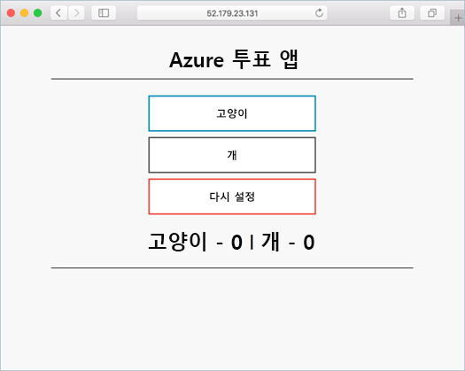

# <a name="quickstart-deploy-an-azure-kubernetes-service-cluster-using-the-azure-cli"></a>빠른 시작: Azure CLI를 사용하여 Azure Kubernetes Service 클러스터 배포

AKS(Azure Kubernetes Service)는 클러스터를 빠르게 배포하고 관리할 수 있는 관리형 Kubernetes 서비스입니다. 이 빠른 시작에서는 다음을 수행합니다.
* Azure CLI를 사용하여 AKS 클러스터를 배포합니다. 
* 클러스터에서 웹 프런트 엔드 및 Redis 인스턴스를 사용하여 다중 컨테이너 애플리케이션을 실행합니다. 
* 애플리케이션을 실행하는 클러스터와 Pod의 상태를 모니터링합니다.

  

이 빠른 시작에서는 Kubernetes 기본 개념을 이해하고 있다고 가정합니다. 자세한 내용은 [AKS(Azure Kubernetes Service)의 Kubernetes 핵심 개념][kubernetes-concepts]을 참조하세요.

[!INCLUDE [quickstarts-free-trial-note](../../includes/quickstarts-free-trial-note.md)]

Windows Server 노드 풀을 만드는 방법에 대한 자세한 내용은 [Windows Server 컨테이너를 지원하는 AKS 클러스터 만들기][windows-container-cli]를 참조하세요.

[!INCLUDE [azure-cli-prepare-your-environment.md](../../includes/azure-cli-prepare-your-environment.md)]

- 이 문서에는 Azure CLI 버전 2.0.64 이상이 필요합니다. Azure Cloud Shell을 사용하는 경우 최신 버전이 이미 설치되어 있습니다.
- 클러스터를 만드는 데 사용하는 ID에는 적절한 최소 권한이 있습니다. AKS의 액세스 및 ID에 대한 자세한 내용은 [AKS(Azure Kubernetes Service)에 대한 액세스 및 ID 옵션](concepts-identity.md)을 참조하세요.

> [!NOTE]
> 이 빠른 시작의 명령을 Azure Cloud Shell 대신 로컬로 실행하려는 경우 관리자 권한으로 명령을 실행합니다.

## <a name="create-a-resource-group"></a>리소스 그룹 만들기

[Azure 리소스 그룹](../azure-resource-manager/management/overview.md)은 Azure 리소스가 배포되고 관리되는 논리 그룹입니다. 리소스 그룹을 만들 때 위치를 지정하라는 메시지가 표시됩니다. 이 위치는 다음과 같습니다. 
* 리소스 그룹 메타데이터의 스토리지 위치입니다.
* 리소스를 만드는 동안 다른 지역을 지정하지 않은 경우 리소스가 Azure에서 실행되는 위치입니다. 

다음 예제에서는 *eastus* 위치에 *myResourceGroup* 이라는 리소스 그룹을 만듭니다.

[az group create][az-group-create] 명령을 사용하여 리소스 그룹을 만듭니다.


```azurecli-interactive
az group create --name myResourceGroup --location eastus
```

성공적으로 생성된 리소스 그룹에 대한 출력:

```json
{
  "id": "/subscriptions/<guid>/resourceGroups/myResourceGroup",
  "location": "eastus",
  "managedBy": null,
  "name": "myResourceGroup",
  "properties": {
    "provisioningState": "Succeeded"
  },
  "tags": null
}
```

## <a name="enable-cluster-monitoring"></a>클러스터 모니터링 사용

1. *Microsoft.OperationsManagement* 및 *Microsoft.OperationalInsights* 가 구독에 등록되어 있는지 확인합니다. 등록 상태를 확인하는 방법은 다음과 같습니다.

    ```azurecli
    az provider show -n Microsoft.OperationsManagement -o table
    az provider show -n Microsoft.OperationalInsights -o table
    ```
 
    등록되지 않은 경우 다음을 사용하여 *Microsoft.OperationsManagement* 및 *Microsoft.OperationalInsights* 를 등록합니다.
 
    ```azurecli
    az provider register --namespace Microsoft.OperationsManagement
    az provider register --namespace Microsoft.OperationalInsights
    ```

2. *--enable-addons monitoring* 매개 변수를 사용하여 [컨테이너용 Azure Monitor][azure-monitor-containers]를 사용하도록 설정합니다. 

## <a name="create-aks-cluster"></a>AKS 클러스터 만들기

[az aks create][az-aks-create] 명령을 사용하여 AKS 클러스터를 만듭니다. 다음 예제에서는 하나의 노드가 있는 *myAKSCluster* 라는 클러스터를 만듭니다. 

```azurecli-interactive
az aks create --resource-group myResourceGroup --name myAKSCluster --node-count 1 --enable-addons monitoring --generate-ssh-keys
```

몇 분 후 명령이 완료되면 클러스터에 대한 JSON 형식 정보가 반환됩니다.

> [!NOTE]
> AKS 클러스터를 생성하면 AKS 리소스를 저장하는 두 번째 리소스 그룹이 자동으로 만들어집니다. 자세한 내용은 [AKS를 통해 두 개의 리소스 그룹이 생성되는 이유는 무엇인가요?](./faq.md#why-are-two-resource-groups-created-with-aks)를 참조하세요.

## <a name="connect-to-the-cluster"></a>클러스터에 연결

Kubernetes 클러스터를 관리하려면 Kubernetes 명령줄 클라이언트인 [kubectl][kubectl]을 사용합니다. Azure Cloud Shell을 사용하는 경우 `kubectl`이 이미 설치되어 있습니다. 

1. [az aks install-cli][az-aks-install-cli] 명령을 사용하여 `kubectl`을 로컬로 설치합니다.

    ```azurecli
    az aks install-cli
    ```

2. [az aks get-credentials][az-aks-get-credentials] 명령을 사용하여 Kubernetes 클러스터에 연결하도록 `kubectl`을 구성합니다. 다음 명령은 아래와 같은 작업을 수행합니다.  
      * 자격 증명을 다운로드하고 이를 사용하도록 Kubernetes CLI를 구성합니다.
      * [Kubernetes 구성 파일][kubeconfig-file]의 기본 위치인 `~/.kube/config`를 사용합니다. *--file* 을 사용하여 Kubernetes 구성 파일의 다른 위치를 지정합니다.


    ```azurecli-interactive
    az aks get-credentials --resource-group myResourceGroup --name myAKSCluster
    ```

3. [kubectl get][kubectl-get] 명령을 사용하여 클러스터에 대한 연결을 확인합니다. 이 명령은 클러스터 노드 목록을 반환합니다.

    ```azurecli-interactive
    kubectl get nodes
    ```

    출력은 이전 단계에서 만든 단일 노드를 보여줍니다. 노드 상태가 *준비* 인지 확인합니다.

    ```output
    NAME                       STATUS   ROLES   AGE     VERSION
    aks-nodepool1-31718369-0   Ready    agent   6m44s   v1.12.8
    ```

## <a name="run-the-application"></a>애플리케이션 실행

[Kubernetes 매니페스트 파일][kubernetes-deployment]은 실행할 컨테이너 이미지와 같은 클러스터에 대해 원하는 상태를 정의합니다. 

이 빠른 시작에서는 매니페스트를 사용하여 [Azure Vote 애플리케이션][azure-vote-app]을 실행하는 데 필요한 모든 개체를 만듭니다. 이 매니페스트에는 다음과 같은 두 개의 [Kubernetes 배포][kubernetes-deployment]가 포함됩니다.
* 샘플 Azure Vote Python 애플리케이션.
* Redis 인스턴스. 

다음과 같은 두 개의 [Kubernetes 서비스][kubernetes-service]도 생성됩니다.
* Redis 인스턴스에 대한 내부 서비스.
* 인터넷에서 Azure Vote 애플리케이션에 액세스하기 위한 외부 서비스.

1. `azure-vote.yaml`라는 파일을 만듭니다.
    * Azure Cloud Shell을 사용하는 경우 이 파일은 가상 또는 실제 시스템에서 작업하고 있는 것처럼 `code`, `vi` 또는 `nano`를 사용하여 만들 수 있습니다.
1. 다음 YAML 정의에 복사합니다.

    ```yaml
    apiVersion: apps/v1
    kind: Deployment
    metadata:
      name: azure-vote-back
    spec:
      replicas: 1
      selector:
        matchLabels:
          app: azure-vote-back
      template:
        metadata:
          labels:
            app: azure-vote-back
        spec:
          nodeSelector:
            "beta.kubernetes.io/os": linux
          containers:
          - name: azure-vote-back
            image: mcr.microsoft.com/oss/bitnami/redis:6.0.8
            env:
            - name: ALLOW_EMPTY_PASSWORD
              value: "yes"
            resources:
              requests:
                cpu: 100m
                memory: 128Mi
              limits:
                cpu: 250m
                memory: 256Mi
            ports:
            - containerPort: 6379
              name: redis
    ---
    apiVersion: v1
    kind: Service
    metadata:
      name: azure-vote-back
    spec:
      ports:
      - port: 6379
      selector:
        app: azure-vote-back
    ---
    apiVersion: apps/v1
    kind: Deployment
    metadata:
      name: azure-vote-front
    spec:
      replicas: 1
      selector:
        matchLabels:
          app: azure-vote-front
      template:
        metadata:
          labels:
            app: azure-vote-front
        spec:
          nodeSelector:
            "beta.kubernetes.io/os": linux
          containers:
          - name: azure-vote-front
            image: mcr.microsoft.com/azuredocs/azure-vote-front:v1
            resources:
              requests:
                cpu: 100m
                memory: 128Mi
              limits:
                cpu: 250m
                memory: 256Mi
            ports:
            - containerPort: 80
            env:
            - name: REDIS
              value: "azure-vote-back"
    ---
    apiVersion: v1
    kind: Service
    metadata:
      name: azure-vote-front
    spec:
      type: LoadBalancer
      ports:
      - port: 80
      selector:
        app: azure-vote-front
    ```

1. [kubectl apply][kubectl-apply] 명령을 사용하여 애플리케이션을 배포하고 YAML 매니페스트의 이름을 지정합니다.

    ```console
    kubectl apply -f azure-vote.yaml
    ```

    출력은 성공적으로 생성된 배포 및 서비스를 보여 줍니다.

    ```output
    deployment "azure-vote-back" created
    service "azure-vote-back" created
    deployment "azure-vote-front" created
    service "azure-vote-front" created
    ```

## <a name="test-the-application"></a>애플리케이션 테스트

애플리케이션이 실행되면 애플리케이션 프런트 엔드를 인터넷에 공개하는 Kubernetes 서비스가 만들어집니다. 이 프로세스를 완료하는 데 몇 분이 걸릴 수 있습니다.

`--watch` 인수와 함께 [kubectl get service][kubectl-get] 명령을 사용하여 진행 상황을 모니터링합니다.

```azurecli-interactive
kubectl get service azure-vote-front --watch
```

`azure-vote-front` 서비스의 **EXTERNAL-IP** 출력은 처음에 *보류 중* 으로 표시됩니다.

```output
NAME               TYPE           CLUSTER-IP   EXTERNAL-IP   PORT(S)        AGE
azure-vote-front   LoadBalancer   10.0.37.27   <pending>     80:30572/TCP   6s
```

**EXTERNAL-IP** 주소가 *보류 중* 에서 실제 공용 IP 주소로 변경되면 `CTRL-C`를 사용하여 `kubectl` 조사식 프로세스를 중지합니다. 다음 예제 출력은 서비스에 할당된 유효한 공용 IP 주소를 보여줍니다.

```output
azure-vote-front   LoadBalancer   10.0.37.27   52.179.23.131   80:30572/TCP   2m
```

Azure Vote 앱이 실제로 작동하는 모습을 보려면 웹 브라우저를 서비스의 외부 IP 주소로 엽니다.


Azure Portal의 [컨테이너용 Azure Monitor][azure-monitor-containers]에서 캡처한 클러스터 노드 및 Pod의 상태 메트릭을 확인합니다. 

## <a name="delete-the-cluster"></a>클러스터 삭제

Azure 요금이 부과되지 않도록 불필요한 리소스를 정리하세요. [az group delete][az-group-delete] 명령을 사용하여 리소스 그룹, 컨테이너 서비스 및 모든 관련 리소스를 제거합니다.

```azurecli-interactive
az group delete --name myResourceGroup --yes --no-wait
```

> [!NOTE]
> 클러스터를 삭제할 때, AKS 클러스터에 사용되는 Azure Active Directory 서비스 주체는 제거되지 않습니다. 서비스 주체를 제거하는 방법에 대한 단계는 [AKS 서비스 주체 고려 사항 및 삭제][sp-delete]를 참조하세요.
> 
> 관리 ID를 사용하는 경우 ID는 플랫폼에 의해 관리되며 제거할 필요가 없습니다.

## <a name="get-the-code"></a>코드 가져오기

이 빠른 시작에서는 Kubernetes 배포를 만드는 데 미리 생성된 컨테이너 이미지를 사용했습니다. 관련된 애플리케이션 코드, Dockerfile 및 Kubernetes 매니페스트 파일을 [GitHub에서 사용][azure-vote-app]할 수 있습니다.

## <a name="next-steps"></a>다음 단계

이 빠른 시작에서는 Kubernetes 클러스터를 배포한 다음, 해당 클러스터에 다중 컨테이너 애플리케이션을 배포했습니다. AKS 클러스터에 대한 [Kubernetes 웹 대시보드에 액세스][kubernetes-dashboard]합니다.

AKS에 대해 자세히 알아보고 배포 예제에 대한 전체 코드를 연습해 보려면 Kubernetes 클러스터 자습서를 계속 진행합니다.

> [!div class="nextstepaction"]
> [AKS 자습서][aks-tutorial]

<!-- LINKS - external -->
[azure-vote-app]: https://github.com/Azure-Samples/azure-voting-app-redis.git
[kubectl]: https://kubernetes.io/docs/user-guide/kubectl/
[kubectl-apply]: https://kubernetes.io/docs/reference/generated/kubectl/kubectl-commands#apply
[kubectl-get]: https://kubernetes.io/docs/reference/generated/kubectl/kubectl-commands#get
[kubeconfig-file]: https://kubernetes.io/docs/concepts/configuration/organize-cluster-access-kubeconfig/

<!-- LINKS - internal -->
[kubernetes-concepts]: concepts-clusters-workloads.md
[aks-monitor]: ../azure-monitor/containers/container-insights-onboard.md
[aks-tutorial]: ./tutorial-kubernetes-prepare-app.md
[az-aks-browse]: /cli/azure/aks#az_aks_browse
[az-aks-create]: /cli/azure/aks#az_aks_create
[az-aks-get-credentials]: /cli/azure/aks#az_aks_get_credentials
[az-aks-install-cli]: /cli/azure/aks#az_aks_install_cli
[az-group-create]: /cli/azure/group#az_group_create
[az-group-delete]: /cli/azure/group#az_group_delete
[azure-cli-install]: /cli/azure/install_azure_cli
[azure-monitor-containers]: ../azure-monitor/containers/container-insights-overview.md
[sp-delete]: kubernetes-service-principal.md#additional-considerations
[azure-portal]: https://portal.azure.com
[kubernetes-deployment]: concepts-clusters-workloads.md#deployments-and-yaml-manifests
[kubernetes-service]: concepts-network.md#services
[kubernetes-dashboard]: kubernetes-dashboard.md
[windows-container-cli]: windows-container-cli.md
